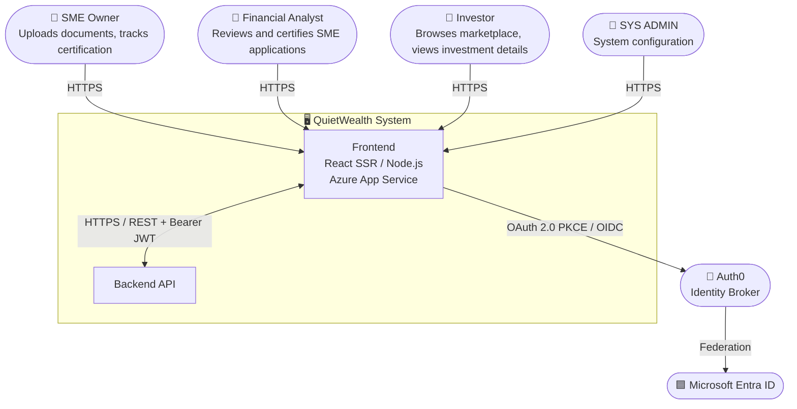
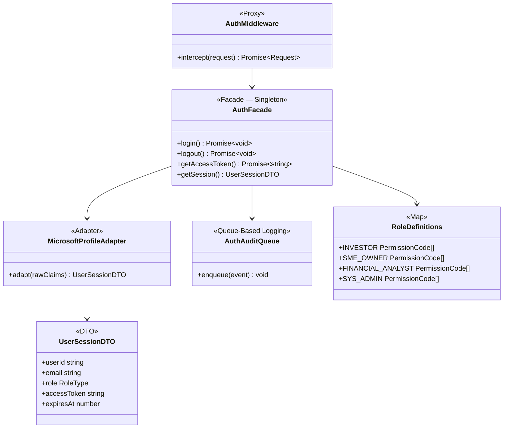
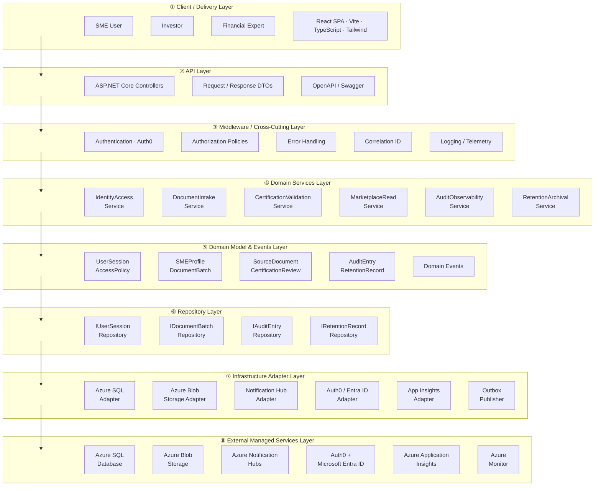

# QuietWealth — Expedited Financial Trust Record for SMEs

## Problem Statement

SMEs face slow, bureaucratic processes to certify their financial health, delaying capital access and investment. QuietWealth provides an expedited financial trust record by integrating document validation, risk analysis, and standardized financial conditions into a single certified report oriented to investors, establishing a low-risk certified investment ecosystem based on real revenue streams.

---

# 1. Frontend Design

## [1.1 Technology Stack](app/)

| Technology | Version | Justification |
|---|---|---|
| **Application Type** | SSR Web App | Server-side rendering enables auth-gated pages to be rendered on the server, reducing layout shift and preventing flash of unauthorized content for sensitive financial data |
| **React.js** | `19.2` | Industry-standard UI library with mature ecosystem; concurrent rendering features (`Suspense`, `React.lazy`) are essential for the document upload and long-running compilation flows |
| **Next.js** | `15` | Provides SSR, file-system routing, and built-in image optimization out of the box; integrates natively with Azure App Service Node.js runtime |
| **Node.js** | `22` | LTS release; required by Next.js 15 SSR runtime on Azure App Service |
| **TypeScript** | `5.9.3` | Static typing catches contract mismatches between API responses and UI state at compile time; essential for a data-intensive financial domain |
| **TailwindCSS** | `4.1` | Utility-first approach maps directly to the design token model; JIT compiler eliminates dead CSS in production with zero configuration |
| **Redux Toolkit** | `2.8` | Manages async thunks for document processing status tracking across page navigations; DevTools enable observability of state transitions during development |
| **Jest** | `30.2.0` | De-facto standard for React unit testing; compatible with TypeScript via `ts-jest`; supports coverage thresholds enforced in CI |
| **Zod** | `4.3.6` | Runtime schema validation for all API responses and form inputs; catches backend contract drift before data reaches Redux state |
| **Prettier** | `3.8.1` | Enforces uniform formatting across the team; integrated with Husky pre-commit hooks to block non-conforming commits |
| **ESLint** | `10.0.2` | Static analysis with custom rules that ban `dangerouslySetInnerHTML`, token storage in `localStorage`, and direct `console.log` calls |
| **Playwright** | `1.52` | Cross-browser E2E and integration testing; supports Chromium and Firefox; first-class `msw` integration for mocking backend responses |
| **Axios** | `1.9` | Provides interceptor support used by `AuthMiddleware` to attach Bearer tokens and handle 401 refresh centrally; cleaner API than native `fetch` for multipart document uploads |
| **Auth0 React SDK** | `2.2` | Manages OAuth 2.0 Authorization Code + PKCE flow and silent token refresh without custom implementation; Microsoft Entra ID is federated through Auth0 |
| **Husky** | `9.1.7` | Runs `lint-staged` on pre-commit; blocks commits that fail ESLint, Prettier, or TypeScript checks |
| **Cloud Service** | Azure | Consistent with the backend infrastructure; reduces operational complexity and cross-cloud latency |
| **Azure App Service** | — | Supports Node.js SSR runtimes natively; provides deployment slots (`staging → production`) enabling zero-downtime releases with instant rollback |
| **Code Repository** | GitHub | Enables GitHub Actions CI/CD with OIDC-based Azure deployment, avoiding long-lived credentials |
| **CI/CD** | GitHub Actions | OIDC token exchange with Azure App Service; branch-based environment promotion with manual approval for production |
| **Azure Application Insights SDK** | — | Unified telemetry for frontend and backend; correlates traces across browser, SSR layer, and backend API using a single `correlationId` |

---

## [1.2 UX / UI Analysis](app/)

### 1.2.1 Core Business Process

#### Login
1. The user accesses the QuietWealth platform and is presented with the authentication screen.
2. The user selects **Continue with Microsoft**.
3. Frontend redirects to Auth0 Universal Login, which federates with Microsoft Entra ID.
4. Auth0 returns an authorization code to the QuietWealth callback URL.
5. If authentication fails, Auth0 returns an error and the login screen displays the reason.
6. If successful, the session is created and the user is redirected to the Marketplace or Dashboard depending on their role.

---

#### Browse the Investment Marketplace
1. The investor lands on the Marketplace screen, which displays a list of certified SMEs available for investment.
2. The user can search for a specific company using the search bar.
3. The user can filter results by sector (e.g., Technology, Energy, Commerce) or by trust level.
4. Each SME card displays certification status, growth percentage, total raised capital, and number of active investors.
5. The user selects a company by clicking **Ver Detalles** to view the full investment profile.

---

#### Upload Financial Documents
1. The SME owner navigates to the **Cargar Documentos** section from the sidebar.
2. The system displays the document upload portal with a progress tracker: **Información Cargada → En Revisión por Expertos → Certificación Emitida**.
3. The user drags and drops files into the upload area or clicks **Seleccionar Archivos** to browse.
4. The system validates file formats (PDF, DOC, XLS, image) and size (max 10 MB per file) client-side via Zod before upload.
5. Once uploaded, documents enter the expert review queue automatically. The frontend sends `POST /api/trust-record-applications` and receives `HTTP 202 Accepted`.

---

#### Expert Validation Panel
1. A financial expert accesses the **Panel de Validación** section from the sidebar.
2. The system displays a list of pending SME certification requests with ID, company name, sector, submission date, and status.
3. The expert selects a pending request by clicking **Revisar**.
4. The expert reviews the uploaded documents and financial information.
5. The expert issues a certification decision, which updates the SME's trust status on the platform.

---

#### View Investment Detail
1. From the Marketplace, the investor clicks **Ver Detalles** on a specific SME card.
2. The system shows key financial metrics: Total Raised, Active Investors, Growth Rate, and Average ROI.
3. The user can scroll down to view detailed charts: Income Growth, Investor Growth, and Accumulated Capital Over Time.
4. The screen displays a company description and key business metrics such as retention rate, MRR, and profit margin.
5. The investor can click **Invertir Ahora** to initiate the investment flow.

---

#### Logout
1. The user ends their session through the logout option in the navigation.
2. Auth0 SDK calls `logout()`, invalidating the session both locally and on Auth0 servers.
3. The session is terminated and the user is redirected to the Login screen.

---

### 1.2.2 Wireframes

#### Login Screen
Microsoft-authenticated entry point to the platform via Auth0 Universal Login. A single **Continue with Microsoft** button is shown — no manual credential form.


---

#### Marketplace Screen
Lists certified SMEs with key financial metrics and trust indicators for investors to browse and compare.


---

#### Document Upload Screen
Allows SMEs to submit financial documents for expert review and certification. Shows a progress tracker with three stages.


---

#### Expert Validation Panel Screen
Enables financial experts to review and certify pending SME applications.


---

#### Investment Detail Screen
Shows verified SME financial metrics, growth charts, and expert certifications to support investor decision-making.


---

### Testing results

Tabla testing · MD
| Participant | Duration | OS | Browser | Opinion Scale (1–5) | Open Feedback |
|-------------|----------|----|---------|---------------------|---------------|
| 542521286 | 49s | Windows | Chrome | 4 | "Considero que la información mostrada es clara." |
| 510669335 | 42s | Windows | Chrome | 5 | "Esta bien" |
| 543901432 | 17.8s | Windows | Brave | 4 | "all good" |
| 508804036 | 70.1s | Windows | Edge | 5 | "." |
| 542802936 | 99.5s | Windows | Edge | 5 | "Anuncios de invierta ahora no deberían de aparecer en la aplicación como tal, solo en una web." |
| 537502878 | 50.1s | Linux | Firefox | 5 | "Muy detallada y presentable, no mejoraría nada." |
| **Average** | **54.8s** | — | — | **4.7 / 5** | — |

---

### Heatmaps for clicks and drop-offs

**Investment Detail Screen**


#### Usability Issues Detected

| # | Screen | Issue | Severity |
|---|---|---|---|
| 1 | Investment Detail | The "Invertir Ahora" CTA feels too prominent within the platform; one participant noted it is more appropriate for an external web page. | Medium |

#### Corrections Applied

| # | Issue | Correction | Decision Criteria |
|---|---|---|---|
| 1 | "Invertir Ahora" CTA felt intrusive inside the platform | Reduced visual weight of the CTA within the Investment Detail screen | Keeps the platform focused on trust and information rather than aggressive selling |


---

## [1.3 Component Design Strategy](app/components)

Atomic Design: atoms → molecules → organisms → templates → pages.

```
app/components/
 ├ atoms/
 ├ molecules/
 ├ organisms/
 ├ templates/
 ├ pages/
 ├ hooks/
 ├ i18n/
 └ styles/
```

### [Atoms](app/components/atoms)
Pure UI, no business logic, no API calls.
```
Button · Input · Badge · Spinner · ProgressBar
TrustIndicator · Label · Card · Toast · Modal · StatCard · MaskedValue
```

### [Molecules](app/components/molecules)
Composed from atoms; UI logic only.
```
SMECard · FilterBar · DocumentUploader · FormField · StatusBadge · InfoBanner
```

### [Organisms](app/components/organisms)
Layout composition only.
```
MarketplaceGrid · InvestmentDetailPanel · ValidationQueue
DocumentUploadZone · Navbar · Sidebar · PageContainer
```

### [Pages](app/components/pages)
Business logic via hooks; mounted by Next.js App Router.
```
LoginPage.tsx · MarketplacePage.tsx · DocumentUploadPage.tsx
ExpertValidationPage.tsx · InvestmentDetailPage.tsx
```

### Reuse Rule
Search atoms → molecules before creating a new component. Extend via props, never duplicate.
```
useAuth() · useMarketplace() · useDocumentUpload() · useCertificationProgress()
useExpertValidation() · useInvestmentDetail() · usePermissions() · usePolicies()
useSession() · useApplicationServices()
```

### Naming Conventions

| Element | Convention | Example |
|---|---|---|
| Component files/folders | `PascalCase` | `SMECard.tsx` / `SMECard/` |
| Page files | `PascalCase` + `Page` suffix | `MarketplacePage.tsx` |
| Hook files | `camelCase` + `use` prefix | `useMarketplace.ts` |
| Service files | `PascalCase` + `Service` suffix | `TrustRecordService.ts` |
| Redux slices | `camelCase` + `Slice` suffix | `marketplaceSlice.ts` |
| Zod schemas | `camelCase` + `Schema` suffix | `documentUploadSchema.ts` |
| Type/interface files | `PascalCase` or `camelCase.types.ts` | `session.types.ts` |
| CSS module files | `camelCase.module.css` | `smeCard.module.css` |
| Tailwind utilities | Token-based CSS vars only | `text-[var(--qw-navy)]` |
| Constants | `SCREAMING_SNAKE_CASE` | `MAX_UPLOAD_FILE_SIZE_MB` |
| DTOs | `PascalCase` + `DTO` suffix | `TrustRecordApplicationDTO` |
| Enums | `PascalCase` values | `CertificationStatus.PENDING` |
| Test files | Mirror source path + `.test.ts(x)` / `.spec.ts` | `AuthFacade.test.ts` |
| i18n keys | `dot.separated.camelCase` | `marketplace.filter.sector` |
| Non-component folders | `kebab-case` | `app/auth/` |

### [Styles and Design Tokens](app/components/styles)

[tokens.ts](app/components/styles/tokens.ts):

```ts
export const colors = {
  primary:    "#0D1F3C",   // QW Navy
  accent:     "#1AACA8",   // QW Teal
  gold:       "#C8972B",   // QW Gold
  background: "#F5F7FA",
  surface:    "#FFFFFF",
  slate:      "#4A5568",
  success:    "#22C55E",
  warning:    "#F59E0B",
  error:      "#EF4444",
};
export const spacing = { sm: "8px", md: "16px", lg: "24px", xl: "48px" };
export const radius  = { sm: "4px", md: "8px",  lg: "12px" };
```

[theme.ts](app/components/styles/theme.ts):
```ts
export const theme = {
  colors,
  spacing,
  radius,
  typography: {
    fontFamily:    "Inter, sans-serif",
    monoFamily:    "JetBrains Mono, monospace",
    headingWeight: 600,
  },
};
```

**Typography:**

| Token | Value | Usage |
|---|---|---|
| `--font-display` | `Inter, sans-serif` | H1–H3 |
| `--font-body` | `Inter, sans-serif` | Body, labels, tables |
| `--font-mono` | `JetBrains Mono, monospace` | Financial metrics, amounts |
| Base size | `16px` | Root `rem` |

**Logos:** SVG only. [`app/assets/logo/logo-dark.svg`](app/assets/logo/logo-dark.svg) (white text) and [`logo-light.svg`](app/assets/logo/logo-light.svg) (navy text). Min width: `120px`.

**Iconography:** Lucide React `0.383.0` — named imports only.

**Spacing:** 4-point scale. Cards: `p-4`; inputs: `p-2`; grids: `gap-6`; page horizontal: `px-6 md:px-12 lg:px-24`.

**Branding rules:**
- Trust certification status: always color + text label (never color alone).
- Certified: `--qw-gold` + checkmark icon.
- Pending: `--qw-warning` + clock icon.
- Rejected: `--qw-error` + X icon.

**Styling rule:**
```tsx
// ✅
<Button className="bg-[var(--color-primary)]" />
// ❌
<Button style={{ background: "#0D1F3C" }} />
```

### Responsive Design

[breakpoints.ts](app/components/styles/breakpoints.ts):
```ts
export const breakpoints = { mobile: 480, tablet: 768, desktop: 1200 };
```

| Device | Marketplace | Investment Detail | Navigation |
|---|---|---|---|
| Mobile | 1 column | 1 column | Hamburger |
| Tablet | 2-column grid | Metrics + charts side-by-side | Collapsed sidebar |
| Desktop | 3-column grid | Full dual-panel | Full sidebar |

### [Internationalization](app/components/i18n)

Translation files: [en.json](app/components/i18n/en.json) · [es.json](app/components/i18n/es.json)

```tsx
// ❌
<h1>Marketplace</h1>
// ✅
const { t } = useTranslation();
<h1>{t("marketplace.title")}</h1>
```

### Performance

```tsx
// Lazy loading
const InvestmentDetailPage = lazy(() => import("@/components/pages/InvestmentDetailPage"));
<Suspense fallback={<Spinner />}><InvestmentDetailPage /></Suspense>

// Memoization
export const SMECard = memo(function SMECard({ sme }: SMECardProps) {
  const formattedGrowth = useMemo(() => formatPercent(sme.growthRate), [sme.growthRate]);
  const onViewDetails   = useCallback(() => router.push(`/marketplace/${sme.id}`), [sme.id]);
  return <article onClick={onViewDetails}>...</article>;
});

// Virtualization (> 100 rows)
<FixedSizeList height={600} itemCount={smes.length} itemSize={120} width="100%">
  {({ index, style }) => <SMECard style={style} sme={smes[index]} />}
</FixedSizeList>
```

- `next-bundle-analyzer` in CI — chunks > 250 KB fail the pipeline.
- Lucide React: named imports only (`import { TrendingUp } from "lucide-react"`).
- Next.js `<Image>` with explicit dimensions for all rasterized assets.

---

## [1.4 Security](app/auth)

### 1.4.1 Technologies
- Auth0 React SDK `2.2` — OAuth 2.0 Authorization Code + PKCE, Microsoft Entra ID
- JWT bearer tokens for protected API requests
- Zod for form and API response validation
- Axios interceptors for token attachment and 401 handling

### 1.4.2 Authentication

**Identity provider:**

| Provider | Supported | Reason |
|---|---|---|
| Microsoft Entra ID | Yes | OAuth 2.0 + PKCE via Auth0 federation |
| Google | No | Out of scope — all users are expected to have corporate Microsoft accounts |

**Auth Flow:**
1. User selects **Continue with Microsoft**.
2. Auth0 Universal Login → Microsoft Entra ID.
3. Auth0 returns authorization code to `AUTH0_CALLBACK_URL`.
4. Backend validates JWT + ID Token; session created.

**Auth0 Config Parameters:**

| Parameter | Storage |
|---|---|
| `AUTH0_DOMAIN` | Azure Key Vault (prod/qa) · `.env` (local) |
| `AUTH0_CLIENT_ID` | Azure Key Vault (prod/qa) · `.env` (local) |
| `AUTH0_CLIENT_SECRET` | Azure Key Vault (prod/qa) · `.env` (local) — backend only |
| `AUTH0_CALLBACK_URL` | Azure Key Vault (prod/qa) · `.env` (local) |
| `AUTH0_AUDIENCE` | Azure Key Vault (prod/qa) · `.env` (local) |

**MFA:** Auth0 Adaptive MFA. Factors: TOTP, SMS OTP, Email OTP. Enforced for all roles.

**[AuthFacade.ts](app/auth/AuthFacade.ts):**
```ts
export class AuthFacade {
  private static instance: AuthFacade | null = null;
  static getInstance(): AuthFacade { ... }
  private constructor() {}

  async login(): Promise<void> { }    // redirects to Auth0 → Microsoft
  async logout(): Promise<void> { }   // invalidates locally and on Auth0
  async getAccessToken(): Promise<string> { }  // getAccessTokenSilently()
  getSession(): UserSessionDTO | null { }
}
export const authFacade = AuthFacade.getInstance();
```

**[MicrosoftProfileAdapter.ts](app/auth/adapters/MicrosoftProfileAdapter.ts):**
```ts
export class MicrosoftProfileAdapter {
  adapt(rawClaims: MicrosoftClaims): UserSessionDTO {
    return {
      userId:      rawClaims.oid,
      email:       rawClaims.preferred_username,
      displayName: rawClaims.name,
      role:        this.resolveRole(rawClaims),
      accessToken: rawClaims.access_token,
      expiresAt:   rawClaims.exp,
    };
  }
}
```

**JWT Claims:**

| Claim | Value |
|---|---|
| `sub` | Auth0 user ID |
| `email` | Corporate email from Entra ID |
| `name` | Display name |
| `roles` | Platform roles array (e.g. `["investor"]`) |
| `permissions` | Granted permission codes |
| `aud` | `AUTH0_AUDIENCE` |
| `iss` | Auth0 domain |
| `exp` / `iat` | Expiry / issued-at |

Estimated payload: **< 2 KB**.

**Token management:**

| Aspect | Config |
|---|---|
| Access token expiry | 60 min |
| Refresh token rotation | Enabled |
| Silent refresh | `getAccessTokenSilently()` before expiry |
| Access token storage | In-memory (Redux) only |
| Refresh token storage | `HttpOnly`, `Secure`, `SameSite=Strict` cookie — Auth0 managed |
| Logout | `logout({ returnTo: window.location.origin })` |

**Session expiration:** On `401`, [httpInterceptors.ts](app/services/httpInterceptors.ts) calls `sessionManager.handleUnauthorized()` and redirects to login.

**Auth latency:** 1–5 s. Spinner shown immediately on click; button disabled until callback resolves.

**[AuthAuditQueue.ts](app/auth/AuthAuditQueue.ts):** Batches auth events and dispatches asynchronously to Application Insights.

**Expected workload:**
- Peak: 7:00 AM – 6:00 PM (Costa Rica time)
- Concurrent users within Auth0 plan threshold — no additional mitigation required

### 1.4.3 Authorization

**Roles** — [roles.ts](app/auth/policies/roles.ts):

| Code | Description |
|---|---|
| `investor` | Browses Marketplace, views investment details, initiates investment |
| `sme_owner` | Uploads financial documents, tracks certification status |
| `financial_analyst` | Reviews certification queue, issues certification decisions |
| `sys_admin` | Full access: user management, audit logs, system config |

**Permissions** — [permissions.ts](app/auth/policies/permissions.ts):

| Code | Description |
|---|---|
| `auth.login` / `auth.logout` | Session start/end |
| `session.read` | Access authenticated screens |
| `marketplace.browse` | View SME listings |
| `investment.detail.view` | View full investment detail |
| `investment.initiate` | Initiate investment flow |
| `documents.upload` | Upload financial documents |
| `documents.status.read` | Track certification status |
| `validation.queue.read` | View expert validation queue |
| `validation.certify` | Issue certification decisions |
| `audit_log.read` | View audit trail |
| `users.admin` / `roles.admin` / `system.config` | `sys_admin` only |

**Role-Permission Mapping** — [rolePermissions.ts](app/auth/policies/rolePermissions.ts):

| Role | Permissions |
|---|---|
| `investor` | `auth.*`, `session.read`, `marketplace.browse`, `investment.detail.view`, `investment.initiate` |
| `sme_owner` | `auth.*`, `session.read`, `documents.upload`, `documents.status.read` |
| `financial_analyst` | `auth.*`, `session.read`, `validation.queue.read`, `validation.certify`, `audit_log.read` |
| `sys_admin` | All |

**Access Policies** — [accessPolicy.ts](app/auth/policies/accessPolicy.ts):

| Policy | Required Permissions |
|---|---|
| `canBrowseMarketplace` | `marketplace.browse` |
| `canViewInvestmentDetail` | `investment.detail.view` |
| `canInitiateInvestment` | `investment.initiate` |
| `canUploadDocuments` | `documents.upload` |
| `canTrackCertification` | `documents.status.read` |
| `canAccessValidationQueue` | `validation.queue.read` |
| `canCertifySME` | `validation.certify` |
| `canReadAuditLog` | `audit_log.read` |
| `canManageSystem` | `users.admin`, `roles.admin`, `system.config` |

**Route Guards** — [app/auth/guards/](app/auth/guards/):

```tsx
// Unauthenticated → redirect to login
<AuthGuard><DashboardLayout><MarketplacePage /></DashboardLayout></AuthGuard>

// Authenticated → redirect to marketplace
<GuestGuard><LoginPage /></GuestGuard>

// Missing permissions → 403 page
<AuthGuard>
  <PolicyGuard required={accessPolicy.canCertifySME}>
    <ExpertValidationPage />
  </PolicyGuard>
</AuthGuard>
```

**Usage rule:**
```ts
// ❌
if (user.role === "financial_analyst") { ... }
// ✅
const { hasAccess } = usePolicies();
{hasAccess("canCertifySME") && <CertifyButton />}
```

- `hasAccess` — all required permissions must be held.
- `hasSomeAccess` — at least one permission held (partial-access sections).
- `getMissingPermissions` — admin/debug screens and access-denied messages.

### 1.4.4 Encryption and Data Privacy

**In transit:** HTTPS/TLS 1.3 enforced; HTTP → 301. `Strict-Transport-Security: max-age=31536000; includeSubDomains`.

**Token storage:**
- Access tokens: in-memory (Redux) only.
- Refresh tokens: `HttpOnly`, `Secure`, `SameSite=Strict` cookie — Auth0 SDK managed.

**Sensitive data in DOM:**
```tsx
// app/components/atoms/MaskedValue/MaskedValue.tsx
export function MaskedValue({ value, visible }: { value: string; visible: boolean }) {
  return <span aria-hidden={!visible}>{visible ? value : "••••••••"}</span>;
}

// Usage
const { hasAccess } = usePolicies();
<MaskedValue value={sme.revenueAmount} visible={hasAccess("canViewInvestmentDetail")} />
```

Client-side masking is a UX layer only — the API returns masked/null values for unauthorized callers.

**Secrets:** Sourced from Azure Key Vault via [Settings.ts](app/settings/Settings.ts). Logger strips keys matching `/token|secret|password|key/i` before emitting to App Insights.

**Privacy:** File bytes streamed directly to backend — not buffered in browser. CSRF: Auth0 `state` parameter validated on callback before code exchange.

### 1.4.5 [API Communication](app/services/client.ts)

All HTTP calls through the HTTP facade. [httpInterceptors.ts](app/services/httpInterceptors.ts):
- Attaches `Authorization: Bearer <token>`.
- On `401`: triggers `sessionManager.handleUnauthorized()`.
- Validates Zod schema on every response before reaching Redux.

### 1.4.6 Storage Rules

| Storage | Allowed Use |
|---|---|
| Memory (Redux) | Session token, marketplace data, certification status |
| Auth0 `HttpOnly` cookie | Refresh token |
| `localStorage` | Theme, language only |
| `sessionStorage` | Not used |

```ts
localStorage.setItem("theme", "dark");      // ✅
// localStorage.setItem("accessToken", t); // ❌
```

### 1.4.7 Data Masking

Financial values gated by certification status are masked via `MaskedValue`. Values are only rendered when the JWT carries the required permission scope and the API has validated it server-side.

### 1.4.8 OWASP Mitigations

| Risk | Mitigation |
|---|---|
| XSS | JSX auto-escaping; `dangerouslySetInnerHTML` banned via ESLint; CSP header at App Service |
| Broken Authentication | PKCE; tokens in memory only |
| Sensitive Data Exposure | Financial values masked for unauthorized roles; nothing sensitive in `localStorage` |
| CSRF | Auth0 `state` parameter validated on callback; `SameSite=Strict` cookies |
| Broken Access Control | `PolicyGuard` on every protected route; server-side re-validation on every call |
| Security Misconfiguration | Secrets from Azure Key Vault; no credentials in source control |
| Clickjacking | `X-Frame-Options: DENY` at App Service level |
| Injection | Zod validates all form inputs and API response shapes |

---

## [1.5 Layered Design](app/)

Five layers, downward dependencies only.
|---|---|---|
| 1 — Presentation | `app/components/`, `app/routes/`, `app/auth/guards/` | Atoms → Pages, route guards |
| 2 — Application | `app/components/hooks/` | Orchestration hooks |
| 3 — Domain Logic | `app/auth/policies/`, `app/models/` | Access policies, Zod schemas, types |
| 4 — Services | `app/services/`, `app/auth/AuthFacade.ts` | HTTP facade, auth, polling |
| 5 — Infrastructure | `app/state/`, `app/components/styles/`, `app/components/i18n/`, `app/utils/` | Session, design system, i18n, logger |

**Dependency rule:** no layer may call upward. Components never import services; pages never call `fetch` directly; hooks never check `user.role`.

```
Browser
  └── Azure App Service (Node.js + Next.js SSR)
        └── Auth Layer (AuthFacade / AuthMiddleware)
              └── Components Layer (Atoms → Pages)
                    └── Hooks
                          └── Services Layer
                                ├── ApiClients
                                ├── Settings → Azure Key Vault
                                └── Utils
Shared: Models · Zod · Redux · ExceptionHandler · Logger → App Insights
CI/CD: GitHub Actions → QA / Production → Azure App Service
```

**Login flow:** `useLogin()` → `AuthFacade.login()` → Auth0 → Microsoft Entra ID → callback → `sessionManager.setSession()` → redirect to Marketplace.

**Document upload flow:** `DocumentUploadPage` → `useDocumentUpload().submit()` → `TrustRecordService.submit()` → `POST /api/trust-record-applications` → `202` → polling starts → `certificationSlice` updates → progress tracker re-renders.

---

## [1.6 Design Patterns](app/)

### Singleton

| Class | File |
|---|---|
| `Logger` | [app/utils/logger.ts](app/utils/logger.ts) |
| `ExceptionHandler` | [app/utils/error-handler.ts](app/utils/error-handler.ts) |
| `AuthFacade` | [app/auth/AuthFacade.ts](app/auth/AuthFacade.ts) |
| `SessionManager` | [app/state/sessionManager.ts](app/state/sessionManager.ts) |
| `CertificationPollingStore` | [app/state/certificationPollingStore.ts](app/state/certificationPollingStore.ts) |
| `DefaultHttpClientFacade` | [app/services/client.ts](app/services/client.ts) |
| `DefaultApplicationServiceFacade` | [app/services/applicationFacade.ts](app/services/applicationFacade.ts) |

```ts
export class MyService {
  private static instance: MyService | null = null;
  static getInstance(): MyService {
    if (!MyService.instance) MyService.instance = new MyService();
    return MyService.instance;
  }
  private constructor() {}
}
export const myService = MyService.getInstance();
```

---

### Observer — Certification Status Tracking

Reference: [certification.types.ts](app/state/certification.types.ts) · [certificationPollingStore.ts](app/state/certificationPollingStore.ts) · [certificationPollingManager.ts](app/state/certificationPollingManager.ts) · [useCertificationProgress.ts](app/components/hooks/useCertificationProgress.ts)

```ts
// Store
class CertificationPollingStore {
  private listeners = new Set<Listener<CertificationState>>();
  private state = createInitialState();
  getState()  { return this.state; }
  subscribe(listener: Listener<CertificationState>) {
    this.listeners.add(listener);
    listener(this.state);
    return () => this.listeners.delete(listener);
  }
  patchState(partial: Partial<CertificationState>) {
    this.state = { ...this.state, ...partial };
    for (const l of this.listeners) l(this.state);
  }
}

// Subscriber hook
function useCertificationProgress() {
  const [state, setState] = useState(() => certificationPollingManager.getSnapshot());
  useEffect(() => certificationPollingManager.subscribe(setState), []);
  return state;
}

// Manager
async function startPolling(applicationId: string) {
  store.patchState({ runState: "polling", applicationId });
  void runPollingLoop(applicationId);
}
```

---

### Facade — Auth + Application Services

[AuthFacade.ts](app/auth/AuthFacade.ts) · [applicationFacade.ts](app/services/applicationFacade.ts)

```ts
interface AuthServiceFacade {
  login(): Promise<void>;
  logout(): Promise<void>;
  getAccessToken(): Promise<string>;
  getCurrentSession(): Promise<UserSessionDTO | null>;
}
interface ApplicationServiceFacade {
  readonly auth: AuthServiceFacade;
  readonly http: HttpClientFacade;
}
```

---

### Adapter

[MicrosoftProfileAdapter.ts](app/auth/adapters/MicrosoftProfileAdapter.ts) — normalizes Entra ID claims into `UserSessionDTO`.

---

### Proxy — Auth Middleware

[AuthMiddleware.ts](app/auth/AuthMiddleware.ts) — intercepts protected API calls; validates JWT expiry; triggers silent refresh or logout.

---

### Strategy — Polling Interval

[app/polling/strategies/](app/polling/strategies/)

```ts
export interface IPollingStrategy {
  getInterval(attempt: number): number; // ms
}
export class FixedIntervalStrategy implements IPollingStrategy {
  getInterval(_: number) { return 10_000; }
}
export class ExponentialBackoffStrategy implements IPollingStrategy {
  getInterval(attempt: number) { return Math.min(2 ** attempt * 1000, 60_000); }
}
```

`PollingOrchestrator` switches to `ExponentialBackoffStrategy` on network errors; stops after 5 failed attempts.

---

### Queue-Based Logging

[AuthAuditQueue.ts](app/auth/AuthAuditQueue.ts) — auth events batched, dispatched async to App Insights.

---

## [1.7 Project Scaffold](app/)

```
app/
├── layout.tsx · page.tsx · globals.css
├── login/page.tsx
├── marketplace/
│   ├── page.tsx                        → MarketplacePage
│   └── [id]/page.tsx                   → InvestmentDetailPage
├── documents/page.tsx                  → DocumentUploadPage
├── validation/page.tsx                 → ExpertValidationPage
└── admin/page.tsx
│
app/components/
├── atoms/
│   ├── Button/ · Badge/ · Input/ · Label/ · Spinner/
│   ├── ProgressBar/ · TrustIndicator/ · StatCard/ · MaskedValue/
│   └── atoms.css
├── molecules/
│   ├── SMECard/ · FilterBar/ · DocumentUploader/
│   ├── FormField/ · StatusBadge/ · InfoBanner/
│   └── molecules.css
├── organisms/
│   ├── MarketplaceGrid/ · InvestmentDetailPanel/ · ValidationQueue/
│   ├── DocumentUploadZone/ · Navbar/ · Sidebar/
│   └── organisms.css
├── templates/
│   └── AuthenticatedLayout/ · PublicLayout/
├── pages/
│   ├── LoginPage.tsx · MarketplacePage.tsx · InvestmentDetailPage.tsx
│   ├── DocumentUploadPage.tsx · ExpertValidationPage.tsx
├── hooks/
│   ├── useApplicationServices.ts · useAuth.ts · useMarketplace.ts
│   ├── useDocumentUpload.ts · useCertificationProgress.ts
│   ├── useExpertValidation.ts · useInvestmentDetail.ts
│   └── usePermissions.ts · usePolicies.ts · useSession.ts
├── i18n/
│   └── config.ts · I18nProvider.tsx · en.json · es.json
└── styles/
    └── tokens.ts · theme.ts · breakpoints.ts · globals.css · ThemeProvider.tsx
│
app/auth/
├── AuthFacade.ts · AuthMiddleware.ts · AuthAuditQueue.ts · authConfig.ts
├── adapters/MicrosoftProfileAdapter.ts
├── guards/AuthGuard.tsx · GuestGuard.tsx · PolicyGuard.tsx
└── policies/roles.ts · permissions.ts · rolePermissions.ts · accessPolicy.ts
│
app/polling/
├── PollingOrchestrator.ts
└── strategies/IPollingStrategy.ts · FixedIntervalStrategy.ts · ExponentialBackoffStrategy.ts
│
app/services/
├── applicationFacade.ts · client.ts · httpInterceptors.ts
├── MarketplaceService.ts · TrustRecordService.ts
└── ExpertValidationService.ts · InvestmentService.ts
│
app/state/
├── certification.types.ts · certificationPollingStore.ts · certificationPollingManager.ts
├── session.types.ts · sessionManager.ts · SessionProvider.tsx
├── StoreProvider.tsx · store.ts · hooks.ts
└── slices/authSlice.ts · marketplaceSlice.ts · certificationSlice.ts · validationSlice.ts
│
app/models/
└── ApiResponse.ts · SME.ts · TrustRecord.ts · DocumentUpload.ts · Permission.ts · Role.ts · User.ts
│
app/validation/
└── documentUploadSchema.ts · smeSchema.ts · userSchema.ts · index.ts
│
app/settings/Settings.ts
app/utils/logger.ts · error-handler.ts · eventBus.ts · schemaValidator.ts · constants.ts · formatters.ts
app/assets/logo/logo-dark.svg · logo-light.svg
│
app/__tests__/
├── setup.ts
├── unit/auth/ · polling/ · services/ · validation/
└── e2e/login.spec.ts · marketplace.spec.ts · documentUpload.spec.ts · expertValidation.spec.ts
│
app/__mocks__/styleMock.ts
next.config.ts · tailwind.config.ts · tsconfig.json · jest.config.ts
playwright.config.ts · package.json · .env.example
.eslintrc.json · .prettierrc · .lintstagedrc.json · .husky/pre-commit
```

---

### [State Management](app/state/)

| File | Description |
|---|---|
| [store.ts](app/state/store.ts) | Redux store: `auth`, `marketplace`, `certification`, `validation` |
| [slices/authSlice.ts](app/state/slices/authSlice.ts) | `isAuthenticated`, `user`, `role`, `accessToken` |
| [slices/marketplaceSlice.ts](app/state/slices/marketplaceSlice.ts) | SME listings, filters, search |
| [slices/certificationSlice.ts](app/state/slices/certificationSlice.ts) | `applicationId`, `status`, `stage` |
| [slices/validationSlice.ts](app/state/slices/validationSlice.ts) | Pending requests, selected request |

---

### [Async Communication and Polling](app/polling/)

Polls `GET /api/trust-record-applications/{id}/status` every 10 s until `CERTIFIED`, `REJECTED`, or `REQUIRES_HUMAN_REVIEW`.

| File | Description |
|---|---|
| [PollingOrchestrator.ts](app/polling/PollingOrchestrator.ts) | Manages loop lifecycle; dispatches to `certificationSlice` |
| [FixedIntervalStrategy.ts](app/polling/strategies/FixedIntervalStrategy.ts) | 10 s fixed (normal) |
| [ExponentialBackoffStrategy.ts](app/polling/strategies/ExponentialBackoffStrategy.ts) | Doubles on failure, cap 60 s; activated on `503` or network error |

---

### [Storage](app/)

| Storage | Usage | Notes |
|---|---|---|
| Memory (Redux) | Session token, marketplace data, certification status | Cleared on tab close |
| Auth0 `HttpOnly` cookie | Refresh token | Auth0 managed; JS-inaccessible |
| `localStorage` | Theme, language | No tokens, no financial data |
| `sessionStorage` | Not used | — |
| WebSockets | Not used in v1 | Polling sufficient; WebSocket upgrade path documented for v2 |

---

### [Events](app/utils/eventBus.ts)

**Redux dispatch** — all business state transitions:
```ts
dispatch(certificationSlice.actions.certificationCompleted({ applicationId, trustScore }));
dispatch(validationSlice.actions.decisionIssued({ requestId, decision: "approved" }));
```

**Custom DOM events** — UI side-effects only (toasts, global loaders):
```ts
// app/utils/eventBus.ts
export const eventBus = {
  emit<T>(name: string, detail: T) {
    window.dispatchEvent(new CustomEvent(name, { detail }));
  },
  on<T>(name: string, handler: (detail: T) => void) {
    const listener = (e: Event) => handler((e as CustomEvent<T>).detail);
    window.addEventListener(name, listener);
    return () => window.removeEventListener(name, listener);
  },
};

eventBus.emit("toast:show", { message: "Documents submitted", type: "success" });
useEffect(() => eventBus.on("toast:show", setToast), []);
```

Rules: event names `namespace:verb`; every `on()` must return its cleanup; called inside `useEffect`.

---

### [Observability and Monitoring](app/utils/)

| File | Description |
|---|---|
| [logger.ts](app/utils/logger.ts) | Singleton — `info`, `warn`, `error` to Azure Application Insights |
| [error-handler.ts](app/utils/error-handler.ts) | Singleton — maps HTTP codes to user messages; routes 5xx to App Insights |

**Logged events:**

| Event | Trigger |
|---|---|
| `AuthLoginStarted` | "Continue with Microsoft" clicked |
| `AuthLoginCompleted` | Session established |
| `AuthLoginFailed` | Auth0 callback error |
| `AuthLogoutCompleted` | Logout finished |
| `DocumentsSubmitted` | `POST /api/trust-record-applications` sent |
| `CertificationPollingStarted` | `PollingOrchestrator.start()` called |
| `CertificationStatusChanged` | Status transition detected |
| `CertificationCompleted` / `CertificationRejected` | Terminal polling states |
| `ValidationDecisionIssued` | Expert certifies or rejects |
| `InvestmentDetailViewed` | User opens Investment Detail |
| `ApiRequestFailed` | HTTP error from `ExceptionHandler` |
| `ContractViolationError` | Zod mismatch on API response |
| `UnhandledExceptionCaptured` | React error boundary triggered |

**Rules:** every event includes `correlationId`, `userId` (hashed), `role`, `timestamp`, `appVersion`. No raw financial values in logs. No polling tick events — only status transitions and exceptional failures.

**Error handling:**

| HTTP | Behavior |
|---|---|
| `400` | Inline validation error on the field |
| `401` | Silent refresh; if fails → login redirect |
| `403` | Toast: permission denied |
| `404` | Not-found redirect |
| `429` | Toast with countdown; exponential backoff activated |
| `5xx` | Toast with Sentry event ID; polling retries ≤ 5 |

---

### [Data Validation](app/validation/)

| File | Validates |
|---|---|
| [documentUploadSchema.ts](app/validation/documentUploadSchema.ts) | MIME types (`application/pdf`, `application/vnd.ms-excel`, `image/*`), max 10 MB/file |
| [smeSchema.ts](app/validation/smeSchema.ts) | SME listing and investment detail API shapes |
| [userSchema.ts](app/validation/userSchema.ts) | Auth0 token claim shapes |

Schema mismatch → `ContractViolationError` logged to App Insights with full response payload.

---

### [Caching](app/)

| Layer | Strategy |
|---|---|
| Marketplace listings | Redux; TTL 5 min |
| Investment detail | Redux per `smeId`; invalidated on certification status change |
| Status polling | `Cache-Control: no-store` |
| Static assets | Content-hash filenames; `max-age=31536000, immutable` via Azure CDN |

---

### [API Consumption and Data Contracts](app/services/)

| File | Endpoints |
|---|---|
| [client.ts](app/services/client.ts) | Base facade: Bearer token, 401 refresh, Zod validation, error delegation |
| [MarketplaceService.ts](app/services/MarketplaceService.ts) | `GET /api/smes` · `GET /api/smes/{id}` |
| [TrustRecordService.ts](app/services/TrustRecordService.ts) | `POST /api/trust-record-applications` · `GET .../status` |
| [ExpertValidationService.ts](app/services/ExpertValidationService.ts) | `GET /api/validation-queue` · `POST /api/validation-queue/{id}/decision` |
| [InvestmentService.ts](app/services/InvestmentService.ts) | `POST /api/investments` |

---

## [1.8 Testing](app/__tests__/)

### Unit (Jest)

| Folder | Coverage |
|---|---|
| [unit/auth/](app/__tests__/unit/auth/) | `AuthFacade`, `hasPermission`, `getMissingPermissions`, `MicrosoftProfileAdapter` |
| [unit/polling/](app/__tests__/unit/polling/) | `PollingOrchestrator` transitions, `FixedIntervalStrategy`, `ExponentialBackoffStrategy` |
| [unit/services/](app/__tests__/unit/services/) | `MarketplaceService`, `TrustRecordService`, `ExpertValidationService` (HttpClientFacade mocked) |
| [unit/validation/](app/__tests__/unit/validation/) | Zod schemas: valid/invalid payloads |

```ts
it("maps Entra ID oid to userId", () => {
  const dto = new MicrosoftProfileAdapter().adapt({ oid: "abc123", preferred_username: "u@corp.com", name: "Jane" });
  expect(dto.userId).toBe("abc123");
});
```

### Integration (Playwright + msw)

Backend mocked with `msw`. Auth0 bypassed via Redux token fixture.

Required flows: login · marketplace browse/filter · document upload + validation errors · certification polling (`SUBMITTED → IN_REVIEW → CERTIFIED`) · expert validation decision · investment detail · logout.

### E2E

| File | Covers |
|---|---|
| [e2e/login.spec.ts](app/__tests__/e2e/login.spec.ts) | Auth0 → Entra ID mock → session |
| [e2e/marketplace.spec.ts](app/__tests__/e2e/marketplace.spec.ts) | Browse, search, filter, detail |
| [e2e/documentUpload.spec.ts](app/__tests__/e2e/documentUpload.spec.ts) | Upload, polling, CERTIFIED/REJECTED |
| [e2e/expertValidation.spec.ts](app/__tests__/e2e/expertValidation.spec.ts) | Queue view, select, certify |

Playwright config: Chromium + Firefox, screenshot on failure, 2 retries on CI.

### Coverage

Minimum 80% statement coverage on `app/auth/`, `app/polling/`, `app/services/`, `app/validation/`:

```ts
// jest.config.ts
coverageThreshold: {
  "app/auth/**":       { statements: 80 },
  "app/polling/**":    { statements: 80 },
  "app/services/**":   { statements: 80 },
  "app/validation/**": { statements: 80 },
},
```

Coverage artifact published on every CI run. PRs below threshold are blocked.

---

## [1.9 CI/CD](.github/workflows/)

### Environments

| Environment | Branch | App |
|---|---|---|
| QA | `staging` | `qaquietwealth-*` |
| Production | `main` | `prodquietwealth-*` |

### Pipelines

| Pipeline | Trigger | Steps |
|---|---|---|
| `ci-frontend` | Every push | `npm ci` → lint → format check → `tsc --noEmit` → Jest + coverage → build → bundle analysis |
| `ci-backend` | Every push | restore → build → xUnit → `dotnet format` |
| `security-scan` | Every PR | dependency vuln · license scan · secret scan |
| `deploy-qa` | Push to `staging`, `app/**` | Build → deploy `qaquietwealth-frontend` |
| `deploy-prod` | Push to `main`, `app/**` + manual approval | Build → deploy `prodquietwealth-frontend` → CDN invalidation |

### Workflow Pattern

```yaml
jobs:
  build:
    environment: QA
    permissions: { contents: read }
    steps:
      - uses: actions/checkout@v4
      - run: npm ci
      - run: npm run lint
      - run: npm run format:check
      - run: npx tsc --noEmit
      - run: npm run test:coverage
      - run: npm run build
        env:
          NEXT_PUBLIC_AUTH0_DOMAIN:    ${{ secrets.AUTH0_DOMAIN }}
          NEXT_PUBLIC_AUTH0_CLIENT_ID: ${{ secrets.AUTH0_CLIENT_ID }}
          NEXT_PUBLIC_API_BASE_URL:    ${{ secrets.VITE_API_BASE_URL }}
      - uses: actions/upload-artifact@v4
        with: { name: node-app, path: .next/ }

  deploy:
    needs: build
    permissions: { id-token: write, contents: read }
    steps:
      - uses: actions/download-artifact@v4
        with: { name: node-app }
      - uses: azure/login@v2
        with:
          client-id:       ${{ secrets.AZUREAPPSERVICE_CLIENTID_QA_FRONTEND }}
          tenant-id:       ${{ secrets.AZUREAPPSERVICE_TENANTID_QA }}
          subscription-id: ${{ secrets.AZUREAPPSERVICE_SUBSCRIPTIONID_QA }}
      - uses: azure/webapps-deploy@v3
        with: { app-name: qaquietwealth-frontend, package: . }
```

- `id-token: write` on **deploy** job only.
- `NEXT_PUBLIC_*` vars are build-time — not Azure app settings.

### Secrets

**QA:** `AZUREAPPSERVICE_CLIENTID_QA_FRONTEND` · `AZUREAPPSERVICE_TENANTID_QA` · `AZUREAPPSERVICE_SUBSCRIPTIONID_QA` · `AUTH0_DOMAIN` · `AUTH0_CLIENT_ID` · `VITE_API_BASE_URL`

**Production:** `AZUREAPPSERVICE_CLIENTID_PROD_FRONTEND` · `AZUREAPPSERVICE_TENANTID_PROD` · `AZUREAPPSERVICE_SUBSCRIPTIONID_PROD` · `AUTH0_DOMAIN` · `AUTH0_CLIENT_ID` · `VITE_API_BASE_URL_PROD`

### OIDC Setup (`infra/setup-github-oidc.ps1`)
Run once per environment. For each (frontend, api) × (qa, prod):
1. Create Entra ID app registration `qw-{env}-{role}-deploy`.
2. Add federated credential: issuer `https://token.actions.githubusercontent.com`, subject `repo:{owner/repo}:environment:{QA|Production}`.
3. Assign `Contributor` scoped to the specific Web App resource.
4. `gh secret set` the 3 OIDC secrets into the GitHub environment.

### Pre-commit

```json
// .lintstagedrc.json
{
  "app/**/*.{ts,tsx}": ["eslint --fix", "prettier --write"],
  "app/**/*.{css,json}": ["prettier --write"]
}
```

### ESLint Rules
- No `dangerouslySetInnerHTML`.
- No `localStorage`/`sessionStorage` with token-related keys.
- No raw `console.log` — use `Logger`.
- No hardcoded strings outside i18n keys.

### Infrastructure (Bicep)

[`infra/`](infra/) — subscription scope.

| Resource | QA | Production |
|---|---|---|
| App Service Plan | `asp-qw-qa` B1 | `asp-qw-prod` B1 |
| Frontend Web App | `qaquietwealth-frontend` (Node 24 LTS) | `prodquietwealth-frontend` |
| API Web App | `qaquietwealth-api` (DOTNETCORE 10.0) | `prodquietwealth-api` |

Secrets (`AUTH0_*`, `Supabase__Url`, `Supabase__ServiceKey`) via `.bicepparam` `readEnvironmentVariable()`. Infra deployment is manual only — secrets never stored in GitHub Actions.

---

## [1.10 Architecture Diagrams (C4)](app/)

### Context Diagram



### Container Diagram


### Code Diagram — Auth



---

# Backend Design

## Technology Stack
- API style: REST API over HTTPS
- API specification standard: OpenAPI
- API gateway and hosting: Azure API Management + Azure App Service
- Database: Azure SQL Database
- File storage: Azure Blob Storage
- Asynchronous operations and notifications: Azure Notification Hubs
- Load balancing: no dedicated load balancer required for the expected traffic profile
- Backend framework and language: .NET SDK 10.0.102, ASP.NET Core
- Repository structure: monorepo shared with the frontend; backend folder: (AGREGAR) ``
- Testing: xUnit for unit and integration tests
- API documentation tooling: Swagger / OpenAPI tooling for contract publication and validation
- Code quality: `dotnet format` and built-in .NET analyzers
- Services (CAMBIAR):
  - Authentication service
  - Document upload service
  - DUA generation orchestration service
  - Notification service
  - Result download service

## Security
- Transport security: HTTPS enforced at Azure API Management for all public endpoints
- Authentication:
  - Username, password, and OTP are validated server-side
  - After successful credential and OTP validation, the backend issues JWT bearer tokens
  - JWT signing algorithm: RS256
  - JWT tokens are required for all protected endpoints
- Encryption at rest:
  - Azure SQL Database uses Transparent Data Encryption (TDE) with service-managed keys
  - Reference: https://learn.microsoft.com/en-us/azure/azure-sql/database/security-overview?view=azuresql#transparent-data-encryption-encryption-at-rest-with-service-managed-keys
- Request payload limits:
  - General API payload limit: 10 MB
  - File upload endpoints exception: up to 100 MB per request to support realistic document sets with multiple PDF, Excel, Word, and scanned image files
  - Requests above these limits must be rejected with a clear validation error
- Rate limiting at Azure API Management:
  - Maximum concurrent connections per authenticated client: 10
  - Request rate limit per authenticated client: 60 requests per minute
  - Stricter limits must be applied to authentication endpoints to reduce abuse risk
- Data retention and archiving:
  - Production operational data and generated files remain in the active production environment for 90 days
  - After 90 days, records and generated artifacts are moved to an archive tier for audit and traceability purposes
  - Archived data is retained according to institutional or customs compliance requirements

## Observability
- Telemetry platform: Azure Application Insights, aligned with the frontend for unified end-to-end telemetry
- Dashboard and analysis tool: Azure Monitor
- Logged backend events:
  - AuthLoginRequested
  - AuthLoginSucceeded
  - AuthLoginFailed
  - OtpValidationSucceeded
  - OtpValidationFailed
  - UserLoggedOut
  - FileUploadStarted
  - FileUploadCompleted
  - FileUploadRejected
  - SupportedFilesValidated
  - <<Agregar otros>>
  - <<Agregar otros>>
  - <<Agregar otros>>
  - <<Agregar otros>>
  - <<Agregar otros>>
  - ApiRequestFailed
  - UnhandledExceptionCaptured
- Progress polling guideline: do not log every frontend polling request; log only meaningful status transitions and exceptional progress-check failures

### Operational metrics (required)
- Latency metrics: at minimum P95/P99 per API endpoint and critical business flow.
- Error metrics: request error rate (4xx/5xx), dependency failure rate, and timeout rate.
- Saturation metrics: CPU/memory utilization, queue depth/age, and worker concurrency saturation.
- Monitoring stack options:
  - Self-managed: Prometheus + Grafana.
  - Managed: Azure Monitor.

### Application observability patterns (required)
- Health checks: implement `liveness` and `readiness` endpoints for API and workers.
- Correlation IDs: propagate a single correlation ID across all services, async messages, logs, traces, and domain events.
- SLIs defined from design: availability and latency SLIs must be defined at architecture stage for each critical user flow.

## Infrastructure (DevOps)
<<Falta agregar los scripts de provisioning para ci cd>>
<<Podemos agregar las reglas que va a tener el github para branching y demás>>

### CI/CD orchestration tool
- Standard tool: **Azure DevOps Pipelines** (single CI/CD control plane from this monorepo).
- Rationale: repository-native workflows, PR checks, environments, approvals, and strong Azure integration.

### Infrastructure as Code (IaC)
- Standard tool: **Terraform** for provisioning and updates across environments.
- Managed resources via Terraform:
- Azure API Management
- Azure App Service (API hosting)
- Azure SQL Database
- Azure Blob Storage
- Azure Notification Hubs
- Observability resources (Application Insights / Azure Monitor where applicable)

### Environments and deployment model
- Environments: `dev`, `stage`, `prod` (isolated by resource group and/or subscription).
- Deployment pattern:
- `dev`: automatic deployment on merge to `develop`.
- `stage`: automatic deployment from `main` after CI success.
- `prod`: manual approval + protected environment gate.
- Application deployment target: **Azure App Service** (no Kubernetes required for current scope).
- Production release strategy: deployment slots (`staging` -> `production`) with slot swap and rollback.

### Pipeline structure
- `ci-frontend`: install, lint, test, build frontend.
- `ci-backend`: restore, build, test backend (.NET), run static analysis/format checks.
- `security-scan`: dependency/license checks and secret scanning.
- `infra-plan`: `terraform fmt` + `terraform validate` + `terraform plan` per environment.
- `deploy-dev` / `deploy-stage` / `deploy-prod`: apply infra changes (as approved) and deploy application artifacts.

### Governance and quality gates
- Required PR checks before merge: frontend CI, backend CI, security scan.
- Protected branches: `main` and release branches.
- Environment approvals required for `prod`.
- Artifact/version traceability required per deployment (commit SHA, build ID, release timestamp).

## Availability
<<No creo que necesitemos 4 nueves, creo que podemos bajarlo a 3>>
99.99% uptime = 0.01% downtime per year = 52.56 minutes/year (≈ 0.876 hours/year)

### Resilience patterns (required)
- Circuit breaker per downstream dependency (SQL, Blob, Notification Hubs, external APIs) to fail fast when an integration is unhealthy and protect API latency.
- Timeouts + retries with exponential backoff (and jitter) for transient failures; retries only for idempotent operations or operations protected with idempotency keys.
- Bulkhead isolation so one slow dependency cannot collapse the full API: separate connection pools, bounded concurrency, and isolated worker/queue paths by integration.

### Controlled degradation (required)
- Feature flags to disable non-critical capabilities quickly (notifications, advanced enrichments, non-essential validations) while preserving core transaction flows.
- Partial responses when optional downstream data is unavailable; return available data + explicit `partial=true` and error details per missing section.
- Absorption queues (outbox + async processing) for burst traffic and slow dependencies to decouple request handling from eventual side effects.

With the most recent official SLA (April 8, 2026) for your stack:

|Component	| SLA | Maximum theoretical downtime/year|
|-----------|-----|--------------------------|
|Azure API Management |	99.99% (Premium multi-region)	| 4.38 h / 0.876 h|
|Azure App Service	| 99.99% (with 2+ AZ) | 4.38 h / 0.876 h|
|Azure SQL Database	| 99.99% (no zone-redundant) / 99.995% (zone-redundant)	| 0.876 h / 0.438 h|
|Azure Blob Storage	| 99.9% write hot; 99.99% read RA-GRS/RA-GZRS (depends on tier/redundancy) | 8.76 h / 0.876 h|
|Azure Notification Hubs | 99.9% | 8.76 h|

### Single points of failure (SPOF)
- APIM in a single region or tier without multi-region.
- App Service without Availability Zones.
- SQL without zone redundancy + regional failover.
- Blob in the synchronous write path (99.9% typical for write hot).
- Notification Hubs if treated as a critical path of the transaction.

### Recovery/mitigation for what doesn't provide 99.99% "by default"
- APIM: use Premium with multi-region deployment and failover.
- App Service: deploy across 2+ Availability Zones (ideally with a regional DR strategy).
- SQL: zone-redundant + auto-failover group regional.
- Blob: RA-GZRS/RA-GRS, retries with backoff, and decouple writing with asynchronous processing.
- Notification Hubs: avoid blocking the main flow; use outbox + retries + DLQ + alternate channel (email/SMS) for incidents.

## Scalability

## Backend key workflows

### User authentication and session validation
1. The frontend sends credentials to [`IdentityAccessController`](/server/QuietWealth.Backend/domains/identity-access/controllers/IdentityAccessController.cs).
2. The backend validates the [`LoginRequest`](/server/QuietWealth.Backend/domains/identity-access/models/LoginRequest.cs).
3. `IdentityAccessService` validates credentials, permissions, and session state.
4. The backend creates a session through [`IUserSessionRepository`](/server/QuietWealth.Backend/domains/identity-access/repositories/IUserSessionRepository.cs).
5. The backend returns a `LoginResponse` with JWT, user summary, roles, permissions, and expiration.
6. Protected endpoints validate the JWT before running business logic.
7. Logout invalidates the session and emits `UserLoggedOut`.

Errors: `401 Unauthorized` for invalid credentials, `403 Forbidden` for missing permissions, expired tokens redirect the user to login.

---

### SME document intake
1. The SME sends files to [`DocumentIntakeController`](/server/QuietWealth.Backend/domains/document-intake/controllers/DocumentIntakeController.cs).
2. The backend checks `files.upload` permission and validates [`UploadFilesRequest`](/server/QuietWealth.Backend/domains/document-intake/models/UploadFilesRequest.cs).
3. Files are validated by format and size.
4. `DocumentIntakeService` creates a `DocumentBatch` with `SourceDocument` records.
5. Metadata is saved through [`IDocumentBatchRepository`](/server/QuietWealth.Backend/domains/document-intake/repositories/IDocumentBatchRepository.cs).
6. File content is stored in Azure Blob Storage.
7. The batch becomes `uploaded` or `rejected`.
8. The backend emits `FilesUploadStarted`, `FilesUploadCompleted`, or `FilesUploadRejected`.
9. The backend returns `UploadFilesResponse`.

Errors: `400 Bad Request` for invalid files, `413 Payload Too Large` for oversized uploads, `503 Service Unavailable` for storage failures.

---

### Expert validation and SME certification
1. The expert requests pending SME submissions.
2. The backend validates expert permissions.
3. The backend loads pending `DocumentBatch` and `SourceDocument` metadata.
4. The expert submits a decision: `approved`, `rejected`, or `needs_changes`.
5. The backend validates that the batch is still reviewable.
6. The certification service stores reviewer id, timestamp, notes, decision, and trust level.
7. Approved SMEs become visible in the marketplace.
8. Rejected or incomplete submissions remain hidden and trigger a notification.
9. The backend emits a certification decision audit event.

Errors: `403 Forbidden` for non-experts, `409 Conflict` for finalized batches, `400 Bad Request` for invalid decisions.

---

### Investment marketplace browsing
1. The investor requests the marketplace list.
2. The backend validates session and marketplace read permission.
3. The backend queries only SMEs with active certification.
4. Optional filters are applied: sector, trust level, growth, capital raised, and search text.
5. The backend returns paginated card data: company, sector, badge, growth, raised capital, investors, and trust level.
6. Financial documents are never returned in list responses.

Errors: `400 Bad Request` for invalid filters, `200 OK` with empty list for no results, `503 Service Unavailable` for read model failures.

---

### Investment detail read flow
1. The investor requests an SME detail by id.
2. The backend verifies that the SME is certified and visible.
3. The backend loads company profile, certification summary, metrics, and chart data.
4. Authorization rules decide which metrics are visible.
5. The response includes raised capital, active investors, growth rate, ROI, description, retention, MRR, and profit margin.
6. Optional chart failures return `partial=true` with structured warning details.

Errors: `404 Not Found` for missing or non-visible SMEs, `403 Forbidden` for restricted metrics.

---

### Audit and observability event capture
1. Domain services emit events for meaningful business transitions.
2. Events include correlation id, actor id, timestamp, event type, aggregate id, and safe metadata.
3. Audit entries are saved through [`IAuditEntryRepository`](/server/QuietWealth.Backend/domains/audit-observability/repositories/IAuditEntryRepository.cs).
4. Logs and traces are sent to Azure Application Insights.
5. Azure Monitor tracks authentication, uploads, validation decisions, failures, and dependency health.

Errors: audit failures are logged as operational incidents and retried through outbox when possible.

---

### Data retention and archival
1. A scheduled job identifies records older than the active retention window.
2. The service applies [`RetentionPolicyOptions`](/server/QuietWealth.Backend/shared/Configuration/RetentionPolicyOptions.cs).
3. Eligible SQL records and Blob artifacts are moved to archival state.
4. Archive metadata stores status, location, timestamp, and retention category.
5. Links between SMEs, documents, certifications, and audit entries are preserved.
6. The backend emits `RecordsArchived`.

Errors: legal-hold records are skipped, partial failures are resumable, archive operations must be idempotent.

## Architecture diagram in layers

### Level 1 - Context
Shows the main users, external identity provider, Azure services, and notification channel involved in the QuietWealth platform.


### Level 2 - Container
Shows the deployable containers and managed services used by the frontend, backend, data, identity, observability, notifications, and CI/CD flow.


### Level 3 - Backend Layered Architecture
Shows the internal components and layers of the ASP.NET Core backend container, including controllers, middleware, domain services, domain models, repositories, adapters, and external managed services.



### Layer responsibilities

| # | Layer | Responsibility |
|---|-------|---------------|
| 1 | **Client / Delivery** | User-facing React SPA; presents UI to SMEs, Investors, and Financial Experts. |
| 2 | **API** | ASP.NET Core controllers expose REST endpoints; DTOs shape request/response contracts; OpenAPI documents the surface. |
| 3 | **Middleware / Cross-Cutting** | Intercepts every request for auth, authorization, error normalization, correlation tracking, and telemetry. |
| 4 | **Domain Services** | Orchestrates business use-cases (identity, document intake, certification, marketplace reads, audit, retention). |
| 5 | **Domain Model & Events** | Pure domain entities, value objects, and domain events — no infrastructure dependencies. |
| 6 | **Repository** | Contracts (`IRepository`) that abstract persistence; implementations live in the adapter layer. |
| 7 | **Infrastructure Adapters** | Concrete implementations that talk to managed cloud services; isolates vendor SDKs from domain code. |
| 8 | **External Managed Services** | Azure-hosted services (SQL, Blob, Notification Hubs, Auth0/Entra, Application Insights, Monitor). |

### Communication rules

- **Controllers → Services**: Controllers delegate all business logic to domain services; they never contain business rules.
- **Services → Domain Models**: Services instantiate, mutate, and validate domain entities; entities are unaware of services.
- **Services → Repositories**: Services call repository interfaces; they never reference adapters directly.
- **Repositories → Adapters**: Each repository implementation is backed by exactly one infrastructure adapter.
- **Adapters → External Services**: All vendor-specific SDK calls are confined to the adapter layer.
- **Cross-domain communication**: Domain services communicate across bounded contexts only via **domain events** or an **Anti-Corruption Layer (ACL)** — never by direct service-to-service calls.
- **Middleware is non-intrusive**: Cross-cutting concerns (auth, logging, error handling) are applied via ASP.NET Core middleware and do not appear inside domain code.

## Design Considerations

## Source Code

### Backend scaffold generation scope
- Use a specialized scaffolding agent to generate the backend skeleton in `server/` from this technical specification.
- Target stack for scaffolded code: ASP.NET Core (.NET SDK 10.0.102) with adapters for Azure SQL, Azure Blob Storage, and Azure Notification Hubs.
- The generated output must include only structure artifacts: project/solution files, folders, class/interface definitions, DTOs, request/response contracts, configuration classes, DI wiring, and CI/CD scripts/templates.
- The generated output must not include functional business logic: no extraction/mapping algorithms, no production SQL queries, no external API side effects, and no hardcoded credentials.
- Methods may be created as stubs (`throw new NotImplementedException()` or equivalent) until implementation phase.

### Monorepo target structure (backend, domain-first)
- Backend root: [`server/`](/server)
- Source root: [`server/src/`](/server/QuietWealth.Backend)
- Domain modules root: [`server/QuietWealth.Backend/domains/`](/server/QuietWealth.Backend/domains)
- Cross-domain ACL root: [`server/QuietWealth.Backend/acls/`](/server/QuietWealth.Backend/acls)
- Shared kernel root: [`server/QuietWealth.Backend/shared/`](/server/QuietWealth.Backend/shared)
- Tests root: [`server/tests/`](/server/tests)
- Deployment/IaC root: [`server/deploy/`](/server/deploy)

### Required structure inside each domain module
- For every domain folder under `domains/<domain-name>/`, scaffold exactly these subfolders:
  - `controllers/`
  - `models/`
  - `repositories/`
  - `services/`
- Example domains to scaffold first:
  - [`server/QuietWealth.Backend/domains/identity-access/`](/server/QuietWealth.Backend/domains/identity-access)
  - [`server/QuietWealth.Backend/domains/document-intake/`](/server/QuietWealth.Backend/domains/document-intake)
  - [`server/QuietWealth.Backend/domains/retention-archival/`](/server/QuietWealth.Backend/domains/retention-archival)
  - <<Agregar otros>>

### ACL policy for cross-domain communication
- All cross-domain calls must go through the ACL layer in [`server/QuietWealth.Backend/acls/`](/server/QuietWealth.Backend/acls).
- No domain is allowed to reference another domain's `repositories/` or `services/` directly.
- ACLs must expose explicit translator/adaptor contracts between domains (anti-corruption boundary).
- Suggested ACL modules:
  - <<Agregar otros>>


### CI/CD and IaC source folders

#### GitHub Environments
Two environments must exist in the repo settings:

| Environment | Branch | App suffix |
|---|---|---|
| `QA` | `staging` | `qa*` |
| `Production` | `main` | `prod*` |

#### Workflows
Four workflow files, all following the same structure.

**Triggers:**
- Push to `main` → `paths: server/**` or `app/**` → deploys to Production
- Push to `staging` → same path filters → deploys to QA
- All support `workflow_dispatch`

**Job pattern:**
```
build (environment: QA|Production, permissions: contents:read)
  └─ deploy (needs: build, permissions: id-token:write + contents:read)
```

To enable OIDC token exchange with azure, `id-token: write` is required on the `deploy` job only.

#### Secrets (stored per GitHub environment)

**QA environment:**
```
AZUREAPPSERVICE_CLIENTID_QA_FRONTEND
AZUREAPPSERVICE_CLIENTID_QA_API
AZUREAPPSERVICE_TENANTID_QA
AZUREAPPSERVICE_SUBSCRIPTIONID_QA
VITE_API_BASE_URL                    ← build-time only, frontend
```

**Production environment:**
```
AZUREAPPSERVICE_CLIENTID_PROD_FRONTEND
AZUREAPPSERVICE_CLIENTID_PROD_API
AZUREAPPSERVICE_TENANTID_PROD
AZUREAPPSERVICE_SUBSCRIPTIONID_PROD
VITE_API_BASE_URL_PROD               ← build-time only, frontend
```

`VITE_API_BASE_URL*` is injected as `env:` on the `npm run build` step — baked into the static bundle at build time. It is **not** an Azure app setting.

**Azure login step:**
```yaml
- uses: azure/login@v2
  with:
    client-id: ${{ secrets.AZUREAPPSERVICE_CLIENTID_QA_FRONTEND }}
    tenant-id: ${{ secrets.AZUREAPPSERVICE_TENANTID_QA }}
    subscription-id: ${{ secrets.AZUREAPPSERVICE_SUBSCRIPTIONID_QA }}
```

#### OIDC / Entra ID Setup (`infra/setup-github-oidc.ps1`)
Run once per environment. Idempotent. Require `az login` + `gh auth login`.
For each of the 4 app/role combos (`prod-frontend`, `prod-api`, `qa-frontend`, `qa-api`):

1. Create Entra ID app registration named `dp-{env}-{role}-deploy`
2. Create a service principal for it
3. Add a federated credential:
   - issuer: `https://token.actions.githubusercontent.com`
   - subject: `repo:{owner/repo}:environment:{Production|QA}`
   - audience: `api://AzureADTokenExchange`
4. Assign `Contributor` role scoped to the specific Web App resource (not subscription-wide)
5. Call `gh secret set` to write the 3 OIDC secrets into the correct GitHub environment

Each Web App has its own Entra app registration and `clientId`. `tenantId` and `subscriptionId` are shared within an environment.

#### Bicep Infra (`infra/`)

**Scope:** `subscription` level — creates the resource group itself.

**Locations:**
- RG metadata: `eastus`
- Resources deployed to: `westcentralus`

**Per-environment resources:**
- Linux App Service Plan `asp-dp-{env}` — SKU B1 (shared)
- Frontend Web App (`Node|24-lts`) — startup: `npx --yes serve -s . -l $PORT`
- API Web App (`DOTNETCORE|10.0`) — startup: `dotnet QuietWealth.Api.dll`

**API app settings provisioned by Bicep:**
```
ASPNETCORE_ENVIRONMENT    = "Production" (prod) | "Development" (qa — enables Swagger)
Supabase__Url             = <from SUPABASE_URL env var>
Supabase__ServiceKey      = <from SUPABASE_SERVICE_KEY env var>
AllowedOrigins__0         = https://{frontendAppName}.azurewebsites.net
WEBSITE_RUN_FROM_PACKAGE  = 1
```

**Frontend app settings provisioned by Bicep:**
```
WEBSITE_NODE_DEFAULT_VERSION   = ~20
SCM_DO_BUILD_DURING_DEPLOYMENT = false   ← disables Oryx; we ship pre-built /dist
```

**Parameters per environment:**

| Param | qa | prod |
|---|---|---|
| `resourceGroupName` | `QuietWealth` | `QuietWealth` |
| `resourceGroupLocation` | `eastus` | `eastus` |
| `servicesLocation` | `westcentralus` | `westcentralus` |
| `appServicePlanSku` | `B1` | `B1` |
| `frontendAppName` | `qaquietwealth-frontend` | `prodquietwealth-frontend` |
| `apiAppName` | `qaquietwealth-api` | `prodquietwealth-api` |

**Secrets flow into Bicep via `.bicepparam`:**
```bicep
param supabaseUrl        = readEnvironmentVariable('SUPABASE_URL', '')
param supabaseServiceKey = readEnvironmentVariable('SUPABASE_SERVICE_KEY', '')
```

Set before running `deploy.ps1`:
```powershell
$env:SUPABASE_URL         = '...'
$env:SUPABASE_SERVICE_KEY = '...'
.\deploy.ps1 -Environment qa   # or prod
```

Local values live in `deploy.secrets.ps1` (gitignored via `*.secrets.ps1`). These secrets are never in GitHub Actions secrets — infra deployment is manual only.

**Deploy command (run by `deploy.ps1`):**
```powershell
az deployment sub create `
  --name        dp-{env}-{timestamp} `
  --location    westcentralus `
  --template-file main.bicep `
  --parameters  parameters/{env}.bicepparam
```

#### Trigger Conditions & Job Dependencies

| Workflow file | Branch | Path filter | Artifact name |
|---|---|---|---|
| `main_prodquietwealth-frontend.yml` | `main` | `app/**` | `node-app` |
| `main_prodquietwealth-api.yml` | `main` | `server/**` | `.net-app` |
| `staging_qaquietwealth-frontend.yml` | `staging` | `app/**` | `node-app` |
| `staging_qaquietwealth-api.yml` | `staging` | `server/**` | `.net-app` |

Artifact is passed between jobs via `actions/upload-artifact` / `actions/download-artifact`.

#### Key Constraints

- Each Web App has its **own** Entra app registration and `clientId` — do not share across frontend/API
- `id-token: write` must be on the **deploy job**, not the build job
- `VITE_*` vars are build-time secrets, not runtime app settings — must be in the build job's `env:` block
- `Supabase__Url` / `Supabase__ServiceKey` use ASP.NET Core's double-underscore config convention (maps to `Supabase:Url` / `Supabase:ServiceKey`)
- Bicep `@secure()` params never appear in deployment logs


### Scaffold acceptance criteria
- Solution compiles successfully with empty/stub implementations.
- OpenAPI document is generated for all planned endpoints.
- Dependency injection registrations resolve at startup.
- Each domain contains `controllers`, `models`, `repositories`, and `services`.
- Cross-domain dependencies are only implemented through the `acls` folder.

### Backend Design Patterns


# Data Design

# Auth

## Recomendaciones Rodri
- Definir qué contenidos va a tener el JWT
- Ver lo del HTTPS required
- Client ID and Client Secret irían dentro del jwt
- Cuánto de expiración al token
- Cuánto al refresh
- CSRF donde ponerlo, qué es?
- Qué vamos a hacer con esos casos que puede tardar hasta 5 segundos para auth? Progress bar o label para indicar al usuario
- Soporta thousands concurrent pero cuántos necesita mi app? Ver cuántos esperamos y ver si están bajo el treshold estamos bien
- El jwt probablemente no pase de 10 kb pero hay que definir lo que lleva
- Cuantificar cuantas autenticaciones en el horario establecido
- Quitar la hablada innecesaria
- Aterrizar bien el workflow

---

## Integration Spec

### Name
Auth0 Authentication Platform by Okta

### Protocol
- HTTPS
- REST API
- OAuth 2.0
- JSON Web Tokens (JWT)

Integrated Identity Providers:
- Microsoft Login (Microsoft Entra ID)

### Security Constraints
- OAuth 2.0 Authorization Code Flow
- JWT validation
- Session validation in backend
- HTTPS required for all authentication traffic
- MFA support available through Auth0
- Client ID and Client Secret required
- Token expiration validation
- Refresh token rotation
- CSRF protection using state parameter
- Security integrated with Microsoft Entra ID through Auth0 federation

### Configuration and Secure Parameter Storage

Configuration parameters:
- AUTH0_DOMAIN
- AUTH0_CLIENT_ID
- AUTH0_CLIENT_SECRET
- AUTH0_CALLBACK_URL
- AUTH0_AUDIENCE

Secure storage locations:
- .env files for local development
- Azure Key Vault for production and QA
- GitHub Actions Secrets

### Throughput

Expected integration characteristics:
- Average authentication response time: 1–5 seconds
- JWT payload size: below 10 KB
- Support for thousands of concurrent authentication requests

Potential bottleneck:
Large concurrent login spikes during business hours for SME users accessing financial trust records.

No mitigation necessary since we expect XXX users daily and are not expecting thousands of concurrent auth requests. JSON payloads will have a size of XX KB which is handled easily by Auth0.

### Workload

Expected workload scenario:
- High login activity between 7:00 AM and 6:00 PM
- SME administrators and financial users accessing dashboards simultaneously
- Increased authentication requests at beginning of workdays

Potential risks:
- Authentication latency caused by external identity providers
- MFA delays from Microsoft enterprise accounts
- Network congestion during peak hours

Mitigation strategy:
- Frontend loading states and retry mechanisms
- Session caching
- Configurable timeout policies

### Integration Strategy

Authentication Flow:
1. User selects "Continue with Microsoft"
2. Frontend redirects user to Auth0 Universal Login
3. Auth0 federates authentication with Microsoft
4. Identity provider authenticates the user
5. Auth0 returns authorization code to QuietWealth backend
6. Backend exchanges authorization code for tokens
7. Backend validates JWT and ID Token
8. User profile is created or updated internally
9. Internal JWT session is generated
10. User gains access to the SME financial trust platform

### Object-Oriented Design Patterns Required

#### Facade Pattern
Used to abstract all third-party authentication providers behind a single authentication interface.

Example:
- AuthFacade.authenticateUser()

#### DTOs (Data Transfer Objects)
Used for authentication request and response encapsulation.

DTO examples:
- AuthRequestDTO
- AuthResponseDTO
- UserSessionDTO
- ExternalProfileDTO

---

## References

- Auth0 Documentation  
https://auth0.com/docs

- OAuth 2.0 Framework  
https://datatracker.ietf.org/doc/html/rfc6749

- Microsoft Entra ID Documentation  
https://learn.microsoft.com/en-us/entra/
