# QuietWealth

SMEs face slow, bureaucratic processes to certify their financial health, delaying capital access. QuietWealth solves this by integrating document validation, risk analysis, and standardized financial conditions into a single certified report — creating a low-risk investment ecosystem anchored in real revenue streams.

---

# 1. Frontend

## 1.1 Technology Stack

| Technology | Version | Justification |
|---|---|---|
| **Application Type** | SSR Web App | Auth-gated pages render server-side, preventing flash of unauthorized content for sensitive financial data |
| **React.js** | `19.2` | `Suspense` and `React.lazy` are essential for document upload and long-running compilation flows |
| **Next.js** | `15` | SSR, file-system routing, and image optimization out of the box; integrates natively with Azure App Service Node.js runtime |
| **Node.js** | `22` | LTS; required by Next.js 15 SSR runtime on Azure App Service |
| **TypeScript** | `5.9.3` | Catches API-to-UI contract mismatches at compile time — critical in a data-intensive financial domain |
| **TailwindCSS** | `4.1` | JIT compiler eliminates dead CSS; utility classes map directly to design tokens |
| **Redux Toolkit** | `2.8` | Tracks async document processing status across page navigations; DevTools provide observability of state transitions |
| **Zod** | `4.3.6` | Runtime schema validation on all API responses and form inputs; catches backend contract drift before data reaches Redux |
| **Axios** | `1.9` | Interceptors attach Bearer tokens and handle 401 refresh centrally; cleaner multipart upload API than native `fetch` |
| **Auth0 React SDK** | `2.2` | Manages OAuth 2.0 Authorization Code + PKCE and silent token refresh; Microsoft Entra ID is federated through Auth0 |
| **Jest** | `30.2.0` | Unit testing with TypeScript support via `ts-jest`; coverage thresholds enforced in CI |
| **Playwright** | `1.52` | Cross-browser E2E testing (Chromium, Firefox) with native `msw` integration for backend mocking |
| **Prettier** | `3.8.1` | Uniform formatting; runs via Husky pre-commit hooks to block non-conforming commits |
| **ESLint** | `10.0.2` | Custom rules ban `dangerouslySetInnerHTML`, token storage in `localStorage`, and direct `console.log` calls |
| **Husky** | `9.1.7` | Runs `lint-staged` on pre-commit; blocks commits that fail ESLint, Prettier, or TypeScript checks |
| **Cloud Service** | Azure | Consistent with backend infrastructure; reduces operational complexity and cross-cloud latency |
| **Azure App Service** | — | Native Node.js SSR runtime; deployment slots enable zero-downtime releases with instant rollback |
| **Code Repository** | GitHub | Enables OIDC-based GitHub Actions → Azure deployment without long-lived credentials |
| **CI/CD** | GitHub Actions | OIDC token exchange with Azure App Service; branch-based environment promotion with manual approval for production |
| **Azure Application Insights SDK** | — | Unified telemetry; correlates traces across browser, SSR layer, and backend API using a shared `correlationId` |

---

## 1.2 UX/UI

### 1.2.1 Core Business Flows

#### Login
1. User opens QuietWealth and reaches the authentication screen.
2. System redirects to Microsoft authentication via Auth0.
3. User enters corporate Microsoft credentials.
4. On failure, an error message is shown and the user is prompted to retry.
5. On success, a session is created and the user is redirected to the Marketplace.

#### Browse the Marketplace
1. User lands on the Marketplace — a list of certified SMEs available for investment.
2. User can search by company name.
3. User can filter by sector (Technology, Energy, Commerce) or trust level.
4. Each SME card shows: certification status, growth %, total capital raised, and active investor count.
5. User clicks **Ver Detalles** to open the full investment profile.

#### Upload Financial Documents
1. User navigates to **Cargar Documentos** from the sidebar.
2. A progress tracker shows the current stage: `Información Cargada → En Revisión por Expertos → Certificación Emitida`.
3. User drags and drops files or clicks **Seleccionar Archivos**.
4. Accepted formats: PDF, DOC, XLS, and image files up to 10 MB each.
5. Uploaded documents are queued automatically for expert review.

#### Expert Validation Panel
1. Financial expert navigates to **Panel de Validación**.
2. System lists pending certification requests: ID, company, sector, submission date, and status.
3. Expert clicks **Revisar** to open a request.
4. Expert reviews documents and financial data.
5. Expert issues a certification decision, updating the SME's trust status.

#### Investment Detail
1. From the Marketplace, user clicks **Ver Detalles** on an SME card.
2. System shows key financial metrics: Total Raised, Active Investors, Growth Rate, and Average ROI.
3. User can scroll to view charts: Income Growth, Investor Growth, and Accumulated Capital Over Time.
4. Additional metrics are displayed: retention rate, MRR, and profit margin.
5. User can click **Invertir Ahora** to initiate the investment flow.

#### Logout
1. User selects logout.
2. System invalidates the active JWT.
3. Session is terminated and user is redirected to Login.

---

### 1.2.2 Wireframes

#### Login
Microsoft-authenticated entry point.

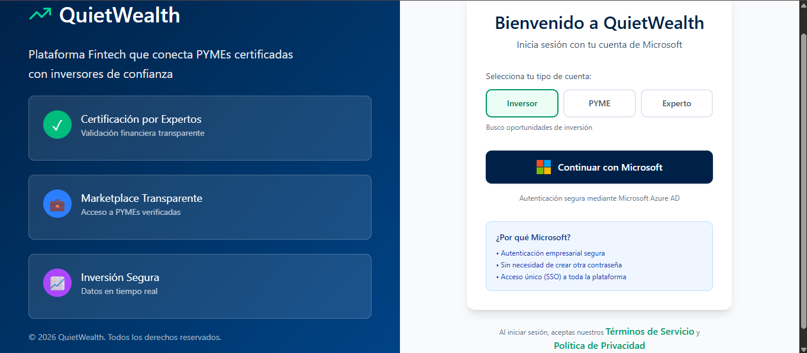

#### Marketplace
Lists certified SMEs with financial metrics and trust indicators.

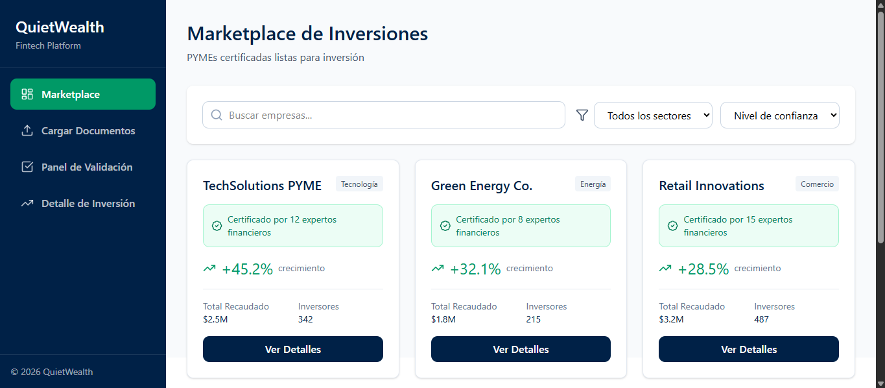

#### Document Upload
Allows SMEs to submit financial documents for expert review.

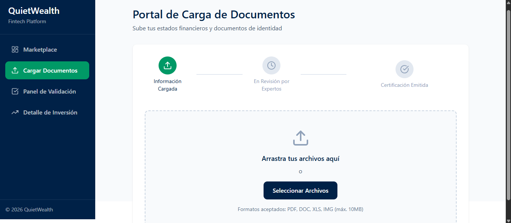

#### Expert Validation Panel
Enables financial experts to review and certify pending applications.

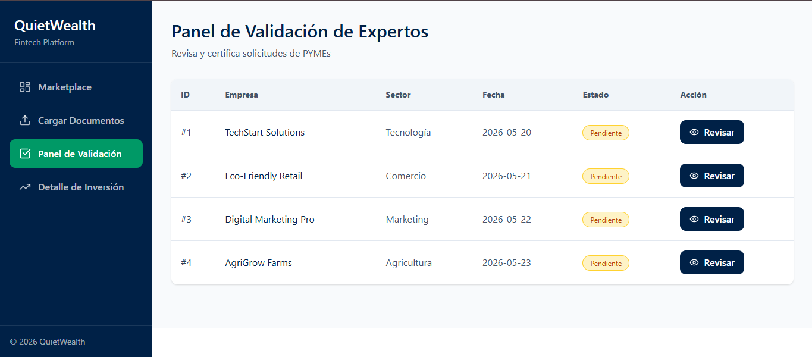

#### Investment Detail
Shows verified SME financials, growth charts, and expert certifications.

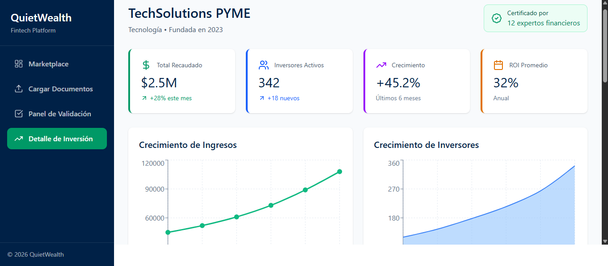
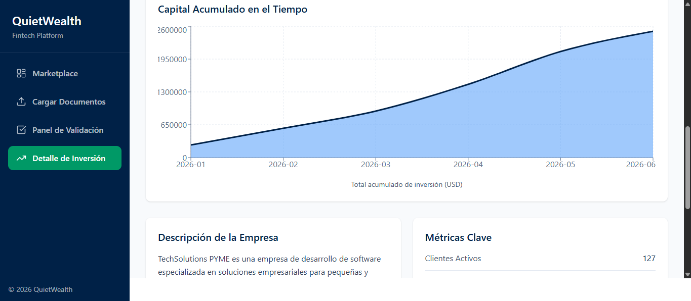
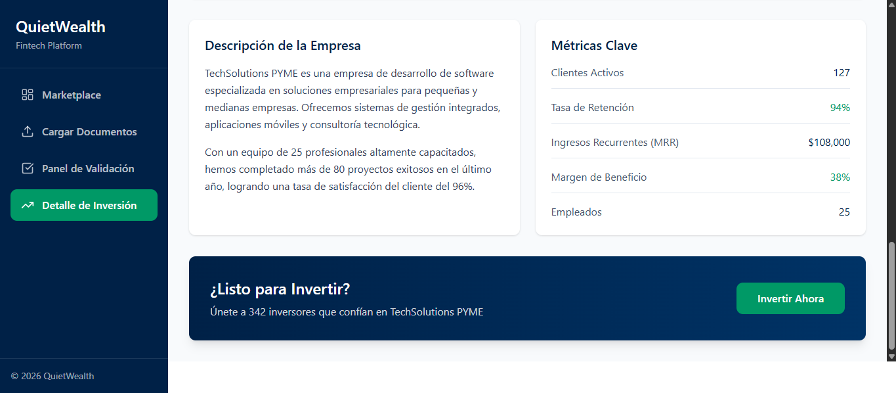

---

### 1.2.3 Usability Testing

Tests were conducted remotely using Maze, targeting the **Investment Detail Screen** — the most data-dense view.

#### Results

| Participant | Duration | OS | Browser | Score (1–5) | Feedback |
|---|---|---|---|---|---|
| 542521286 | 49 s | Windows | Chrome | 4 | "Considero que la información mostrada es clara." |
| 510669335 | 42 s | Windows | Chrome | 5 | "Esta bien" |
| 543901432 | 17.8 s | Windows | Brave | 4 | "all good" |
| 508804036 | 70.1 s | Windows | Edge | 5 | "." |
| 542802936 | 99.5 s | Windows | Edge | 5 | "Anuncios de invierta ahora no deberían de aparecer en la aplicación como tal, solo en una web." |
| 537502878 | 50.1 s | Linux | Firefox | 5 | "Muy detallada y presentable, no mejoraría nada." |
| **Average** | **54.8 s** | — | — | **4.7 / 5** | — |

#### Heatmaps — Investment Detail Screen

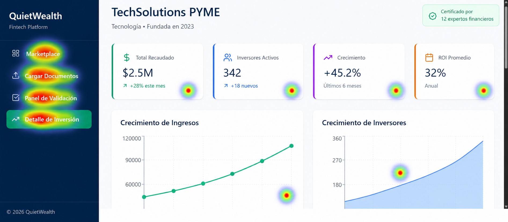
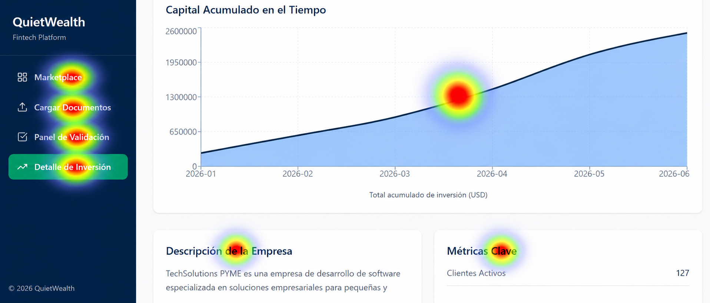
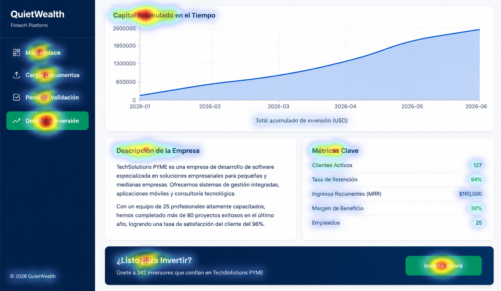

#### Issues and Corrections

| # | Screen | Issue | Severity |
|---|---|---|---|
| 1 | Investment Detail | The **Invertir Ahora** CTA felt too prominent; one participant noted it suits an external website better than an internal platform. | Medium |

| # | Issue | Correction | Decision Criteria |
|---|---|---|---|
| 1 | CTA felt intrusive inside the platform | Reduced visual weight of the button in the Investment Detail screen | Keeps the platform focused on trust and information rather than aggressive selling |

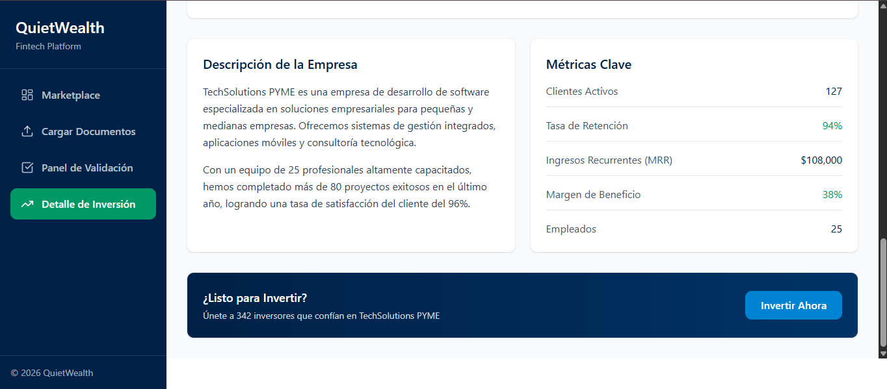

---

## 1.3 Component Design

### 1.3.1 Strategy
The frontend uses **Atomic Design** for component architecture.

### 1.3.2 File Structure

```
app/
 └─ components/
     ├─ atoms/
     ├─ molecules/
     ├─ organisms/
     ├─ templates/
     ├─ pages/
     ├─ hooks/
     ├─ i18n/
     └─ styles/
```

### 1.3.3 Component Levels

#### [Atoms](app/components/atoms)
Pure UI — no API calls, no business logic. Accept props only. Must support design tokens.

```
Button · Input · Badge · Spinner · ProgressBar
TrustIndicator · Label · Card · Toast · Modal · StatCard
```

```tsx
<Button variant="primary" size="md" loading>
  Submit Documents
</Button>
```

#### [Molecules](app/components/molecules)
Composed from atoms. Handle UI logic only — no direct API calls.

```
DocumentUploader · FormField · StatusBadge · InfoBanner · SMECard · FilterBar
```

```
SMECard
 ├─ TrustIndicator (certification status)
 ├─ StatCard (growth %, capital raised)
 └─ Button ("Ver Detalles")
```

#### [Organisms](app/components/organisms)
Larger layout sections. Composition only — no business logic.

```
MarketplaceGrid · InvestmentDetailPanel · ValidationQueue
DocumentUploadZone · Navbar · Sidebar · PageContainer
```

#### [Pages](app/components/pages)
Feature-specific components tied to a business process. Coordinate logic through hooks. Mounted by Next.js App Router.

```
LoginPage.tsx
MarketplacePage.tsx
DocumentUploadPage.tsx
ExpertValidationPage.tsx
InvestmentDetailPage.tsx
```

### 1.3.4 Reuse Rule
Before creating a component, check [atoms](app/components/atoms) and [molecules](app/components/molecules). If a similar one exists, extend it via props, variants, or composition — never duplicate.

```tsx
<TrustIndicator level="certified" />
<TrustIndicator level="pending" />
<TrustIndicator level="rejected" />
```

### 1.3.5 Hooks
All business logic lives in hooks. Hooks interact with services and state. Components never call services directly.

```
useAuth()               useMarketplace()         useDocumentUpload()
useExpertValidation()   useInvestmentDetail()     usePermissions()
usePolicies()           useSession()              useApplicationServices()
```

### 1.3.6 Naming Conventions

| Element | Convention | Example |
|---|---|---|
| Component files | `PascalCase` | `SMECard.tsx` |
| Component folders | `PascalCase` | `SMECard/` |
| Page files | `PascalCase` + `Page` suffix | `MarketplacePage.tsx` |
| Hook files | `camelCase` + `use` prefix | `useMarketplace.ts` |
| Service files | `PascalCase` + `Service` suffix | `TrustRecordService.ts` |
| Redux slices | `camelCase` + `Slice` suffix | `marketplaceSlice.ts` |
| Zod schemas | `camelCase` + `Schema` suffix | `documentUploadSchema.ts` |
| Type/interface files | `PascalCase` or `camelCase.types.ts` | `session.types.ts` |
| CSS module files | `camelCase.module.css` matching component | `smeCard.module.css` |
| Tailwind utilities | Token-based CSS vars only | `text-[var(--qw-navy)]` |
| Constants | `SCREAMING_SNAKE_CASE` | `MAX_UPLOAD_FILE_SIZE_MB` |
| DTOs | `PascalCase` + `DTO` suffix | `TrustRecordApplicationDTO` |
| Enums | `PascalCase` values | `CertificationStatus.PENDING` |
| Test files | Mirror source path + `.test.ts(x)` or `.spec.ts` | `AuthFacade.test.ts` |
| i18n keys | `dot.separated.camelCase` | `marketplace.filter.sector` |
| Non-component folders | `kebab-case` | `app/auth/` · `investment-detail/` |

### 1.3.7 Design Tokens

All visual styles are defined in [tokens.ts](app/components/styles/tokens.ts):

```ts
export const colors = {
  primary:    "#0D1F3C",   // QW Navy — headings, navbar
  accent:     "#1AACA8",   // QW Teal — CTA buttons, active states
  gold:       "#C8972B",   // QW Gold — trust scores, certified badges
  background: "#F5F7FA",   // Off-white page background
  surface:    "#FFFFFF",   // Cards and modals
  slate:      "#4A5568",   // Body text, secondary labels
  success:    "#22C55E",   // Certified, low-risk
  warning:    "#F59E0B",   // Pending review, medium-risk
  error:      "#EF4444",   // Rejected, high-risk, validation errors
};

export const spacing = { sm: "8px", md: "16px", lg: "24px", xl: "48px" };
export const radius  = { sm: "4px", md: "8px",  lg: "12px" };
```

Theme in [theme.ts](app/components/styles/theme.ts):

```ts
export const theme = {
  colors,
  spacing,
  radius,
  typography: {
    fontFamily:  "Inter, sans-serif",
    monoFamily:  "JetBrains Mono, monospace",  // financial metrics and numbers
    headingWeight: 600,
  },
};
```

**Typography tokens:**

| Token | Value | Usage |
|---|---|---|
| `--font-display` | `Inter, sans-serif` | Headings H1–H3 |
| `--font-body` | `Inter, sans-serif` | Body text, labels, tables |
| `--font-mono` | `JetBrains Mono, monospace` | Financial metrics, percentages, amounts |
| Base size | `16px` | Root `rem` reference |

**Styling rule — always use CSS variables, never hardcoded hex values:**

```tsx
// Correct
<Button className="bg-[var(--color-primary)] text-[var(--color-primary-foreground)]" />

// Wrong
<Button style={{ background: "#0D1F3C" }} />
```

**Logos:** SVG only. Two variants in [app/assets/logo/](app/assets/logo/): `logo-dark.svg` (white text, for dark navbar) and `logo-light.svg` (navy text, for light surfaces). Minimum width: `120px`. No rasterized PNGs.

**Icons:** Lucide React (`lucide-react@0.383.0`). Named imports only — required for tree-shaking. No icon fonts.

**Spacing:** 4-point Tailwind scale. Card padding: `p-4` (16px). Input padding: `p-2` (8px). Grid gaps: `gap-6` (24px). Page horizontal padding: `px-6 md:px-12 lg:px-24`.

**Trust status** must always be communicated with both color **and** a text label — never color alone (accessibility requirement):
- Certified → `--qw-gold` + checkmark icon
- Pending → `--qw-warning` + clock icon
- Rejected → `--qw-error` + X icon

### 1.3.8 Responsive Design

Breakpoints in [breakpoints.ts](app/components/styles/breakpoints.ts):

```ts
export const breakpoints = { mobile: 480, tablet: 768, desktop: 1200 };
```

| Device | Marketplace | Investment Detail | Navigation |
|---|---|---|---|
| Mobile | Single-column stacked cards | Single column | Hamburger menu |
| Tablet | 2-column card grid | Side-by-side metrics + charts | Collapsed sidebar |
| Desktop | 3-column card grid | Full dual-panel | Full sidebar |

Use `flex`/`grid` layouts. Avoid fixed widths. Use Tailwind responsive prefixes: `sm:`, `md:`, `lg:`.

### 1.3.9 Internationalization

All display text must be externalized. Literal strings in components are blocked by ESLint.

```tsx
// Wrong
<h1>Marketplace</h1>

// Correct
const { t } = useTranslation();
<h1>{t("marketplace.title")}</h1>
```

Translation files: [en.json](app/components/i18n/en.json) · [es.json](app/components/i18n/es.json)

### 1.3.10 Performance Rules

```tsx
// Lazy-load feature pages
const MarketplacePage      = lazy(() => import("@/components/pages/MarketplacePage"));
const InvestmentDetailPage = lazy(() => import("@/components/pages/InvestmentDetailPage"));

export function AppRoutes() {
  return (
    <Suspense fallback={<Spinner />}>
      <MarketplacePage />
    </Suspense>
  );
}

// Memoize heavy list items
export const SMECard = memo(function SMECard({ sme }: SMECardProps) {
  const formattedGrowth = useMemo(() => formatPercent(sme.growthRate), [sme.growthRate]);
  const onViewDetails   = useCallback(() => router.push(`/marketplace/${sme.id}`), [sme.id]);
  return <article onClick={onViewDetails}>...</article>;
});
```

- Use `React.memo` for list items rendered at scale.
- Use `lazy()` for all feature page modules.
- Use `useMemo` / `useCallback` to avoid unnecessary re-renders in heavy components.

---

## 1.4 Security

### 1.4.1 Stack

- Auth0 React SDK `2.2` — OAuth 2.0 Authorization Code + PKCE, Microsoft Entra ID federation
- JWT bearer tokens for protected API requests
- Zod for client-side form and API response validation
- Axios interceptors for centralized token attachment and 401 handling

### 1.4.2 Authentication

QuietWealth delegates authentication to **Auth0** federating exclusively with **Microsoft Entra ID**. All users are expected to have corporate Microsoft accounts.

**Auth flow:**
1. User selects **Continue with Microsoft**.
2. Frontend redirects to Auth0 Universal Login.
3. Auth0 federates with Microsoft Entra ID.
4. Microsoft returns an authorization code to Auth0.
5. Auth0 forwards the code to `AUTH0_CALLBACK_URL`.
6. Backend validates the JWT; session is created.

**Identity providers:**

| Provider | Supported | Reason |
|---|---|---|
| Microsoft Entra ID | Yes | OAuth 2.0 Authorization Code + PKCE via Auth0 |
| Google | No | Out of scope — platform targets corporate SME/investor accounts |

**Auth0 configuration parameters:**

| Parameter | Storage |
|---|---|
| `AUTH0_DOMAIN` | Azure Key Vault (prod/QA) · `.env.local` (local) |
| `AUTH0_CLIENT_ID` | Azure Key Vault (prod/QA) · `.env.local` (local) |
| `AUTH0_CLIENT_SECRET` | Azure Key Vault (prod/QA) · `.env.local` (local) — backend only |
| `AUTH0_CALLBACK_URL` | Azure Key Vault (prod/QA) · `.env.local` (local) |
| `AUTH0_AUDIENCE` | Azure Key Vault (prod/QA) · `.env.local` (local) |

**MFA:** Managed by Auth0 Adaptive MFA. Supported factors: Authenticator app (TOTP), SMS OTP, Email OTP. Enforced for all roles.

**AuthFacade** — the only entry point for all auth operations ([app/auth/AuthFacade.ts](app/auth/AuthFacade.ts)):

```ts
export class AuthFacade {
  private static instance: AuthFacade | null = null;
  static getInstance(): AuthFacade { ... }
  private constructor() {}

  async login(): Promise<void>         { /* redirects to Auth0 → Microsoft */ }
  async logout(): Promise<void>        { /* clears local session and Auth0 session */ }
  async getAccessToken(): Promise<string> { /* getAccessTokenSilently() with auto-refresh */ }
  getSession(): UserSessionDTO | null  { /* returns current in-memory session */ }
}
export const authFacade = AuthFacade.getInstance();
```

**MicrosoftProfileAdapter** normalizes Entra ID claims into `UserSessionDTO` ([app/auth/adapters/MicrosoftProfileAdapter.ts](app/auth/adapters/MicrosoftProfileAdapter.ts)):

```ts
export class MicrosoftProfileAdapter {
  adapt(rawClaims: MicrosoftClaims): UserSessionDTO {
    return {
      userId:      rawClaims.oid,
      email:       rawClaims.preferred_username,
      displayName: rawClaims.name,
      role:        this.resolveRole(rawClaims),
      accessToken: rawClaims.access_token,
      expiresAt:   rawClaims.exp,
    };
  }
}
```

**JWT contents:**

| Claim | Description |
|---|---|
| `sub` | Auth0 user ID |
| `email` | Corporate email from Entra ID |
| `name` | Display name |
| `roles` | Array of platform roles (e.g. `["investor"]`) |
| `permissions` | Array of granted permission codes |
| `aud` | `AUTH0_AUDIENCE` |
| `iss` | Auth0 domain |
| `exp` | Expiry timestamp |
| `iat` | Issued-at timestamp |

Estimated JWT payload size: **< 2 KB**.

**Token management:**

| Aspect | Configuration |
|---|---|
| Access token expiry | 60 minutes |
| Refresh token rotation | Enabled — each use issues a new refresh token |
| Silent refresh | `getAccessTokenSilently()` called by Auth0 SDK before expiry |
| Token storage | Access tokens in Redux memory only; refresh token in `HttpOnly`, `Secure`, `SameSite=Strict` cookie — inaccessible to JavaScript |
| Logout | `logout({ returnTo: window.location.origin })` — clears local session and Auth0 session |

**Session expiry:** On `401`, the Axios interceptor in [app/services/httpInterceptors.ts](app/services/httpInterceptors.ts) calls `sessionManager.handleUnauthorized()` and redirects to login with a session-expired message.

**Auth latency:** Auth0 + Entra ID round-trip takes 1–5 seconds. A loading spinner is shown immediately when the user clicks **Continue with Microsoft** and persists until the callback resolves.

**AuthAuditQueue** ([app/auth/AuthAuditQueue.ts](app/auth/AuthAuditQueue.ts)): Batches auth events (login, logout, token refresh, permission denial) and dispatches them asynchronously to Application Insights — preventing auth flow delays from synchronous logging I/O.

---

### 1.4.3 Authorization

#### Roles
[app/auth/policies/roles.ts](app/auth/policies/roles.ts)

| Code | Description |
|---|---|
| `investor` | Browses the Marketplace, views investment details, initiates investment flow |
| `sme_owner` | Uploads financial documents, tracks certification status |
| `financial_analyst` | Reviews pending certification requests, issues certification decisions |
| `sys_admin` | Full system access including user management, audit logs, and system configuration |

#### Permissions
[app/auth/policies/permissions.ts](app/auth/policies/permissions.ts)

| Code | Description |
|---|---|
| `auth.login` / `auth.logout` | Session start/end |
| `session.read` | Access authenticated screens |
| `marketplace.browse` | View the investment marketplace and SME listings |
| `investment.detail.view` | View full investment detail screen |
| `investment.initiate` | Click **Invertir Ahora** and enter the investment flow |
| `documents.upload` | Upload financial documents for certification |
| `documents.status.read` | Track document review and certification status |
| `validation.queue.read` | View the pending certification queue (expert panel) |
| `validation.certify` | Issue certification decisions on SME applications |
| `audit_log.read` | View audit trail |
| `users.admin` / `roles.admin` / `system.config` | `sys_admin` only |

#### Role-Permission Mapping
[app/auth/policies/rolePermissions.ts](app/auth/policies/rolePermissions.ts)

| Role | Permissions |
|---|---|
| `investor` | `auth.login`, `auth.logout`, `session.read`, `marketplace.browse`, `investment.detail.view`, `investment.initiate` |
| `sme_owner` | `auth.login`, `auth.logout`, `session.read`, `documents.upload`, `documents.status.read` |
| `financial_analyst` | `auth.login`, `auth.logout`, `session.read`, `validation.queue.read`, `validation.certify`, `audit_log.read` |
| `sys_admin` | All permissions |

#### Access Policies
[app/auth/policies/accessPolicy.ts](app/auth/policies/accessPolicy.ts)

| Policy | Required Permissions |
|---|---|
| `canBrowseMarketplace` | `marketplace.browse` |
| `canViewInvestmentDetail` | `investment.detail.view` |
| `canInitiateInvestment` | `investment.initiate` |
| `canUploadDocuments` | `documents.upload` |
| `canTrackCertification` | `documents.status.read` |
| `canAccessValidationQueue` | `validation.queue.read` |
| `canCertifySME` | `validation.certify` |
| `canReadAuditLog` | `audit_log.read` |
| `canManageSystem` | `users.admin`, `roles.admin`, `system.config` |

#### Route Guards
[app/auth/guards/](app/auth/guards/)

**AuthGuard** — blocks unauthenticated users:
```tsx
<AuthGuard>
  <DashboardLayout><MarketplacePage /></DashboardLayout>
</AuthGuard>
```

**GuestGuard** — prevents authenticated users from accessing public routes:
```tsx
<GuestGuard><LoginPage /></GuestGuard>
```

**PolicyGuard** — blocks a route when the user lacks required permissions:
```tsx
<AuthGuard>
  <PolicyGuard required={accessPolicy.canCertifySME}>
    <ExpertValidationPage />
  </PolicyGuard>
</AuthGuard>
```

#### Permission Check Rule

```ts
// Wrong — never check roles directly
if (user.role === "financial_analyst") { ... }

// Correct — always use access policies
const { hasAccess } = usePolicies();
{hasAccess("canCertifySME") && <CertifyButton />}
```

- **`hasAccess`** — all required permissions must be held (default for all actions).
- **`hasSomeAccess`** — any required permission held (for dashboards and grouped menus).
- **`getMissingPermissions`** — use in admin/debug screens or access-denied messages.

---

### 1.4.4 Encryption and Data Privacy

**In transit:**
- All browser-to-Azure communication enforced over HTTPS / TLS 1.3. HTTP requests rejected with `301`.
- `Strict-Transport-Security: max-age=31536000; includeSubDomains`.
- Auth0 token exchange over HTTPS only.

**Tokens:**
- Access tokens stored **in memory only** (Redux). Never written to `localStorage`, `sessionStorage`, or IndexedDB.
- Refresh tokens in an `HttpOnly`, `Secure`, `SameSite=Strict` cookie managed by Auth0 SDK — inaccessible to JavaScript.

**Secrets management:**
- Auth0 credentials sourced from **Azure Key Vault** at runtime via [app/settings/Settings.ts](app/settings/Settings.ts).
- `.env.example` contains placeholder values only. No credentials in source control.
- `Logger` strips any key matching `/token|secret|password|key/i` before emitting to Application Insights.

**Privacy:**
- No document content is cached on the client. Uploaded bytes are streamed directly to the backend.
- CSRF protection via Auth0 `state` parameter, validated on callback before the authorization code is exchanged.

---

### 1.4.5 Data Masking

Masking operates at two independent layers:

| Layer | Who | Behavior |
|---|---|---|
| Backend | .NET API | Returns `null` on sensitive fields when the JWT does not include `investment.detail.view` |
| Frontend | `MaskedValue` atom | Renders `••••••••` when `value == null` or `usePolicies()` denies access |

The frontend is **not** the security enforcement layer — if the backend returns `null`, the component masks it regardless of local permission state.

**`MaskedValue` component** ([app/components/atoms/MaskedValue/MaskedValue.tsx](app/components/atoms/MaskedValue/MaskedValue.tsx)):

```tsx
interface MaskedValueProps {
  value: string | null | undefined;
  visible: boolean;
  placeholder?: string;        // default: "••••••••"
  as?: "span" | "p" | "td";   // default: "span"
  "data-testid"?: string;
}

export function MaskedValue({ value, visible, placeholder = "••••••••", as: Tag = "span", ...rest }: MaskedValueProps) {
  const isRevealed = visible && value != null;
  return (
    <Tag
      aria-label={isRevealed ? undefined : t("maskedValue.hiddenLabel")}
      aria-hidden={!isRevealed}
      className={isRevealed ? "font-mono text-[var(--color-slate)]" : "select-none tracking-widest opacity-50"}
      {...rest}
    >
      {isRevealed ? value : placeholder}
    </Tag>
  );
}
```

- `value == null` → placeholder, regardless of `visible`.
- `visible = false` → placeholder, regardless of `value`.
- `select-none` prevents copying the placeholder text.

**Masked fields** — all in Investment Detail, all require `investment.detail.view`:

`revenueAmount` · `profitMargin` · `mrr` · `averageROI` · `totalRaised` · `retentionRate`

Never masked: `growthRate`, `certificationStatus`, `sector`, company name.

**Usage in `InvestmentDetailPanel`:**

```tsx
const canView = usePolicies().hasAccess("canViewInvestmentDetail");

// Correct
<StatCard label={t("detail.mrr")}>
  <MaskedValue value={sme.mrr} visible={canView} data-testid="stat-mrr" />
</StatCard>

// Wrong
canView ? <span>{sme.mrr}</span> : null
sme.mrr ?? "N/A"
```

**Zod schema** ([app/validation/smeSchema.ts](app/validation/smeSchema.ts)):

```ts
export const smeDetailSchema = z.object({
  id:                  z.string().uuid(),
  name:                z.string(),
  sector:              z.string(),
  growthRate:          z.number(),                    // always public
  certificationStatus: z.nativeEnum(CertificationStatus),

  // nullable — backend omits these if the caller lacks the permission
  totalRaised:   z.number().nullable(),
  mrr:           z.string().nullable(),
  averageROI:    z.string().nullable(),
  profitMargin:  z.string().nullable(),
  retentionRate: z.string().nullable(),
  revenueAmount: z.string().nullable(),
});
```

**Acceptance tests:**

```ts
// app/__tests__/e2e/investment-detail.spec.ts
test("sme_owner sees masked fields", async ({ page }) => {
  await injectAuthSession(page, { role: "sme_owner" });
  await page.goto("/marketplace/sme-123");
  await expect(page.getByTestId("stat-mrr")).toHaveText("••••••••");
});

test("investor sees real values", async ({ page }) => {
  await injectAuthSession(page, { role: "investor" });
  await page.goto("/marketplace/sme-123");
  await expect(page.getByTestId("stat-mrr")).not.toHaveText("••••••••");
});
```

---

### 1.4.6 API Communication

All HTTP calls go through the centralized HTTP facade ([app/services/client.ts](app/services/client.ts)). Interceptors in [app/services/httpInterceptors.ts](app/services/httpInterceptors.ts) handle:
- Attaching `Authorization: Bearer <token>` on every protected request.
- Detecting `401` and triggering `sessionManager.handleUnauthorized()`.
- Zod schema validation on every API response before data reaches Redux state.

Never call `fetch` or `axios` directly — always use the injected HTTP facade via `useApplicationServices().http`.

---

### 1.4.7 Storage Rules

| Storage | Allowed Use |
|---|---|
| Memory (Redux) | Active session token, marketplace data, certification status |
| Auth0 `HttpOnly` cookie | Refresh token — managed by Auth0 SDK, inaccessible to JavaScript |
| `localStorage` | UI preferences only (theme, language) |
| `sessionStorage` | Not used |

```ts
localStorage.setItem("theme", "dark");       // Allowed
// localStorage.setItem("accessToken", t);  // Forbidden
```

---

### 1.4.8 OWASP Mitigations

| OWASP Risk | Developer Responsibility | Implementation Area | Acceptance Criteria |
|---|---|---|---|
| XSS | Never render untrusted HTML. Do not use `dangerouslySetInnerHTML`. All dynamic text through React JSX escaping. | `app/components/`, ESLint config | PR is rejected if `dangerouslySetInnerHTML` appears. ESLint rule must fail the build. |
| Broken Authentication | All login, logout, token retrieval, and refresh must go through `AuthFacade`. Never call Auth0 SDK from pages or components directly. | `app/auth/AuthFacade.ts`, `app/auth/AuthMiddleware.ts`, `app/services/httpInterceptors.ts` | Components never access Auth0 SDK directly. API calls receive tokens only through the interceptor. |
| Token Exposure | Access tokens in memory only. Never store tokens in `localStorage`, `sessionStorage`, IndexedDB, or URL parameters. | `app/state/authSlice.ts`, `app/state/sessionManager.ts`, `app/services/httpInterceptors.ts` | Static analysis blocks token-related keys in browser storage. |
| Broken Access Control | Protected routes must use `AuthGuard` + `PolicyGuard`. UI actions check permissions via `usePolicies()`, never by role string. | `app/auth/guards/`, `app/auth/policies/`, `app/components/hooks/usePolicies.ts` | Code must not contain `user.role === "..."` checks. |
| Sensitive Data Exposure | Financial values must be masked unless the user has permission and the backend has authorized the response. | `app/components/atoms/MaskedValue/`, `InvestmentDetailPanel/` | Unauthorized users see masked or null values. Client masking is not treated as the only control. |
| Injection | All form inputs and API responses validated with Zod schemas before reaching Redux or UI. | `app/validation/`, `app/services/`, feature hooks | Invalid payloads throw a validation error and must not update UI state. |
| CSRF | Auth uses Auth0 Authorization Code + PKCE with the `state` parameter. No custom OAuth callbacks. | `app/auth/AuthFacade.ts`, Auth0 config | Login flow preserves PKCE and state validation. |
| Security Misconfiguration | Environment variables and secrets through the settings layer. Secrets never committed to the repo. | `app/settings/Settings.ts`, Azure Key Vault, `.env.example` | `.env.example` contains placeholders only. |
| Clickjacking | Application must reject iframe embedding. | Azure App Service headers / Next.js security headers | `X-Frame-Options: DENY` or `Content-Security-Policy: frame-ancestors 'none'` configured. |
| Security Logging | Security events logged through `Logger` and `AuthAuditQueue`. Raw tokens, passwords, or financial values must never appear in logs. | `app/utils/logger.ts`, `app/auth/AuthAuditQueue.ts`, Application Insights | Logs include `correlationId`, event type, hashed userId, timestamp. Sensitive keys redacted. |
| File Upload Abuse | Documents validated by MIME type and size before submission. Frontend validates early; backend is the final authority. | `app/validation/documentUploadSchema.ts`, `DocumentUploader/` | Files above the size limit or unsupported MIME types are rejected before upload with a clear error. |

**Developer rules — apply to every feature:**
- Do not call APIs directly from components.
- Do not store tokens in browser-persistent storage.
- Do not check user roles directly in components.
- Do not log raw financial values or authentication secrets.
- Do not create new security logic inside pages — reuse `AuthFacade`, `AuthMiddleware`, `PolicyGuard`, `usePolicies()`, and Zod schemas.
- Every protected screen must have both an authentication and an authorization check.

---

## 1.5 Layered Architecture

The frontend uses five logical layers with **downward-only dependencies**. This section defines what code goes where — the C4 diagrams in section 1.10 explain system structure.

| Layer | Responsibility | Examples | Rule |
|---|---|---|---|
| Presentation | Render UI and handle user interaction | Atoms, molecules, organisms, pages, layouts | May call hooks; must not call services or API clients directly |
| Application | Orchestrate use cases and UI workflows | `useAuth`, `useMarketplace`, `useDocumentUpload`, `useExpertValidation`, `useInvestmentDetail` | Validates user actions, calls services, dispatches Redux actions |
| Domain | Define business rules, permissions, DTOs, and validation schemas | Zod schemas, role definitions, permission policies, models | Must not import React components or infrastructure clients |
| Services | Communicate with backend and external SDKs | `AuthFacade`, `HttpClientFacade`, `MarketplaceService`, `TrustRecordService`, `ExpertValidationService`, `InvestmentService` | Exposes clean methods to hooks; must not render UI |
| Infrastructure | Shared technical concerns | Redux store, `SessionProvider`, `Logger`, `ExceptionHandler`, i18n, settings, design tokens | Supports other layers; must not contain feature-specific UI logic |

**Dependency flow:**
```
UI Components
      ↓
Feature Hooks
      ↓
Application Services
      ↓
Infrastructure
```

### Flow Examples

**Login:**
`LoginPage` → `useAuth().login()` → `AuthFacade` (Auth0 PKCE flow) → `MicrosoftProfileAdapter` normalizes claims → `SessionManager` updates session → Redux reflects authenticated state.

**Document Upload:**
`DocumentUploadPage` → `useDocumentUpload().submit(files)` → validates with `documentUploadSchema` → `TrustRecordService` sends `POST` → backend returns `202 Accepted` → `PollingOrchestrator` starts status polling → `certificationSlice` updates the progress tracker until terminal state.

---

## 1.6 Design Patterns

### Singleton
One shared instance app-wide.

| Class | File |
|---|---|
| `Logger` | [app/utils/logger.ts](app/utils/logger.ts) |
| `ExceptionHandler` | [app/utils/error-handler.ts](app/utils/error-handler.ts) |
| `AuthFacade` | [app/auth/AuthFacade.ts](app/auth/AuthFacade.ts) |
| `SessionManager` | [app/state/sessionManager.ts](app/state/sessionManager.ts) |
| `CertificationPollingStore` | [app/state/certificationPollingStore.ts](app/state/certificationPollingStore.ts) |
| `DefaultHttpClientFacade` | [app/services/client.ts](app/services/client.ts) |
| `DefaultApplicationServiceFacade` | [app/services/applicationFacade.ts](app/services/applicationFacade.ts) |

```ts
export class MyService {
  private static instance: MyService | null = null;
  static getInstance(): MyService {
    if (!MyService.instance) MyService.instance = new MyService();
    return MyService.instance;
  }
  private constructor() {}
}
export const myService = MyService.getInstance();
```

### Observer — Certification Status Tracking
Used for the long-running document certification process.

Reference files: [certification.types.ts](app/state/certification.types.ts) · [certificationPollingStore.ts](app/state/certificationPollingStore.ts) · [certificationPollingManager.ts](app/state/certificationPollingManager.ts) · [useCertificationProgress.ts](app/components/hooks/useCertificationProgress.ts)

```ts
// Observable store
class CertificationPollingStore {
  private listeners = new Set<Listener<CertificationState>>();
  private state: CertificationState = createInitialState();

  getState()  { return this.state; }
  subscribe(listener: Listener<CertificationState>) {
    this.listeners.add(listener);
    listener(this.state);            // emit immediately on subscribe
    return () => this.listeners.delete(listener);
  }
  patchState(partial: Partial<CertificationState>) {
    this.state = { ...this.state, ...partial };
    for (const l of this.listeners) l(this.state);
  }
}

// Subscriber hook
function useCertificationProgress() {
  const [state, setState] = useState(() => certificationPollingManager.getSnapshot());
  useEffect(() => certificationPollingManager.subscribe(setState), []);
  return state;
}

// Manager — non-blocking kickoff
async function startPolling(applicationId: string) {
  store.patchState({ runState: "polling", applicationId });
  void runPollingLoop(applicationId);
}
```

### Facade — Auth + Application Services
[AuthFacade.ts](app/auth/AuthFacade.ts) · [applicationFacade.ts](app/services/applicationFacade.ts)

```ts
export interface AuthServiceFacade {
  login(): Promise<void>;
  logout(): Promise<void>;
  getAccessToken(): Promise<string>;
  getCurrentSession(): Promise<UserSessionDTO | null>;
}

export interface ApplicationServiceFacade {
  readonly auth: AuthServiceFacade;
  readonly http: HttpClientFacade;
}
```

Hooks import only `useApplicationServices()`. New domains are added by extending facades — never by importing low-level clients directly in hooks.

### Adapter
[MicrosoftProfileAdapter.ts](app/auth/adapters/MicrosoftProfileAdapter.ts)

Normalizes Microsoft Entra ID claims (forwarded by Auth0) into `UserSessionDTO`. The rest of the application never sees provider-specific claim shapes.

### Proxy — Auth Middleware
[AuthMiddleware.ts](app/auth/AuthMiddleware.ts)

Intercepts every protected API call to validate JWT expiry and trigger silent refresh or logout before the request is dispatched.

### Strategy — Polling Interval
[app/polling/strategies/](app/polling/strategies/)

```ts
export interface IPollingStrategy {
  getInterval(attempt: number): number;  // ms
}

export class FixedIntervalStrategy implements IPollingStrategy {
  getInterval(_: number) { return 10_000; }  // 10 s
}

export class ExponentialBackoffStrategy implements IPollingStrategy {
  getInterval(attempt: number) { return Math.min(2 ** attempt * 1000, 60_000); }
}
```

`PollingOrchestrator` switches to `ExponentialBackoffStrategy` on network errors. After 5 failed attempts it stops and dispatches a connectivity error to the UI.

### Queue-Based Logging
[AuthAuditQueue.ts](app/auth/AuthAuditQueue.ts)

Auth events are enqueued and dispatched asynchronously to Application Insights, preventing auth flow delays from synchronous logging I/O.

---

## 1.7 Implementation Guide

### State Management

State is split into **global shared state** (Redux Toolkit) and **local UI state** (`useState` / `useReducer`). Rule: if more than one component needs a value, it goes into Redux; otherwise it stays local.

#### Redux Slices

| Slice | File | Holds |
|---|---|---|
| `auth` | [app/state/slices/authSlice.ts](app/state/slices/authSlice.ts) | `isAuthenticated`, `user`, `role`, `accessToken` |
| `marketplace` | [app/state/slices/marketplaceSlice.ts](app/state/slices/marketplaceSlice.ts) | SME listings, active filters, search query |
| `certification` | [app/state/slices/certificationSlice.ts](app/state/slices/certificationSlice.ts) | Upload job: `applicationId`, `status`, `stage` |
| `validation` | [app/state/slices/validationSlice.ts](app/state/slices/validationSlice.ts) | Expert queue: pending requests, selected request |

#### Local State (keep out of Redux)
- Form input values inside a single component.
- UI toggles: modal open/close, dropdown expanded, per-button loading spinners.
- Transient error messages that don't need to survive navigation.

#### Reading State

Always use typed hooks from [app/state/hooks.ts](app/state/hooks.ts):

```ts
import { useAppSelector, useAppDispatch } from "@/state/hooks";

const smes     = useAppSelector(state => state.marketplace.smes);
const dispatch = useAppDispatch();
```

#### Writing State

All writes go through slice actions or async thunks:

```ts
dispatch(certificationSlice.actions.certificationStarted(applicationId));
```

#### Async Operations

Use `createAsyncThunk` for API calls. Thunks handle `pending`, `fulfilled`, and `rejected` automatically:

```ts
export const fetchSMEs = createAsyncThunk(
  "marketplace/fetchSMEs",
  async (filters: SMEFilters) => {
    return await marketplaceService.getSMEs(filters);
  }
);
```

State transitions follow the thunk lifecycle: `pending → loading`, `fulfilled → succeeded`, `rejected → failed`.

#### Infrastructure Files

| File | Purpose |
|---|---|
| [app/state/store.ts](app/state/store.ts) | Configures the Redux store; registers all slices |
| [app/state/StoreProvider.tsx](app/state/StoreProvider.tsx) | Wraps the app with `<Provider store={store}>` |
| [app/state/hooks.ts](app/state/hooks.ts) | Exports typed `useAppSelector` and `useAppDispatch` |

---

### Async Communication and Polling

Document certification is a long-running async process. The frontend polls `GET /api/trust-record-applications/{id}/status` every 10 seconds until status reaches `CERTIFIED`, `REJECTED`, or `REQUIRES_HUMAN_REVIEW`.

| File | Description |
|---|---|
| [PollingOrchestrator.ts](app/polling/PollingOrchestrator.ts) | Starts, suspends, and stops the polling loop; dispatches status to `certificationSlice` |
| [FixedIntervalStrategy.ts](app/polling/strategies/FixedIntervalStrategy.ts) | 10-second fixed interval (normal operation) |
| [ExponentialBackoffStrategy.ts](app/polling/strategies/ExponentialBackoffStrategy.ts) | Doubles interval on each failure, capped at 60 s; activated on `503` or network error |

---

### Events

**1. Redux dispatch — intra-app state:**

```ts
dispatch(certificationSlice.actions.certificationCompleted({ applicationId, trustScore }));
dispatch(validationSlice.actions.decisionIssued({ requestId, decision: "approved" }));
```

**2. Custom DOM events — UI side-effects only** (e.g. Toast notifications, global loaders):

```ts
// app/utils/eventBus.ts
export const eventBus = {
  emit<T>(name: string, detail: T) {
    window.dispatchEvent(new CustomEvent(name, { detail }));
  },
  on<T>(name: string, handler: (detail: T) => void) {
    const listener = (e: Event) => handler((e as CustomEvent<T>).detail);
    window.addEventListener(name, listener);
    return () => window.removeEventListener(name, listener);
  },
};

// Emit from service layer
eventBus.emit("toast:show", { message: "Documents submitted successfully", type: "success" });

// Subscribe in Toast organism (mounted once at layout level)
useEffect(() => eventBus.on("toast:show", setToast), []);
```

**Rules:**
- Custom DOM events are for UI side-effects only. Business state always goes through Redux.
- Event names use `namespace:verb` format: `toast:show`, `session:expired`.
- Every `on()` subscription must return its cleanup function and be called inside `useEffect`.

---

### Observability

| File | Description |
|---|---|
| [app/utils/logger.ts](app/utils/logger.ts) | Singleton logger — emits `info`, `warn`, `error` to Azure Application Insights |
| [app/utils/error-handler.ts](app/utils/error-handler.ts) | Singleton — maps HTTP codes to user-facing messages; routes 5xx to App Insights |

**Logged events:**

| Event | Trigger |
|---|---|
| `AuthLoginStarted` | User clicks **Continue with Microsoft** |
| `AuthLoginCompleted` | Session established after token exchange |
| `AuthLoginFailed` | Auth0 returns error on callback |
| `AuthLogoutCompleted` | Logout flow finishes |
| `DocumentsSubmitted` | `POST /api/trust-record-applications` sent |
| `CertificationPollingStarted` | `PollingOrchestrator.start()` called |
| `CertificationStatusChanged` | Any state transition detected by polling |
| `CertificationCompleted` | Status reaches `CERTIFIED` |
| `CertificationRejected` | Status reaches `REJECTED` |
| `ValidationDecisionIssued` | Expert certifies or rejects a request |
| `InvestmentDetailViewed` | User opens Investment Detail screen |
| `ApiRequestFailed` | Any HTTP error from `ExceptionHandler` |
| `ContractViolationError` | Zod schema mismatch on API response |
| `UnhandledExceptionCaptured` | React error boundary catches render crash |

**Rules:**
- Every event must include: `correlationId`, `userId` (hashed), `role`, `timestamp`, `appVersion`.
- Do not log raw financial values — log identifiers only (`applicationId`, `smeId`).
- Do not log every polling tick — log only meaningful status transitions and exceptional failures.

**Error handling by HTTP status:**

| Status | User-facing behavior |
|---|---|
| `400` | Inline form validation error next to the offending field |
| `401` | Silent token refresh attempted; if it fails, redirect to login with session-expired message |
| `403` | Toast: "You don't have permission to perform this action" |
| `404` | Redirect to not-found page |
| `429` | Toast with retry countdown; `ExponentialBackoffStrategy` activated |
| `5xx` | Toast with support reference number; polling retries up to 5 times |

---

### Data Validation

| File | Description |
|---|---|
| [app/validation/documentUploadSchema.ts](app/validation/documentUploadSchema.ts) | Validates MIME types (`application/pdf`, `application/vnd.ms-excel`, `image/*`), max 10 MB/file |
| [app/validation/smeSchema.ts](app/validation/smeSchema.ts) | Validates SME listing and investment detail API response shapes |
| [app/validation/userSchema.ts](app/validation/userSchema.ts) | Validates user profile shape from Auth0 token claims |

A schema mismatch throws a `ContractViolationError` logged to Application Insights with the full response payload.

---

### Caching

| Layer | Strategy |
|---|---|
| Marketplace listings | Stored in Redux; stale after 5 minutes — triggers fresh fetch |
| Investment detail | Stored in Redux per `smeId`; invalidated on certification status change |
| Certification status polling | `Cache-Control: no-store` — always fresh |
| Static assets (JS, CSS, SVG) | Content-hash filenames; `max-age=31536000, immutable` via Azure CDN |

---

### API Contracts

The frontend treats the backend OpenAPI spec as the single source of truth. Workflow: **spec first → generate types → validate at runtime**.

**Refresh the local spec from a running QA backend:**
```bash
curl https://qaquietwealth-api.azurewebsites.net/swagger/v1/swagger.json \
  -o app/contracts/openapi.json
```

**Regenerate types after a spec update:**
```bash
npx openapi-typescript app/contracts/openapi.json --output app/models/api.types.ts
```

Never hand-write DTO types for backend endpoints — always regenerate from the spec.

**Endpoints by service:**

| Service | File | Endpoints |
|---|---|---|
| Marketplace | [MarketplaceService.ts](app/services/MarketplaceService.ts) | `GET /api/smes` · `GET /api/smes/{id}` |
| Trust Record | [TrustRecordService.ts](app/services/TrustRecordService.ts) | `POST /api/trust-record-applications` · `GET /api/trust-record-applications/{id}/status` |
| Expert Validation | [ExpertValidationService.ts](app/services/ExpertValidationService.ts) | `GET /api/validation-queue` · `POST /api/validation-queue/{id}/decision` |
| Investment | [InvestmentService.ts](app/services/InvestmentService.ts) | `POST /api/investments` |

**Runtime validation** — every API response is validated with Zod before reaching Redux, catching backend contract drift that TypeScript alone cannot catch at runtime:

```ts
// TrustRecordService.ts
async getStatus(applicationId: string): Promise<TrustRecordStatus> {
  const response = await httpClient.get(`/api/trust-record-applications/${applicationId}/status`);
  return trustRecordStatusSchema.parse(response.data);  // throws ContractViolationError on mismatch
}
```

---

### Performance Optimization

**Code splitting:** Next.js App Router splits at route segment level automatically.

**Lazy loading and memoization:**
```tsx
const InvestmentDetailPage = lazy(() => import("@/components/pages/InvestmentDetailPage"));
const ExpertValidationPage  = lazy(() => import("@/components/pages/ExpertValidationPage"));

<Suspense fallback={<Spinner />}>
  <InvestmentDetailPage />
</Suspense>
```

**Bundle limits:**
- `next-bundle-analyzer` runs in CI; any chunk exceeding **250 KB** fails the pipeline.
- Lucide React: named imports only — `import { TrendingUp, Shield } from "lucide-react"`.
- TailwindCSS JIT eliminates unused utility classes at build time.

**Image optimization:**
- All rasterized assets use Next.js `<Image>` with explicit `width`/`height`.
- Logos served as inline SVG only — no raster formats.

**List virtualization:**
```tsx
import { FixedSizeList } from "react-window";

<FixedSizeList height={600} itemCount={smes.length} itemSize={120} width="100%">
  {({ index, style }) => <SMECard style={style} sme={smes[index]} />}
</FixedSizeList>
```

Apply `react-window` (`FixedSizeList`) to the Marketplace grid and Expert Validation Queue when row count exceeds 100.

---

## 1.8 Testing

### Unit Tests (Jest)

| Folder | What is tested |
|---|---|
| [app/__tests__/unit/auth/](app/__tests__/unit/auth/) | `AuthFacade`, `hasPermission`, `getMissingPermissions`, `MicrosoftProfileAdapter` |
| [app/__tests__/unit/polling/](app/__tests__/unit/polling/) | `PollingOrchestrator` state transitions, `FixedIntervalStrategy`, `ExponentialBackoffStrategy` |
| [app/__tests__/unit/services/](app/__tests__/unit/services/) | `MarketplaceService`, `TrustRecordService`, `ExpertValidationService` — with `HttpClientFacade` mocked |
| [app/__tests__/unit/validation/](app/__tests__/unit/validation/) | Zod schemas: valid payloads pass; invalid payloads produce expected error shapes |

**Rules per unit test:**
- Cover expected behavior, edge cases (empty, loading, error states), and exception paths.
- Mock all external dependencies.
- Never call real APIs, Auth0, or Azure services.

```ts
// MicrosoftProfileAdapter.test.ts
it("maps Entra ID oid to userId", () => {
  const adapter = new MicrosoftProfileAdapter();
  const dto = adapter.adapt({ oid: "abc123", preferred_username: "user@corp.com", name: "Jane" });
  expect(dto.userId).toBe("abc123");
});
```

**Coverage threshold — minimum 80% statement coverage on critical paths:**

```ts
// jest.config.ts
coverageThreshold: {
  "app/auth/**":       { statements: 80 },
  "app/polling/**":    { statements: 80 },
  "app/services/**":   { statements: 80 },
  "app/validation/**": { statements: 80 },
},
```

Coverage reports are published as GitHub Actions artifacts on every CI run. PRs that drop below threshold are blocked.

---

### Integration / E2E Tests (Playwright + msw)

Playwright tests run against a local Next.js dev server. Backend is mocked with `msw`. Auth0 is bypassed via a test fixture injected into Redux.

**Folder structure:**
```
app/__tests__/e2e/
├── login.spec.ts
├── marketplace.spec.ts
├── document-upload.spec.ts
└── expert-validation.spec.ts
```

One file per business flow. Kebab-case for multi-word flows. Do not place E2E files next to components.

#### How to Write a Test

```ts
// app/__tests__/e2e/marketplace.spec.ts
import { test, expect } from "@playwright/test";
import { injectAuthSession } from "../fixtures/auth";
import { MarketplacePOM } from "./pages/MarketplacePage";

test.describe("Marketplace", () => {
  test.beforeEach(async ({ page }) => {
    await injectAuthSession(page, { role: "investor" });
    await page.goto("/marketplace");
  });

  test("displays SME cards after loading", async ({ page }) => {
    const marketplace = new MarketplacePOM(page);
    await marketplace.waitForCards();
    expect(await marketplace.cardCount()).toBeGreaterThan(0);
  });

  test("filters by sector", async ({ page }) => {
    const marketplace = new MarketplacePOM(page);
    await marketplace.selectSector("Technology");
    const cards = await marketplace.getVisibleCards();
    expect(cards.every(c => c.sector === "Technology")).toBe(true);
  });
});
```

**Rules:**
- Use `test.describe` to group cases under the same flow.
- Use `test.beforeEach` for auth and navigation setup — never repeat inside individual tests.
- Each `test()` block tests one observable behavior.
- Name tests as plain sentences: `"displays SME cards after loading"`, not `"test marketplace loads"`.

#### Page Object Model (POM)

Every screen gets a POM in `app/__tests__/e2e/pages/`. POMs own all selectors and interactions.

```ts
// app/__tests__/e2e/pages/MarketplacePage.ts
export class MarketplacePOM {
  constructor(private page: Page) {}

  async waitForCards() {
    await this.page.waitForSelector("[data-testid='sme-card']");
  }

  async cardCount() {
    return this.page.locator("[data-testid='sme-card']").count();
  }
}
```

All `data-testid` attributes are defined in the component, not hardcoded in test files.

#### Auth Fixture

Auth0 is never called in tests. Inject a session directly:

```ts
await injectAuthSession(page, { role: "investor" });
```

`SessionProvider` reads `window.__TEST_AUTH__` when present and skips the Auth0 flow.

#### Backend Mock (msw)

```ts
// app/__tests__/mocks/handlers.ts
import { http, HttpResponse } from "msw";
import { smeListFixture } from "../fixtures/sme";

export const handlers = [
  http.get("/api/smes", () => HttpResponse.json(smeListFixture)),
];
```

Override a handler for a specific test:
```ts
test("shows error banner when API fails", async ({ page }) => {
  await page.route("**/api/smes", route => route.fulfill({ status: 500 }));
  await page.goto("/marketplace");
  await expect(page.getByTestId("error-banner")).toBeVisible();
});
```

#### Configuration

```ts
// playwright.config.ts
export default defineConfig({
  projects: [
    { name: "chromium", use: { ...devices["Desktop Chrome"] } },
    { name: "firefox",  use: { ...devices["Desktop Firefox"] } },
  ],
  use: { baseURL: process.env.PLAYWRIGHT_BASE_URL ?? "http://localhost:3000" },
  retries: process.env.CI ? 2 : 0,
  reporter: [["html"], ["github"]],
});
```

**Commands:**
- Run all: `npx playwright test`
- Run single file: `npx playwright test marketplace.spec.ts`
- UI mode: `npx playwright test --ui`

---

## 1.9 CI/CD

**Technology:** GitHub Actions. Pipeline files in [`.github/workflows/`](.github/workflows/). Two protected branches: `staging` (QA) and `main` (Production). Merging into either is the only deployment trigger.

**GitHub Environments:** Configured under **Repository → Settings → Environments**. `Production` requires manual approval before the deploy job runs.

### Deployment Flow

```
developer push
      │
      ▼
ci-frontend + ci-backend + security-scan (on PR)
lint · typecheck · test · build
      │
      │ all checks pass
      ▼
branch = staging?
  yes → deploy-qa → qaquietwealth-frontend + qaquietwealth-api
  no  → stops (feature branches do not deploy)
      │
      │ merge staging → main
      ▼
deploy-prod (manual approval required)
      │
      ▼
prodquietwealth-frontend + prodquietwealth-api
```

Authentication to Azure uses **OIDC** — no stored credentials. GitHub exchanges a short-lived token with Azure Entra ID at deploy time.

### Pipeline Files

| File | Trigger | Scope |
|---|---|---|
| [ci-frontend.yml](.github/workflows/ci-frontend.yml) | Push to any branch, `app/**` | `npm ci` → ESLint → Prettier → `tsc --noEmit` → Jest + coverage → build → bundle analysis |
| [ci-backend.yml](.github/workflows/ci-backend.yml) | Push to any branch, `server/**` | `dotnet restore` → `dotnet build` → `dotnet test` → `dotnet format --verify-no-changes` |
| [security-scan.yml](.github/workflows/security-scan.yml) | Pull requests only | `npm audit` · OSSF Scorecard · `gitleaks` secret scanning |
| [deploy-qa-frontend.yml](.github/workflows/deploy-qa-frontend.yml) | Push to `staging`, `app/**` | Build → upload artifact → Azure login (OIDC) → `azure/webapps-deploy` |
| [deploy-qa-api.yml](.github/workflows/deploy-qa-api.yml) | Push to `staging`, `server/**` | Build → publish → Azure login (OIDC) → `azure/webapps-deploy` |
| [deploy-prod-frontend.yml](.github/workflows/deploy-prod-frontend.yml) | Push to `main`, `app/**` + approval | Same as QA; targets `prodquietwealth-frontend` |
| [deploy-prod-api.yml](.github/workflows/deploy-prod-api.yml) | Push to `main`, `server/**` + approval | Same as QA; targets `prodquietwealth-api` |

### Workflow Structure

Every deploy workflow uses a two-job pattern. The build job has no Azure permissions; only the deploy job requests `id-token: write` for OIDC.

```yaml
# .github/workflows/deploy-qa-frontend.yml
on:
  push:
    branches: [staging]
    paths: [app/**]

jobs:
  build:
    runs-on: ubuntu-latest
    environment: QA
    permissions:
      contents: read
    steps:
      - uses: actions/checkout@v4
      - uses: actions/setup-node@v4
        with: { node-version: '22', cache: 'npm', cache-dependency-path: app/package-lock.json }
      - run: npm ci
        working-directory: app
      - run: npm run lint
        working-directory: app
      - run: npm run format:check
        working-directory: app
      - run: npx tsc --noEmit
        working-directory: app
      - run: npm run test:coverage
        working-directory: app
      - run: npm run build
        working-directory: app
        env:
          NEXT_PUBLIC_AUTH0_DOMAIN:    ${{ secrets.AUTH0_DOMAIN }}
          NEXT_PUBLIC_AUTH0_CLIENT_ID: ${{ secrets.AUTH0_CLIENT_ID }}
          NEXT_PUBLIC_API_BASE_URL:    ${{ secrets.API_BASE_URL }}
      - uses: actions/upload-artifact@v4
        with: { name: node-app, path: app/.next/ }

  deploy:
    runs-on: ubuntu-latest
    needs: build
    environment: QA
    permissions:
      id-token: write   # required for OIDC — must NOT be on the build job
      contents: read
    steps:
      - uses: actions/download-artifact@v4
        with: { name: node-app }
      - uses: azure/login@v2
        with:
          client-id:       ${{ secrets.AZUREAPPSERVICE_CLIENTID_QA_FRONTEND }}
          tenant-id:       ${{ secrets.AZUREAPPSERVICE_TENANTID_QA }}
          subscription-id: ${{ secrets.AZUREAPPSERVICE_SUBSCRIPTIONID_QA }}
      - uses: azure/webapps-deploy@v3
        with:
          app-name: qaquietwealth-frontend
          package: .
```

`NEXT_PUBLIC_*` variables are baked into the Next.js bundle at build time. Do **not** add them under Azure App Service **Configuration → Application settings**.

### Pre-commit Hooks

Husky runs `lint-staged` before every local commit:

```json
// app/.lintstagedrc.json
{
  "app/**/*.{ts,tsx}": ["eslint --fix", "prettier --write"],
  "app/**/*.{css,json}": ["prettier --write"]
}
```

ESLint rules enforced on every commit:
- `no-restricted-syntax` → no `dangerouslySetInnerHTML`
- `no-restricted-globals` → no `localStorage.setItem` / `sessionStorage.setItem` with token-related keys
- `no-console` → use `Logger` from `app/utils/logger.ts`
- `i18n/no-literal-string` → no hardcoded display strings outside i18n keys

### Secrets

#### Local Development

Create `app/.env.local` (gitignored). Copy from `app/.env.example` and fill in values:

```bash
NEXT_PUBLIC_AUTH0_DOMAIN=dev-xxxx.us.auth0.com
NEXT_PUBLIC_AUTH0_CLIENT_ID=<Auth0 dashboard → Applications → QuietWealth Dev → Settings>
NEXT_PUBLIC_API_BASE_URL=http://localhost:5000
AUTH0_SECRET=<generate: openssl rand -hex 32>
```

#### QA and Production (GitHub Actions)

Secrets live in **GitHub → Repository → Settings → Environments → QA / Production → Environment secrets**.

| Secret | Environment | Source |
|---|---|---|
| `AZUREAPPSERVICE_CLIENTID_QA_FRONTEND` | QA | Output of [`infra/setup-github-oidc.ps1`](infra/setup-github-oidc.ps1) |
| `AZUREAPPSERVICE_CLIENTID_QA_API` | QA | Output of [`infra/setup-github-oidc.ps1`](infra/setup-github-oidc.ps1) |
| `AZUREAPPSERVICE_TENANTID_QA` | QA | Azure Portal → Entra ID → Overview → Tenant ID |
| `AZUREAPPSERVICE_SUBSCRIPTIONID_QA` | QA | Azure Portal → Subscriptions |
| `AUTH0_DOMAIN` | QA + Production | Auth0 dashboard → Tenant Settings |
| `AUTH0_CLIENT_ID` | QA + Production | Auth0 dashboard → Applications → QuietWealth QA/Prod |
| `API_BASE_URL` | QA | `https://qaquietwealth-api.azurewebsites.net` |
| `AZUREAPPSERVICE_CLIENTID_PROD_FRONTEND` | Production | Output of [`infra/setup-github-oidc.ps1`](infra/setup-github-oidc.ps1) |
| `AZUREAPPSERVICE_CLIENTID_PROD_API` | Production | Output of [`infra/setup-github-oidc.ps1`](infra/setup-github-oidc.ps1) |
| `AZUREAPPSERVICE_TENANTID_PROD` | Production | Azure Portal → Entra ID → Overview → Tenant ID |
| `AZUREAPPSERVICE_SUBSCRIPTIONID_PROD` | Production | Azure Portal → Subscriptions |
| `API_BASE_URL` | Production | `https://prodquietwealth-api.azurewebsites.net` |

Backend secrets (`ConnectionStrings__QuietWealthSql`, `BlobStorage__ConnectionString`, `NotificationHub__ConnectionString`, `AUTH0_CLIENT_SECRET`) are provisioned as Azure App Service Application settings via Bicep — they never pass through GitHub Actions.

### OIDC and Azure App Registrations

The script [`infra/setup-github-oidc.ps1`](infra/setup-github-oidc.ps1) automates one-time OIDC setup. Run it locally with `az login` and `gh auth login` active before the first deployment to each environment.

**What the script does for each app × environment** (`frontend-qa`, `api-qa`, `frontend-prod`, `api-prod`):
1. Creates an **Entra ID App Registration** named `qw-{env}-{role}-deploy`.
2. Creates a **Service Principal** for it.
3. Adds a **Federated Credential** with issuer `https://token.actions.githubusercontent.com`, subject `repo:danielpulido01/QuietWealth:environment:QA` (or `Production`), audience `api://AzureADTokenExchange`.
4. Assigns the **Contributor** role scoped to the specific Web App resource — not subscription-wide.
5. Writes the three OIDC secrets (`CLIENTID`, `TENANTID`, `SUBSCRIPTIONID`) into the correct GitHub Environment via `gh secret set`.

**Critical constraints:**
- Each Web App has its own App Registration and `clientId`. `tenantId` and `subscriptionId` are shared within an environment.
- Do not reuse the same App Registration across frontend and API.
- Bicep infra secrets are passed via `.bicepparam` using `readEnvironmentVariable()`. Set them in your shell before running `deploy.ps1`:

```powershell
$env:QW_SQL_CONNECTION       = '...'
$env:BLOB_CONNECTION         = '...'
$env:NOTIFICATION_CONNECTION = '...'
.\infra\deploy.ps1 -Environment qa
```

Infra deployment is **manual only** from a developer machine — not from GitHub Actions. Bicep provisions Azure resources; GitHub Actions only deploys application code.

### Infrastructure Resources (Bicep)

[`infra/`](infra/) — subscription scope. Deploys the resource group and all Azure resources.

| Resource | QA | Production |
|---|---|---|
| App Service Plan | `asp-qw-qa` (B1) | `asp-qw-prod` (B1) |
| Frontend Web App | `qaquietwealth-frontend` (Node 24 LTS) | `prodquietwealth-frontend` |
| API Web App | `qaquietwealth-api` (DOTNETCORE 10.0) | `prodquietwealth-api` |

**Frontend App Service settings (Bicep-provisioned):**
- `WEBSITE_NODE_DEFAULT_VERSION = ~22`
- `SCM_DO_BUILD_DURING_DEPLOYMENT = false` — Oryx disabled; deploys pre-built `.next/`

**API App Service settings (Bicep-provisioned):**
- `ASPNETCORE_ENVIRONMENT = Production` (prod) / `Development` (QA — enables Swagger UI)
- `ConnectionStrings__QuietWealthSql`, `BlobStorage__ConnectionString`, `NotificationHub__ConnectionString` — injected from `.bicepparam`
- `AllowedOrigins__0 = https://{frontendAppName}.azurewebsites.net`

---

## 1.10 Architecture Diagrams (C4)

### C4 Level 1 — System Context

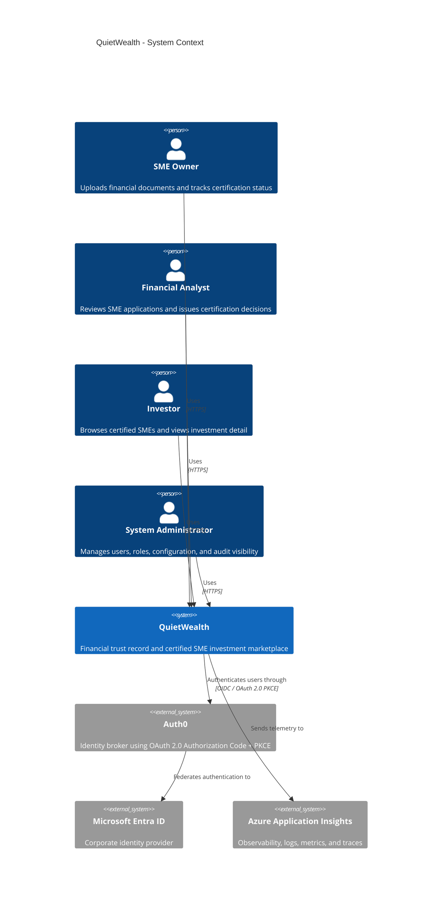

### C4 Level 2 — Container Diagram

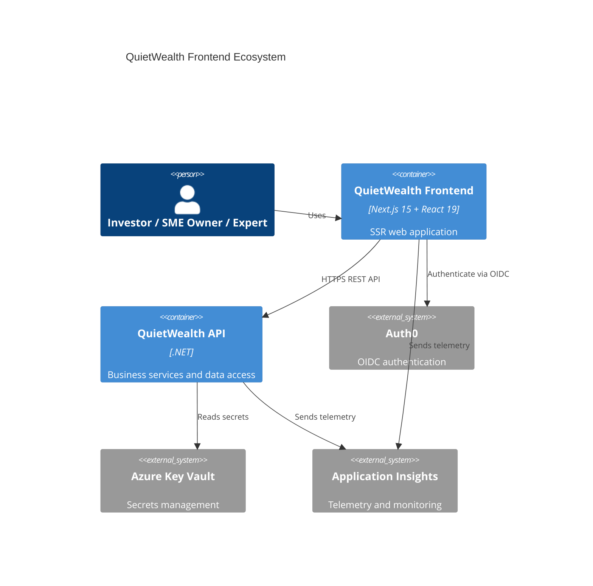

### C4 Level 3 — Frontend Component Diagram

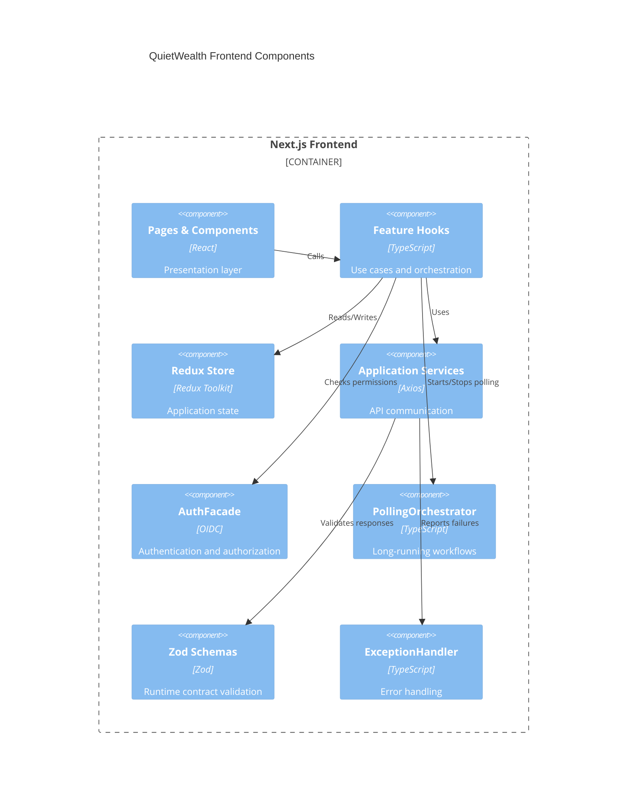

### C4 Level 4 — Auth and Security Code Diagram


### Context Diagram

QuietWealth serves three primary actors: SME owners submit financial documents, financial analysts review and certify submissions, and investors browse certified SMEs. Identity is delegated to **Auth0** federating exclusively with **Microsoft Entra ID**.

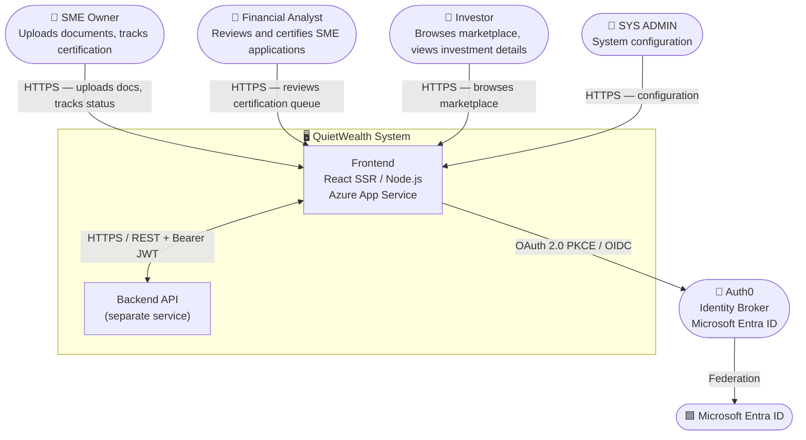

### Container Diagram

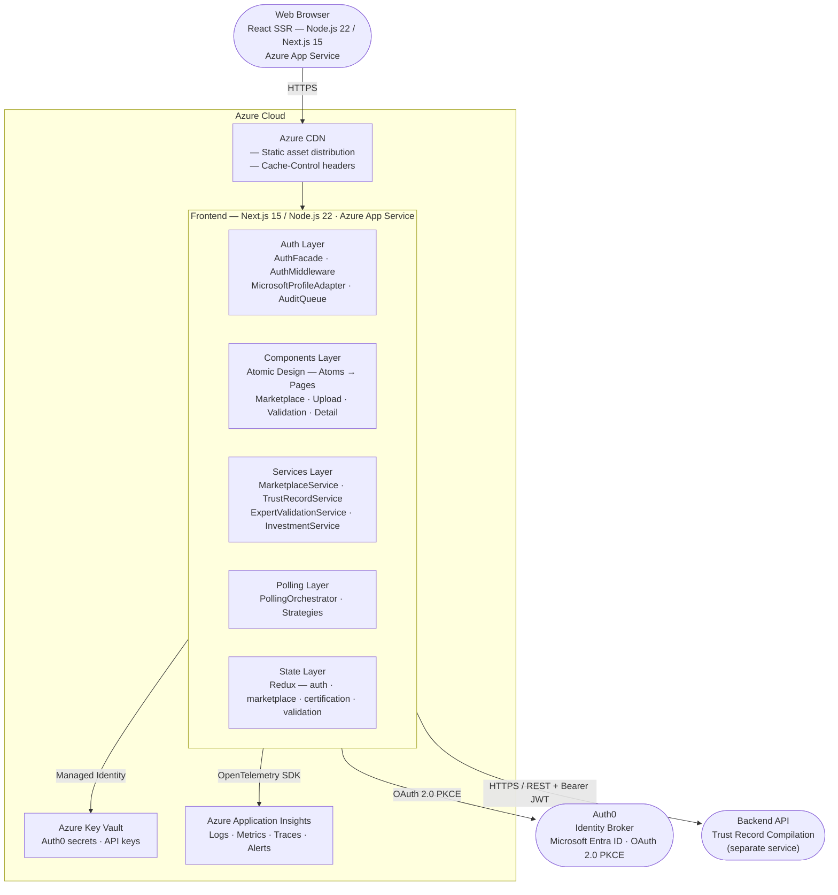
