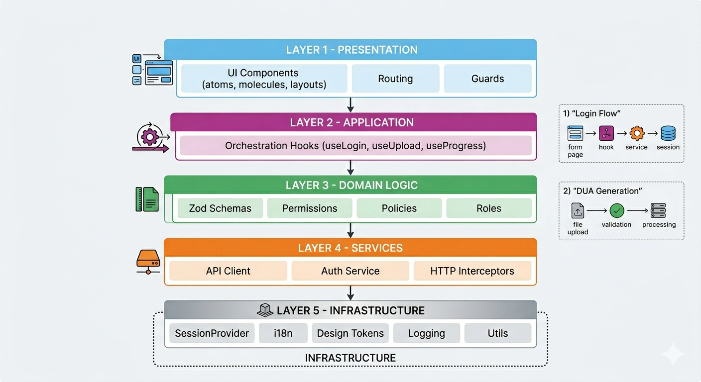
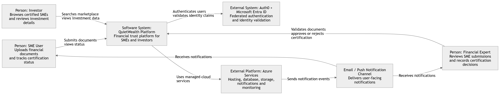
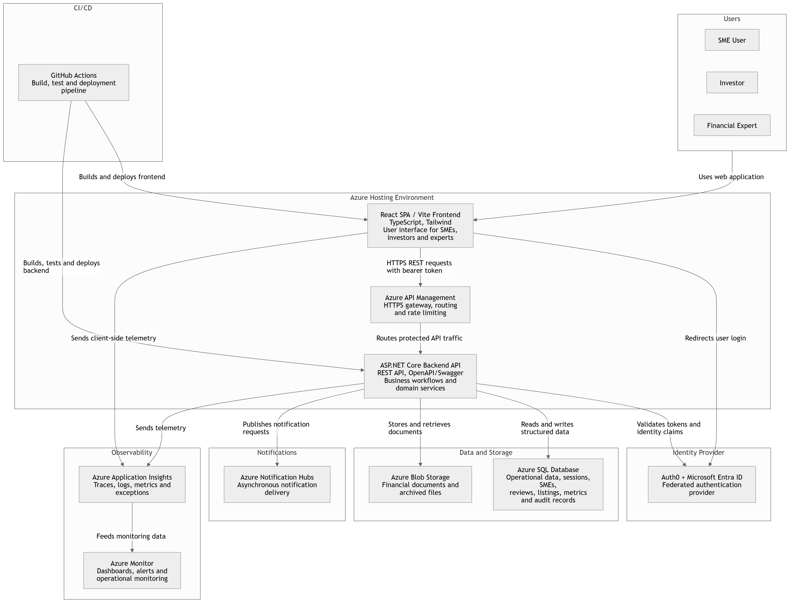
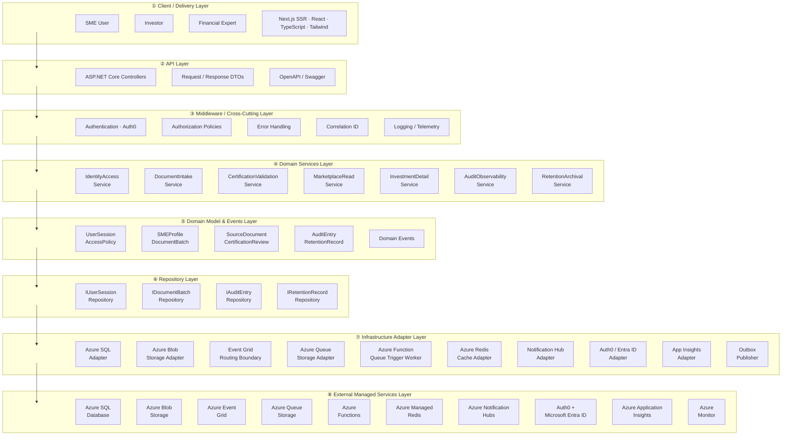

# QuietWealth

## Problem Statement

SMEs spend weeks proving their financial health before they can raise capital. The paperwork is slow, the criteria are inconsistent, and investors have no quick way to tell a healthy company from a risky one. QuietWealth shortens that loop: SMEs upload their financials, financial analysts certify them, and investors browse a marketplace of companies whose numbers have already been checked. Every certified profile is backed by a trust record built from validated documents and standardized financial conditions.

The core problem lies in the absence of a transparent, unified platform where financial trust can be established programmatically, enabling investors and SMEs to connect through certified, validated data.


## Authors

- Daniel Pulido  
- Juan Pablo Cambronero
- Victoria Molina Martínez
- Jose Pablo Chavarro Conde
- Camilo Allon Quesada


# 1. Frontend Design

## 1.1 Technology stack

- Application Type: SPA Web App (SSR)
- Web Framework: Next.js version 15
- UI Library: React version 19.2
- Web server: NodeJS version 22 (LTS)
- Coding Language: TypeScript 5.9.3
- Styling Framework: TailwindCSS 4.1
- State Management: Redux Toolkit 2.8
- Data Validations: Zod 4.3.6
- HTTP Client: Axios 1.9
- Authentication: Auth0 + Microsoft Entra ID via backend-managed session cookies
- Unit Testing: Jest version 30.2.0
- Integration Testing: Playwright version 1.52
- Code Prettier Framework: Prettier 3.8.1
- Code Style Framework: ESLint 10.0.2
- Code Automation Tasks Tool: Husky 9.1.7
- Cloud Service: Azure
- Hosted Services with the Cloud Service: Azure App Service
- Code Repositories Service: GitHub
- CI/CD Pipeline Technology: GitHub Actions
- Environments: Development, Stage and Production
- Observability Framework: Azure Application Insights SDK


## 1.2 UX UI analysis

### 1.2.1 Core Business Process

#### Login
1. User opens QuietWealth and reaches the authentication screen
2. System redirects to Microsoft authentication via Auth0
3. User enters corporate Microsoft credentials
4. On failure, an error message is shown and the user is prompted to retry
5. On success, a session is created and the user is redirected to the Marketplace

#### Browse the Marketplace
1. User lands on the Marketplace — a list of certified SMEs available for investment
2. User can search by company name
3. User can filter by sector (Technology, Energy, Commerce) or trust level
4. Each SME card shows: certification status, growth %, total capital raised, and active investor count
5. User clicks **Ver Detalles** to open the full investment profile

#### Upload Financial Documents
1. User navigates to **Cargar Documentos** from the sidebar
2. A progress tracker shows the current stage: `Información Cargada → En Revisión por Expertos → Certificación Emitida`
3. User drags and drops files or clicks **Seleccionar Archivos**
4. Accepted formats: PDF, DOC, XLS, and image files up to 10 MB each
5. Uploaded documents are queued automatically for expert review

#### Expert Validation Panel
1. Financial expert navigates to **Panel de Validación**
2. System lists pending certification requests: ID, company, sector, submission date, and status
3. Expert clicks **Revisar** to open a request
4. Expert reviews documents and financial data
5. Expert issues a certification decision, updating the SME's trust status

#### Investment Detail
1. From the Marketplace, user clicks **Ver Detalles** on an SME card
2. System shows key financial metrics: Total Raised, Active Investors, Growth Rate, and Average ROI
3. User can scroll to view charts: Income Growth, Investor Growth, and Accumulated Capital Over Time
4. Additional metrics are displayed: retention rate, MRR, and profit margin
5. User can click **Invertir Ahora** to initiate the investment flow

#### Logout
1. User selects logout
2. System invalidates the active JWT
3. Session is terminated and user is redirected to Login


### 1.2.2 Wireframes

#### Login Screen
Microsoft-authenticated entry point.


#### Marketplace Screen
Lists certified SMEs with financial metrics and trust indicators.


#### Document Upload Screen
Allows SMEs to submit financial documents for expert review.


#### Expert Validation Panel Screen
Enables financial experts to review and certify pending applications.


#### Investment Detail Screen
Shows verified SME financials, growth charts, and expert certifications.


#### Logout Screen
Session is invalidated and user is redirected to login.


### 1.2.3 UX Test Results

A usability test was conducted using Maze to validate the proposed wireframes of the QuietWealth system. The test was shared remotely via URL with 6 participants, targeting the **Investment Detail Screen** — the most data-dense view.

#### Test Objective
Evaluate user ability to:
- Navigate the investment detail view
- Interpret financial metrics and trust indicators
- Identify the certification status of an SME
- Initiate an investment action

#### Tasks Executed

| Task | Description |
|------|------------|
| Task 1 - Login | User authenticates through Microsoft via Auth0 |
| Task 2 - Browse Marketplace | User navigates the list of certified SMEs |
| Task 3 - View Investment Detail | User opens an SME's financial profile |
| Task 4 - Upload Documents | User submits financial documents for review |
| Task 5 - Logout | User ends the session |

#### Participants

| Participant | Duration | OS | Browser | Score (1–5) | Feedback |
|---|---|---|---|---|---|
| 542521286 | 49 s | Windows | Chrome | 4 | "Considero que la información mostrada es clara." |
| 510669335 | 42 s | Windows | Chrome | 5 | "Esta bien" |
| 543901432 | 17.8 s | Windows | Brave | 4 | "all good" |
| 508804036 | 70.1 s | Windows | Edge | 5 | "." |
| 542802936 | 99.5 s | Windows | Edge | 5 | "Anuncios de invierta ahora no deberían de aparecer en la aplicación como tal, solo en una web." |
| 537502878 | 50.1 s | Linux | Firefox | 5 | "Muy detallada y presentable, no mejoraría nada." |
| **Average** | **54.8 s** | — | — | **4.7 / 5** | — |

#### Key Metrics (Maze)

#### Overall Performance

| Metric | Value | Interpretation |
|--------|------|----------------|
| Completion Rate | 100% | All users successfully completed all tasks |
| Success Rate | 100% | No task failures occurred |
| Average Time on Task | 54.8 seconds | Tasks were completed efficiently |
| Average Score | 4.7 / 5 | High user satisfaction across all participants |

#### Findings

- All participants successfully completed every task, indicating a clear and understandable user flow.
- The **Invertir Ahora** CTA felt too prominent for one participant, who noted it suits an external website better than an internal platform.
- All other interactions showed high clarity in navigation and actions.
- The financial metrics and certification status were considered clear and well presented.
- The review and logout flows were intuitive and required minimal effort.

#### Observations

- Users understood the platform flow without guidance.
- The interface provided clear feedback during each step of the process.
- The Investment Detail screen may benefit from reducing the visual weight of the primary CTA.

#### Heatmaps — Investment Detail Screen


#### Issues and Corrections

| # | Screen | Issue | Severity |
|---|---|---|---|
| 1 | Investment Detail | The **Invertir Ahora** CTA felt too prominent; one participant noted it suits an external website better than an internal platform. | Medium |

| # | Issue | Correction | Decision Criteria |
|---|---|---|---|
| 1 | CTA felt intrusive inside the platform | Reduced visual weight of the button in the Investment Detail screen | Keeps the platform focused on trust and information rather than aggressive selling |


## 1.3 Component design strategy

### 1.3.1 Components
The frontend follows an atomic design for component architecture.

### 1.3.2 Component Hierarchy
[Components](/app/src/components)

Current component implementation uses 5 atomic UI layers plus shared support modules:
```
app/
 ├ components/
 │   ├ atoms/
 │   ├ molecules/
 │   ├ organisms/
 │   ├ templates/
 │   ├ pages/
 │   ├ hooks/
 │   ├ i18n/
 │   └ styles/
```

### 1.3.3 Component Categories

#### [Atoms](/app/src/components/atoms)
Reusable low-level UI components (no business logic)

- Must be pure UI
- No API calls
- No business logic
- Only accept props
- Must support theme tokens

```
Button
Badge
Input
Label
Spinner
ProgressBar
TrustIndicator
StatCard
MaskedValue
```

Example usage:
```TypeScript
<Button variant="primary" size="md" onClick={onViewDetails}>
  {t("marketplace.viewDetails")}
</Button>
```

#### [Molecules](/app/src/components/molecules)
Built from primitives

- Combine primitives
- Handle UI logic
- No API calls directly
- Data passed via props

```
SMECard
FilterBar
DocumentUploader
FormField
StatusBadge
InfoBanner
```

Example:
```
SMECard
 ├ TrustIndicator
 ├ StatCard
 └ Button
```

#### [Organisms](/app/src/components/organisms)
Components responsible for larger layout composition and section structure.

- Must not contain business logic
- Responsible only for layout composition

```
MarketplaceGrid
InvestmentDetailPanel
ValidationQueue
DocumentUploadZone
Navbar
Sidebar
```

Example:
```
InvestmentDetailPanel
 ├ StatCard
 ├ TrustIndicator
 └ MaskedValue
```

#### [Templates](/app/src/components/templates)
Layout shells

- Wrap authenticated and public route layouts
- Do not contain feature logic

```
AuthenticatedLayout
PublicLayout
```

#### [Pages](/app/src/components/pages)
Feature-specific components tied to a business process.

- Coordinate business logic through hooks, which interact with services
- Compose composites + layouts
- Are mounted by route definitions via Next.js App Router

```
LoginPage
MarketplacePage
InvestmentDetailPage
DocumentUploadPage
ExpertValidationPage
```

### [Hooks](/app/src/components/hooks)
Components use hooks for business logic.

Example:
```
useApplicationServices()
useLogin()
useLogout()
useMarketplace()
useDocumentUpload()
useCertificationProgress()
useExpertValidation()
useInvestmentDetail()
usePermissions()
usePolicies()
useSession()
useTheme()
```

Hooks use [Services](/app/src/services), [Auth service](/app/src/auth/authService.ts) and [State](/app/src/state) for orchestration:

Example:
```
applicationFacade.ts
CertificationPollingManager.ts
```

### 1.3.4 Component Reuse Strategy

Before creating a new component, developers must:
1. Search in [Atoms](/app/src/components/atoms)
2. Search in [Molecules](/app/src/components/molecules)

If a similar component exists, extend it by adding props, variants, or composition instead of duplicating code.

Components must be configurable using props instead of duplication.

```
<Button variant="primary" />
<Button variant="secondary" />
<Button variant="danger" />
```

### 1.3.5 [Styles](/app/src/components/styles)
All visual styles must be centralized using design tokens in [tokens.ts](/app/src/components/styles/tokens.ts)

Example:
```TypeScript
export const colors = {
  primary:    "#0D1F3C", // navy — headings, navbar
  accent:     "#1AACA8", // teal — CTAs, active states
  gold:       "#C8972B", // gold — certified badges, trust scores
  background: "#F5F7FA",
  surface:    "#FFFFFF",
  success:    "#22C55E",
  warning:    "#F59E0B",
  error:      "#EF4444",
};

export const spacing = {
  sm: "8px",
  md: "16px",
  lg: "24px",
}

export const radius = {
  sm: "4px",
  md: "8px",
  lg: "12px"
}
```

#### [Theme](/app/src/components/styles/theme.ts)

Example:
```TypeScript
export const theme = {
  colors,
  spacing,
  radius,
  typography: {
    fontFamily: "Inter, sans-serif",
    headingWeight: 600
  }
}
```

#### Styling rules
Developers must:
- Use tokens
- Avoid hardcoded colors
- Prefer token-based class names/CSS variables for visual styling
- Use inline styles only for temporary layout scaffolding

Correct:
```TypeScript
<Button className="bg-[var(--color-primary)] text-[var(--color-surface)]" />
```
Incorrect:
```TypeScript
<Button style={{ background: "#0D1F3C" }} />
```

Certification status is communicated with both a color and a text label, never color alone: certified uses gold with a check, pending uses warning with a clock, rejected uses error with an X.

### 1.3.6 Internationalization Strategy
All text must be externalized.

#### [i18n](/app/src/components/i18n)
Insert new languages in this folder:
- [es](/app/src/components/i18n/es.json)
- [en](/app/src/components/i18n/en.json)

Example:
```JSON
{
  "marketplace.title": "Marketplace",
  "marketplace.filter.sector": "Sector",
  "marketplace.viewDetails": "Ver Detalles",
  "sme.growth": "Crecimiento"
}
```

#### Usage rule
Components must not contain literal text.

Incorrect:
```TypeScript
<h1>Marketplace</h1>
```

Correct:
```TypeScript
<h1>{t("marketplace.title")}</h1>
```

#### Translation hook
Developers must use `react-i18next`.

Example:
```TypeScript
const { t } = useTranslation()
```

### 1.3.7 Responsiveness Strategy
Responsiveness must be centralized using breakpoint tokens in [breakpoints.ts](/app/src/components/styles/breakpoints.ts)

Example:
```TypeScript
export const breakpoints = {
  mobile: 480,
  tablet: 768,
  desktop: 1200
}
```

#### Responsive rules
Developers must:
- Use flex/grid layouts
- Avoid fixed widths
- Use responsive utilities (`sm:`, `md:`, `lg:` Tailwind prefixes)

| Device | Marketplace | Investment Detail | Navigation |
|--------|-------------|-------------------|------------|
| Mobile | Single column | Single column | Hamburger menu |
| Tablet | 2-column grid | Metrics beside charts | Collapsed sidebar |
| Desktop | 3-column grid | Full dual panel | Full sidebar |

### 1.3.8 Testing Requirements for Components
Each component or testable frontend module must include automated tests.

Verification commands:
- `cd app && npm run test` runs the Jest unit suite without coverage.
- `cd app && npm run test:ci` runs the Jest unit suite with the CI coverage gate from [jest.config](/app/jest.config.ts).
- `cd app && npm run test:e2e` [Unit tests](/app/__tests__/e2e).


#### [Unit tests](/app/__tests__/unit) (Jest)
| Folder | Covers |
|---|---|
| `app/__tests__/unit/auth/` | `AuthProvider`, `AuthFacade`, `authService`, guards, permission helpers |
| `app/__tests__/unit/polling/` | `PollingOrchestrator` placeholder coverage to expand once polling modules exist |
| `app/__tests__/unit/services/` | Services and helpers with mocked `HttpClientFacade` or `axios` boundaries |
| `app/__tests__/unit/validation/` | Zod schemas — valid payloads pass, invalid ones fail with the expected shape |

Real examples for how to build these tests live in [`app/TESTING.md`](/app/TESTING.md), including:
- router-aware guard tests with `MemoryRouter`
- service tests with mocked HTTP responses
- Zod schema tests that assert `flatten().fieldErrors`
- component test templates for render, loading, and click behavior

#### [Integration tests](/app/__tests__/e2e) (Playwright)

Minimum required flows:
| Flow | File |
|---|---|
| Login | [login.spec.ts](/app/__tests__/e2e/login.spec.ts) |
| Marketplace | [marketplace.spec.ts](/app/__tests__/e2e/marketplace.spec.ts) |
| Document upload | [document-upload.spec.ts](/app/__tests__/e2e/document-upload.spec.ts) |
| Expert validation | [expert-validation.spec.ts](/app/__tests__/e2e/expert-validation.spec.ts) |


The current files in `__tests__/e2e` are scaffolds with `test.describe.skip(...)`. Replace the placeholder body with a real flow when the screen exists.

Before writing a flow:

1. Start the app with a stable base URL.
2. Seed or mock the backend response required for the journey.
3. Use stable selectors such as `data-testid`.
4. Assert both user-visible UI and route transitions.

[Login](/app/__tests__/e2e/login.spec.ts):

```ts
import { expect, test } from "@playwright/test";

test("authenticates a user and lands on the home route", async ({ page }) => {
  await page.route("**/api/auth/login", async (route) => {
    await route.fulfill({ status: 204, body: "" });
  });

  await page.route("**/api/auth/me", async (route) => {
    await route.fulfill({
      status: 200,
      contentType: "application/json",
      body: JSON.stringify({
        userId: "user-1",
        email: "user@example.com",
        tenantIds: [],
        tenantRoles: [],
      }),
    });
  });

  await page.goto("/login");
  await page.getByTestId("login-email").fill("user@example.com");
  await page.getByTestId("login-password").fill("secret");
  await page.getByRole("button", { name: "Sign in" }).click();

  await expect(page).toHaveURL(/\/home$/);
  await expect(page.getByText("user@example.com")).toBeVisible();
});
```

#### [Component tests](/app/__tests__/unit/components)

When a component is added, create the test in [components](/app/__tests__/unit/components) and follow the same Jest setup already used in this repo.

Example:

```tsx
import { jest } from "@jest/globals";
import { render, screen } from "@testing-library/react";
import userEvent from "@testing-library/user-event";
import { Button } from "../../../src/components/primitives/Button";

describe("Button", () => {
  it("renders its label", () => {
    render(<Button>Save</Button>);
    expect(screen.getByRole("button", { name: "Save" })).toBeInTheDocument();
  });

  it("shows the loading state", () => {
    render(<Button loading>Save</Button>);
    expect(screen.getByRole("button")).toBeDisabled();
    expect(screen.getByText("Loading...")).toBeInTheDocument();
  });

  it("triggers the click handler", async () => {
    const user = userEvent.setup();
    const onClick = jest.fn();

    render(<Button onClick={onClick}>Save</Button>);
    await user.click(screen.getByRole("button", { name: "Save" }));

    expect(onClick).toHaveBeenCalledTimes(1);
  });
});
```

Prefer:
- `getByRole` over brittle CSS selectors
- `userEvent` over manual DOM event dispatch
- visible behavior over implementation details


#### Checklist For New Tests

- Put the test beside the correct layer under `__tests__/unit` or `__tests__/e2e`.
- Mock external boundaries such as HTTP, auth, router state, browser location, and time.
- Add one happy-path assertion and at least one failure-path assertion.
- Use stable selectors and visible behavior.
- Run the narrowest command first, then `npm run test:ci` before merging Jest changes.

### 1.3.9 Performance Guidelines
Developers must:
- Use `React.memo` for heavy components
- Use `lazy()` for feature modules
- Avoid unnecessary re-renders

Examples:

```tsx
import { memo } from "react";

export const SMECard = memo(function SMECard({ sme }: SMECardProps) {
  return (
    <article data-testid="sme-card">
      <TrustIndicator level={sme.certificationStatus} />
      <StatCard label={t("sme.growth")} value={formatPercent(sme.growthRate)} />
    </article>
  );
});
```

```tsx
import { lazy, Suspense } from "react";

const MarketplacePage = lazy(() => import("@/components/pages/MarketplacePage"));
const InvestmentDetailPage = lazy(() => import("@/components/pages/InvestmentDetailPage"));

export function AppRoutes() {
  return (
    <Suspense fallback={<Spinner />}>
      <MarketplacePage />
      <InvestmentDetailPage />
    </Suspense>
  );
}
```

## 1.4 Security

### 1.4.1 Technologies
- Auth0 with Microsoft Entra ID federation
- Zod (runtime validation)
- Axios via `HttpClientFacade`
- Secure `HttpOnly` session cookies managed by the backend
- Context API and in-memory session state (`SessionProvider` + `sessionStore`)

### 1.4.2 Authentication
Uses a backend-mediated Auth0 flow federated with Microsoft Entra ID.

1. User selects "Continue with Microsoft".
2. `AuthFacade.beginMicrosoftLogin()` redirects the browser to `/api/auth/microsoft/login`.
3. The backend starts the Auth0 Universal Login flow and federates to Microsoft Entra ID.
4. After the callback completes, the backend persists session state in secure cookies.
5. The frontend calls `AuthFacade.getCurrentSession()` to hydrate in-memory session state.
6. Protected API calls use `HttpClientFacade.authFetch()` with `withCredentials`.
7. On `401`, the HTTP client attempts `/api/auth/refresh`; if that fails, the session is cleared and the user is redirected to login.

[AuthFacade.ts](/app/src/auth/AuthFacade.ts)
```TypeScript
export type AuthFacade = AuthServiceFacade;
export const authFacade: AuthFacade = authServiceFacade;
```

The SPA never reads or stores bearer tokens directly. Session cookies stay `HttpOnly`, `Secure`, and same-site, while the frontend keeps only a normalized session snapshot in memory through `sessionStore` and `SessionProvider`.

### 1.4.3 Authorization

#### 1.4.3.1 Roles
Roles are found in [roles.ts](/app/src/auth/policies/roles.ts)

| Code | Description |
|---|---|
| `investor` | Can browse the marketplace, view investment detail, and initiate investments |
| `sme_owner` | Can upload financial documents and track certification status |
| `financial_analyst` | Can review pending applications and issue certification decisions |
| `sys_admin` | Full access to the platform, including user, role, and audit administration |

#### 1.4.3.2 Permissions
Permissions are found in [permissions.ts](/app/src/auth/policies/permissions.ts)

**Permission Catalog**
| Code | Description |
|---|---|
| `marketplace.browse` | User can view and filter the list of certified SMEs |
| `investment.detail.view` | User can open an SME's full investment profile |
| `investment.initiate` | User can initiate an investment action |
| `documents.upload` | User can upload financial documents for review |
| `documents.status.read` | User can view upload and certification status |
| `validation.queue.read` | Financial analyst can view pending certification requests |
| `validation.certify` | Financial analyst can issue certification decisions |
| `audit_log.read` | Admin can view the full system audit log |

#### 1.4.3.3 Role-Permission Mapping
Role to permissions mapping is found in [rolePermissions.ts](/app/src/auth/policies/rolePermissions.ts)

| Role | Permissions |
|---|---|
| `investor` | `marketplace.browse`, `investment.detail.view`, `investment.initiate` |
| `sme_owner` | `marketplace.browse`, `documents.upload`, `documents.status.read` |
| `financial_analyst` | `marketplace.browse`, `investment.detail.view`, `validation.queue.read`, `validation.certify` |
| `sys_admin` | All permissions |

#### 1.4.3.4 Access Policies
Access Policies are found in [accessPolicy.ts](/app/src/auth/policies/accessPolicy.ts)

| Policy | Required Permissions | Description |
|---|---|---|
| `canBrowseMarketplace` | `marketplace.browse` | Allows access to the SME listing screen |
| `canViewInvestmentDetail` | `investment.detail.view` | Allows opening an SME's full financial profile |
| `canInitiateInvestment` | `investment.initiate` | Allows starting the investment flow |
| `canUploadDocuments` | `documents.upload` | Allows submitting documents for certification |
| `canReadDocumentStatus` | `documents.status.read` | Allows tracking upload and certification progress |
| `canViewValidationQueue` | `validation.queue.read` | Allows financial analysts to view pending requests |
| `canCertifySME` | `validation.certify` | Allows issuing a certification decision |
| `canReadAuditLog` | `audit_log.read` | Allows access to the full audit log |

#### 1.4.3.5 Routing Protection
This project has three methods of routing protection.

**[AuthGuard.tsx](/app/src/auth/guards/AuthGuard.tsx)**

Use this guard to prevent unauthenticated access to specific routes.

Example usage:
```TypeScript
<AuthGuard>
  <AuthenticatedLayout>
    <MarketplacePage />
  </AuthenticatedLayout>
</AuthGuard>
```

**[GuestGuard.tsx](/app/src/auth/guards/GuestGuard.tsx)**

Use this guard to prevent authenticated users accessing unauthenticated sites.

Example usage:
```TypeScript
<GuestGuard>
  <LoginPage />
</GuestGuard>
```

**[PolicyGuard.tsx](/app/src/auth/guards/PolicyGuard.tsx)**

Use this guard when an entire route or page requires a specific access policy.

Example usage:
```TypeScript
<AuthGuard>
  <PolicyGuard required={accessPolicy.canCertifySME}>
    <ExpertValidationPage />
  </PolicyGuard>
</AuthGuard>
```

#### 1.4.3.6 Usage
Developers must never write:
```TypeScript
if (user.role === "financial_analyst")
```
directly inside pages or components. Instead they should use:
```TypeScript
const { hasAccess } = usePolicies();

{hasAccess("canCertifySME") && <CertifyButton />}
```

**hasAccess** — use when the user must have all permissions required by the policy (default for most actions).

**hasSomeAccess** — use when a screen can still provide value with partial access (dashboards with optional widgets).

**getMissingPermissions(policyName)** — use when the UI needs to explain why access is denied.

**To add additional roles/permissions:**

1. Add role definition in [roles.ts](/app/src/auth/policies/roles.ts)
2. Add permission in [permissions.ts](/app/src/auth/policies/permissions.ts)
3. Map policy to permissions in [accessPolicy.ts](/app/src/auth/policies/accessPolicy.ts)

### 1.4.4 API Communication

#### Centralized API Client
[client.ts](/app/src/services/client.ts)

#### HTTP Interceptors
[httpInterceptors.ts](/app/src/services/httpInterceptors.ts)

### 1.4.5 Storage Rules

**Allowed storage**
- UI preferences
- Selected language
- Theme
- Non-sensitive temporary UI state

**Forbidden storage**
- Access tokens
- Refresh tokens
- Passwords
- one-time tokens
- Raw permission payloads if sensitive

**Preferred storage model**
- backend session stored in secure, HTTP-only, same-site cookies
- frontend session state kept in memory through SessionProvider

#### Examples
```ts
// Allowed: non-sensitive preferences
localStorage.setItem("theme", "dark");
localStorage.setItem("language", "en");

// Forbidden: secrets
// localStorage.setItem("accessToken", token);
// localStorage.setItem("password", password);
```

**Enforcement**
- Keep authentication credentials out of `localStorage` and `sessionStorage`.
- Clear in-memory session data on logout and on 401 responses.
- Review pull requests for any usage of `localStorage` or `sessionStorage` with token-shaped keys.

### 1.4.6 Logout
Responsibilities:
- Call `AuthFacade.logout()`
- Clear `sessionStore` / `SessionProvider` state
- Clear any derived in-memory session data
- Redirect to login

[useLogout.ts](/app/src/components/hooks/useLogout.ts)

### 1.4.7 Session Expiration

When the backend returns 401 Unauthorized:
- `HttpClientFacade.authFetch()` detects it
- Silent session refresh is attempted via `POST /api/auth/refresh`
- If refresh fails, `sessionManager.handleUnauthorized()` clears the session
- User is redirected to login with a session-expired message

## 1.5 Layered design

The frontend uses a five-layer architecture with clear responsibilities and downward-only dependencies.

**Architecture diagram:**


**Layer 1 - Presentation:** Pages and components render data and capture input. They do not call APIs directly. React Router route guards protect navigation.

**Layer 2 - Application:** Hooks orchestrate use cases end to end. Standard flow: validate input -> call facade/service -> update session or feature state.

**Layer 3 - Domain Logic:** Zod schemas validate every API response. Permission checks use `usePolicies()`, not direct role comparisons. Policies define roles and permissions.

**Layer 4 - Services:** `HttpClientFacade` and `AuthFacade` are the only network entry points. Services call the backend, session endpoints, and auth redirect endpoints; they render no UI.

**Layer 5 - Infrastructure:** Shared foundation: `sessionStore`, `SessionProvider`, design tokens, i18n, observability utilities.

**Folder mapping:**

| Folder | Layer | Purpose |
|--------|-------|---------|
| `app/src/components/pages/`, `app/**/page.tsx` | Layer 1 | Route entry points and feature screens |
| `app/src/components/atoms/`, `molecules/`, `organisms/`, `templates/` | Layer 1 | Atomic UI components |
| `app/src/components/hooks/` | Layer 2 | Application orchestration hooks |
| `app/src/models/`, `app/src/validation/`, `app/src/auth/policies/` | Layer 3 | Domain types, Zod schemas, access policies |
| `app/src/services/`, `app/src/auth/AuthFacade.ts`, `app/src/auth/authService.ts` | Layer 4 | HTTP facade, auth service, interceptors |
| `app/src/state/`, `app/src/utils/`, `app/src/components/i18n/`, `app/src/components/styles/` | Layer 5 | Session store, logger, i18n, tokens |

**Dependency rules:**
- Presentation can only call Application (hooks) and Infrastructure.
- Application can call Domain Logic, Services, and Infrastructure.
- Domain Logic can only use Infrastructure.
- Services can only use Infrastructure.
- **No layer may call upward.**

**Example: Login flow**

`LoginPage` -> `useLogin().login()` -> `applicationServiceFacade.auth.login()` -> `POST /api/auth/login` -> `AuthFacade.getCurrentSession()` -> `sessionManager.setSession()` -> `sessionStore` / `SessionProvider` update.

**Example: Certification polling flow**

`DocumentUploadPage` -> `useCertificationProgress()` subscription -> `CertificationPollingManager.startPolling()` -> `PollingOrchestrator` -> `GET /api/trust-record-applications/{id}/status` -> `certificationPollingStore.patchState()` -> UI update.

## 1.6 Design patterns

### Singleton
The following classes currently use the singleton pattern:
- [logger.ts](/app/src/utils/logger.ts) — `Logger`
- [error-handler.ts](/app/src/utils/error-handler.ts) — `ExceptionHandler`
- [AuthFacade.ts](/app/src/auth/AuthFacade.ts) - `authFacade`
- [sessionManager.ts](/app/src/state/sessionManager.ts) — `SessionManager`
- [certificationPollingStore.ts](/app/src/state/certificationPollingStore.ts) — `CertificationPollingStore`
- [certificationPollingManager.ts](/app/src/state/certificationPollingManager.ts) — `CertificationPollingManager`
- [applicationFacade.ts](/app/src/services/applicationFacade.ts) — `ApplicationServiceFacade`

#### When to apply here
Apply only if all are true:
1. One shared instance is desired app-wide.
2. Behavior must stay consistent across all consumers.
3. Class should not be recreated with different runtime config per feature.

#### Do not apply here
Skip singleton for:
- Error objects (`*Error` classes): create per error event.
- React components: React manages lifecycle.
- Per-operation objects with internal mutable buffers (e.g. report formatters).

#### Implementation recipe

```ts
export class MyService {
  private static instance: MyService | null = null;

  static getInstance() {
    if (!MyService.instance) {
      MyService.instance = new MyService();
    }
    return MyService.instance;
  }

  private constructor() {}
}

export const myService = MyService.getInstance();
```

Example — Logger singleton:
```ts
export class Logger {
  private static instance: Logger | null = null;
  static getInstance(): Logger {
    if (!Logger.instance) Logger.instance = new Logger();
    return Logger.instance;
  }
  private constructor() {}
}
export const logger = Logger.getInstance();
```

### Observer
Use these files as the canonical pattern:
- [certification.types.ts](/app/src/state/certification.types.ts)
- [certificationPollingStore.ts](/app/src/state/certificationPollingStore.ts)
- [certificationPollingManager.ts](/app/src/state/certificationPollingManager.ts)
- [useCertificationProgress.ts](/app/src/components/hooks/useCertificationProgress.ts)

#### 1) State Contract (`*.types.ts`)
Define progress phases, run state (`idle`, `running`, `completed`, etc.), progress snapshot shape, and `createInitial...State()` factory.

#### 2) Observable Store (`*Store.ts`)
Must expose: `getState()`, `subscribe(listener) => unsubscribe`, `patchState(partial)`, `reset()`.

Rule: listeners stored in a `Set`; `subscribe` must emit current state immediately.

#### 3) Manager/Publisher (`*Manager.ts`)
Must expose: `startPolling()`, `stopPolling()`, `subscribe(...)` pass-through, `getSnapshot()` pass-through.

#### 4) Subscriber Hook
```ts
function useCertificationProgress() {
  const [state, setState] = useState(() => certificationPollingManager.getSnapshot());
  useEffect(() => certificationPollingManager.subscribe(setState), []);
  return state;
}
```

#### Agent Copy Template

```ts
// store
class XStore {
  private listeners = new Set<Listener<XState>>();
  private state: XState = createInitialXState();
  getState() { return this.state; }
  subscribe(listener: Listener<XState>) {
    this.listeners.add(listener);
    listener(this.state);
    return () => this.listeners.delete(listener);
  }
  patchState(partial: Partial<XState>) {
    this.state = { ...this.state, ...partial };
    for (const listener of this.listeners) listener(this.state);
  }
}
```

### Proxy / Interceptor - Authenticated HTTP
- [client.ts](/app/src/services/client.ts)
- [httpInterceptors.ts](/app/src/services/httpInterceptors.ts)
- [unauthorizedHandlingStrategy.ts](/app/src/services/unauthorizedHandlingStrategy.ts)

Authenticated requests are centralized in the HTTP client. `authFetch()` performs cookie-based requests, retries once through `/api/auth/refresh` when configured, and delegates final `401` handling to the unauthorized-handling strategy.

```ts
class SourceHttpClient {
  async authFetch(input: string, init?: RequestInit): Promise<Response> {
    // Performs authenticated request, refreshes session on 401,
    // then clears session and redirects if still unauthorized.
  }
}
```

### Facade Pattern (Hooks -> Auth + HTTP)
Expose a single service access surface for hooks while keeping auth and HTTP implementation details behind facades.

#### Files to keep aligned
- [client.ts](/app/src/services/client.ts)
- [AuthFacade.ts](/app/src/auth/AuthFacade.ts)
- [authService.ts](/app/src/auth/authService.ts)
- [applicationFacade.ts](/app/src/services/applicationFacade.ts)
- [useApplicationServices.ts](/app/src/components/hooks/useApplicationServices.ts)

#### Contracts

HTTP facade contract:
```ts
export interface HttpClientFacade {
  fetch(input: string, init?: RequestInit): Promise<Response>;
  authFetch(input: string, init?: RequestInit): Promise<Response>;
  json<T>(input: string, init?: RequestInit): Promise<T>;
  authJson<T>(input: string, init?: RequestInit): Promise<T>;
}
```

Auth facade contract:
```ts
export interface AuthFacade {
  login(input: LoginInput): Promise<AuthSession | null>;
  logout(): Promise<void>;
  beginMicrosoftLogin(returnUrl?: string): void;
  refreshSession(): Promise<AuthSession | null>;
  requestPasswordReset(email: string, redirectTo?: string): Promise<void>;
  resetPassword(accessToken: string, refreshToken: string, newPassword: string): Promise<void>;
  getCurrentSession(): Promise<AuthSession | null>;
}
```

App facade contract:
```ts
export interface ApplicationServiceFacade {
  readonly auth: AuthFacade;
  readonly http: HttpClientFacade;
}
```

#### Checklist for New Agents
- Hooks import only `useApplicationServices` for service access.
- `AuthFacade` is the only frontend auth entry point.
- `HttpClientFacade` is the only Axios/fetch entry point.
- New features are added by extending facades, not by importing Axios or hard-coding auth redirects directly in hooks.

### Strategy ? Polling Interval Selection
[IPollingStrategy.ts](/app/polling/strategies/IPollingStrategy.ts), [FixedIntervalStrategy.ts](/app/polling/strategies/FixedIntervalStrategy.ts), [ExponentialBackoffStrategy.ts](/app/polling/strategies/ExponentialBackoffStrategy.ts), [PollingOrchestrator.ts](/app/polling/PollingOrchestrator.ts)

```ts
interface IPollingStrategy {
  getInterval(attempt: number): number;
}
class FixedIntervalStrategy implements IPollingStrategy {
  getInterval() { return 10_000; } // 10 s
}
class ExponentialBackoffStrategy implements IPollingStrategy {
  getInterval(attempt: number) { return Math.min(10_000 * 2 ** attempt, 60_000); }
}
```

### Queue-based logging — Auth Audit Events
[AuthAuditQueue.ts](/app/src/auth/AuthAuditQueue.ts)

Auth events (login, logout, refresh, permission denial) are enqueued and flushed asynchronously to Application Insights, avoiding latency during authentication.

```ts
class AuthAuditQueue {
  private queue: AuthEvent[] = [];
  enqueue(event: AuthEvent): void { /* add to queue */ }
  private async flush(): Promise<void> { /* send to App Insights */ }
}
```

### Not implemented (pending)
- **Adapter** for normalizing heterogeneous SME financial data from different API providers into a unified `SMEProfile` domain model.
- **Strategy** for document upload validation per file type (PDF, XLS, DOC, image) with type-specific size and MIME checks.

## 1.7 src folder

The `/app` folder contains the application scaffold organized by architectural layers and functional domains, following the 5-layer architecture specified in sections 1.1 to 1.6.

```txt
src/
├── layout.tsx · page.tsx · globals.css
├── login/page.tsx
├── marketplace/page.tsx
├── marketplace/[id]/page.tsx
├── documents/page.tsx
├── validation/page.tsx
├── admin/page.tsx
│
├── components/
│   ├── atoms/        Button, Badge, Input, Label, Spinner, ProgressBar,
│   │                 TrustIndicator, StatCard, MaskedValue
│   ├── molecules/    SMECard, FilterBar, DocumentUploader, FormField,
│   │                 StatusBadge, InfoBanner
│   ├── organisms/    MarketplaceGrid, InvestmentDetailPanel, ValidationQueue,
│   │                 DocumentUploadZone, Navbar, Sidebar
│   ├── templates/    AuthenticatedLayout, PublicLayout
│   ├── pages/        LoginPage, MarketplacePage, InvestmentDetailPage,
│   │                 DocumentUploadPage, ExpertValidationPage
|   |-- hooks/        useApplicationServices, useLogin, useLogout,
|   |                 usePermissions, usePolicies, useSession,
|   |                 useTheme
│   ├── i18n/         config.ts, I18nProvider.tsx, en.json, es.json
│   └── styles/       tokens.ts, theme.ts, breakpoints.ts, globals.css, ThemeProvider.tsx
│
├── auth/
|   |-- AuthFacade.ts, authService.ts, auth-schemas.ts, AuthProvider.tsx
│   ├── guards/       AuthGuard.tsx, GuestGuard.tsx, PolicyGuard.tsx
│   └── policies/     roles.ts, permissions.ts, rolePermissions.ts, accessPolicy.ts
│
├── polling/
│   ├── PollingOrchestrator.ts
│   └── strategies/   IPollingStrategy.ts, FixedIntervalStrategy.ts, ExponentialBackoffStrategy.ts
│
├── services/         applicationFacade.ts, client.ts, httpInterceptors.ts,
│                     MarketplaceService.ts, TrustRecordService.ts,
│                     ExpertValidationService.ts, InvestmentService.ts
│
├── state/
│   ├── certification.types.ts, certificationPollingStore.ts, certificationPollingManager.ts
│   ├── session.types.ts, sessionManager.ts, SessionProvider.tsx
|   |-- sessionStore.ts
│
├── contracts/        openapi.json, openapi.example.json
├── models/           api.types.ts (generated), SME.ts, TrustRecord.ts, DocumentUpload.ts, …
├── validation/       documentUploadSchema.ts, smeSchema.ts, trustRecordSchema.ts, userSchema.ts, index.ts
├── settings/         Settings.ts
├── utils/            logger.ts, error-handler.ts, eventBus.ts, schemaValidator.ts, constants.ts, formatters.ts
├── assets/logo/      logo-dark.svg, logo-light.svg
├── __tests__/        setup.ts, unit/, e2e/, fixtures/, mocks/
│
├── next.config.ts · tailwind.config.ts · tsconfig.json
├── jest.config.ts · playwright.config.ts · package.json
├── .env.example · .eslintrc.json · .prettierrc · .lintstagedrc.json
└── .husky/pre-commit
```
---

# Backend Design

## Technology Stack
- API style: REST API over HTTPS
- API specification standard: OpenAPI
- API gateway and hosting: Azure API Management + Azure App Service
- Database: Azure SQL Database
- File storage: Azure Blob Storage
- Blob archival: Azure Blob Lifecycle Management for Cool, Cold, and Archive tier transitions
- SQL archival orchestration: Scheduled Azure Function export process
- Cache: Azure Cache Redis
- Asynchronous document processing: Azure Blob Storage events via Azure Event Grid, Azure Queue Storage, and Azure Function Queue Trigger
- Notifications: Azure Notification Hubs
- Load balancing: no dedicated load balancer required for the expected traffic profile
- Backend framework and language: .NET SDK 10.0.102, ASP.NET Core
- Repository structure: monorepo shared with the frontend; application source under `server/QuietWealth.Backend` and backend test projects under `server/tests`
- Test framework: xUnit
- Assertion library: FluentAssertions
- Mocking: Moq
- API and in-memory host testing: `Microsoft.AspNetCore.Mvc.Testing` with `WebApplicationFactory`
- Ephemeral dependency orchestration for integration tests: Testcontainers for .NET
- Deterministic database cleanup between tests: Respawn
- Coverage collection and reporting: `coverlet.collector` + ReportGenerator
- Contract testing at the Anti-Corruption Layer (ACL): PactNet for HTTP provider contracts and Verify.Xunit for versioned event/message fixtures
- Health check framework: `Microsoft.Extensions.Diagnostics.HealthChecks` with dependency-specific checks for SQL, Blob Storage, Queue Storage, Redis, and Notification Hubs
- API documentation tooling: Swagger / OpenAPI tooling for contract publication and validation
- Code quality: `dotnet format` and built-in .NET analyzers
- Services:
  - Identity access service
  - Document intake service
  - Certification validation service
  - Marketplace read service
  - Investment detail service
  - Audit observability service
  - Retention archival service 

## Security
- Transport security: HTTPS enforced at Azure API Management for all public endpoints
- Authentication:
  - Users authenticate through Auth0 Universal Login federated with Microsoft Entra ID
  - The backend owns the session and issues secure `HttpOnly` cookies to the browser
  - Frontend requests use `withCredentials`; the SPA does not persist or attach bearer tokens directly
  - Client secrets are never returned to the browser
- Encryption at rest:
  - Azure SQL Database uses Transparent Data Encryption (TDE) with service-managed keys
  - Reference: https://learn.microsoft.com/en-us/azure/azure-sql/database/security-overview?view=azuresql#transparent-data-encryption-encryption-at-rest-with-service-managed-keys
- Request payload limits:
  - General API payload limit: 10 MB
  - File upload endpoints exception: up to 10 MB per request to support realistic document sets with multiple PDF, Excel, Word, and scanned image files
  - Requests above these limits must be rejected with a clear validation error
- Rate limiting at Azure API Management:
  - Maximum concurrent connections per authenticated client: 10
  - Request rate limit per authenticated client: 60 requests per minute
  - Stricter limits must be applied to authentication endpoints to reduce abuse risk
- Data retention and archiving:
  - Production operational data and generated files remain in the active production environment for 90 days
  - After 90 days, records and generated artifacts are moved to an archive tier for audit and traceability purposes
  - Archived data is retained according to financial compliance requirements

## Observability
- Telemetry platform: Azure Application Insights, aligned with the frontend for unified end-to-end telemetry
- Dashboard and analysis tool: Azure Monitor
- Logged backend events:
  - AuthLoginRequested
  - AuthLoginSucceeded
  - AuthLoginFailed
  - UserLoggedOut
  - FilesUploadStarted
  - FilesUploadCompleted
  - FilesUploadRejected
  - SupportedFilesValidated
  - CertificationReviewRequested
  - CertificationApproved
  - CertificationRejected
  - MarketplaceListingViewed
  - RecordsArchived
  - ApiRequestFailed
  - UnhandledExceptionCaptured
- Progress polling guideline: do not log every frontend polling request; log only meaningful status transitions and exceptional progress-check failures

### Operational metrics (required)
- Latency metrics: at minimum P95/P99 per API endpoint and critical business flow.
- Error metrics: request error rate (4xx/5xx), dependency failure rate, and timeout rate.
- Saturation metrics: CPU/memory utilization, queue depth/age, and worker concurrency saturation.
- Monitoring stack options:
  - Self-managed: Prometheus + Grafana.
  - Managed: Azure Monitor.

### Application observability patterns (required)
- Health checks: implement `liveness` and `readiness` endpoints for API and workers.
- Correlation IDs: propagate a single correlation ID across all services, async messages, logs, traces, and domain events.
- SLIs defined from design: availability and latency SLIs must be defined at architecture stage for each critical user flow.

## Infrastructure (DevOps)

### CI/CD orchestration tool
- Standard tool: **GitHub Actions** (single CI/CD control plane from this monorepo).
- Rationale: repository-native workflows, PR checks, environments, approvals, and OIDC-based Azure deployment.

### GitHub Environments
Two environments must exist in the repo settings:

| Environment | Branch | App suffix |
|---|---|---|
| `QA` | `staging` | `qa*` |
| `Production` | `main` | `prod*` |

#### Secrets (stored per GitHub environment)

**QA environment:**
```
AZUREAPPSERVICE_CLIENTID_QA_FRONTEND
AZUREAPPSERVICE_CLIENTID_QA_API
AZUREAPPSERVICE_TENANTID_QA
AZUREAPPSERVICE_SUBSCRIPTIONID_QA
NEXT_PUBLIC_API_BASE_URL             ← build-time only, frontend
```

**Production environment:**
```
AZUREAPPSERVICE_CLIENTID_PROD_FRONTEND
AZUREAPPSERVICE_CLIENTID_PROD_API
AZUREAPPSERVICE_TENANTID_PROD
AZUREAPPSERVICE_SUBSCRIPTIONID_PROD
NEXT_PUBLIC_API_BASE_URL_PROD        ← build-time only, frontend
```

`NEXT_PUBLIC_API_BASE_URL*` is injected as `env:` on the `npm run build` step — baked into the Next.js bundle at build time. It is **not** an Azure app setting.

**Azure login step:**
```yaml
- uses: azure/login@v2
  with:
    client-id: ${{ secrets.AZUREAPPSERVICE_CLIENTID_QA_FRONTEND }}
    tenant-id: ${{ secrets.AZUREAPPSERVICE_TENANTID_QA }}
    subscription-id: ${{ secrets.AZUREAPPSERVICE_SUBSCRIPTIONID_QA }}
```

### OIDC / Entra ID Setup (`infra/setup-github-oidc.ps1`)
Run once per environment. Idempotent. Require `az login` + `gh auth login`.
For each of the 4 app/role combos (`prod-frontend`, `prod-api`, `qa-frontend`, `qa-api`):

1. Create Entra ID app registration named `dp-{env}-{role}-deploy`
2. Create a service principal for it
3. Add a federated credential:
   - issuer: `https://token.actions.githubusercontent.com`
   - subject: `repo:{owner/repo}:environment:{Production|QA}`
   - audience: `api://AzureADTokenExchange`
4. Assign `Contributor` role scoped to the specific Web App resource (not subscription-wide)
5. Call `gh secret set` to write the 3 OIDC secrets into the correct GitHub environment

Each Web App has its own Entra app registration and `clientId`. `tenantId` and `subscriptionId` are shared within an environment.

### CI Workflows
There should be one reusable backend validation workflow and two API deployment workflows. The deployment workflows must not publish unless all backend test lanes pass.

**Triggers:**
- Push to `main` → `paths: server/**` or `app/**` → deploys to Production
- Push to `staging` → same path filters → deploys to QA
- All support `workflow_dispatch`

**Job pattern:**
```
build (environment: QA|Production, permissions: contents:read)
  └─ deploy (needs: build, permissions: id-token:write + contents:read)
```

To enable OIDC token exchange with azure, `id-token: write` is required on the `deploy` job only.

#### Required backend validation flow

In addition to the deployment triggers listed above, backend CI must include a reusable validation job that runs on `pull_request` and can also be called from the staging and production API workflows before packaging.

Required execution order:

```yaml
- name: Restore backend
  run: dotnet restore server/QuietWealth.Backend.sln

- name: Build backend
  run: dotnet build server/QuietWealth.Backend.sln --configuration Release --no-restore

- name: Unit tests
  run: dotnet test server/tests/QuietWealth.Backend.UnitTests/QuietWealth.Backend.UnitTests.csproj --configuration Release --no-build --logger "trx;LogFileName=unit-tests.trx" --collect:"XPlat Code Coverage"

- name: Integration tests
  run: dotnet test server/tests/QuietWealth.Backend.IntegrationTests/QuietWealth.Backend.IntegrationTests.csproj --configuration Release --no-build --logger "trx;LogFileName=integration-tests.trx" --collect:"XPlat Code Coverage"

- name: API tests
  run: dotnet test server/tests/QuietWealth.Backend.ApiTests/QuietWealth.Backend.ApiTests.csproj --configuration Release --no-build --logger "trx;LogFileName=api-tests.trx" --collect:"XPlat Code Coverage"

- name: Contract tests
  run: dotnet test server/tests/QuietWealth.Backend.ContractTests/QuietWealth.Backend.ContractTests.csproj --configuration Release --no-build --logger "trx;LogFileName=contract-tests.trx" --collect:"XPlat Code Coverage"
```

Required workflow behaviors:
- Upload all `*.trx` files and coverage artifacts even when one test lane fails.
- Fail the workflow immediately if unit or contract tests fail.
- Allow API and integration tests to finish in the same run so developers receive full defect information.
- Publish only after all four test lanes are green.
- Run a post-deploy readiness probe against `/health/ready`.

#### Trigger Conditions & Job Dependencies

| Workflow file | Branch | Path filter | Artifact name |
|---|---|---|---|
| `main_prodquietwealth-frontend.yml` | `main` | `app/**` | `node-app` |
| `main_prodquietwealth-api.yml` | `main` | `server/**` | `.net-app` |
| `staging_qaquietwealth-frontend.yml` | `staging` | `app/**` | `node-app` |
| `staging_qaquietwealth-api.yml` | `staging` | `server/**` | `.net-app` |

Artifact is passed between jobs via `actions/upload-artifact` / `actions/download-artifact`.

#### Manual execution

Developers must be able to run every backend lane locally before pushing:

```powershell
dotnet restore server/QuietWealth.Backend.sln
dotnet build server/QuietWealth.Backend.sln --configuration Release --no-restore
dotnet test server/tests/QuietWealth.Backend.UnitTests/QuietWealth.Backend.UnitTests.csproj --configuration Release --no-build
dotnet test server/tests/QuietWealth.Backend.IntegrationTests/QuietWealth.Backend.IntegrationTests.csproj --configuration Release --no-build
dotnet test server/tests/QuietWealth.Backend.ApiTests/QuietWealth.Backend.ApiTests.csproj --configuration Release --no-build
dotnet test server/tests/QuietWealth.Backend.ContractTests/QuietWealth.Backend.ContractTests.csproj --configuration Release --no-build
```

To execute through GitHub Actions manually, `workflow_dispatch` must expose at least these inputs:
- `environment`: `qa` or `prod`
- `test_scope`: `all`, `unit`, `integration`, `api`, or `contract`
- `deploy_after_tests`: `true` or `false`

If `deploy_after_tests=false`, the workflow runs validation only and publishes test artifacts without deploying.

#### Key Constraints

- Each Web App has its **own** Entra app registration and `clientId` — do not share across frontend/API
- `id-token: write` must be on the **deploy job**, not the build job
- `NEXT_PUBLIC_*` vars are build-time settings, not runtime app settings — must be in the build job's `env:` block
- `ConnectionStrings__QuietWealthSql`, `BlobStorage__ConnectionString`, and `NotificationHub__ConnectionString` use ASP.NET Core's double-underscore config convention
- Bicep `@secure()` params never appear in deployment logs

### Infrastructure as Code (IaC)
- Standard tool: **Bicep** for provisioning and updates across environments.
- Managed resources via Bicep:
- Azure API Management
- Azure App Service (API hosting)
- Azure SQL Database
- Azure Blob Storage
- Azure Blob Lifecycle Management rules
- Azure Managed Redis
- Azure Event Grid
- Azure Queue Storage
- Azure Functions
- Scheduled Azure Function
- Azure Notification Hubs
- Observability resources (Application Insights / Azure Monitor where applicable)

#### Bicep Infra (`infra/`)

**Scope:** `subscription` level — creates the resource group itself.

**Locations:**
- RG metadata: `eastus`
- Resources deployed to: `westcentralus`

**Per-environment resources:**
- Linux App Service Plan `asp-dp-{env}` — SKU B1 (shared)
- Frontend Web App (`Node|24-lts`) — startup: `npx --yes serve -s . -l $PORT`
- API Web App (`DOTNETCORE|10.0`) — startup: `dotnet QuietWealth.Api.dll`

**API app settings provisioned by Bicep:**
```
ASPNETCORE_ENVIRONMENT    = "Production" (prod) | "Development" (qa — enables Swagger)
ConnectionStrings__QuietWealthSql = <from AZURE_SQL_CONNECTION_STRING env var>
BlobStorage__ConnectionString     = <from AZURE_BLOB_CONNECTION_STRING env var>
NotificationHub__ConnectionString = <from AZURE_NOTIFICATION_HUB_CONNECTION_STRING env var>
AllowedOrigins__0         = https://{frontendAppName}.azurewebsites.net
WEBSITE_RUN_FROM_PACKAGE  = 1
```

**Frontend app settings provisioned by Bicep:**
```
WEBSITE_NODE_DEFAULT_VERSION   = ~20
SCM_DO_BUILD_DURING_DEPLOYMENT = false   ← disables Oryx; we ship pre-built /dist
```

**Parameters per environment:**

| Param | qa | prod |
|---|---|---|
| `resourceGroupName` | `QuietWealth` | `QuietWealth` |
| `resourceGroupLocation` | `eastus` | `eastus` |
| `servicesLocation` | `westcentralus` | `westcentralus` |
| `appServicePlanSku` | `B1` | `B1` |
| `frontendAppName` | `qaquietwealth-frontend` | `prodquietwealth-frontend` |
| `apiAppName` | `qaquietwealth-api` | `prodquietwealth-api` |

**Secrets flow into Bicep via `.bicepparam`:**
```bicep
param sqlConnectionString             = readEnvironmentVariable('AZURE_SQL_CONNECTION_STRING', '')
param blobStorageConnectionString     = readEnvironmentVariable('AZURE_BLOB_CONNECTION_STRING', '')
param notificationHubConnectionString = readEnvironmentVariable('AZURE_NOTIFICATION_HUB_CONNECTION_STRING', '')
```

Set before running `deploy.ps1`:
```powershell
$env:AZURE_SQL_CONNECTION_STRING = '...'
$env:AZURE_BLOB_CONNECTION_STRING = '...'
$env:AZURE_NOTIFICATION_HUB_CONNECTION_STRING = '...'
.\deploy.ps1 -Environment qa   # or prod
```

Local values live in `deploy.secrets.ps1` (gitignored via `*.secrets.ps1`). These secrets are never in GitHub Actions secrets — infra deployment is manual only.

**Deploy command (run by `deploy.ps1`):**
```powershell
az deployment sub create `
  --name        dp-{env}-{timestamp} `
  --location    westcentralus `
  --template-file main.bicep `
  --parameters  parameters/{env}.bicepparam
```

### Environments and deployment model
- GitHub Environments: `QA` and `Production` (isolated by resource group and deployment configuration).
- Deployment pattern:
- `QA`: automatic deployment from `staging` after CI success.
- `Production`: automatic deployment from `main` after CI success, with protected environment approval.
- Application deployment target: **Azure App Service** (no Kubernetes required for current scope).
- Production release strategy: deployment slots (`staging` -> `production`) with slot swap and rollback.

### Pipeline structure
- `ci-frontend`: install, lint, test, build frontend.
- `ci-backend`: restore, build, run unit tests, integration tests, API tests, contract tests, collect coverage, and run static analysis/format checks.
- `security-scan`: dependency/license checks and secret scanning.
- `infra-plan`: `bicep build` + `az deployment what-if` per environment.
- `deploy-qa` / `deploy-prod`: apply infra changes (as approved), deploy application artifacts, and validate `/health/ready` before marking the release successful.

### Governance and quality gates
- Required PR checks before merge: frontend CI, backend CI, security scan.
- Protected branches: `main` and release branches.
- Environment approvals required for `Production`.
- Artifact/version traceability required per deployment (commit SHA, build ID, release timestamp).

## Availability
Target availability: **99.9%** for the MVP and course demo scope. Higher availability targets require multi-region APIM, zone-redundant App Service, and zone-redundant SQL.

### Resilience patterns (required)
- Circuit breaker per downstream dependency (SQL, Blob, Notification Hubs, external APIs) to fail fast when an integration is unhealthy and protect API latency.
- Timeouts + retries with exponential backoff (and jitter) for transient failures; retries only for idempotent operations or operations protected with idempotency keys.
- Bulkhead isolation so one slow dependency cannot collapse the full API: separate connection pools, bounded concurrency, and isolated worker/queue paths by integration.

### Controlled degradation (required)
- Feature flags to disable non-critical capabilities quickly (notifications, advanced enrichments, non-essential validations) while preserving core transaction flows.
- Partial responses when optional downstream data is unavailable; return available data + explicit `partial=true` and error details per missing section.
- Absorption queues (outbox + async processing) for burst traffic and slow dependencies to decouple request handling from eventual side effects.

With the most recent official SLA (April 8, 2026) for your stack:

|Component	| SLA | Maximum theoretical downtime/year|
|-----------|-----|--------------------------|
|Azure API Management |	99.99% (Premium multi-region)	| 0.876 h|
|Azure App Service	| 99.99% (with 2+ AZ) | 0.876 h|
|Azure SQL Database	| 99.99% (no zone-redundant) / 99.995% (zone-redundant)	| 0.876 h / 0.438 h|
|Azure Blob Storage	| 99.9% write hot; 99.99% read RA-GRS/RA-GZRS (depends on tier/redundancy) | 8.76 h / 0.876 h|
|Azure Notification Hubs | 99.9% | 8.76 h|

### Single points of failure (SPOF)
- APIM in a single region or tier without multi-region.
- App Service without Availability Zones.
- SQL without zone redundancy + regional failover.
- Blob in the synchronous write path (99.9% typical for write hot).
- Notification Hubs if treated as a critical path of the transaction.

### Recovery/mitigation for what doesn't provide 99.99% "by default"
- APIM: use Premium with multi-region deployment and failover.
- App Service: deploy across 2+ Availability Zones (ideally with a regional DR strategy).
- SQL: zone-redundant + auto-failover group regional.
- Blob: RA-GZRS/RA-GRS, retries with backoff, and decouple writing with asynchronous processing.
- Notification Hubs: avoid blocking the main flow; use outbox + retries + DLQ + alternate channel (email/SMS) for incidents.

## Scalability

### Scaling model by component

| Component | Scaling type | MVP baseline | Max target | Failure behavior |
|---|---|---:|---:|---|
| API App Service | Horizontal first, vertical if CPU stays high at max instances | 2 instances | 6 instances | APIM returns `429` after rate limit; API returns `503` if dependency pools are exhausted |
| App Service Plan | Vertical scale for CPU/memory headroom | B1 | P1v3 | Deployment blocked if target SKU is unavailable |
| Azure SQL Database | Vertical scale + query/index tuning | GP 2 vCores | GP 8 vCores | API returns `503`; writes are not silently dropped |
| Azure Functions | Horizontal scale from Queue trigger | 1 instance | 10 instances | Message retries; after 5 failures goes to poison queue and document status becomes `Failed` |
| Azure Managed Redis | Vertical tier scale | Standard C1 | Standard C3 | Fallback to direct Azure SQL reads for marketplace queries |

### Auto-scaling rules

| Target | Scale out trigger | Scale in trigger | Min | Max | Cooldown |
|---|---|---|---:|---:|---|
| API App Service | CPU > 70% for 10 min OR memory > 75% for 10 min OR API P95 latency > 800 ms for 10 min | CPU < 40% AND memory < 55% AND P95 latency < 400 ms for 30 min | 2 | 6 | 10 min |
| Document Azure Functions | Queue depth > 100 messages OR oldest message age > 60 s | Queue depth < 20 messages AND oldest message age < 15 s for 15 min | 1 | 10 | 5 min |

If the API reaches 6 instances and P95 stays above 1.5 s for 15 min, scale the App Service Plan from B1 to P1v3.

### Stateless API

- API instances store no local session state.
- Auth state lives in Auth0 JWTs and backend session metadata lives in Azure SQL.
- Marketplace cache lives in Azure Managed Redis.
- No sticky sessions are required; any API instance can serve any authenticated request.
- If an API instance dies, the next request is routed to another instance and revalidates the JWT.

### Azure SQL connection pooling

| Pool | Max pool size | Timeout | Use |
|---|---:|---:|---|
| API read/write pool | 80 connections per API instance | 30 s command timeout | Marketplace, certification, document metadata |
| Audit/outbox pool | 20 connections per API instance | 15 s command timeout | AuditEntry and OutboxMessage writes |
| Function processing pool | 40 connections per Function instance | 30 s command timeout | Document processing status updates |

- If a pool is exhausted for more than 5 s, return `503 Service Unavailable`.
- Bulkhead isolation: audit/outbox saturation must not consume the API read/write pool.
- SQL writes use idempotency keys for document-processing updates.

### Redis scaling and fallback

| Rule | Action |
|---|---|
| Redis memory > 70% for 15 min | Scale from Standard C1 to Standard C2 |
| Redis memory > 70% on C2 for 15 min OR cache CPU > 75% for 15 min | Scale to Standard C3 |
| Redis unavailable for 3 consecutive requests | Bypass cache for 5 min and read marketplace data directly from Azure SQL |
| Redis recovers | Re-enable cache and warm top 50 marketplace queries |

Marketplace cache TTL: 5 min. Invalidate keys when certification status or marketplace metrics change.

### Async document pipeline scaling

| Stage | Scaling rule | Failure behavior |
|---|---|---|
| React direct upload to Blob | SAS expires after 15 min; max file size 10 MB/request | Expired SAS requires a new upload permission request |
| Event Grid | One Blob-created event per uploaded file | Failed delivery retries for 24 h, then logs operational incident |
| Azure Queue Storage | Queue absorbs upload bursts; alert at > 1,000 pending messages | Upload remains `Pending`; UI shows delayed processing |
| Azure Function Queue Trigger | Batch size 16, max 10 instances, max 160 concurrent messages | Retry 5 times; poison message sets document status to `Failed` |
| Azure SQL status update | Status transition: `Pending -> Processing -> Completed/Failed` | Duplicate events are ignored by idempotency key |

### Scalability bottlenecks

| Bottleneck | Limit signal | Mitigation |
|---|---|---|
| Azure SQL shared write load | DTU/vCore CPU > 80% for 15 min OR deadlocks > 5/min | Add indexes, reduce query fan-out, scale to GP 8 vCores |
| APIM per-client rate limit | Client hits 60 req/min or 10 concurrent connections | Return `429` with `Retry-After: 30`; frontend backs off |
| Redis hot keys | One key > 20% of cache operations for 10 min | Add key partition by filter/page and warm common pages |
| Queue backlog | > 1,000 pending messages or oldest message > 5 min | Keep max 10 instances, show `Processing delayed`, and prioritize oldest messages first |
| Notification Hubs throughput | Notification failures > 2% for 10 min | Queue notification retries through outbox; API polling against Azure SQL-backed status remains fallback |

### 10x-100x traffic changes

| Growth | Required changes |
|---|---|
| 10x | API max instances 12, Function max instances 30, Redis Standard C3, Azure SQL GP 8 vCores |
| 100x | Split marketplace read model from transactional SQL, partition document queues by tenant, use Azure Functions Premium plan, add Redis clustering, move APIM to Premium multi-region |


## Backend Error Handling Standard

### Standard response contract

#### Success responses

All successful responses with a body must use a shared envelope:

```json
{
  "data": {},
  "correlationId": "01JZ2JQ7HY7CF6J9P9M6S7Q0ZK"
}
```

Standard shape is found in [ApiResponse.cs](server/QuietWealth.Backend/shared/Api/ApiResponse.cs):
```csharp
namespace QuietWealth.Bakend.Shared.Api;

public sealed record ApiResponse<T>(T Data, string CorrelationId);
```

Rules:
- `200 OK`, `201 Created`, and `202 Accepted` return `ApiResponse<T>`.
- `204 No Content` returns no body.
- `X-Correlation-Id` must also be returned as a response header.

#### Error responses

All error responses must use RFC 7807 `ProblemDetails` with extensions.

Content type:
```text
application/problem+json
```

Base shape:
```json
{
  "type": "https://api.quietwealth/errors/domain-rule-violation",
  "title": "Domain rule violated",
  "status": 409,
  "detail": "The document batch cannot be archived because it is still processing.",
  "instance": "/api/retention/archive",
  "correlationId": "01JZ2JQ7HY7CF6J9P9M6S7Q0ZK",
  "errorCode": "retention.batch_processing",
  "category": "domain"
}
```

Required extension fields:
- `correlationId`: stable per request, also returned in `X-Correlation-Id`
- `errorCode`: stable machine-readable code owned by the domain or shared layer
- `category`: `validation`, `domain`, `infrastructure`, `authorization`, `not-found`, `conflict`, or `unexpected`

Optional extension fields:
- `errors`: validation dictionary for field-level failures
- `retryable`: `true` for transient infrastructure failures

Do not include:
- stack traces
- SQL errors
- blob paths
- connection strings
- raw vendor exception messages
- secrets, tokens, or internal identifiers that are not safe for clients

#### Correlation ID rules

Each request must have a correlation ID.
Rules:
- Read `X-Correlation-Id` from the incoming request if present and valid.
- If it is missing, generate one in middleware.
- Store it in `HttpContext.Items` or a scoped accessor.
- Return it in:
  - `X-Correlation-Id` response header
  - every `ApiResponse<T>`
  - every `ProblemDetails` payload
- Include it in structured logs and dependency telemetry.
- Reuse the same value when publishing domain events or outbox messages triggered by the request.
- `correlationId` is the business-visible identifier for support and debugging.
- `traceId` may still exist in telemetry, but clients should rely on `correlationId`.

### Error categories and HTTP mapping

#### Validation errors

Use for:
- malformed JSON
- missing required fields
- invalid enum values
- length, range, format, and schema violations
- request DTO validation failures

HTTP status:
- `400 Bad Request`

Payload:
- `ValidationProblemDetails`
- must include `correlationId`, `errorCode`, and `category = "validation"`
- must include `errors`

Example:

```json
{
  "type": "https://api.quietwealth/errors/validation",
  "title": "One or more validation errors occurred.",
  "status": 400,
  "correlationId": "01JZ2JQ7HY7CF6J9P9M6S7Q0ZK",
  "errorCode": "validation.failed",
  "category": "validation",
  "errors": {
    "fileNames": [
      "At least one file is required."
    ],
    "ownerUserId": [
      "The owner user id field is required."
    ]
  }
}
```

#### Domain errors
Use for business rules owned by a bounded context.

Subtypes:
- `DomainNotFoundException` -> `404 Not Found`
- `DomainConflictException` -> `409 Conflict`
- `DomainRuleViolationException` -> `409 Conflict`
- `DomainForbiddenException` -> `403 Forbidden`

Rules:

- `detail` may be shown to the user only if it is safe and business-oriented.
- `errorCode` must be stable and domain-specific.

Examples:

- `document.batch_not_found`
- `identity.invalid_otp`
- `retention.legal_hold_enabled`

### 4.2.1 Authentication and authorization errors

These are not generic domain errors and must be handled explicitly by the auth pipeline.

Authentication failure:

- use `401 Unauthorized`
- return `ProblemDetails`
- include `WWW-Authenticate` when bearer authentication is in use
- use a stable code such as `auth.unauthorized`
- do not reveal whether the username, password, OTP, or token was the exact failure point

Authorization failure:

- use `403 Forbidden`
- return `ProblemDetails`
- use a stable code such as `auth.forbidden`
- `detail` must remain safe and must not disclose hidden resources or policies beyond what the caller is allowed to know

#### Infrastructure errors

Use for failures in:

- Azure SQL
- Blob Storage
- Redis
- Notification Hub
- Auth0 or Microsoft Entra integrations
- network, timeout, and dependency availability failures

HTTP status:

- `503 Service Unavailable` for transient dependency failures
- `500 Internal Server Error` for non-transient infrastructure failures that cannot be classified better

Rules:

- Never expose the raw dependency exception message.
- Use a generic `title` and safe `detail`.
- Include `retryable = true` when the client can retry later.

Example codes:

- `infrastructure.azure_sql_unavailable`
- `infrastructure.blob_timeout`
- `infrastructure.auth_provider_unavailable`

#### Unexpected errors

Use when the exception is unknown or not mapped.

HTTP status:

- `500 Internal Server Error`

Rules:

- return a generic message
- log the full exception internally with `correlationId`
- do not leak implementation details

#### Additional protocol-level errors

These are not business failures, but the API must define them so implementations do not invent inconsistent responses later.

- `413 Payload Too Large`: file upload exceeds allowed size
- `415 Unsupported Media Type`: request content type is unsupported
- `429 Too Many Requests`: throttling or abuse protection
- `412 Precondition Failed`: optimistic concurrency or conditional request failed

Recommended error codes:

- `request.payload_too_large`
- `request.unsupported_media_type`
- `request.rate_limited`
- `request.precondition_failed`

For `429`, include `Retry-After` when available.

### API response rules by scenario

| Scenario | Status | Response body |
|---|---|---|
| Read successful | `200` | `ApiResponse<T>` |
| Resource created | `201` | `ApiResponse<T>` |
| Async process accepted | `202` | `ApiResponse<T>` |
| Successful command with no body | `204` | No body |
| Request validation failed | `400` | `ValidationProblemDetails` |
| Authentication failed | `401` | `ProblemDetails` |
| Authenticated but not allowed | `403` | `ProblemDetails` |
| Requested domain resource not found | `404` | `ProblemDetails` |
| Business rule or state conflict | `409` | `ProblemDetails` |
| Concurrency or precondition failure | `412` | `ProblemDetails` |
| Request payload too large | `413` | `ProblemDetails` |
| Unsupported content type | `415` | `ProblemDetails` |
| Rate limited | `429` | `ProblemDetails` |
| Downstream dependency unavailable | `503` | `ProblemDetails` |
| Unhandled server error | `500` | `ProblemDetails` |

Additional rules:

- Controllers must not build ad hoc error payloads.
- Controllers must not catch exceptions unless they are translating a known case into a better domain exception.
- Services may throw typed exceptions; the global handler maps them to HTTP.
- Repositories and infrastructure adapters must wrap vendor exceptions into typed infrastructure exceptions before they cross into the service layer.

### Standard exception model

Shared exceptions:
[AppException.cs](server/QuietWealth.Backend/shared/Errors/AppException.cs:1)
```csharp
namespace QuietWealth.Bakend.Shared.Errors;

public abstract class AppException(
    string message,
    string errorCode) : Exception(message)
{
    public string ErrorCode { get; } = errorCode;
}

public abstract class DomainException(
    string message,
    string errorCode) : AppException(message, errorCode);

public sealed class DomainNotFoundException(
    string message,
    string errorCode) : DomainException(message, errorCode);

public sealed class DomainConflictException(
    string message,
    string errorCode) : DomainException(message, errorCode);

public sealed class DomainRuleViolationException(
    string message,
    string errorCode) : DomainException(message, errorCode);

public sealed class DomainForbiddenException(
    string message,
    string errorCode) : DomainException(message, errorCode);

public sealed class InfrastructureException(
    string message,
    string errorCode,
    bool retryable = false) : AppException(message, errorCode)
{
    public bool Retryable { get; } = retryable;
}
```

### Global exception handler example

Implement one global handler instead of repeating response logic inside controllers.

[GlobalExceptionHandler.cs](server/QuietWealth.Backend/shared/Api/GlobalExceptionHandler.cs:1)
```csharp
using Microsoft.AspNetCore.Diagnostics;
using Microsoft.AspNetCore.Mvc;
using QuietWealth.Bakend.Shared.Errors;

namespace QuietWealth.Bakend.Shared.Api;

public sealed class GlobalExceptionHandler(
    ILogger<GlobalExceptionHandler> logger) : IExceptionHandler
{
    public async ValueTask<bool> TryHandleAsync(
        HttpContext httpContext,
        Exception exception,
        CancellationToken cancellationToken)
    {
        var correlationId =
            httpContext.Items[CorrelationIdMiddleware.HeaderName]?.ToString()
            ?? httpContext.TraceIdentifier;

        logger.LogError(
            exception,
            "Unhandled exception. CorrelationId: {CorrelationId}",
            correlationId);

        var (status, title, type, category, detail, errorCode, retryable) = exception switch
        {
            DomainNotFoundException ex => (
                StatusCodes.Status404NotFound,
                "Resource not found",
                "https://api.quietwealth/errors/domain-not-found",
                "not-found",
                ex.Message,
                ex.ErrorCode,
                (bool?)null),

            DomainConflictException ex => (
                StatusCodes.Status409Conflict,
                "Conflict",
                "https://api.quietwealth/errors/domain-conflict",
                "conflict",
                ex.Message,
                ex.ErrorCode,
                (bool?)null),

            DomainRuleViolationException ex => (
                StatusCodes.Status409Conflict,
                "Domain rule violated",
                "https://api.quietwealth/errors/domain-rule-violation",
                "domain",
                ex.Message,
                ex.ErrorCode,
                (bool?)null),

            DomainForbiddenException ex => (
                StatusCodes.Status403Forbidden,
                "Forbidden",
                "https://api.quietwealth/errors/forbidden",
                "authorization",
                ex.Message,
                ex.ErrorCode,
                (bool?)null),

            InfrastructureException ex => (
                ex.Retryable ? StatusCodes.Status503ServiceUnavailable : StatusCodes.Status500InternalServerError,
                ex.Retryable ? "Dependency unavailable" : "Infrastructure failure",
                ex.Retryable
                    ? "https://api.quietwealth/errors/dependency-unavailable"
                    : "https://api.quietwealth/errors/infrastructure",
                "infrastructure",
                ex.Retryable
                    ? "A required service is temporarily unavailable. Try again later."
                    : "The request could not be completed.",
                ex.ErrorCode,
                ex.Retryable),

            _ => (
                StatusCodes.Status500InternalServerError,
                "Internal server error",
                "https://api.quietwealth/errors/unexpected",
                "unexpected",
                "The request could not be completed.",
                "unexpected.internal_server_error",
                (bool?)null)
        };

        var problemDetails = new ProblemDetails
        {
            Status = status,
            Title = title,
            Type = type,
            Detail = detail,
            Instance = httpContext.Request.Path
        };

        problemDetails.Extensions["correlationId"] = correlationId;
        problemDetails.Extensions["errorCode"] = errorCode;
        problemDetails.Extensions["category"] = category;

        if (retryable is not null)
        {
            problemDetails.Extensions["retryable"] = retryable.Value;
        }

        httpContext.Response.StatusCode = status;

        await httpContext.Response.WriteAsJsonAsync(problemDetails, cancellationToken);
        return true;
    }
}
```

Registration example:
[Program.cs](server/QuietWealth.Backend/Program.cs:18)
```csharp
builder.Services.AddProblemDetails();
builder.Services.AddExceptionHandler<GlobalExceptionHandler>();

var app = builder.Build();

app.UseExceptionHandler();
```

Important rule:

- `OperationCanceledException` and request-abort scenarios must not be reported as ordinary `500` server errors. They should be logged at low severity or ignored when the client disconnected.

### Validation response example

The API must customize model-state failures so validation also returns the shared extensions.

[Program.cs](/server/QuietWealth.Backend/Program.cs:19)
```csharp
using Microsoft.AspNetCore.Mvc;

builder.Services.AddControllers()
    .ConfigureApiBehaviorOptions(options =>
    {
        options.InvalidModelStateResponseFactory = context =>
        {
            var correlationId =
                context.HttpContext.Items[CorrelationIdMiddleware.HeaderName]?.ToString()
                ?? context.HttpContext.TraceIdentifier;

            var problemDetails = new ValidationProblemDetails(context.ModelState)
            {
                Type = "https://api.quietwealth/errors/validation",
                Title = "One or more validation errors occurred.",
                Status = StatusCodes.Status400BadRequest,
                Instance = context.HttpContext.Request.Path
            };

            problemDetails.Extensions["correlationId"] = correlationId;
            problemDetails.Extensions["errorCode"] = "validation.failed";
            problemDetails.Extensions["category"] = "validation";

            return new BadRequestObjectResult(problemDetails)
            {
                ContentTypes = { "application/problem+json" }
            };
        };
    });
```

### Correlation middleware example

[CorrelationIdMiddleware.cs](server/QuietWealth.Backend/shared/Api/CorrelationIdMiddleware.cs:1)
```csharp
namespace QuietWealth.Bakend.Shared.Api;

public sealed class CorrelationIdMiddleware(RequestDelegate next)
{
    public const string HeaderName = "X-Correlation-Id";

    public async Task InvokeAsync(HttpContext context)
    {
        var correlationId = context.Request.Headers.TryGetValue(HeaderName, out var incoming)
            && !string.IsNullOrWhiteSpace(incoming)
                ? incoming.ToString()
                : Guid.NewGuid().ToString("N");

        context.Items[HeaderName] = correlationId;
        context.Response.Headers[HeaderName] = correlationId;

        await next(context);
    }
}
```

Registration:
[Program.cs](server/QuietWealth.Backend/Program.cs:74)

```csharp
app.UseMiddleware<CorrelationIdMiddleware>();
app.UseExceptionHandler();
```

`CorrelationIdMiddleware` must run before exception handling writes the response body.

Do not treat the response header itself as the source of truth. In the implementation, prefer a scoped accessor or `HttpContext.Items`, and only mirror the value to the response header.

### Controller usage rule

Controllers stay thin and return success only. They should not manually create error responses.

Example: [DocumentIntakeController.cs](server/QuietWealth.Backend/domains/document-intake/controllers/DocumentIntakeController.cs)
```csharp
[ApiController]
[Route("api/files")]
public sealed class DocumentIntakeController(
    IDocumentIntakeService documentIntakeService) : ControllerBase
{
    [HttpPost("upload")]
    [ProducesResponseType(typeof(ApiResponse<UploadFilesResponse>), StatusCodes.Status202Accepted)]
    [ProducesResponseType(typeof(ValidationProblemDetails), StatusCodes.Status400BadRequest)]
    [ProducesResponseType(typeof(ProblemDetails), StatusCodes.Status409Conflict)]
    [ProducesResponseType(typeof(ProblemDetails), StatusCodes.Status503ServiceUnavailable)]
    public async Task<ActionResult<ApiResponse<UploadFilesResponse>>> UploadAsync(
        [FromBody] UploadFilesRequest request,
        CancellationToken cancellationToken)
    {
        var response = await documentIntakeService.UploadAsync(request, cancellationToken);
        var correlationId =
            HttpContext.Items[CorrelationIdMiddleware.HeaderName]?.ToString()
            ?? HttpContext.TraceIdentifier;

        return Accepted(new ApiResponse<UploadFilesResponse>(response, correlationId));
    }
}
```

### Repository and service rules

#### Services
- validate business rules
- throw typed domain exceptions
- never return `null` to represent an error case
- do not leak repository or SDK exceptions directly to controllers

Example:
[IdentityAccessService.cs](server/QuietWealth.Backend/domains/identity-access/services/IdentityAccessService.cs):

```csharp
public async Task<UserSession> GetCurrentSessionAsync(CancellationToken cancellationToken = default)
{
    var session = await userSessionRepository.GetCurrentSessionAsync(cancellationToken);

    if (session is null)
    {
        throw new DomainNotFoundException(
            "The current session was not found.",
            "identity.session_not_found");
    }

    return session;
}
```

#### Repositories and infrastructure adapters
- catch vendor-specific exceptions where needed
- translate them into `InfrastructureException`
- preserve the original exception as `InnerException` for logs

Example:
[AzureSqlConnectionFactory.cs](server/QuietWealth.Backend/shared/Infrastructure/AzureSqlConnectionFactory.cs)
```csharp
try
{
    // Azure SQL or Blob SDK call
}
catch (SqlException ex)
{
    throw new InfrastructureException(
        "The request could not be completed because Azure SQL is unavailable.",
        "infrastructure.azure_sql_unavailable",
        retryable: true);
}
```

### OpenAPI rules

Every endpoint must document:
- success envelope type
- `400` validation problem
- relevant domain errors such as `404` or `409`
- infrastructure or unexpected failures when they are meaningful for clients

The OpenAPI contract must show `application/problem+json` for error responses.
Auth-protected endpoints must also document `401` and `403`.
Upload endpoints must also document `413` and `415`.
Endpoints with concurrency control must also document `412`.

### Do not do
- do not return custom ad hoc error DTOs per controller
- do not return `200 OK` for business failures
- do not expose raw exception details to clients
- do not omit `correlationId` from any response path


## Testing

### Mandatory test project layout
Developers must create and maintain the following backend [test projects](server/tests):

| Project | Primary scope | Must not test |
|---|---|---|
| [UnitTests](server/tests/QuietWealth.Backend.UnitTests) | Domain models, domain services, validators, mappers, ACL translators in isolation | Real HTTP, real SQL, real Azure SDK calls |
| [IntegrationTests](server/tests/QuietWealth.Backend.IntegrationTests) | Repository implementations, SQL access, outbox persistence, Azure adapter wiring, health-check registrations | Full browser flows or UI concerns |
| [ApiTests](server/tests/QuietWealth.Backend.ApiTests) | Controllers, filters, auth policies, model validation, middleware, response contracts, health endpoints | Direct repository internals |
| [ContractTests](server/tests/QuietWealth.Backend.ContractTests) |  [Anti-Corruption Layer](server/QuietWealth.Backend/acls) contracts | Controller routing or UI behavior |

[Common](server/tests/Common) may be added for shared fixtures, test data builders, fake JWT generation, and container bootstrapping, but assertions must remain in the owning test project.

### 1. [Unit testing strategy](server/tests/QuietWealth.Backend.UnitTests)

Every domain service, aggregate invariant, mapper, and validator must have fast, deterministic tests with all external boundaries mocked.

Required rules:
- Test classes mirror the source folder structure under [domains](server/QuietWealth.Backend/domains) and [shared](server/QuietWealth.Backend/shared).
- Repository interfaces, Azure client factories, outbox publishers, clocks, and correlation ID providers are mocked with Moq.
- Each use case must cover success, validation failure, authorization failure, null/empty input handling, and cancellation token propagation where relevant.
- Event-emitting services must assert the exact domain event or outbox payload produced, not only the final return value.
- Domain models that enforce state transitions, such as `DocumentBatch` and `RetentionRecord`, must have explicit transition tests for allowed and rejected states.

Minimum unit-test targets:
- [IdentityAccessService.cs](server/QuietWealth.Backend/domains/identity-access/services/IdentityAccessService.cs)
- [DocumentIntakeService.cs](server/QuietWealth.Backend/domains/document-intake/services/DocumentIntakeService.cs)
- [RetentionArchivalService.cs](server/QuietWealth.Backend/domains/retention-archival/services/RetentionArchivalService.cs)
- [AuditObservabilityService.cs](server/QuietWealth.Backend/domains/audit-observability/services/AuditObservabilityService.cs)
- DTO and mapper translation logic
- Shared API response and error-shape helpers

#### Unit test examples

Example 1: [DocumentIntakeService.cs](server/QuietWealth.Backend/domains/document-intake/services/DocumentIntakeService.cs) should return repository data unchanged through [FilesReadResponse.cs](server/QuietWealth.Backend/domains/document-intake/models/FilesReadResponse.cs).

[DocumentIntakeServiceTests.cs](server/tests/QuietWealth.Backend.UnitTests/DocumentIntakeServiceTests.cs)
```csharp
using FluentAssertions;
using Moq;
using QuietWealth.Bakend.Domains.DocumentIntake.Models;
using QuietWealth.Bakend.Domains.DocumentIntake.Repositories;
using QuietWealth.Bakend.Domains.DocumentIntake.Services;

public sealed class DocumentIntakeServiceTests
{
    [Fact]
    public async Task ReadAsync_returns_batches_from_repository()
    {
        var expectedBatch = new DocumentBatch(
            Guid.NewGuid(),
            Guid.NewGuid(),
            Guid.NewGuid(),
            Array.Empty<SourceDocument>(),
            "Pending",
            DateTimeOffset.UtcNow);

        var repository = new Mock<IDocumentBatchRepository>();
        repository
            .Setup(x => x.ListAsync(It.IsAny<CancellationToken>()))
            .ReturnsAsync(new[] { expectedBatch });

        var sut = new DocumentIntakeService(repository.Object);

        var response = await sut.ReadAsync(CancellationToken.None);

        response.DocumentBatches.Should().ContainSingle();
        response.DocumentBatches.Single().Should().Be(expectedBatch);
        repository.Verify(x => x.ListAsync(It.IsAny<CancellationToken>()), Times.Once);
    }
}
```

Example 2: [IdentityAccessService.cs](server/QuietWealth.Backend/domains/identity-access/services/IdentityAccessService.cs) currently delegates [GetCurrentSessionAsync](server/QuietWealth.Backend/domains/identity-access/repositories/IUserSessionRepository.cs) directly to [IUserSessionRepository](server/QuietWealth.Backend/domains/identity-access/repositories/IUserSessionRepository.cs).

[IdentityAccessServiceTests.cs](server/tests/QuietWealth.Backend.UnitTests/IdentityAccessServiceTests.cs)
```csharp
using FluentAssertions;
using Moq;
using QuietWealth.Bakend.Domains.IdentityAccess.Models;
using QuietWealth.Bakend.Domains.IdentityAccess.Repositories;
using QuietWealth.Bakend.Domains.IdentityAccess.Services;

public sealed class IdentityAccessServiceTests
{
    [Fact]
    public async Task GetCurrentSessionAsync_returns_repository_session()
    {
        var expected = new UserSession(
            Guid.NewGuid(),
            Guid.NewGuid(),
            "jane.doe@quietwealth.test",
            new[] { "Investor" },
            new[] { "marketplace.read" },
            "jwt-token-placeholder",
            DateTimeOffset.UtcNow.AddMinutes(30));

        var repository = new Mock<IUserSessionRepository>();
        repository
            .Setup(x => x.GetCurrentSessionAsync(It.IsAny<CancellationToken>()))
            .ReturnsAsync(expected);

        var sut = new IdentityAccessService(repository.Object);

        var result = await sut.GetCurrentSessionAsync(CancellationToken.None);

        result.Should().Be(expected);
        repository.Verify(x => x.GetCurrentSessionAsync(It.IsAny<CancellationToken>()), Times.Once);
    }
}
```

Example 3: configuration seams in [AzureSqlConnectionFactory.cs](server/QuietWealth.Backend/shared/Infrastructure/AzureSqlConnectionFactory.cs) should be unit-tested without containers.

[AzureSqlConnectionFactoryTests.cs](server/tests/QuietWealth.Backend.UnitTests/AzureSqlConnectionFactoryTests.cs)
```csharp
using FluentAssertions;
using Microsoft.Extensions.Options;
using QuietWealth.Bakend.Shared.Configuration;
using QuietWealth.Bakend.Shared.Infrastructure;

public sealed class AzureSqlConnectionFactoryTests
{
    [Fact]
    public void GetConfiguredConnectionString_returns_bound_option_value()
    {
        var options = Options.Create(new AzureSqlOptions
        {
            ConnectionString = "Server=localhost,14333;Database=QuietWealthTestDb;"
        });

        var sut = new AzureSqlConnectionFactory(options);

        sut.GetConfiguredConnectionString().Should().Be("Server=localhost,14333;Database=QuietWealthTestDb;");
    }
}
```

### 2. [Integration testing strategy](server/tests/QuietWealth.Backend.IntegrationTests)

Integration tests must validate that infrastructure code works against realistic dependencies. These tests must prove SQL persistence, outbox persistence, configuration binding, and Azure-facing adapter behavior before deployment.

Required implementation:
- Use Testcontainers for .NET to start disposable dependencies in CI and local runs.
- Use SQL Server in a container for repository and unit-of-work tests.
- Use Azurite in a container for Blob Storage and Queue Storage adapter tests.
- Reset relational state between tests with Respawn; never rely on test ordering.
- Keep one container set per test collection to reduce runtime, but isolate data per test.

What must be covered:
- `IUserSessionRepository`, `IDocumentBatchRepository`, `IRetentionRecordRepository`, and `IAuditEntryRepository` implementations.
- [AzureSqlConnectionFactory.cs](server/QuietWealth.Backend/shared/Infrastructure/AzureSqlConnectionFactory.cs), [AzureBlobClientFactory.cs](server/QuietWealth.Backend/shared/Infrastructure/AzureBlobClientFactory.cs), and [NotificationHubClientFactory.cs](server/QuietWealth.Backend/shared/Infrastructure/NotificationHubClientFactory.cs) configuration/wiring.
- Outbox persistence and retry-state transitions.
- Readiness health checks for SQL, Blob Storage, Queue Storage, Redis, and Notification Hubs.

What must not be done:
- No mocks for the dependency under test.
- No calls to live Azure subscriptions from CI.
- No "all green" claim without containers starting successfully.

#### Docker-backed local test infrastructure

For local integration and API test debugging, the repository use these scripts and compose file, developers must add a docker equivalent for each dependency in order to test:
- [docker-compose.integration.yml](server/tests/infrastructure/docker-compose.integration.yml)
- [start-test-dependencies.ps1](server/tests/infrastructure/start-test-dependencies.ps1)
- [stop-test-dependencies.ps1](server/tests/infrastructure/stop-test-dependencies.ps1)

Start the local dependencies with:

```powershell
pwsh ./server/tests/infrastructure/start-test-dependencies.ps1
```

Stop them with:

```powershell
pwsh ./server/tests/infrastructure/stop-test-dependencies.ps1 -DeleteVolumes
```

The compose stack starts:
- SQL Server on `localhost:14333`
- Azurite Blob service on `localhost:10000`
- Azurite Queue service on `localhost:10001`
- Redis on `localhost:6380`

CI should still prefer Testcontainers so each test run controls its own dependency lifecycle. The compose files are for repeatable local debugging and manual smoke verification.

#### Integration test examples

Example 1: [AzureSqlConnectionFactory.cs](server/QuietWealth.Backend/shared/Infrastructure/AzureSqlConnectionFactory.cs) can be verified through real DI configuration binding.

[AzureSqlConnectionFactoryIntegrationTests.cs](server/tests/QuietWealth.Backend.IntegrationTests/AzureSqlConnectionFactoryIntegrationTests.cs)
```csharp
using FluentAssertions;
using Microsoft.Extensions.Configuration;
using Microsoft.Extensions.DependencyInjection;
using QuietWealth.Bakend.Shared.Configuration;
using QuietWealth.Bakend.Shared.Infrastructure;
using Xunit;

public sealed class AzureSqlConnectionFactoryIntegrationTests
{
    [Fact]
    public void Factory_reads_connection_string_from_bound_configuration()
    {
        var configuration = new ConfigurationBuilder()
            .AddInMemoryCollection(new Dictionary<string, string?>
            {
                [$"{AzureSqlOptions.SectionName}:ConnectionString"] =
                    "Server=localhost,14333;Database=QuietWealthTestDb;User Id=sa;Password=QuietWealth_Test_123!;"
            })
            .Build();

        var services = new ServiceCollection();
        services.Configure<AzureSqlOptions>(configuration.GetSection(AzureSqlOptions.SectionName));
        services.AddSingleton<IAzureSqlConnectionFactory, AzureSqlConnectionFactory>();

        using var provider = services.BuildServiceProvider();

        var factory = provider.GetRequiredService<IAzureSqlConnectionFactory>();

        factory.GetConfiguredConnectionString()
            .Should()
            .Contain("Server=localhost,14333");
    }
}
```

Example 2: when [DocumentBatchRepository.cs](server/QuietWealth.Backend/domains/document-intake/repositories/DocumentBatchRepository.cs) is implemented, prove it round-trips data against containerized SQL Server.

```csharp
[Fact]
public async Task ListAsync_returns_batches_persisted_in_sql_server()
{
    // Placeholder until DocumentBatchRepository has real SQL implementation.
    // Arrange:
    // 1. Start SQL Server test container.
    // 2. Apply schema for document_batches and source_documents.
    // 3. Insert one known batch record.
    // 4. Resolve DocumentBatchRepository with the test connection string.
    //
    // Act:
    // var result = await sut.ListAsync(CancellationToken.None);
    //
    // Assert:
    // result.Should().ContainSingle(x => x.Status == "Pending");
}
```

### 3. [API testing strategy](server/tests/QuietWealth.Backend.ApiTests)

API tests validate the ASP.NET Core HTTP surface through `WebApplicationFactory`, running the backend in-memory and asserting observable behavior at the controller and middleware boundary.

Required assertions per endpoint:
- HTTP status code
- Response body shape
- Validation error shape
- Auth behavior (`401`, `403`)
- `correlationId` presence on success and failure responses
- OpenAPI exposure endpoint behavior

Minimum API coverage for the current backend surface:

| Endpoint group | Required tests |
|---|---|
| `/api/auth/*` | login success/failure, logout `204`, session/profile auth and payload shape |
| `/api/files` and `/api/files/upload` | read success, upload accepted response, invalid request rejection, delete success/not-found |
| `/api/activity` | authenticated read, unauthorized access, stable response contract |
| `/api/retention/archive` | accepted response, validation failure, authorization failure |
| `/api/metadata/openapi` | returns the published OpenAPI document location |
| `/health/live` and `/health/ready` | liveness stays up when app process is healthy; readiness reflects dependency state |

Implementation rules:
- Use the real ASP.NET Core pipeline, middleware, filters, and JSON serialization settings.
- Replace only external dependencies with test doubles or container-backed services.
- API tests own HTTP contract assertions for public endpoints; contract tests do not duplicate controller routing checks.
- Every new controller action must ship with at least one success-path test and one failure-path test in [ApiTests](server/tests/QuietWealth.Backend.ApiTests).

#### API test examples

The host bootstrap below is a placeholder for the future application entry point. The endpoint targets are real and already defined in:
- [MetadataController.cs](server/QuietWealth.Backend/controllers/MetadataController.cs)
- [IdentityAccessController.cs](server/QuietWealth.Backend/domains/identity-access/controllers/IdentityAccessController.cs)
- [DocumentIntakeController.cs](server/QuietWealth.Backend/domains/document-intake/controllers/DocumentIntakeController.cs)

Example 1: verify `/api/metadata/openapi` returns the published contract location.

[MetadataApiTests.cs](server/tests/QuietWealth.Backend.ApiTests/MetadataApiTests.cs)
```csharp
using System.Net;
using System.Text.Json;
using FluentAssertions;
using Microsoft.AspNetCore.Mvc.Testing;
using Xunit;

public sealed class MetadataApiTests : IClassFixture<WebApplicationFactory<Program>>
{
    private readonly HttpClient _client;

    public MetadataApiTests(WebApplicationFactory<Program> factory)
    {
        _client = factory.CreateClient();
    }

    [Fact]
    public async Task GetOpenApiLocation_returns_contract_url()
    {
        var response = await _client.GetAsync("/api/metadata/openapi");

        response.StatusCode.Should().Be(HttpStatusCode.OK);

        var payload = await response.Content.ReadFromJsonAsync<JsonElement>();
        payload.GetProperty("name").GetString().Should().Be("QuietWealth OpenAPI Contract");
        payload.GetProperty("url").GetString().Should().Be("/openapi/quietwealth-backend.openapi.json");
    }
}
```

Example 2: verify `/api/auth/session` returns the session shape when the backend is bootstrapped with a fake [IUserSessionRepository](server/QuietWealth.Backend/domains/identity-access/repositories/IUserSessionRepository.cs).

[AuthSessionApiTests.cs](server/tests/QuietWealth.Backend.ApiTests/AuthSessionApiTests.cs)
```csharp
using System.Text.Json;
using FluentAssertions;
using Microsoft.AspNetCore.Mvc.Testing;
using Microsoft.Extensions.DependencyInjection;
using Microsoft.Extensions.DependencyInjection.Extensions;
using QuietWealth.Bakend.Domains.IdentityAccess.Models;
using QuietWealth.Bakend.Domains.IdentityAccess.Repositories;
using Xunit;

public sealed class AuthSessionApiTests : IClassFixture<WebApplicationFactory<Program>>
{
    private readonly HttpClient _client;

    public AuthSessionApiTests(WebApplicationFactory<Program> factory)
    {
        _client = factory.WithWebHostBuilder(builder =>
        {
            builder.ConfigureServices(services =>
            {
                services.RemoveAll<IUserSessionRepository>();
                services.AddSingleton<IUserSessionRepository>(new FakeUserSessionRepository(
                    new UserSession(
                        Guid.Parse("aaaaaaaa-aaaa-aaaa-aaaa-aaaaaaaaaaaa"),
                        Guid.Parse("bbbbbbbb-bbbb-bbbb-bbbb-bbbbbbbbbbbb"),
                        "qa.user@quietwealth.test",
                        new[] { "Expert" },
                        new[] { "certification.review" },
                        "jwt-placeholder",
                        DateTimeOffset.UtcNow.AddMinutes(20))));
            });
        }).CreateClient();
    }

    [Fact]
    public async Task GetSession_returns_current_user_session()
    {
        var response = await _client.GetAsync("/api/auth/session");

        response.EnsureSuccessStatusCode();
        var payload = await response.Content.ReadFromJsonAsync<JsonElement>();
        payload.GetProperty("username").GetString().Should().Be("qa.user@quietwealth.test");
    }

    private sealed class FakeUserSessionRepository(UserSession session) : IUserSessionRepository
    {
        public Task<UserSession?> GetCurrentSessionAsync(CancellationToken cancellationToken = default)
            => Task.FromResult<UserSession?>(session);
    }
}
```

### 4. Health-check strategy

The backend must expose exactly two public probes:

| Endpoint | Purpose | Failure meaning |
|---|---|---|
| `/health/live` | Process is running and request pipeline can answer | The app instance must be restarted or replaced |
| `/health/ready` | The API is safe to receive traffic | One or more critical dependencies are unavailable or degraded |

Implementation requirements:
- Implement health checks through `AddHealthChecks()` and `MapHealthChecks()`.
- Tag checks so liveness never performs downstream network I/O.
- Readiness must validate at least Azure SQL, Blob Storage, Queue Storage, Redis, Notification Hubs, and any external identity metadata fetch the API depends on at runtime.
- Return machine-readable JSON with check name, status, duration, and failure description.
- Publish health-check results to Application Insights as availability telemetry.
- Deployment workflows must call `/health/ready` after deployment and fail the job if readiness is not `Healthy`.

Test requirements:
- API tests must assert both endpoints are registered.
- Integration tests must force one dependency failure and prove `/health/ready` degrades while `/health/live` remains healthy.

#### Health-check registration examples

Use `AddHealthChecks()` during service registration in the future `server/QuietWealth.Backend/Program.cs` or, if the project centralizes DI extensions, in a composition file such as `server/QuietWealth.Backend/composition/HealthChecksServiceCollectionExtensions.cs`.

Example registration:

[Program.cs](/server/QuietWealth.Backend/Program.cs)
```csharp
using QuietWealth.Bakend.Shared.Configuration;
using Microsoft.AspNetCore.Diagnostics.HealthChecks;
using Microsoft.Extensions.Diagnostics.HealthChecks;
using System.Text.Json;

var builder = WebApplication.CreateBuilder(args);

builder.Services.Configure<AzureSqlOptions>(
    builder.Configuration.GetSection(AzureSqlOptions.SectionName));
builder.Services.Configure<BlobStorageOptions>(
    builder.Configuration.GetSection(BlobStorageOptions.SectionName));
builder.Services.Configure<NotificationHubOptions>(
    builder.Configuration.GetSection(NotificationHubOptions.SectionName));

builder.Services
    .AddHealthChecks()
    .AddCheck("self", () => HealthCheckResult.Healthy(), tags: new[] { "live" })
    .AddSqlServer(
        connectionString: builder.Configuration["AzureSql:ConnectionString"]!,
        name: "azure-sql",
        tags: new[] { "ready" })
    .AddRedis(
        redisConnectionString: builder.Configuration["Redis:ConnectionString"]!,
        name: "redis",
        tags: new[] { "ready" })
    .AddAzureBlobStorage(
        connectionString: builder.Configuration["BlobStorage:ConnectionString"]!,
        name: "blob-storage",
        tags: new[] { "ready" })
    // Placeholder custom check until the Notification Hub adapter exists.
    .AddCheck<NotificationHubHealthCheck>("notification-hub", tags: new[] { "ready" });
```

Use `MapHealthChecks()` in the HTTP pipeline after routing/auth middleware and before the app starts accepting traffic:

```csharp
var app = builder.Build();

app.MapHealthChecks("/health/live", new HealthCheckOptions
{
    Predicate = check => check.Tags.Contains("live"),
    ResponseWriter = WriteHealthResponseAsync
});

app.MapHealthChecks("/health/ready", new HealthCheckOptions
{
    Predicate = check => check.Tags.Contains("ready"),
    ResponseWriter = WriteHealthResponseAsync
});

app.Run();

static Task WriteHealthResponseAsync(HttpContext context, HealthReport report)
{
    context.Response.ContentType = "application/json";

    var payload = new
    {
        status = report.Status.ToString(),
        totalDuration = report.TotalDuration,
        checks = report.Entries.Select(entry => new
        {
            name = entry.Key,
            status = entry.Value.Status.ToString(),
            duration = entry.Value.Duration,
            description = entry.Value.Description
        })
    };

    return context.Response.WriteAsync(JsonSerializer.Serialize(payload));
}
```

Example API test for health registration:

```csharp
[Fact]
public async Task Liveness_endpoint_returns_ok_when_process_is_running()
{
    var response = await _client.GetAsync("/health/live");

    response.StatusCode.Should().Be(HttpStatusCode.OK);
}
```

### 5. [Contract testing strategy](server/tests/QuietWealth.Backend.ContractTests)

Contract testing belongs at the Anti-Corruption Layer. Prove external payloads, provider schemas, and cross-context translations are normalized before entering the domain model.

Scope:
- All code under [acls](server/QuietWealth.Backend/acls)
- External HTTP provider payloads consumed by the backend
- Queue, Event Grid, and outbox message payloads crossing bounded contexts
- Any adapter translating Auth0, Microsoft Entra ID, Blob metadata, or future marketplace/certification provider payloads

Implementation rules:
- Public API controller contracts are covered by API tests; ACL contract tests cover only boundary translation and backward compatibility.
- For HTTP-based providers, use PactNet consumer contracts generated by the ACL-facing client.
- For event/message/file-metadata contracts, store approved JSON fixtures and verify them with Verify.Xunit.
- A contract test must fail if a required field is removed, renamed, changes type, or changes semantic meaning without an intentional version bump.
- Additive fields are allowed only when the ACL ignores unknown fields safely.
- Every ACL must have explicit mapping tests proving external enums/status values translate to internal domain values.
- Contract fixtures must live under the contract test project and be versioned with the source that consumes them.

Required initial ACL contract targets:
- `identity-access` adapters that normalize Auth0 / Microsoft Entra claims
- `document-intake-to-certification-validation`
- `certification-validation-to-marketplace`
- `all-domains-to-audit-observability`

Example:
[IdentityAccessAclContractExampleTests.cs](server/tests/QuietWealth.Backend.ContractTests/IdentityAccessAclContractExampleTests.cs)
```csharp
using System.Text.Json;
using FluentAssertions;

namespace QuietWealth.Backend.ContractTests;

public sealed class IdentityAccessAclContractExampleTests
{
    [Fact]
    public void Auth0_claim_fixture_contains_required_boundary_fields()
    {
        var fixturePath = Path.Combine(AppContext.BaseDirectory, "Fixtures", "auth0-claims.sample.json");
        using var document = JsonDocument.Parse(File.ReadAllText(fixturePath));

        var root = document.RootElement;

        root.GetProperty("sub").GetString().Should().NotBeNullOrWhiteSpace();
        root.GetProperty("email").GetString().Should().Be("qa.user@quietwealth.test");
        root.GetProperty("roles").EnumerateArray().Select(x => x.GetString()).Should().Contain("Expert");
        root.GetProperty("permissions").EnumerateArray().Select(x => x.GetString()).Should().Contain("certification.review");
    }
}
```

### Coverage and quality gates

Backend coverage gates must be enforced in CI:

| Test lane | Minimum gate |
|---|---|
| Unit tests | 85% line coverage on services, validators, and ACL translators |
| API tests | 80% line coverage on controllers and shared API middleware |
| Integration tests | No percentage gate; all required repository and readiness scenarios must pass |
| Contract tests | 100% pass required; no skipped contract tests on protected branches |

Developers may exclude generated OpenAPI files, DTOs that only carry data, and trivial configuration records from coverage, but must not exclude services, ACLs, repositories, or controllers.


## Backend key workflows

### User authentication and session validation
1. The user authenticates through Auth0 Universal Login federated with Microsoft Entra ID.
2. The backend completes the federated callback flow and establishes the QuietWealth session.
3. The frontend calls protected backend endpoints with secure cookies using `withCredentials`.
4. `IdentityAccessService` validates session state, roles, permissions, and tenant access before continuing.
5. The backend creates or refreshes session metadata through [`IUserSessionRepository`](/server/QuietWealth.Backend/domains/identity-access/repositories/IUserSessionRepository.cs).
6. Protected endpoints validate the active session and permission policies before running business logic.
7. Logout clears the local session, delegates logout to Auth0, and emits `UserLoggedOut`.

Errors: `401 Unauthorized` for invalid or expired sessions, `403 Forbidden` for missing permissions, Auth0 callback failures return the user to the login screen.

---

### SME document intake
1. React requests upload permission from [`DocumentIntakeController`](/server/QuietWealth.Backend/domains/document-intake/controllers/DocumentIntakeController.cs).
2. The .NET backend validates the user, checks `files.upload`, creates `DocumentBatch` / `SourceDocument` metadata, and generates a short-lived SAS upload URL.
3. React uploads the file directly to the Azure Blob Storage container using the SAS URL.
4. Azure Blob Storage emits a file-created event after the blob is written.
5. Azure Event Grid routes the Blob-created event to Azure Queue Storage.
6. An Azure Function Queue Trigger reads the queue message, processes the file, validates checksum/metadata, and updates `SourceDocument.validation_status` in Azure SQL: `Pending`, `Processing`, `Completed`, or `Failed`.
7. The function updates `DocumentBatch.status` in Azure SQL based on the batch result: `Pending`, `Processing`, `Completed`, or `Failed`.
8. When validation or processing fails, the function sets `SourceDocument.validation_status = Failed` and writes `SourceDocument.processing_error_reason`.
9. OutboxMessage records are created for audit, notification, and observability side effects.
10. React polls `GET /api/trust-record-applications/{id}/status` or receives a user-facing notification through Azure Notification Hubs. Azure Notification Hubs is not part of document processing.

Errors: `400 Bad Request` for invalid files, `413 Payload Too Large` for oversized uploads, `503 Service Unavailable` for storage failures.

---

### Expert validation and SME certification
1. The expert requests pending SME submissions.
2. The backend validates expert permissions.
3. The backend loads pending `DocumentBatch` and `SourceDocument` metadata.
4. The expert submits a decision: `Approved`, `Rejected`, or `NeedsChanges`.
5. The backend validates that the batch is still reviewable.
6. The certification service stores reviewer id, timestamp, notes, decision, and trust level.
7. `DocumentBatch.status` becomes `Approved`, `Rejected`, or `NeedsChanges` based on the expert decision.
8. Approved SMEs become visible in the marketplace.
9. Rejected or incomplete submissions remain hidden and trigger a notification.
10. The backend emits a certification decision audit event.

Errors: `403 Forbidden` for non-experts, `409 Conflict` for finalized batches, `400 Bad Request` for invalid decisions.

---

### Investment marketplace browsing
1. The investor requests the marketplace list.
2. The backend validates session and marketplace read permission.
3. `MarketplaceReadService` checks Azure Managed Redis using filter, search, page, and sort parameters as the cache key.
4. On cache hit, the backend returns cached paginated card data.
5. On cache miss, the backend queries Azure SQL, which remains the source of truth, and returns only SMEs with approved certification.
6. Optional filters are applied: sector, trust level, growth, capital raised, and search text.
7. The backend stores the result in Redis with a short TTL and invalidates it when certification status, marketplace listing data, or investment metric data changes.
8. The backend returns paginated card data: company, sector, badge, growth, raised capital, investors, and trust level.
9. Financial documents are never returned in list responses.

Errors: `400 Bad Request` for invalid filters, `200 OK` with empty list for no results, `503 Service Unavailable` for read model failures.

---

### Investment detail read flow
1. The investor requests an SME detail by id.
2. The backend verifies that the SME is certified and visible.
3. The backend loads company profile, certification summary, metrics, and chart data.
4. Authorization rules decide which metrics are visible.
5. The response includes raised capital, active investors, growth rate, ROI, description, retention, MRR, and profit margin.
6. Optional chart failures return `partial=true` with structured warning details.

Errors: `404 Not Found` for missing or non-visible SMEs, `403 Forbidden` for restricted metrics.

---

### Audit and observability event capture
1. Domain services emit events for meaningful business transitions.
2. Events include correlation id, actor id, timestamp, event type, aggregate id, and safe metadata.
3. Audit entries are saved through [`IAuditEntryRepository`](/server/QuietWealth.Backend/domains/audit-observability/repositories/IAuditEntryRepository.cs) in the same transaction as the business state change.
4. A matching `OutboxMessage` is inserted into `outbox_messages` with `status = Pending`, `retry_count = 0`, aggregate reference, payload JSON, and correlation id.
5. An outbox publisher worker reads `Pending` or retryable `Failed` messages, sends logs/traces to Azure Application Insights, and marks successful messages as `Published`.
6. If publishing fails and retries remain, the worker updates `failure_reason` and `last_attempted_at_utc`, increments `retry_count`, and marks the message as `Failed`.
7. Messages that exceed the retry limit are marked `DeadLettered`, have `dead_lettered_at_utc` updated, are logged as operational incidents, and are kept for manual replay or investigation.
8. Azure Monitor tracks authentication, uploads, validation decisions, failures, outbox age, retry count, and failed-message count.

Errors: audit persistence failures fail the current transaction; telemetry publishing failures do not block the user flow because they are retried through `outbox_messages`.

---

### Data retention and archival
1. Blob artifacts already stored in Azure Blob Storage are governed by Azure Blob Lifecycle Management.
2. Blob lifecycle rules move eligible files automatically from Hot to Cool, Cold, or Archive tier based on retention age and policy.
3. Old structured records in Azure SQL are identified using [`RetentionPolicyOptions`](/server/QuietWealth.Backend/shared/Configuration/RetentionPolicyOptions.cs).
4. A scheduled Azure Function export process moves eligible SQL data to archive files in Azure Blob Storage.
5. After SQL data is exported, Blob Lifecycle Management moves those archived files to the Archive tier.
6. Archive metadata stores status, location, timestamp, retention category, and legal-hold state.
7. Links between SMEs, documents, certifications, and audit entries are preserved.
8. The backend emits `RecordsArchived`.

Errors: legal-hold records are skipped, partial failures are resumable, archive operations must be idempotent.

## Architecture diagram in layers

### Level 1 - Context
Shows the main users, external identity provider, Azure services, and notification channel involved in the QuietWealth platform.



### Level 2 - Container
Shows the deployable containers and managed services used by the frontend, backend, data, identity, observability, notifications, and CI/CD flow.



### Level 3 - Backend Layered Architecture
Shows the internal components and layers of the ASP.NET Core backend container, including controllers, middleware, domain services, domain models, repositories, adapters, and external managed services.



### Layer responsibilities

| # | Layer | Responsibility |
|---|-------|---------------|
| 1 | **Client / Delivery** | User-facing Next.js SSR web app; presents UI to SMEs, Investors, and Financial Experts. |
| 2 | **API** | ASP.NET Core controllers expose REST endpoints; DTOs shape request/response contracts; OpenAPI documents the surface. |
| 3 | **Middleware / Cross-Cutting** | Intercepts every request for auth, authorization, error normalization, correlation tracking, and telemetry. |
| 4 | **Domain Services** | Orchestrates business use-cases (identity, document intake, certification, marketplace reads, audit, retention). |
| 5 | **Domain Model & Events** | Pure domain entities, value objects, and domain events — no infrastructure dependencies. |
| 6 | **Repository** | Contracts (`IRepository`) that abstract persistence; implementations live in the adapter layer. |
| 7 | **Infrastructure Adapters** | Concrete implementations that talk to managed cloud services; isolates vendor SDKs from domain code. |
| 8 | **External Managed Services** | Azure-hosted services (SQL, Blob, Notification Hubs, Auth0/Entra, Application Insights, Monitor). |

### Communication rules

- **Controllers → Services**: Controllers delegate all business logic to domain services; they never contain business rules.
- **Services → Domain Models**: Services instantiate, mutate, and validate domain entities; entities are unaware of services.
- **Services → Repositories**: Services call repository interfaces; they never reference adapters directly.
- **Repositories → Adapters**: Each repository implementation is backed by exactly one infrastructure adapter.
- **Adapters → External Services**: All vendor-specific SDK calls are confined to the adapter layer.
- **Cross-domain communication**: Domain services communicate across bounded contexts only via **domain events** or an **Anti-Corruption Layer (ACL)** — never by direct service-to-service calls.
- **Middleware is non-intrusive**: Cross-cutting concerns (auth, logging, error handling) are applied via ASP.NET Core middleware and do not appear inside domain code.

## Design Considerations

### 1) Configuration, parameters, and policy as code
- Runtime configuration is versioned in source control through typed options, `.env.example`, Bicep parameter templates, and documented environment variables.
- Secrets are injected through secure providers and environment variables; credentials, connection strings, client secrets, and tokens are never hardcoded, and SAS permissions are generated at runtime with short expiration windows.
- The configuration catalog covers Auth0 + Microsoft Entra ID, Azure SQL Database, Azure Blob Storage, Azure Managed Redis, Azure Event Grid, Azure Queue Storage, Azure Notification Hubs, and Azure Application Insights.
- Azure API Management policies define rate limits, quotas, payload limits, and CORS rules for the frontend App Service origins.
- Authorization policy is maintained as an explicit mapping from roles to permissions to protected endpoints.
- Retention and archival policy is implemented through `RetentionRecord`, Azure Blob Lifecycle Management, and a Scheduled Azure Function for SQL archival.
- Outbox publishing policy defines event status values, retry limits, dead-letter behavior, and maximum processing age.
- Every policy change includes the code/configuration change, migration notes, and rollback plan.

### 2) Resource allocation and capacity planning
- Baseline API capacity starts with a minimum of 2 App Service instances and scales horizontally based on CPU, memory, queue depth, and API P95 latency thresholds.
- Peak request control is enforced through Azure API Management: 60 requests per minute and 10 concurrent connections per authenticated client.
- Upload metadata requests remain bounded by API payload limits, while document binaries are uploaded directly to Azure Blob Storage through short-lived SAS permissions.
- Azure SQL connection pools are separated by workload: API read/write, audit/outbox, and Function processing, with explicit command timeouts and exhaustion behavior.
- Azure Managed Redis reduces marketplace read pressure only; Azure SQL Database remains the source of truth for listings and investment metrics.
- The backend API does not process document bytes synchronously. Azure Event Grid, Azure Queue Storage, and Azure Functions absorb upload and processing spikes.
- Timeout, retry, circuit breaker, and idempotency rules are defined for SQL, Blob Storage, Redis, Queue Storage, Notification Hubs, and external identity validation.

### 3) Business-rule parameterization and deterministic workflows
- The document intake workflow is deterministic and traceable from upload permission request to Blob upload, queued processing, status update, audit event, and user notification.
- Document processing states use the official lifecycle: `Pending`, `Processing`, `Completed`, and `Failed`.
- Certification decisions use the official decision set: `Approved`, `Rejected`, and `NeedsChanges`.
- Validation, retention, scoring, and trust-level assignment are parameterized through backend-owned rule sets and strategy interfaces.
- Technical processing failures move documents to `Failed`; business validation issues or incomplete submissions move the certification workflow to `NeedsChanges`.
- Every meaningful state transition creates audit and observability records with correlation ID, actor context, aggregate reference, and timestamp.

### 4) AI integration scope
- The current backend design contains no AI agent module.
- Agentic AI patterns such as ReAct, Reflection, Planning, Tool Use, and Multi-Agent Collaboration are outside the current scope.
- Future AI-assisted financial analysis or document review is introduced as a separate bounded capability with explicit evaluation, safety, auditability, and human-review rules.
- Current validation, certification, retention, and marketplace workflows remain deterministic and service-driven.

### 5) Interfaces, adapters, and external integrations
- APIs are contract-first through OpenAPI / Swagger, with request and response DTOs documenting the integration surface.
- Controllers stay thin and delegate business workflow coordination to domain services.
- `IdentityAccessService`, `DocumentIntakeService`, `CertificationValidationService`, `MarketplaceReadService`, `InvestmentDetailService`, `AuditObservabilityService`, and `RetentionArchivalService` coordinate backend workflows.
- Repository contracts isolate domain services from Azure SQL Database persistence details.
- Adapters isolate Azure Blob Storage, Azure Managed Redis, Azure Event Grid, Azure Notification Hubs, Auth0 + Microsoft Entra ID, Azure Queue Storage, and Azure Application Insights.
- Azure API Management handles gateway-level responsibilities such as routing, throttling, quotas, payload limits, and shared request policies.
- ASP.NET Core middleware handles application-level cross-cutting concerns such as authentication, authorization, error mapping, correlation IDs, telemetry, and health checks.
- Correlation ID propagates across API requests, async workers, outbox messages, audit entries, and telemetry records.
- External dependency failure modes define timeout, retry, dead-letter, and compensating behavior.

### 6) Asynchronous processing, reliability, and observability
- Azure Event Grid detects and routes Blob-created events after direct uploads complete.
- Azure Queue Storage buffers document processing work and smooths upload spikes.
- Azure Functions consume queued document events and update document and batch status in Azure SQL Database.
- `OutboxMessage` stores reliable side effects after committed state changes for audit, telemetry, and user-facing notifications.
- Azure Notification Hubs is used only for user-facing notification delivery and is not part of document processing.
- Azure Application Insights and Azure Monitor capture traces, metrics, exceptions, dependency telemetry, health status, queue depth, retry counts, and failed-message counts.
- Liveness and readiness health endpoints expose API and worker availability to operational monitoring.
- Failed asynchronous processing remains retryable, auditable, and traceable through correlation IDs.

### 7) Connection management, pooling, and threading
- ASP.NET Core request threads must not be blocked by long-running document processing.
- Document processing runs through Azure Queue Storage and Azure Functions, not synchronous API threads.
- Azure SQL access uses bounded connection pools with explicit command timeouts.
- API read/write, audit/outbox, and Function processing workloads use explicit connection limits and monitoring boundaries.
- Redis connections are reused through a shared cache client and are used only for marketplace reads.
- Blob uploads use SAS direct upload, so the API does not hold request threads while transferring document bytes.
- Retry policies use bounded retries with exponential backoff to avoid connection exhaustion.
- `CancellationToken` is propagated through controllers, services, repositories, adapters, and workers.
- Background workers process queue messages with controlled concurrency, retry limits, and queue visibility timeout handling.
- Azure Application Insights and Azure Monitor track dependency latency, connection failures, queue depth, retries, and worker failures.

## Source Code

### Backend scaffold generation scope
- Use a specialized scaffolding agent to generate the backend skeleton in `server/` from this technical specification.
- Target stack for scaffolded code: ASP.NET Core (.NET SDK 10.0.102) with adapters for Azure SQL, Azure Blob Storage, and Azure Notification Hubs.
- The generated output must include only structure artifacts: project/solution files, folders, class/interface definitions, DTOs, request/response contracts, configuration classes, DI wiring, and CI/CD scripts/templates.
- The generated output must not include functional business logic: no extraction/mapping algorithms, no production SQL queries, no external API side effects, and no hardcoded credentials.
- Methods may be created as stubs (`throw new NotImplementedException()` or equivalent) until implementation phase.

### Monorepo target structure (backend, domain-first)
- Backend root: [`server/`](/server)
- Source root: [`server/src/`](/server/QuietWealth.Backend)
- Domain modules root: [`server/QuietWealth.Backend/domains/`](/server/QuietWealth.Backend/domains)
- Cross-domain ACL root: [`server/QuietWealth.Backend/acls/`](/server/QuietWealth.Backend/acls)
- Shared kernel root: [`server/QuietWealth.Backend/shared/`](/server/QuietWealth.Backend/shared)
- Tests root: [`server/tests/`](/server/tests)
- Deployment/IaC root: [`server/deploy/`](/server/deploy)

### Required structure inside each domain module
- For every domain folder under `domains/<domain-name>/`, scaffold exactly these subfolders:
  - `controllers/`
  - `models/`
  - `repositories/`
  - `services/`
- Example domains to scaffold first:
  - [`server/QuietWealth.Backend/domains/identity-access/`](/server/QuietWealth.Backend/domains/identity-access)
  - [`server/QuietWealth.Backend/domains/document-intake/`](/server/QuietWealth.Backend/domains/document-intake)
  - [`server/QuietWealth.Backend/domains/retention-archival/`](/server/QuietWealth.Backend/domains/retention-archival)
  - [`server/QuietWealth.Backend/domains/audit-observability/`](/server/QuietWealth.Backend/domains/audit-observability)

### ACL policy for cross-domain communication
- All cross-domain calls must go through the ACL layer in [`server/QuietWealth.Backend/acls/`](/server/QuietWealth.Backend/acls).
- No domain is allowed to reference another domain's `repositories/` or `services/` directly.
- ACLs must expose explicit translator/adaptor contracts between domains (anti-corruption boundary).
- Suggested ACL modules:
  - `document-intake-to-certification-validation`
  - `certification-validation-to-marketplace`
  - `all-domains-to-audit-observability`

### Scaffold acceptance criteria
- Solution compiles successfully with empty/stub implementations.
- OpenAPI document is generated for all planned endpoints.
- Dependency injection registrations resolve at startup.
- Each domain contains `controllers`, `models`, `repositories`, and `services`.
- Cross-domain dependencies are only implemented through the `acls` folder.

### Backend Design Patterns

#### 1. Repository Pattern

The following backend artifacts use the repository pattern:
- [domains/identity-access/repositories/](/server/QuietWealth.Backend/domains/identity-access/repositories/)
  - `IUserSessionRepository`
- [domains/document-intake/repositories/](/server/QuietWealth.Backend/domains/document-intake/repositories/)
  - `IDocumentBatchRepository`
  - `ISourceDocumentRepository`
- [domains/audit-observability/repositories/](/server/QuietWealth.Backend/domains/audit-observability/repositories/)
  - `IAuditEntryRepository`
- [domains/retention-archival/repositories/](/server/QuietWealth.Backend/domains/retention-archival/repositories/)
  - `IRetentionRecordRepository`
- [domains/marketplace/repositories/](/server/QuietWealth.Backend/domains/marketplace/repositories/)
  - `IMarketplaceListingRepository`
- [domains/certification-validation/repositories/](/server/QuietWealth.Backend/domains/certification-validation/repositories/)
  - `ICertificationReviewRepository`
- [domains/identity-access/repositories/](/server/QuietWealth.Backend/domains/identity-access/repositories/)
  - `ISMEProfileRepository`

##### When to apply here
Apply only if all are true:

1. A domain service needs aggregate retrieval or persistence.
2. Azure SQL Database remains the source of truth.
3. Domain services must stay testable without Azure SQL adapter code.

##### Do not apply here
Skip repositories for:

- Azure Blob Storage document binaries and archived artifacts.
- Azure Managed Redis marketplace cache reads.
- Azure Notification Hubs user-facing notification delivery.
- DTO-only mapping with no persistence boundary.

##### Implementation recipe

```csharp
public interface IDocumentBatchRepository
{
    Task<DocumentBatch?> GetByIdAsync(Guid documentBatchId, CancellationToken cancellationToken);
    Task SaveAsync(DocumentBatch batch, CancellationToken cancellationToken);
}

public sealed class DocumentIntakeService
{
    private readonly IDocumentBatchRepository batches;

    public DocumentIntakeService(IDocumentBatchRepository batches) =>
        this.batches = batches;
}
```

##### Migration steps for a new repository

1. Add an interface under `domains/<domain>/repositories/`.
2. Keep SQL implementation in the infrastructure adapter layer.
3. Inject the interface into the domain service.
4. Register the interface and implementation in dependency injection.
5. Add repository tests for aggregate load/save behavior.

##### Quick checks before finishing

Run:

```powershell
rg -n "SqlConnection|DbContext|SELECT|INSERT|UPDATE" server/QuietWealth.Backend/domains -S
```

Expected: domain services depend on repository interfaces, not direct SQL or infrastructure queries.

#### 2. Adapter Pattern

The following backend artifacts use the adapter pattern:
- [shared/infrastructure/adapters/](/server/QuietWealth.Backend/shared/infrastructure/adapters/)
  - `AzureBlobStorageAdapter`
  - `AzureNotificationHubAdapter`
  - `AzureApplicationInsightsAdapter`
  - `AzureQueueStorageAdapter`
  - `AzureRedisCacheAdapter`
  - `Auth0EntraIdentityAdapter`

##### When to apply here
Apply only if all are true:

1. Backend code talks to an external provider or Azure SDK.
2. Provider contracts must be translated into QuietWealth contracts.
3. Domain services must remain independent from vendor SDK details.

##### Do not apply here
Skip adapters for:

- Domain entities and value objects.
- DTOs that only shape HTTP requests/responses.
- Internal domain service calls within one bounded context.

##### Implementation recipe

```csharp
public interface IBlobStorageAdapter
{
    Task<UploadPermissionDto> CreateUploadPermissionAsync(
        SourceDocument document,
        TimeSpan expiresIn,
        CancellationToken cancellationToken);
}

public sealed class AzureBlobStorageAdapter : IBlobStorageAdapter
{
    public Task<UploadPermissionDto> CreateUploadPermissionAsync(
        SourceDocument document,
        TimeSpan expiresIn,
        CancellationToken cancellationToken) =>
        Task.FromResult(UploadPermissionDto.CreateFor(document.SourceDocumentId, expiresIn));
}
```

##### Migration steps for a new adapter

1. Define the adapter interface with QuietWealth DTOs or domain models.
2. Implement the provider-specific adapter outside domain logic.
3. Register the adapter in dependency injection.
4. Replace direct SDK usage with the adapter interface.
5. Add contract tests for translation and failure behavior.

##### Quick checks before finishing

Run:

```powershell
rg -n "Azure\.|BlobServiceClient|NotificationHub|QueueClient|Redis|TelemetryClient" server/QuietWealth.Backend/domains -S
```

Expected: vendor SDK references stay outside domain services.

#### 3. Facade Pattern

The following backend artifacts use the facade pattern:
- [domains/identity-access/services/](/server/QuietWealth.Backend/domains/identity-access/services/)
  - `IdentityAccessFacade`
- [domains/document-intake/services/](/server/QuietWealth.Backend/domains/document-intake/services/)
  - `DocumentIntakeFacade`
- [domains/audit-observability/services/](/server/QuietWealth.Backend/domains/audit-observability/services/)
  - `NotificationFacade`

##### When to apply here
Apply only if all are true:

1. A controller needs one stable entry point into a complex workflow.
2. The workflow coordinates several services or adapters.
3. Callers should not know Auth0, Entra ID, Blob SAS, or Notification Hubs internals.

##### Do not apply here
Skip facades for:

- Single-method services with no orchestration.
- Domain entities.
- Gateway-level behavior handled by Azure API Management.

##### Implementation recipe

```csharp
public interface IDocumentIntakeFacade
{
    Task<UploadPermissionDto> RequestUploadPermissionAsync(
        Guid batchId,
        string fileName,
        CancellationToken cancellationToken);
}

public interface IDocumentIntakeService
{
    Task<UploadPermissionDto> CreateUploadPermissionAsync(
        Guid batchId,
        string fileName,
        CancellationToken cancellationToken);
}

public sealed class DocumentIntakeFacade : IDocumentIntakeFacade
{
    private readonly IDocumentIntakeService intake;

    public DocumentIntakeFacade(IDocumentIntakeService intake) => this.intake = intake;

    public Task<UploadPermissionDto> RequestUploadPermissionAsync(
        Guid batchId,
        string fileName,
        CancellationToken cancellationToken) =>
        intake.CreateUploadPermissionAsync(batchId, fileName, cancellationToken);
}

##### Migration steps for a new facade

1. Create a facade interface for the workflow.
2. Inject service contracts, not concrete implementations.
3. Move orchestration out of controllers.
4. Keep provider details behind adapters.
5. Add facade tests with mocked service contracts.

##### Quick checks before finishing

Run:

```powershell
rg -n "new .*Service|Auth0|Blob|NotificationHub" server/QuietWealth.Backend/domains/*/controllers -S
```

Expected: controllers call facades or services and do not coordinate provider-specific workflows.

#### 4. DTO Pattern

The following backend artifacts use the DTO pattern:
- [domains/document-intake/controllers/](/server/QuietWealth.Backend/domains/document-intake/controllers/)
  - `CreateDocumentBatchRequestDto`
  - `UploadPermissionDto`
- [domains/certification-validation/controllers/](/server/QuietWealth.Backend/domains/certification-validation/controllers/)
  - `CertificationDecisionRequestDto`
- [domains/marketplace/controllers/](/server/QuietWealth.Backend/domains/marketplace/controllers/)
  - `MarketplaceListingResponseDto`

##### When to apply here
Apply only if all are true:

1. Data crosses an HTTP, queue, or external integration boundary.
2. The contract must be explicit for OpenAPI / Swagger.
3. Domain entities require protection from API shape changes.

##### Do not apply here
Skip DTOs for:

- Rich domain behavior and invariants.
- Internal value objects that never cross a boundary.
- Persistence-only schema types.

##### Implementation recipe

```csharp
public sealed record CertificationDecisionRequestDto(
    Guid DocumentBatchId,
    string Decision,
    decimal TrustLevel,
    string Notes);

public sealed record MarketplaceListingResponseDto(
    Guid SmeProfileId,
    string CompanyName,
    string Sector,
    decimal TrustLevel);
```

##### Migration steps for a new DTO

1. Create a request or response DTO near the controller or contract folder.
2. Map DTOs to domain commands, entities, or query objects.
3. Keep validation rules explicit before calling domain services.
4. Update OpenAPI / Swagger output.
5. Add contract tests for required fields and response shape.

##### Quick checks before finishing

Run:

```powershell
rg -n "public .*Controller|record .*Dto|record .*DTO" server/QuietWealth.Backend -S
```

Expected: controllers expose DTOs and do not return domain entities directly.

#### 5. Outbox Pattern

The following backend artifacts use the outbox pattern:
- [shared/Infrastructure/OutboxMessage.cs](/server/QuietWealth.Backend/shared/Infrastructure/OutboxMessage.cs)
  - `OutboxMessage`
- [shared/infrastructure/outbox/](/server/QuietWealth.Backend/shared/infrastructure/outbox/)
  - `IOutboxRepository`
  - `OutboxPublisherWorker`

##### When to apply here
Apply only if all are true:

1. A state change must trigger audit, telemetry, notification, or publication side effects.
2. The state change and pending side effect must be committed together in Azure SQL Database.
3. Publishing needs retry and dead-letter behavior.

##### Do not apply here
Skip outbox for:

- Pure read operations.
- Synchronous validation with no side effect.
- Azure Queue Storage document-processing commands before business state exists.

##### Implementation recipe

```csharp
public sealed record OutboxMessage(
    Guid OutboxMessageId,
    string EventName,
    string AggregateType,
    Guid AggregateId,
    string PayloadJson,
    string Status);

await outbox.SaveAsync(new OutboxMessage(
    Guid.NewGuid(),
    "CertificationApproved",
    "DocumentBatch",
    batch.DocumentBatchId,
    payloadJson,
    "Pending"), ct);
```

##### Migration steps for a new outbox event

1. Define the event name and payload contract.
2. Save the business state change.
3. Save an `OutboxMessage` with `Status = "Pending"` in the same transaction.
4. Add publisher handling and retry policy.
5. Add dead-letter behavior for exhausted retries.

##### Quick checks before finishing

Run:

```powershell
rg -n "OutboxMessage|Status = \"Pending\"|retry" server/QuietWealth.Backend -S
```

Expected: reliable side effects use `OutboxMessage`, not direct best-effort publishing inside domain services.

#### 6. Domain Events

The following backend artifacts use domain events:
- [domains/document-intake/models/](/server/QuietWealth.Backend/domains/document-intake/models/)
  - `DocumentBatchCreated`
  - `SourceDocumentValidationCompleted`
  - `SourceDocumentValidationFailed`
- [domains/certification-validation/models/](/server/QuietWealth.Backend/domains/certification-validation/models/)
  - `CertificationApproved`
  - `CertificationRejected`
- [domains/marketplace/models/](/server/QuietWealth.Backend/domains/marketplace/models/)
  - `MarketplaceListingPublished`
- [domains/retention-archival/models/](/server/QuietWealth.Backend/domains/retention-archival/models/)
  - `RecordsArchived`

##### When to apply here
Apply only if all are true:

1. A meaningful business fact has already happened.
2. Other modules, ACL handlers, audit, or outbox publishers need to react.
3. The producer must not call downstream services directly.

##### Do not apply here
Skip domain events for:

- Commands that request work.
- Query results.
- Low-level logging messages without domain meaning.

##### Implementation recipe

```csharp
public interface IDomainEvent
{
    Guid AggregateId { get; }
    DateTimeOffset OccurredAtUtc { get; }
}

public interface IDomainEvent
{
    Guid AggregateId { get; }
    DateTimeOffset OccurredAtUtc { get; }
}

public sealed record SourceDocumentValidationCompleted(
    Guid AggregateId,
    DateTimeOffset OccurredAtUtc,
    string Status) : IDomainEvent;
```

##### Migration steps for a new domain event

1. Name the event as a past-tense business fact.
2. Include aggregate id, timestamp, correlation id, and safe metadata.
3. Emit the event after the domain state transition.
4. Route side effects through outbox or ACL handlers.
5. Add tests for the event-producing transition.

##### Quick checks before finishing

Run:

```powershell
rg -n "IDomainEvent|Created|Processed|Approved|Rejected|Archived" server/QuietWealth.Backend/domains -S
```

Expected: events describe completed facts and do not perform side effects directly.

#### 7. Strategy Pattern

The following backend artifacts use the strategy pattern:
- [domains/document-intake/services/](/server/QuietWealth.Backend/domains/document-intake/services/)
  - `IDocumentValidationStrategy`
- [domains/certification-validation/services/](/server/QuietWealth.Backend/domains/certification-validation/services/)
  - `ICertificationScoringStrategy`
- [domains/retention-archival/services/](/server/QuietWealth.Backend/domains/retention-archival/services/)
  - `IRetentionPolicyStrategy`

##### When to apply here
Apply only if all are true:

1. Multiple rule variants share the same contract.
2. The caller selects or receives a strategy without knowing implementation details.
3. Each variant must be unit-tested independently.

##### Do not apply here
Skip strategies for:

- One-off logic with no alternate rule set.
- Workflow orchestration across services.
- State transitions that belong in the State pattern.

##### Implementation recipe

```csharp
public interface ICertificationScoringStrategy
{
    decimal CalculateTrustLevel(DocumentBatch batch, IReadOnlyList<SourceDocument> documents);
}

public sealed class RevenueBasedScoringStrategy : ICertificationScoringStrategy
{
    public decimal CalculateTrustLevel(DocumentBatch batch, IReadOnlyList<SourceDocument> documents) =>
        85.00m;
}
```

##### Migration steps for a new strategy

1. Extract the shared rule contract.
2. Move each rule variant into its own class.
3. Inject or select the strategy in the orchestration service.
4. Keep strategy methods deterministic.
5. Add unit tests per variant.

##### Quick checks before finishing

Run:

```powershell
rg -n "Strategy|CalculateTrustLevel|Validate|RetentionPolicy" server/QuietWealth.Backend/domains -S
```

Expected: rule variation is isolated in strategy classes, not duplicated across services.

#### 8. Middleware Pipeline Pattern

The following backend artifacts use the middleware pipeline pattern:
- [shared/middleware/](/server/QuietWealth.Backend/shared/middleware/)
  - `CorrelationIdMiddleware`
  - `ErrorHandlingMiddleware`
  - `RequestTelemetryMiddleware`
- [Program.cs](/server/QuietWealth.Backend/Program.cs)
  - Authentication middleware
  - Authorization policies
  - Health checks

##### When to apply here
Apply only if all are true:

1. The concern must run consistently for many HTTP requests.
2. The concern is cross-cutting and not domain-specific.
3. The concern belongs at application level, after Azure API Management gateway policies.

##### Do not apply here
Skip middleware for:

- Business validation.
- Domain state transitions.
- Azure API Management gateway routing and throttling policies.

##### Implementation recipe

```csharp
var app = builder.Build();

app.UseMiddleware<CorrelationIdMiddleware>();
app.UseMiddleware<ErrorHandlingMiddleware>();
app.UseAuthentication();
app.UseAuthorization();
app.UseMiddleware<RequestTelemetryMiddleware>();
app.MapControllers();
app.MapHealthChecks("/health/ready");
```

##### Migration steps for new middleware

1. Create one middleware class for one cross-cutting concern.
2. Avoid domain logic inside middleware.
3. Register middleware in the correct order.
4. Add tests for request/response behavior.
5. Confirm health endpoints still respond.

##### Quick checks before finishing

Run:

```powershell
rg -n "UseMiddleware|UseAuthentication|UseAuthorization|MapHealthChecks" server/QuietWealth.Backend -S
```

Expected: cross-cutting HTTP concerns are centralized in the pipeline.

#### 9. Read Model Pattern

The following backend artifacts use the read model pattern:
- [domains/marketplace/models/](/server/QuietWealth.Backend/domains/marketplace/models/)
  - `MarketplaceListing`
  - `InvestmentMetric`
- [domains/marketplace/services/](/server/QuietWealth.Backend/domains/marketplace/services/)
  - `MarketplaceReadService`
  - `InvestmentDetailService`
- [shared/infrastructure/adapters/](/server/QuietWealth.Backend/shared/infrastructure/adapters/)
  - `IMarketplaceCacheAdapter`

##### When to apply here
Apply only if all are true:

1. The query is read-heavy and user-facing.
2. The response shape differs from write aggregates.
3. Azure SQL Database remains the source of truth and Redis acts only as marketplace cache.

##### Do not apply here
Skip read models for:

- Transactional writes.
- Document binary processing.
- Authorization decisions.

##### Implementation recipe

```csharp
public sealed class MarketplaceReadService
{
    private readonly IMarketplaceListingRepository listings;
    private readonly IMarketplaceCacheAdapter cache;

    public Task<IReadOnlyList<MarketplaceListingResponseDto>> SearchAsync(MarketplaceQueryDto query, CancellationToken ct) =>
        cache.GetOrCreateAsync(query.CacheKey, () => listings.SearchAsync(query, ct), TimeSpan.FromMinutes(5), ct);
}
```

##### Migration steps for a new read model

1. Define the read model shape.
2. Store it in Azure SQL as the source of truth.
3. Add repository query methods for filters and pagination.
4. Add Redis cache-aside only for marketplace read pressure.
5. Invalidate cache when certification or marketplace metrics change.

##### Quick checks before finishing

Run:

```powershell
rg -n "MarketplaceListing|InvestmentMetric|CacheAside|GetOrCreateAsync" server/QuietWealth.Backend -S
```

Expected: Redis usage remains limited to marketplace reads.

#### 10. Anti-Corruption Layer

The following backend artifacts use the anti-corruption layer pattern:
- [acls/document-intake-to-certification-validation/](/server/QuietWealth.Backend/acls/document-intake-to-certification-validation/)
  - `DocumentIntakeToCertificationValidationAcl`
- [acls/certification-validation-to-marketplace/](/server/QuietWealth.Backend/acls/certification-validation-to-marketplace/)
  - `CertificationValidationToMarketplaceAcl`
- [acls/all-domains-to-audit-observability/](/server/QuietWealth.Backend/acls/all-domains-to-audit-observability/)
  - `AuditObservabilityAcl`

##### When to apply here
Apply only if all are true:

1. One bounded context needs to communicate with another.
2. Terms or contracts differ between contexts.
3. Direct service-to-service calls would couple domain internals.

##### Do not apply here
Skip ACLs for:

- Calls within the same bounded context.
- Generic infrastructure adapters.
- Simple DTO mapping inside one controller.

##### Implementation recipe

```csharp
public interface ICertificationValidationToMarketplaceAcl
{
    Task PublishApprovedSmeAsync(CertificationReview review, CancellationToken ct);
}

public sealed class CertificationValidationToMarketplaceAcl : ICertificationValidationToMarketplaceAcl
{
    public Task PublishApprovedSmeAsync(CertificationReview review, CancellationToken ct) =>
        Task.CompletedTask;
}
```

##### Migration steps for a new ACL

1. Create an ACL folder under `acls/<source>-to-<target>/`.
2. Define an interface using source and target domain language explicitly.
3. Implement translation without exposing target repositories to the source domain.
4. Register the ACL in dependency injection.
5. Add tests for translation rules.

##### Quick checks before finishing

Run:

```powershell
rg -n "using .*domains\..*\.services|using .*domains\..*\.repositories" server/QuietWealth.Backend/domains -S
```

Expected: cross-domain references go through `acls/`, not direct service or repository imports.

#### 11. State Pattern

The following backend artifacts use the state pattern:
- [domains/document-intake/models/](/server/QuietWealth.Backend/domains/document-intake/models/)
  - `SourceDocument`
  - `DocumentBatch`
  - `IDocumentState`
- [domains/retention-archival/models/](/server/QuietWealth.Backend/domains/retention-archival/models/)
  - `RetentionRecord`
  - `RetentionLifecycleState`

##### When to apply here
Apply only if all are true:

1. The model has explicit lifecycle states.
2. Valid transitions differ by current state.
3. Invalid transitions must be rejected inside the domain.

##### Do not apply here
Skip state objects for:

- Static lookup values with no transitions.
- One-step boolean flags.
- DTO status strings that only mirror domain state.

##### Implementation recipe

```csharp
public interface IDocumentState
{
    string Name { get; }
    void MoveToProcessing(SourceDocument document);
}

public sealed class PendingDocumentState : IDocumentState
{
    public string Name => "Pending";

    public void MoveToProcessing(SourceDocument document) =>
        document.SetValidationStatus("Processing");
}

public sealed class CompletedDocumentState : IDocumentState
{
    public string Name => "Completed";

    public void MoveToProcessing(SourceDocument document) =>
        throw new InvalidOperationException("Completed documents cannot move back to Processing.");
}
```

##### Migration steps for a new stateful model

1. List all allowed states and transitions.
2. Create a state interface.
3. Implement state-specific transition methods.
4. Delegate transition calls from the entity to the current state.
5. Add tests for valid and invalid transitions.

##### Quick checks before finishing

Run:

```powershell
rg -n "validation_status|status|lifecycle_status|switch|if .*Status" server/QuietWealth.Backend/domains -S
```

Expected: lifecycle branching is centralized in state classes and domain models.

#### 12. Chain of Responsibility Pattern

The following backend artifacts use the chain of responsibility pattern:
- [domains/document-intake/services/](/server/QuietWealth.Backend/domains/document-intake/services/)
  - `IDocumentValidationHandler`
  - `FileTypeValidationHandler`
  - `DocumentSizeValidationHandler`
- [domains/certification-validation/services/](/server/QuietWealth.Backend/domains/certification-validation/services/)
  - `CertificationEligibilityHandler`
- [domains/retention-archival/services/](/server/QuietWealth.Backend/domains/retention-archival/services/)
  - `RetentionEligibilityHandler`

##### When to apply here
Apply only if all are true:

1. Several validations must run in a defined order.
2. Each validation rule has one responsibility.
3. Critical failures must stop the pipeline immediately.

##### Do not apply here
Skip handler chains for:

- Single validation checks.
- Domain lifecycle transitions.
- External side-effect publishing.

##### Implementation recipe

```csharp
public interface IDocumentValidationHandler
{
    IDocumentValidationHandler SetNext(IDocumentValidationHandler next);
    Task<ValidationResult> HandleAsync(UploadMetadataDto metadata, CancellationToken ct);
}

public sealed class FileTypeValidationHandler : IDocumentValidationHandler
{
    private IDocumentValidationHandler? next;

    public IDocumentValidationHandler SetNext(IDocumentValidationHandler nextHandler) =>
        next = nextHandler;

    public Task<ValidationResult> HandleAsync(UploadMetadataDto metadata, CancellationToken ct) =>
        IsSupported(metadata.ContentType)
            ? next?.HandleAsync(metadata, ct) ?? Task.FromResult(ValidationResult.Valid())
            : Task.FromResult(ValidationResult.Fail("Unsupported file type"));
}
```

The chain coordinates validation order; individual handlers still use strategies for rule-specific behavior.

##### Migration steps for a new validation chain

1. Extract each validation rule into one handler.
2. Define the shared handler interface.
3. Link handlers in the required order.
4. Stop the chain on critical validation failure.
5. Add tests for each handler and full-chain behavior.

##### Quick checks before finishing

Run:

```powershell
rg -n "ValidationHandler|SetNext|HandleAsync|Validate" server/QuietWealth.Backend/domains -S
```

Expected: validation pipelines are composed from focused handlers.

#### 13. Command Pattern

The following backend artifacts use the command pattern:
- [domains/document-intake/services/](/server/QuietWealth.Backend/domains/document-intake/services/)
  - `ProcessSourceDocumentCommand`
  - `ProcessSourceDocumentCommandHandler`
- [domains/certification-validation/services/](/server/QuietWealth.Backend/domains/certification-validation/services/)
  - `PublishCertificationDecisionCommand`
- [domains/retention-archival/services/](/server/QuietWealth.Backend/domains/retention-archival/services/)
  - `ArchiveRetentionRecordCommand`
- [shared/infrastructure/outbox/](/server/QuietWealth.Backend/shared/infrastructure/outbox/)
  - `OutboxPublisherWorker`

##### When to apply here
Apply only if all are true:

1. A backend operation must be executed by a handler.
2. The operation needs audit, retry, queue, or outbox processing.
3. The action must be represented independently from the code that triggers it.

##### Do not apply here
Skip commands for:

- Events that describe completed facts.
- Simple read queries.
- DTOs that only carry HTTP request data.

##### Implementation recipe

```csharp
public interface ICommand
{
    Guid CommandId { get; }
    string CorrelationId { get; }
}

public sealed record ProcessSourceDocumentCommand(
    Guid CommandId,
    string CorrelationId,
    Guid SourceDocumentId,
    Guid DocumentBatchId) : ICommand;

public sealed class ProcessSourceDocumentCommandHandler
{
    public Task HandleAsync(ProcessSourceDocumentCommand command, CancellationToken ct) =>
        Task.CompletedTask;
}
```

##### Migration steps for a new command

1. Define the command as an immutable action request.
2. Include command id and correlation id.
3. Implement a handler with one execution responsibility.
4. Route async commands through Azure Queue Storage, Azure Functions, or Outbox processing.
5. Add tests for handler execution and retry-safe behavior.

##### Quick checks before finishing

Run:

```powershell
rg -n "Command|CommandHandler|ICommand|OutboxMessage|Queue" server/QuietWealth.Backend -S
```

Expected: commands request work, while domain events describe work that already happened.

## Domain-Driven Design (DDD) domain definition

### Domain classification
| Domain | Classification | Why |
|---|---|---|
| Certification Validation and Trust Assessment | Core Domain | This is the differentiator of QuietWealth: convert uploaded SME evidence into a certified trust record investors can rely on. |
| Document Intake | Supporting Domain | Handles upload permission, file registration, blob linkage, checksum/validation status, and intake lifecycle. |
| SME Profile Management | Supporting Domain | Owns the canonical SME/company identity used by document, certification, and marketplace flows. |
| Marketplace Read Model | Supporting Domain | Exposes certified SMEs to investors through browse/detail views, filters, and cached read models. |
| Retention and Archival | Supporting Domain | Applies lifecycle, archive, legal-hold, and traceability rules to records and artifacts. |
| Identity and Access | Generic Domain | Standard authentication, authorization, session, and permission enforcement. |
| Audit and Observability | Generic Domain | Cross-cutting audit trail, domain event persistence, correlation, and telemetry publishing. |

### Bounded contexts
| Bounded Context | Main Responsibilities | Aggregate Root(s) | Primary Data Store |
|---|---|---|---|
| `IdentityAccess` | JWT/session validation, policy checks, session refresh, logout | `UserSession`, `AccessPolicy` | Azure SQL |
| `SMEProfile` | SME/company identity, ownership, profile completeness, business metadata | `SMEProfile` | Azure SQL |
| `DocumentIntake` | Upload authorization, batch registration, source-document metadata, processing status | `DocumentBatch`, `SourceDocument` | Azure SQL + Blob |
| `CertificationValidation` | Review queue, expert decision, trust-level assignment, application status | `TrustRecordApplication`, `CertificationReview` | Azure SQL |
| `Marketplace` | Investor browse/detail read models, visibility rules, filtering, cache invalidation | `MarketplaceListing`, `InvestmentMetric` | Azure SQL + Redis |
| `RetentionArchival` | Retention policy evaluation, archive export, legal hold, archive metadata | `RetentionRecord` | Azure SQL + Blob Archive tier |
| `AuditObservability` | Audit entries, outbox-backed event capture, telemetry publication | `AuditEntry` | Azure SQL + Application Insights |

### Aggregate invariants
| Context | Invariant |
|---|---|
| `IdentityAccess` | A `UserSession` cannot be active beyond token/session expiry. |
| `DocumentIntake` | A `SourceDocument` cannot be `Completed` without blob reference, checksum, and validation result. |
| `DocumentIntake` | A `DocumentBatch` cannot be intake-`Completed` while any required `SourceDocument` is still `Pending` or `Processing`. |
| `CertificationValidation` | A `TrustRecordApplication` can be reviewed only when its intake is complete and still reviewable. |
| `CertificationValidation` | A finalized certification decision is immutable unless an explicit reopen workflow exists. |
| `Marketplace` | Only SMEs with active approved certification can be visible in `MarketplaceListing`. |
| `Marketplace` | Financial documents are never exposed through marketplace list responses. |
| `RetentionArchival` | Records under legal hold cannot be archived or deleted. |
| `RetentionArchival` | Archive operations must be idempotent and preserve linkage to SME, documents, certification, and audit history. |

### Domain events and consumers
| Event | Produced by | Consumed by |
|---|---|---|
| `UserLoggedOut` | `IdentityAccess` | `AuditObservability` |
| `FilesUploadStarted` / `FilesUploadCompleted` / `FilesUploadRejected` | `DocumentIntake` | `CertificationValidation`, `AuditObservability` |
| `SourceDocumentValidationCompleted` / `SourceDocumentValidationFailed` | `DocumentIntake` | `CertificationValidation`, `AuditObservability` |
| `CertificationApproved` / `CertificationRejected` / `CertificationNeedsChanges` | `CertificationValidation` | `Marketplace`, `AuditObservability` |
| `MarketplaceListingPublished` / `MarketplaceListingUnpublished` | `Marketplace` | `AuditObservability` |
| `RecordsArchived` | `RetentionArchival` | `AuditObservability` |

### Context map
| Upstream Context | Downstream Context | Integration Pattern |
|---|---|---|
| `IdentityAccess` | All contexts | JWT claims and permission policy enforcement |
| `SMEProfile` | `DocumentIntake` | ACL-mediated SME ownership/profile contract |
| `SMEProfile` | `CertificationValidation` | ACL-mediated company identity contract |
| `DocumentIntake` | `CertificationValidation` | ACL-mediated submission contract + published events |
| `CertificationValidation` | `Marketplace` | ACL-mediated publication/visibility contract + events |
| All operational contexts | `AuditObservability` | Outbox/event publisher with correlation ID propagation |
| `DocumentIntake`, `CertificationValidation`, `Marketplace` | `RetentionArchival` | Scheduled export/archive contracts |

### Ubiquitous language
| Term | Definition |
|---|---|
| `SMEProfile` | Canonical business identity of an SME on the platform. |
| `DocumentBatch` | Set of uploaded financial documents submitted together by an SME. |
| `SourceDocument` | Individual uploaded file with blob linkage and validation metadata. |
| `TrustRecordApplication` | Certification case created from an SME submission and tracked through review. |
| `CertificationReview` | Expert decision record with reviewer, notes, timestamp, and trust level. |
| `TrustLevel` | Business rating assigned after expert validation. |
| `MarketplaceListing` | Investor-facing certified SME card used for search, filter, and browse. |
| `InvestmentMetric` | Financial and marketplace KPIs shown in detail views and charts. |
| `RetentionRecord` | Lifecycle metadata controlling retention, archive, and legal-hold status. |

In the current MVP data model, `TrustRecordApplication` is represented by `DocumentBatch` plus `CertificationReview`.

### Mapping to backend folders
| Folder | DDD role |
|---|---|
| `server/QuietWealth.Backend/domains/<domain-name>/models` | Aggregates, entities, value objects, domain events, invariants |
| `server/QuietWealth.Backend/domains/<domain-name>/services` | Domain behaviors and use-case orchestration inside the boundary |
| `server/QuietWealth.Backend/domains/<domain-name>/repositories` | Persistence contracts and implementations owned by the domain |
| `server/QuietWealth.Backend/domains/<domain-name>/controllers` | HTTP endpoints for the domain module |
| `server/QuietWealth.Backend/acls/<source>-to-<target>` | Anti-Corruption Layer for all cross-domain translations and calls |
| `server/QuietWealth.Backend/shared` | Shared kernel primitives and infrastructure abstractions |

### Proposed domain folders
- `identity-access`
- `sme-profile`
- `document-intake`
- `certification-validation`
- `marketplace`
- `retention-archival`
- `audit-observability`

# Data Design

## Database engine
QuietWealth uses **Azure SQL Database** as the primary relational data store. The system data is structured, transactional, and strongly related across users, SME profiles, document batches, certifications, marketplace metrics, audit records, and retention metadata.

Azure Blob Storage is used only for file bytes and archived artifacts. SQL stores file metadata, blob paths, checksums, lifecycle state, and audit linkage.

## Core entities
| Entity | Purpose | Backend reference |
|---|---|---|
| `UserSession` | Stores active backend session metadata and authorization context. | [`UserSession.cs`](/server/QuietWealth.Backend/domains/identity-access/models/UserSession.cs) |
| `AccessPolicy` | Defines permission requirements for protected backend actions. | [`AccessPolicy.cs`](/server/QuietWealth.Backend/domains/identity-access/models/AccessPolicy.cs) |
| `SMEProfile` | Represents the SME visible to experts and investors. | Planned marketplace/certification model |
| `DocumentBatch` | Groups financial documents uploaded by an SME. | [`DocumentBatch.cs`](/server/QuietWealth.Backend/domains/document-intake/models/DocumentBatch.cs) |
| `SourceDocument` | Stores metadata for each uploaded file. | [`SourceDocument.cs`](/server/QuietWealth.Backend/domains/document-intake/models/SourceDocument.cs) |
| `CertificationReview` | Records expert decisions and trust level assignment. | Planned certification model |
| `MarketplaceListing` | Denormalized read model for certified SME cards and filtering. | Planned marketplace model |
| `InvestmentMetric` | Stores financial and marketplace metrics over time for investment detail charts. | Planned marketplace model |
| `AuditEntry` | Stores business and operational audit events. | [`AuditEntry.cs`](/server/QuietWealth.Backend/domains/audit-observability/models/AuditEntry.cs) |
| `RetentionRecord` | Tracks active/archive lifecycle for files and records. | [`RetentionRecord.cs`](/server/QuietWealth.Backend/domains/retention-archival/models/RetentionRecord.cs) |
| `OutboxMessage` | Stores pending domain events before asynchronous publication. | [`OutboxMessage.cs`](/server/QuietWealth.Backend/shared/Infrastructure/OutboxMessage.cs) |

## Entity relationship model


## DBML specification
```dbml
Table user_sessions {
  session_id uniqueidentifier [pk]
  user_id uniqueidentifier [not null]
  username nvarchar(160) [not null]
  roles_json nvarchar(max) [not null]
  permissions_json nvarchar(max) [not null]
  jwt_token_hash nvarchar(256) [not null]
  expires_at_utc datetimeoffset [not null]
}

Table access_policies {
  access_policy_id uniqueidentifier [pk]
  policy_name nvarchar(120) [not null, unique]
  required_permissions_json nvarchar(max) [not null]
}

Table sme_profiles {
  sme_profile_id uniqueidentifier [pk]
  owner_user_id uniqueidentifier [not null]
  company_name nvarchar(200) [not null]
  sector nvarchar(120) [not null]
  certification_status nvarchar(40) [not null]
  trust_level decimal(5,2)
  created_at_utc datetimeoffset [not null]
}

Table document_batches {
  document_batch_id uniqueidentifier [pk]
  sme_profile_id uniqueidentifier [not null, ref: > sme_profiles.sme_profile_id]
  owner_user_id uniqueidentifier [not null]
  status nvarchar(40) [not null]
  created_at_utc datetimeoffset [not null]

  indexes {
    (sme_profile_id, status)
    (owner_user_id, created_at_utc)
  }
}

Table source_documents {
  source_document_id uniqueidentifier [pk]
  document_batch_id uniqueidentifier [not null, ref: > document_batches.document_batch_id]
  file_name nvarchar(260) [not null]
  content_type nvarchar(120) [not null]
  validation_status nvarchar(40) [not null]
  blob_path nvarchar(500)
  checksum nvarchar(128)
  processing_error_reason nvarchar(1000)

  indexes {
    (document_batch_id, validation_status)
  }
}

Table certification_reviews {
  certification_review_id uniqueidentifier [pk]
  document_batch_id uniqueidentifier [not null, ref: > document_batches.document_batch_id]
  reviewer_user_id uniqueidentifier [not null]
  decision nvarchar(40) [not null]
  trust_level decimal(5,2)
  notes nvarchar(1000)
  decided_at_utc datetimeoffset [not null]
}

Table investment_metrics {
  investment_metric_id uniqueidentifier [pk]
  sme_profile_id uniqueidentifier [not null, ref: > sme_profiles.sme_profile_id]
  metric_date date [not null]
  monthly_recurring_revenue decimal(18,2)
  retention_rate decimal(8,2)
  profit_margin decimal(8,2)
  growth_rate decimal(8,2)
  average_roi decimal(8,2)
  raised_capital decimal(18,2)
  accumulated_capital decimal(18,2)
  active_investors int

  indexes {
    (sme_profile_id, metric_date) [unique]
  }
}

Table marketplace_listings {
  marketplace_listing_id uniqueidentifier [pk]
  sme_profile_id uniqueidentifier [not null, ref: > sme_profiles.sme_profile_id]
  company_name nvarchar(200) [not null]
  sector nvarchar(120) [not null]
  certification_status nvarchar(40) [not null]
  trust_level decimal(5,2)
  growth_rate decimal(8,2)
  raised_capital decimal(18,2)
  active_investors int
  last_refreshed_at_utc datetimeoffset [not null]

  indexes {
    sme_profile_id [unique]
    (sector, certification_status)
    trust_level
  }
}

Table audit_entries {
  audit_entry_id uniqueidentifier [pk]
  event_name nvarchar(160) [not null]
  correlation_id nvarchar(120) [not null]
  actor_user_id uniqueidentifier
  aggregate_type nvarchar(120)
  aggregate_id uniqueidentifier
  occurred_at_utc datetimeoffset [not null]

  indexes {
    (aggregate_type, aggregate_id)
    (actor_user_id, occurred_at_utc)
    correlation_id
  }
}

Table retention_records {
  retention_record_id uniqueidentifier [pk]
  artifact_type nvarchar(80) [not null]
  artifact_id uniqueidentifier [not null]
  storage_tier nvarchar(40) [not null]
  lifecycle_status nvarchar(40) [not null]
  legal_hold bit [not null, default: 0]
  archive_path nvarchar(500)
  retained_until_utc datetimeoffset
  archived_at_utc datetimeoffset

  indexes {
    (artifact_type, artifact_id)
    (lifecycle_status, retained_until_utc, legal_hold)
  }
}

Table outbox_messages {
  outbox_message_id uniqueidentifier [pk]
  event_name nvarchar(160) [not null]
  aggregate_type nvarchar(120) [not null]
  aggregate_id uniqueidentifier [not null]
  payload_json nvarchar(max) [not null]
  status nvarchar(40) [not null]
  retry_count int [not null, default: 0]
  failure_reason nvarchar(1000)
  created_at_utc datetimeoffset [not null]
  last_attempted_at_utc datetimeoffset
  published_at_utc datetimeoffset
  dead_lettered_at_utc datetimeoffset

  indexes {
    (status, created_at_utc)
    (aggregate_type, aggregate_id)
  }
}
```

## Polymorphic references
`audit_entries.aggregate_type + aggregate_id`, `retention_records.artifact_type + artifact_id`, and `outbox_messages.aggregate_type + aggregate_id` are polymorphic references. They intentionally do not use physical foreign keys because they can point to records from multiple bounded contexts. Referential integrity is enforced in domain services and covered by repository tests.

## Data integrity rules
- A `SourceDocument` cannot be marked as `Completed` without `blob_path` and `checksum`; failed files keep `validation_status = Failed` and `processing_error_reason`.
- `DocumentBatch.status` allowed values: `Pending`, `Processing`, `Completed`, `Failed`, `UnderReview`, `Approved`, `Rejected`, `NeedsChanges`, `Archived`.
- `CertificationReview.decision` allowed values: `Approved`, `Rejected`, `NeedsChanges`.
- A `DocumentBatch` can move to review only when at least one valid `SourceDocument` exists.
- A `CertificationReview` can be created only for an existing `DocumentBatch`.
- Only SMEs with approved certification can appear in `MarketplaceListing`.
- `AuditEntry` records are append-only.
- `RetentionRecord` operations must be idempotent and preserve original artifact linkage, storage tier, retention date, and `legal_hold` state.
- `OutboxMessage` records move from `Pending` to `Published`, `Failed`, or `DeadLettered`.

## Creation, migration, and seed strategy
- Creation scripts live under `server/deploy/sql/create/`.
- Seed scripts live under `server/deploy/sql/seed/`.
- Migration scripts live under `server/deploy/sql/migrations/` and use timestamped names such as `20260607_add_certification_reviews.sql`.
- Rollback scripts live under `server/deploy/sql/rollback/` and use the same timestamp prefix as the migration they revert.
- MVP seed data includes sample SME profiles, certified marketplace listings, document batches, source documents, investment metrics, access policies, and audit events.
- Migrations that rename status fields must include backfill scripts.
- Status value migrations must normalize casing, such as `pending` to `Pending`.
- Large table changes must include lock-risk notes and rollback steps.
- Rollback scripts must preserve audit, retention, and outbox lineage.

## Database review agents and automated checks
| Agent/check | Responsibility |
|---|---|
| DB design reviewer | Checks table names, relationships, required indexes, and normalization. |
| Security reviewer | Checks sensitive fields, auditability, retention state, and secret handling. |
| Migration reviewer | Checks that every schema change has a forward migration, rollback script, and seed impact note. |
| Architecture validator | Checks that repository contracts match the documented data model and domain boundaries. |

## Data security
- Azure SQL uses Transparent Data Encryption at rest.
- Blob artifacts use private containers and are accessed through backend-controlled paths or short-lived signed URLs.
- JWT values are never stored as raw tokens; only hashes or session references are persisted.
- Audit tables are append-only and include correlation ids for traceability.
- Secrets are stored in environment variables locally and Azure/GitHub secrets for deployed environments.
- Production backups follow Azure SQL automated backup policy with point-in-time restore enabled.
- Archived files keep immutable linkage to their source document, SME profile, and audit trail.

# Auth

## Integration Spec

### Name
Auth0 Authentication Platform by Okta

### Protocol
- HTTPS
- REST API
- OAuth 2.0
- JSON Web Tokens (JWT)

Integrated Identity Providers:
- Microsoft Login (Microsoft Entra ID)

### Security Constraints
- OAuth 2.0 Authorization Code Flow
- JWT validation
- Session validation in backend
- HTTPS required for all authentication traffic
- MFA enforced for all roles through Auth0 and Microsoft Entra ID.
- Client ID is public frontend configuration
- Client Secret is backend-only configuration and is never stored in JWT claims
- Token expiration validation
- Refresh token rotation
- CSRF protection using state parameter
- Security integrated with Microsoft Entra ID through Auth0 federation

### Configuration and Secure Parameter Storage

Configuration parameters:
- AUTH0_DOMAIN
- AUTH0_CLIENT_ID
- AUTH0_CLIENT_SECRET
- AUTH0_CALLBACK_URL
- AUTH0_AUDIENCE

Secure storage locations:
- .env files for local development
- Azure Key Vault for production and QA
- GitHub Actions Secrets

### Throughput

Expected integration characteristics:
- Average authentication response time: 1–5 seconds
- JWT payload size: below 10 KB
- Support for thousands of concurrent authentication requests

Potential bottleneck:
Large concurrent login spikes during business hours for SME users accessing financial trust records.

No additional mitigation is required for the MVP because the expected course-demo workload is small and JWT payloads remain below the documented 10 KB threshold.

### Workload

Expected workload scenario:
- High login activity between 7:00 AM and 6:00 PM
- SME administrators and financial users accessing dashboards simultaneously
- Increased authentication requests at beginning of workdays

Potential risks:
- Authentication latency caused by external identity providers
- MFA delays from Microsoft enterprise accounts
- Network congestion during peak hours

Mitigation strategy:
- Frontend loading states and retry mechanisms
- Session caching
- Configurable timeout policies

### Integration Strategy

Authentication Flow:
1. User selects "Continue with Microsoft"
2. Frontend redirects the browser to the backend Microsoft login endpoint
3. The backend starts Auth0 Universal Login and federates authentication with Microsoft
4. Identity provider authenticates the user
5. Auth0 returns control to the configured QuietWealth callback
6. The backend completes the callback flow and establishes the QuietWealth session
7. Frontend sends authenticated requests with secure cookies via `withCredentials`
8. Backend validates session state, roles, permissions, and tenant access
9. User profile and session metadata are created or updated internally
10. User gains access to the SME financial trust platform

### Object-Oriented Design Patterns Required

#### Facade Pattern
Used to abstract all third-party authentication providers behind a single authentication interface.

Example:
- AuthFacade.beginMicrosoftLogin()

#### DTOs (Data Transfer Objects)
Used for authentication request and response encapsulation.

DTO examples:
- AuthRequestDTO
- AuthResponseDTO
- UserSessionDTO
- ExternalProfileDTO

---

## References

- Auth0 Documentation  
https://auth0.com/docs

- OAuth 2.0 Framework  
https://datatracker.ietf.org/doc/html/rfc6749

- Microsoft Entra ID Documentation  
https://learn.microsoft.com/en-us/entra/
