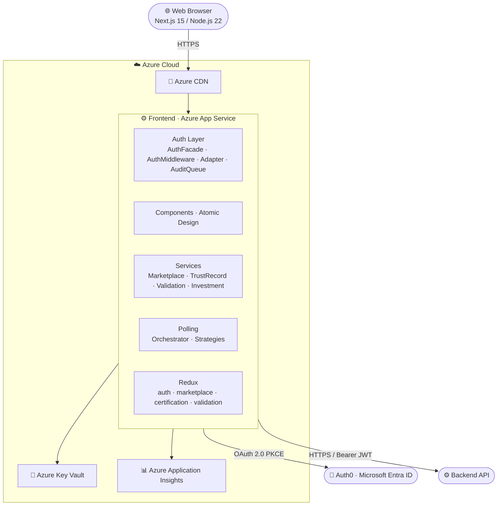
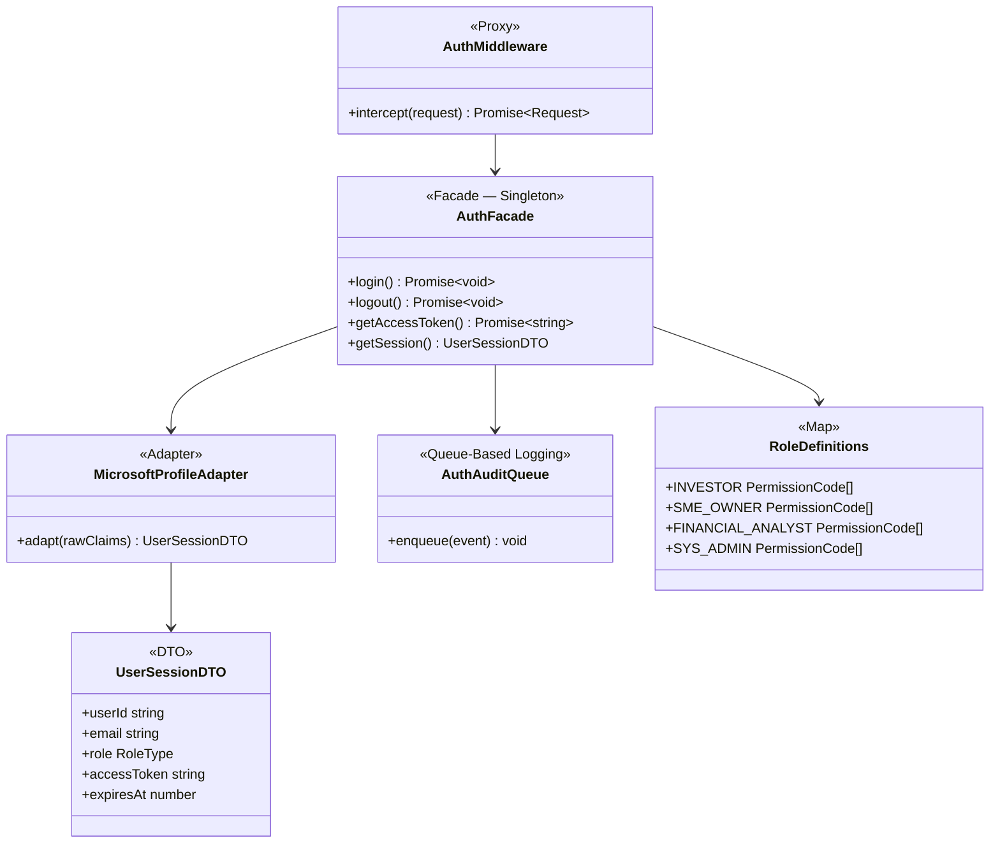
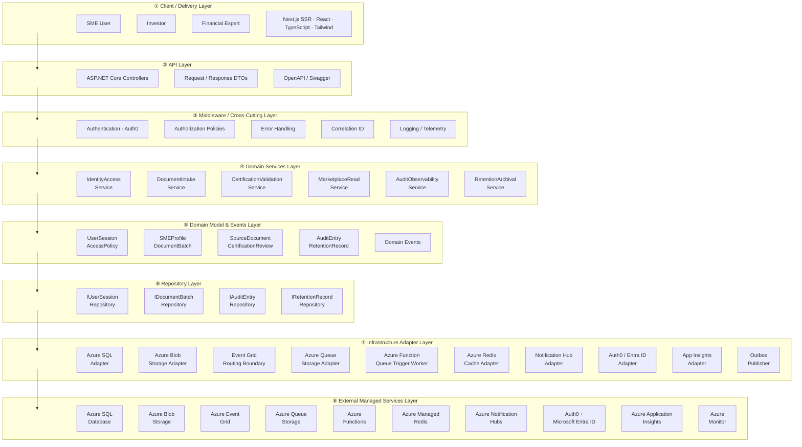
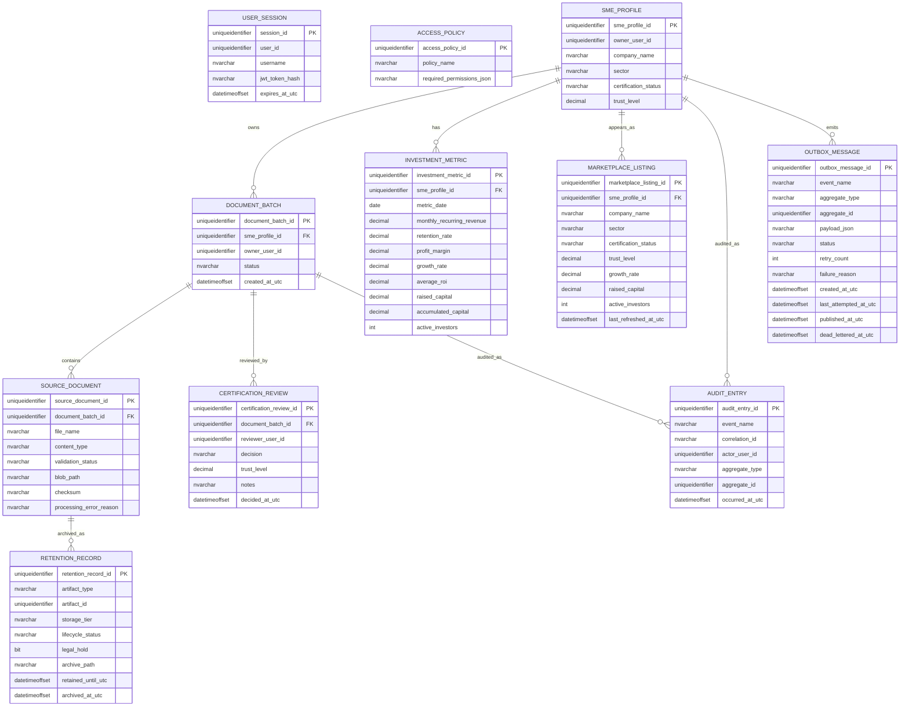

# QuietWealth — Expedited Financial Trust Record for SMEs

## Problem Statement

SMEs face slow, bureaucratic processes to certify their financial health, delaying capital access and investment. QuietWealth provides an expedited financial trust record by integrating document validation, risk analysis, and standardized financial conditions into a single certified report oriented to investors, establishing a low-risk certified investment ecosystem based on real revenue streams.

---

# 1. Frontend Design

## [1.1 Technology Stack](app/)

| Technology | Version | Justification |
|---|---|---|
| **Application Type** | SSR Web App | Server-side rendering enables auth-gated pages to be rendered on the server, reducing layout shift and preventing flash of unauthorized content for sensitive financial data |
| **React.js** | `19.2` | Industry-standard UI library with mature ecosystem; concurrent rendering features (`Suspense`, `React.lazy`) are essential for the document upload and long-running compilation flows |
| **Next.js** | `15` | Provides SSR, file-system routing, and built-in image optimization out of the box; integrates natively with Azure App Service Node.js runtime |
| **Node.js** | `22` | LTS release; required by Next.js 15 SSR runtime on Azure App Service |
| **TypeScript** | `5.9.3` | Static typing catches contract mismatches between API responses and UI state at compile time; essential for a data-intensive financial domain |
| **TailwindCSS** | `4.1` | Utility-first approach maps directly to the design token model; JIT compiler eliminates dead CSS in production with zero configuration |
| **Redux Toolkit** | `2.8` | Manages async thunks for document processing status tracking across page navigations; DevTools enable observability of state transitions during development |
| **Jest** | `30.2.0` | De-facto standard for React unit testing; compatible with TypeScript via `ts-jest`; supports coverage thresholds enforced in CI |
| **Zod** | `4.3.6` | Runtime schema validation for all API responses and form inputs; catches backend contract drift before data reaches Redux state |
| **Prettier** | `3.8.1` | Enforces uniform formatting across the team; integrated with Husky pre-commit hooks to block non-conforming commits |
| **ESLint** | `10.0.2` | Static analysis with custom rules that ban `dangerouslySetInnerHTML`, token storage in `localStorage`, and direct `console.log` calls |
| **Playwright** | `1.52` | Cross-browser E2E and integration testing; supports Chromium and Firefox; first-class `msw` integration for mocking backend responses |
| **Axios** | `1.9` | Provides interceptor support used by `AuthMiddleware` to attach Bearer tokens and handle 401 refresh centrally; cleaner API than native `fetch` for multipart document uploads |
| **Auth0 React SDK** | `2.2` | Manages OAuth 2.0 Authorization Code + PKCE flow and silent token refresh without custom implementation; Microsoft Entra ID is federated through Auth0 |
| **Husky** | `9.1.7` | Runs `lint-staged` on pre-commit; blocks commits that fail ESLint, Prettier, or TypeScript checks |
| **Cloud Service** | Azure | Consistent with the backend infrastructure; reduces operational complexity and cross-cloud latency |
| **Azure App Service** | — | Supports Node.js SSR runtimes natively; provides deployment slots (`staging → production`) enabling zero-downtime releases with instant rollback |
| **Code Repository** | GitHub | Enables GitHub Actions CI/CD with OIDC-based Azure deployment, avoiding long-lived credentials |
| **CI/CD** | GitHub Actions | OIDC token exchange with Azure App Service; branch-based environment promotion with manual approval for production |
| **Azure Application Insights SDK** | — | Unified telemetry for frontend and backend; correlates traces across browser, SSR layer, and backend API using a single `correlationId` |

---

## [1.2 UX / UI Analysis](app/)

### 1.2.1 Core Business Process

#### Login
1. The user accesses the QuietWealth platform and is presented with the authentication screen.
2. The user selects **Continue with Microsoft**.
3. Frontend redirects to Auth0 Universal Login, which federates with Microsoft Entra ID.
4. Auth0 returns an authorization code to the QuietWealth callback URL.
5. If authentication fails, Auth0 returns an error and the login screen displays the reason.
6. If successful, the session is created and the user is redirected to the Marketplace or Dashboard depending on their role.

---

#### Browse the Investment Marketplace
1. The investor lands on the Marketplace screen, which displays a list of certified SMEs available for investment.
2. The user can search for a specific company using the search bar.
3. The user can filter results by sector (e.g., Technology, Energy, Commerce) or by trust level.
4. Each SME card displays certification status, growth percentage, total raised capital, and number of active investors.
5. The user selects a company by clicking **Ver Detalles** to view the full investment profile.

---

#### Upload Financial Documents
1. The SME owner navigates to the **Cargar Documentos** section from the sidebar.
2. The system displays the document upload portal with a progress tracker: **Información Cargada → En Revisión por Expertos → Certificación Emitida**.
3. The user drags and drops files into the upload area or clicks **Seleccionar Archivos** to browse.
4. The system validates file formats (PDF, DOC, XLS, image) and size (max 10 MB per file) client-side via Zod before upload.
5. The frontend requests upload permission and receives a short-lived SAS URL from the backend.
6. React uploads the file directly to Azure Blob Storage; Blob events trigger asynchronous processing and the UI tracks `Pending`, `Processing`, `Completed`, or `Failed`.

---

#### Expert Validation Panel
1. A financial expert accesses the **Panel de Validación** section from the sidebar.
2. The system displays a list of pending SME certification requests with ID, company name, sector, submission date, and status.
3. The expert selects a pending request by clicking **Revisar**.
4. The expert reviews the uploaded documents and financial information.
5. The expert issues a certification decision, which updates the SME's trust status on the platform.

---

#### View Investment Detail
1. From the Marketplace, the investor clicks **Ver Detalles** on a specific SME card.
2. The system shows key financial metrics: Total Raised, Active Investors, Growth Rate, and Average ROI.
3. The user can scroll down to view detailed charts: Income Growth, Investor Growth, and Accumulated Capital Over Time.
4. The screen displays a company description and key business metrics such as retention rate, MRR, and profit margin.
5. The investor can click **Invertir Ahora** to initiate the investment flow.

---

#### Logout
1. The user ends their session through the logout option in the navigation.
2. Auth0 SDK calls `logout()`, invalidating the session both locally and on Auth0 servers.
3. The session is terminated and the user is redirected to the Login screen.

---

### 1.2.2 Wireframes

#### Login Screen
Microsoft-authenticated entry point to the platform via Auth0 Universal Login. A single **Continue with Microsoft** button is shown — no manual credential form.


---

#### Marketplace Screen
Lists certified SMEs with key financial metrics and trust indicators for investors to browse and compare.


---

#### Document Upload Screen
Allows SMEs to submit financial documents for expert review and certification. Shows a progress tracker with three stages.


---

#### Expert Validation Panel Screen
Enables financial experts to review and certify pending SME applications.


---

#### Investment Detail Screen
Shows verified SME financial metrics, growth charts, and expert certifications to support investor decision-making.


---

### Testing results

Tabla testing · MD
| Participant | Duration | OS | Browser | Opinion Scale (1–5) | Open Feedback |
|-------------|----------|----|---------|---------------------|---------------|
| 542521286 | 49s | Windows | Chrome | 4 | "Considero que la información mostrada es clara." |
| 510669335 | 42s | Windows | Chrome | 5 | "Esta bien" |
| 543901432 | 17.8s | Windows | Brave | 4 | "all good" |
| 508804036 | 70.1s | Windows | Edge | 5 | "." |
| 542802936 | 99.5s | Windows | Edge | 5 | "Anuncios de invierta ahora no deberían de aparecer en la aplicación como tal, solo en una web." |
| 537502878 | 50.1s | Linux | Firefox | 5 | "Muy detallada y presentable, no mejoraría nada." |
| **Average** | **54.8s** | — | — | **4.7 / 5** | — |

---

### Heatmaps for clicks and drop-offs

**Investment Detail Screen**


#### Usability Issues Detected

| # | Screen | Issue | Severity |
|---|---|---|---|
| 1 | Investment Detail | The "Invertir Ahora" CTA feels too prominent within the platform; one participant noted it is more appropriate for an external web page. | Medium |

#### Corrections Applied

| # | Issue | Correction | Decision Criteria |
|---|---|---|---|
| 1 | "Invertir Ahora" CTA felt intrusive inside the platform | Reduced visual weight of the CTA within the Investment Detail screen | Keeps the platform focused on trust and information rather than aggressive selling |


---

## [1.3 Component Design Strategy](app/components)

Atomic Design: atoms → molecules → organisms → templates → pages.

```
app/components/
 ├ atoms/
 ├ molecules/
 ├ organisms/
 ├ templates/
 ├ pages/
 ├ hooks/
 ├ i18n/
 └ styles/
```

### [Atoms](app/components/atoms)
Pure UI, no business logic, no API calls.
```
Button · Input · Badge · Spinner · ProgressBar
TrustIndicator · Label · Card · Toast · Modal · StatCard · MaskedValue
```

### [Molecules](app/components/molecules)
Composed from atoms; UI logic only.
```
SMECard · FilterBar · DocumentUploader · FormField · StatusBadge · InfoBanner
```

### [Organisms](app/components/organisms)
Layout composition only.
```
MarketplaceGrid · InvestmentDetailPanel · ValidationQueue
DocumentUploadZone · Navbar · Sidebar · PageContainer
```

### [Pages](app/components/pages)
Business logic via hooks; mounted by Next.js App Router.
```
LoginPage.tsx · MarketplacePage.tsx · DocumentUploadPage.tsx
ExpertValidationPage.tsx · InvestmentDetailPage.tsx
```

### Reuse Rule
Search atoms → molecules before creating a new component. Extend via props, never duplicate.
```
useAuth() · useMarketplace() · useDocumentUpload() · useCertificationProgress()
useExpertValidation() · useInvestmentDetail() · usePermissions() · usePolicies()
useSession() · useApplicationServices()
```

### Naming Conventions

| Element | Convention | Example |
|---|---|---|
| Component files/folders | `PascalCase` | `SMECard.tsx` / `SMECard/` |
| Page files | `PascalCase` + `Page` suffix | `MarketplacePage.tsx` |
| Hook files | `camelCase` + `use` prefix | `useMarketplace.ts` |
| Service files | `PascalCase` + `Service` suffix | `TrustRecordService.ts` |
| Redux slices | `camelCase` + `Slice` suffix | `marketplaceSlice.ts` |
| Zod schemas | `camelCase` + `Schema` suffix | `documentUploadSchema.ts` |
| Type/interface files | `PascalCase` or `camelCase.types.ts` | `session.types.ts` |
| CSS module files | `camelCase.module.css` | `smeCard.module.css` |
| Tailwind utilities | Token-based CSS vars only | `text-[var(--qw-navy)]` |
| Constants | `SCREAMING_SNAKE_CASE` | `MAX_UPLOAD_FILE_SIZE_MB` |
| DTOs | `PascalCase` + `DTO` suffix | `TrustRecordApplicationDTO` |
| Enums | `PascalCase` values | `CertificationStatus.PENDING` |
| Test files | Mirror source path + `.test.ts(x)` / `.spec.ts` | `AuthFacade.test.ts` |
| i18n keys | `dot.separated.camelCase` | `marketplace.filter.sector` |
| Non-component folders | `kebab-case` | `app/auth/` |

### [Styles and Design Tokens](app/components/styles)

[tokens.ts](app/components/styles/tokens.ts):

```ts
export const colors = {
  primary:    "#0D1F3C",   // QW Navy
  accent:     "#1AACA8",   // QW Teal
  gold:       "#C8972B",   // QW Gold
  background: "#F5F7FA",
  surface:    "#FFFFFF",
  slate:      "#4A5568",
  success:    "#22C55E",
  warning:    "#F59E0B",
  error:      "#EF4444",
};
export const spacing = { sm: "8px", md: "16px", lg: "24px", xl: "48px" };
export const radius  = { sm: "4px", md: "8px",  lg: "12px" };
```

[theme.ts](app/components/styles/theme.ts):
```ts
export const theme = {
  colors,
  spacing,
  radius,
  typography: {
    fontFamily:    "Inter, sans-serif",
    monoFamily:    "JetBrains Mono, monospace",
    headingWeight: 600,
  },
};
```

**Typography:**

| Token | Value | Usage |
|---|---|---|
| `--font-display` | `Inter, sans-serif` | H1–H3 |
| `--font-body` | `Inter, sans-serif` | Body, labels, tables |
| `--font-mono` | `JetBrains Mono, monospace` | Financial metrics, amounts |
| Base size | `16px` | Root `rem` |

**Logos:** SVG only. [`app/assets/logo/logo-dark.svg`](app/assets/logo/logo-dark.svg) (white text) and [`logo-light.svg`](app/assets/logo/logo-light.svg) (navy text). Min width: `120px`.

**Iconography:** Lucide React `0.383.0` — named imports only.

**Spacing:** 4-point scale. Cards: `p-4`; inputs: `p-2`; grids: `gap-6`; page horizontal: `px-6 md:px-12 lg:px-24`.

**Branding rules:**
- Trust certification status: always color + text label (never color alone).
- Certified: `--qw-gold` + checkmark icon.
- Pending: `--qw-warning` + clock icon.
- Rejected: `--qw-error` + X icon.

**Styling rule:**
```tsx
// ✅
<Button className="bg-[var(--color-primary)]" />
// ❌
<Button style={{ background: "#0D1F3C" }} />
```

### Responsive Design

[breakpoints.ts](app/components/styles/breakpoints.ts):
```ts
export const breakpoints = { mobile: 480, tablet: 768, desktop: 1200 };
```

| Device | Marketplace | Investment Detail | Navigation |
|---|---|---|---|
| Mobile | 1 column | 1 column | Hamburger |
| Tablet | 2-column grid | Metrics + charts side-by-side | Collapsed sidebar |
| Desktop | 3-column grid | Full dual-panel | Full sidebar |

### [Internationalization](app/components/i18n)

Translation files: [en.json](app/components/i18n/en.json) · [es.json](app/components/i18n/es.json)

```tsx
// ❌
<h1>Marketplace</h1>
// ✅
const { t } = useTranslation();
<h1>{t("marketplace.title")}</h1>
```

### Performance

```tsx
// Lazy loading
const InvestmentDetailPage = lazy(() => import("@/components/pages/InvestmentDetailPage"));
<Suspense fallback={<Spinner />}><InvestmentDetailPage /></Suspense>

// Memoization
export const SMECard = memo(function SMECard({ sme }: SMECardProps) {
  const formattedGrowth = useMemo(() => formatPercent(sme.growthRate), [sme.growthRate]);
  const onViewDetails   = useCallback(() => router.push(`/marketplace/${sme.id}`), [sme.id]);
  return <article onClick={onViewDetails}>...</article>;
});

// Virtualization (> 100 rows)
<FixedSizeList height={600} itemCount={smes.length} itemSize={120} width="100%">
  {({ index, style }) => <SMECard style={style} sme={smes[index]} />}
</FixedSizeList>
```

- `next-bundle-analyzer` in CI — chunks > 250 KB fail the pipeline.
- Lucide React: named imports only (`import { TrendingUp } from "lucide-react"`).
- Next.js `<Image>` with explicit dimensions for all rasterized assets.

---

## [1.4 Security](app/auth)

### 1.4.1 Technologies
- Auth0 React SDK `2.2` — OAuth 2.0 Authorization Code + PKCE, Microsoft Entra ID
- JWT bearer tokens for protected API requests
- Zod for form and API response validation
- Axios interceptors for token attachment and 401 handling

### 1.4.2 Authentication

**Identity provider:**

| Provider | Supported | Reason |
|---|---|---|
| Microsoft Entra ID | Yes | OAuth 2.0 + PKCE via Auth0 federation |
| Google | No | Out of scope — all users are expected to have corporate Microsoft accounts |

**Auth Flow:**
1. User selects **Continue with Microsoft**.
2. Auth0 Universal Login → Microsoft Entra ID.
3. Auth0 returns authorization code to `AUTH0_CALLBACK_URL`.
4. Backend validates JWT + ID Token; session created.

**Auth0 Config Parameters:**

| Parameter | Storage |
|---|---|
| `AUTH0_DOMAIN` | Azure Key Vault (prod/qa) · `.env` (local) |
| `AUTH0_CLIENT_ID` | Azure Key Vault (prod/qa) · `.env` (local) |
| `AUTH0_CLIENT_SECRET` | Azure Key Vault (prod/qa) · `.env` (local) — backend only |
| `AUTH0_CALLBACK_URL` | Azure Key Vault (prod/qa) · `.env` (local) |
| `AUTH0_AUDIENCE` | Azure Key Vault (prod/qa) · `.env` (local) |

**MFA:** Auth0 Adaptive MFA. Factors: TOTP, SMS OTP, Email OTP. Enforced for all roles.

**[AuthFacade.ts](app/auth/AuthFacade.ts):**
```ts
export class AuthFacade {
  private static instance: AuthFacade | null = null;
  static getInstance(): AuthFacade { ... }
  private constructor() {}

  async login(): Promise<void> { }    // redirects to Auth0 → Microsoft
  async logout(): Promise<void> { }   // invalidates locally and on Auth0
  async getAccessToken(): Promise<string> { }  // getAccessTokenSilently()
  getSession(): UserSessionDTO | null { }
}
export const authFacade = AuthFacade.getInstance();
```

**[MicrosoftProfileAdapter.ts](app/auth/adapters/MicrosoftProfileAdapter.ts):**
```ts
export class MicrosoftProfileAdapter {
  adapt(rawClaims: MicrosoftClaims): UserSessionDTO {
    return {
      userId:      rawClaims.oid,
      email:       rawClaims.preferred_username,
      displayName: rawClaims.name,
      role:        this.resolveRole(rawClaims),
      accessToken: rawClaims.access_token,
      expiresAt:   rawClaims.exp,
    };
  }
}
```

**JWT Claims:**

| Claim | Value |
|---|---|
| `sub` | Auth0 user ID |
| `email` | Corporate email from Entra ID |
| `name` | Display name |
| `roles` | Platform roles array (e.g. `["investor"]`) |
| `permissions` | Granted permission codes |
| `aud` | `AUTH0_AUDIENCE` |
| `iss` | Auth0 domain |
| `exp` / `iat` | Expiry / issued-at |

Estimated payload: **< 2 KB**.

**Token management:**

| Aspect | Config |
|---|---|
| Access token expiry | 60 min |
| Refresh token rotation | Enabled |
| Silent refresh | `getAccessTokenSilently()` before expiry |
| Access token storage | In-memory (Redux) only |
| Refresh token storage | `HttpOnly`, `Secure`, `SameSite=Strict` cookie — Auth0 managed |
| Logout | `logout({ returnTo: window.location.origin })` |

**Session expiration:** On `401`, [httpInterceptors.ts](app/services/httpInterceptors.ts) calls `sessionManager.handleUnauthorized()` and redirects to login.

**Auth latency:** 1–5 s. Spinner shown immediately on click; button disabled until callback resolves.

**[AuthAuditQueue.ts](app/auth/AuthAuditQueue.ts):** Batches auth events and dispatches asynchronously to Application Insights.

**Expected workload:**
- Peak: 7:00 AM – 6:00 PM (Costa Rica time)
- Concurrent users within Auth0 plan threshold — no additional mitigation required

### 1.4.3 Authorization

**Roles** — [roles.ts](app/auth/policies/roles.ts):

| Code | Description |
|---|---|
| `investor` | Browses Marketplace, views investment details, initiates investment |
| `sme_owner` | Uploads financial documents, tracks certification status |
| `financial_analyst` | Reviews certification queue, issues certification decisions |
| `sys_admin` | Full access: user management, audit logs, system config |

**Permissions** — [permissions.ts](app/auth/policies/permissions.ts):

| Code | Description |
|---|---|
| `auth.login` / `auth.logout` | Session start/end |
| `session.read` | Access authenticated screens |
| `marketplace.browse` | View SME listings |
| `investment.detail.view` | View full investment detail |
| `investment.initiate` | Initiate investment flow |
| `documents.upload` | Upload financial documents |
| `documents.status.read` | Track certification status |
| `validation.queue.read` | View expert validation queue |
| `validation.certify` | Issue certification decisions |
| `audit_log.read` | View audit trail |
| `users.admin` / `roles.admin` / `system.config` | `sys_admin` only |

**Role-Permission Mapping** — [rolePermissions.ts](app/auth/policies/rolePermissions.ts):

| Role | Permissions |
|---|---|
| `investor` | `auth.*`, `session.read`, `marketplace.browse`, `investment.detail.view`, `investment.initiate` |
| `sme_owner` | `auth.*`, `session.read`, `documents.upload`, `documents.status.read` |
| `financial_analyst` | `auth.*`, `session.read`, `validation.queue.read`, `validation.certify`, `audit_log.read` |
| `sys_admin` | All |

**Access Policies** — [accessPolicy.ts](app/auth/policies/accessPolicy.ts):

| Policy | Required Permissions |
|---|---|
| `canBrowseMarketplace` | `marketplace.browse` |
| `canViewInvestmentDetail` | `investment.detail.view` |
| `canInitiateInvestment` | `investment.initiate` |
| `canUploadDocuments` | `documents.upload` |
| `canTrackCertification` | `documents.status.read` |
| `canAccessValidationQueue` | `validation.queue.read` |
| `canCertifySME` | `validation.certify` |
| `canReadAuditLog` | `audit_log.read` |
| `canManageSystem` | `users.admin`, `roles.admin`, `system.config` |

**Route Guards** — [app/auth/guards/](app/auth/guards/):

```tsx
// Unauthenticated → redirect to login
<AuthGuard><DashboardLayout><MarketplacePage /></DashboardLayout></AuthGuard>

// Authenticated → redirect to marketplace
<GuestGuard><LoginPage /></GuestGuard>

// Missing permissions → 403 page
<AuthGuard>
  <PolicyGuard required={accessPolicy.canCertifySME}>
    <ExpertValidationPage />
  </PolicyGuard>
</AuthGuard>
```

**Usage rule:**
```ts
// ❌
if (user.role === "financial_analyst") { ... }
// ✅
const { hasAccess } = usePolicies();
{hasAccess("canCertifySME") && <CertifyButton />}
```

- `hasAccess` — all required permissions must be held.
- `hasSomeAccess` — at least one permission held (partial-access sections).
- `getMissingPermissions` — admin/debug screens and access-denied messages.

### 1.4.4 Encryption and Data Privacy

**In transit:** HTTPS/TLS 1.3 enforced; HTTP → 301. `Strict-Transport-Security: max-age=31536000; includeSubDomains`.

**Token storage:**
- Access tokens: in-memory (Redux) only.
- Refresh tokens: `HttpOnly`, `Secure`, `SameSite=Strict` cookie — Auth0 SDK managed.

**Sensitive data in DOM:**
```tsx
// app/components/atoms/MaskedValue/MaskedValue.tsx
export function MaskedValue({ value, visible }: { value: string; visible: boolean }) {
  return <span aria-hidden={!visible}>{visible ? value : "••••••••"}</span>;
}

// Usage
const { hasAccess } = usePolicies();
<MaskedValue value={sme.revenueAmount} visible={hasAccess("canViewInvestmentDetail")} />
```

Client-side masking is a UX layer only — the API returns masked/null values for unauthorized callers.

**Secrets:** Sourced from Azure Key Vault via [Settings.ts](app/settings/Settings.ts). Logger strips keys matching `/token|secret|password|key/i` before emitting to App Insights.

**Privacy:** File bytes streamed directly to backend — not buffered in browser. CSRF: Auth0 `state` parameter validated on callback before code exchange.

### 1.4.5 [API Communication](app/services/client.ts)

All HTTP calls through the HTTP facade. [httpInterceptors.ts](app/services/httpInterceptors.ts):
- Attaches `Authorization: Bearer <token>`.
- On `401`: triggers `sessionManager.handleUnauthorized()`.
- Validates Zod schema on every response before reaching Redux.

### 1.4.6 Storage Rules

| Storage | Allowed Use |
|---|---|
| Memory (Redux) | Session token, marketplace data, certification status |
| Auth0 `HttpOnly` cookie | Refresh token |
| `localStorage` | Theme, language only |
| `sessionStorage` | Not used |

```ts
localStorage.setItem("theme", "dark");      // ✅
// localStorage.setItem("accessToken", t); // ❌
```

### 1.4.7 Data Masking

Financial values gated by certification status are masked via `MaskedValue`. Values are only rendered when the JWT carries the required permission scope and the API has validated it server-side.

### 1.4.8 OWASP Mitigations

| Risk | Mitigation |
|---|---|
| XSS | JSX auto-escaping; `dangerouslySetInnerHTML` banned via ESLint; CSP header at App Service |
| Broken Authentication | PKCE; tokens in memory only |
| Sensitive Data Exposure | Financial values masked for unauthorized roles; nothing sensitive in `localStorage` |
| CSRF | Auth0 `state` parameter validated on callback; `SameSite=Strict` cookies |
| Broken Access Control | `PolicyGuard` on every protected route; server-side re-validation on every call |
| Security Misconfiguration | Secrets from Azure Key Vault; no credentials in source control |
| Clickjacking | `X-Frame-Options: DENY` at App Service level |
| Injection | Zod validates all form inputs and API response shapes |

---

## [1.5 Layered Design](app/)

Five layers, downward dependencies only.
|---|---|---|
| 1 — Presentation | `app/components/`, `app/routes/`, `app/auth/guards/` | Atoms → Pages, route guards |
| 2 — Application | `app/components/hooks/` | Orchestration hooks |
| 3 — Domain Logic | `app/auth/policies/`, `app/models/` | Access policies, Zod schemas, types |
| 4 — Services | `app/services/`, `app/auth/AuthFacade.ts` | HTTP facade, auth, polling |
| 5 — Infrastructure | `app/state/`, `app/components/styles/`, `app/components/i18n/`, `app/utils/` | Session, design system, i18n, logger |

**Dependency rule:** no layer may call upward. Components never import services; pages never call `fetch` directly; hooks never check `user.role`.

```
Browser
  └── Azure App Service (Node.js + Next.js SSR)
        └── Auth Layer (AuthFacade / AuthMiddleware)
              └── Components Layer (Atoms → Pages)
                    └── Hooks
                          └── Services Layer
                                ├── ApiClients
                                ├── Settings → Azure Key Vault
                                └── Utils
Shared: Models · Zod · Redux · ExceptionHandler · Logger → App Insights
CI/CD: GitHub Actions → QA / Production → Azure App Service
```

**Login flow:** `useLogin()` → `AuthFacade.login()` → Auth0 → Microsoft Entra ID → callback → `sessionManager.setSession()` → redirect to Marketplace.

**Document upload flow:** `DocumentUploadPage` → `useDocumentUpload().submit()` → `TrustRecordService.submit()` → `POST /api/trust-record-applications` → `202` → polling starts → `certificationSlice` updates → progress tracker re-renders.

---

## [1.6 Design Patterns](app/)

### Singleton

| Class | File |
|---|---|
| `Logger` | [app/utils/logger.ts](app/utils/logger.ts) |
| `ExceptionHandler` | [app/utils/error-handler.ts](app/utils/error-handler.ts) |
| `AuthFacade` | [app/auth/AuthFacade.ts](app/auth/AuthFacade.ts) |
| `SessionManager` | [app/state/sessionManager.ts](app/state/sessionManager.ts) |
| `CertificationPollingStore` | [app/state/certificationPollingStore.ts](app/state/certificationPollingStore.ts) |
| `DefaultHttpClientFacade` | [app/services/client.ts](app/services/client.ts) |
| `DefaultApplicationServiceFacade` | [app/services/applicationFacade.ts](app/services/applicationFacade.ts) |

```ts
export class MyService {
  private static instance: MyService | null = null;
  static getInstance(): MyService {
    if (!MyService.instance) MyService.instance = new MyService();
    return MyService.instance;
  }
  private constructor() {}
}
export const myService = MyService.getInstance();
```

---

### Observer — Certification Status Tracking

Reference: [certification.types.ts](app/state/certification.types.ts) · [certificationPollingStore.ts](app/state/certificationPollingStore.ts) · [certificationPollingManager.ts](app/state/certificationPollingManager.ts) · [useCertificationProgress.ts](app/components/hooks/useCertificationProgress.ts)

```ts
// Store
class CertificationPollingStore {
  private listeners = new Set<Listener<CertificationState>>();
  private state = createInitialState();
  getState()  { return this.state; }
  subscribe(listener: Listener<CertificationState>) {
    this.listeners.add(listener);
    listener(this.state);
    return () => this.listeners.delete(listener);
  }
  patchState(partial: Partial<CertificationState>) {
    this.state = { ...this.state, ...partial };
    for (const l of this.listeners) l(this.state);
  }
}

// Subscriber hook
function useCertificationProgress() {
  const [state, setState] = useState(() => certificationPollingManager.getSnapshot());
  useEffect(() => certificationPollingManager.subscribe(setState), []);
  return state;
}

// Manager
async function startPolling(applicationId: string) {
  store.patchState({ runState: "polling", applicationId });
  void runPollingLoop(applicationId);
}
```

---

### Facade — Auth + Application Services

[AuthFacade.ts](app/auth/AuthFacade.ts) · [applicationFacade.ts](app/services/applicationFacade.ts)

```ts
interface AuthServiceFacade {
  login(): Promise<void>;
  logout(): Promise<void>;
  getAccessToken(): Promise<string>;
  getCurrentSession(): Promise<UserSessionDTO | null>;
}
interface ApplicationServiceFacade {
  readonly auth: AuthServiceFacade;
  readonly http: HttpClientFacade;
}
```

---

### Adapter

[MicrosoftProfileAdapter.ts](app/auth/adapters/MicrosoftProfileAdapter.ts) — normalizes Entra ID claims into `UserSessionDTO`.

---

### Proxy — Auth Middleware

[AuthMiddleware.ts](app/auth/AuthMiddleware.ts) — intercepts protected API calls; validates JWT expiry; triggers silent refresh or logout.

---

### Strategy — Polling Interval

[app/polling/strategies/](app/polling/strategies/)

```ts
export interface IPollingStrategy {
  getInterval(attempt: number): number; // ms
}
export class FixedIntervalStrategy implements IPollingStrategy {
  getInterval(_: number) { return 10_000; }
}
export class ExponentialBackoffStrategy implements IPollingStrategy {
  getInterval(attempt: number) { return Math.min(2 ** attempt * 1000, 60_000); }
}
```

`PollingOrchestrator` switches to `ExponentialBackoffStrategy` on network errors; stops after 5 failed attempts.

---

### Queue-Based Logging

[AuthAuditQueue.ts](app/auth/AuthAuditQueue.ts) — auth events batched, dispatched async to App Insights.

---

## [1.7 Project Scaffold](app/)

```
app/
├── layout.tsx · page.tsx · globals.css
├── login/page.tsx
├── marketplace/
│   ├── page.tsx                        → MarketplacePage
│   └── [id]/page.tsx                   → InvestmentDetailPage
├── documents/page.tsx                  → DocumentUploadPage
├── validation/page.tsx                 → ExpertValidationPage
└── admin/page.tsx
│
app/components/
├── atoms/
│   ├── Button/ · Badge/ · Input/ · Label/ · Spinner/
│   ├── ProgressBar/ · TrustIndicator/ · StatCard/ · MaskedValue/
│   └── atoms.css
├── molecules/
│   ├── SMECard/ · FilterBar/ · DocumentUploader/
│   ├── FormField/ · StatusBadge/ · InfoBanner/
│   └── molecules.css
├── organisms/
│   ├── MarketplaceGrid/ · InvestmentDetailPanel/ · ValidationQueue/
│   ├── DocumentUploadZone/ · Navbar/ · Sidebar/
│   └── organisms.css
├── templates/
│   └── AuthenticatedLayout/ · PublicLayout/
├── pages/
│   ├── LoginPage.tsx · MarketplacePage.tsx · InvestmentDetailPage.tsx
│   ├── DocumentUploadPage.tsx · ExpertValidationPage.tsx
├── hooks/
│   ├── useApplicationServices.ts · useAuth.ts · useMarketplace.ts
│   ├── useDocumentUpload.ts · useCertificationProgress.ts
│   ├── useExpertValidation.ts · useInvestmentDetail.ts
│   └── usePermissions.ts · usePolicies.ts · useSession.ts
├── i18n/
│   └── config.ts · I18nProvider.tsx · en.json · es.json
└── styles/
    └── tokens.ts · theme.ts · breakpoints.ts · globals.css · ThemeProvider.tsx
│
app/auth/
├── AuthFacade.ts · AuthMiddleware.ts · AuthAuditQueue.ts · authConfig.ts
├── adapters/MicrosoftProfileAdapter.ts
├── guards/AuthGuard.tsx · GuestGuard.tsx · PolicyGuard.tsx
└── policies/roles.ts · permissions.ts · rolePermissions.ts · accessPolicy.ts
│
app/polling/
├── PollingOrchestrator.ts
└── strategies/IPollingStrategy.ts · FixedIntervalStrategy.ts · ExponentialBackoffStrategy.ts
│
app/services/
├── applicationFacade.ts · client.ts · httpInterceptors.ts
├── MarketplaceService.ts · TrustRecordService.ts
└── ExpertValidationService.ts · InvestmentService.ts
│
app/state/
├── certification.types.ts · certificationPollingStore.ts · certificationPollingManager.ts
├── session.types.ts · sessionManager.ts · SessionProvider.tsx
├── StoreProvider.tsx · store.ts · hooks.ts
└── slices/authSlice.ts · marketplaceSlice.ts · certificationSlice.ts · validationSlice.ts
│
app/models/
└── ApiResponse.ts · SME.ts · TrustRecord.ts · DocumentUpload.ts · Permission.ts · Role.ts · User.ts
│
app/validation/
└── documentUploadSchema.ts · smeSchema.ts · userSchema.ts · index.ts
│
app/settings/Settings.ts
app/utils/logger.ts · error-handler.ts · eventBus.ts · schemaValidator.ts · constants.ts · formatters.ts
app/assets/logo/logo-dark.svg · logo-light.svg
│
app/__tests__/
├── setup.ts
├── unit/auth/ · polling/ · services/ · validation/
└── e2e/login.spec.ts · marketplace.spec.ts · documentUpload.spec.ts · expertValidation.spec.ts
│
app/__mocks__/styleMock.ts
next.config.ts · tailwind.config.ts · tsconfig.json · jest.config.ts
playwright.config.ts · package.json · .env.example
.eslintrc.json · .prettierrc · .lintstagedrc.json · .husky/pre-commit
```

---

### [State Management](app/state/)

| File | Description |
|---|---|
| [store.ts](app/state/store.ts) | Redux store: `auth`, `marketplace`, `certification`, `validation` |
| [slices/authSlice.ts](app/state/slices/authSlice.ts) | `isAuthenticated`, `user`, `role`, `accessToken` |
| [slices/marketplaceSlice.ts](app/state/slices/marketplaceSlice.ts) | SME listings, filters, search |
| [slices/certificationSlice.ts](app/state/slices/certificationSlice.ts) | `applicationId`, `status`, `stage` |
| [slices/validationSlice.ts](app/state/slices/validationSlice.ts) | Pending requests, selected request |

---

### [Async Communication and Polling](app/polling/)

Polls `GET /api/trust-record-applications/{id}/status` every 10 s until `CERTIFIED`, `REJECTED`, or `REQUIRES_HUMAN_REVIEW`.

| File | Description |
|---|---|
| [PollingOrchestrator.ts](app/polling/PollingOrchestrator.ts) | Manages loop lifecycle; dispatches to `certificationSlice` |
| [FixedIntervalStrategy.ts](app/polling/strategies/FixedIntervalStrategy.ts) | 10 s fixed (normal) |
| [ExponentialBackoffStrategy.ts](app/polling/strategies/ExponentialBackoffStrategy.ts) | Doubles on failure, cap 60 s; activated on `503` or network error |

---

### [Storage](app/)

| Storage | Usage | Notes |
|---|---|---|
| Memory (Redux) | Session token, marketplace data, certification status | Cleared on tab close |
| Auth0 `HttpOnly` cookie | Refresh token | Auth0 managed; JS-inaccessible |
| `localStorage` | Theme, language | No tokens, no financial data |
| `sessionStorage` | Not used | — |
| WebSockets | Not used in v1 | Polling sufficient; WebSocket upgrade path documented for v2 |

---

### [Events](app/utils/eventBus.ts)

**Redux dispatch** — all business state transitions:
```ts
dispatch(certificationSlice.actions.certificationCompleted({ applicationId, trustScore }));
dispatch(validationSlice.actions.decisionIssued({ requestId, decision: "approved" }));
```

**Custom DOM events** — UI side-effects only (toasts, global loaders):
```ts
// app/utils/eventBus.ts
export const eventBus = {
  emit<T>(name: string, detail: T) {
    window.dispatchEvent(new CustomEvent(name, { detail }));
  },
  on<T>(name: string, handler: (detail: T) => void) {
    const listener = (e: Event) => handler((e as CustomEvent<T>).detail);
    window.addEventListener(name, listener);
    return () => window.removeEventListener(name, listener);
  },
};

eventBus.emit("toast:show", { message: "Documents submitted", type: "success" });
useEffect(() => eventBus.on("toast:show", setToast), []);
```

Rules: event names `namespace:verb`; every `on()` must return its cleanup; called inside `useEffect`.

---

### [Observability and Monitoring](app/utils/)

| File | Description |
|---|---|
| [logger.ts](app/utils/logger.ts) | Singleton — `info`, `warn`, `error` to Azure Application Insights |
| [error-handler.ts](app/utils/error-handler.ts) | Singleton — maps HTTP codes to user messages; routes 5xx to App Insights |

**Logged events:**

| Event | Trigger |
|---|---|
| `AuthLoginStarted` | "Continue with Microsoft" clicked |
| `AuthLoginCompleted` | Session established |
| `AuthLoginFailed` | Auth0 callback error |
| `AuthLogoutCompleted` | Logout finished |
| `DocumentsSubmitted` | `POST /api/trust-record-applications` sent |
| `CertificationPollingStarted` | `PollingOrchestrator.start()` called |
| `CertificationStatusChanged` | Status transition detected |
| `CertificationCompleted` / `CertificationRejected` | Terminal polling states |
| `ValidationDecisionIssued` | Expert certifies or rejects |
| `InvestmentDetailViewed` | User opens Investment Detail |
| `ApiRequestFailed` | HTTP error from `ExceptionHandler` |
| `ContractViolationError` | Zod mismatch on API response |
| `UnhandledExceptionCaptured` | React error boundary triggered |

**Rules:** every event includes `correlationId`, `userId` (hashed), `role`, `timestamp`, `appVersion`. No raw financial values in logs. No polling tick events — only status transitions and exceptional failures.

**Error handling:**

| HTTP | Behavior |
|---|---|
| `400` | Inline validation error on the field |
| `401` | Silent refresh; if fails → login redirect |
| `403` | Toast: permission denied |
| `404` | Not-found redirect |
| `429` | Toast with countdown; exponential backoff activated |
| `5xx` | Toast with Sentry event ID; polling retries ≤ 5 |

---

### [Data Validation](app/validation/)

| File | Validates |
|---|---|
| [documentUploadSchema.ts](app/validation/documentUploadSchema.ts) | MIME types (`application/pdf`, `application/vnd.ms-excel`, `image/*`), max 10 MB/file |
| [smeSchema.ts](app/validation/smeSchema.ts) | SME listing and investment detail API shapes |
| [userSchema.ts](app/validation/userSchema.ts) | Auth0 token claim shapes |

Schema mismatch → `ContractViolationError` logged to App Insights with full response payload.

---

### [Caching](app/)

| Layer | Strategy |
|---|---|
| Marketplace listings | Redux; TTL 5 min |
| Investment detail | Redux per `smeId`; invalidated on certification status change |
| Status polling | `Cache-Control: no-store` |
| Static assets | Content-hash filenames; `max-age=31536000, immutable` via Azure CDN |

---

### [API Consumption and Data Contracts](app/services/)

| File | Endpoints |
|---|---|
| [client.ts](app/services/client.ts) | Base facade: Bearer token, 401 refresh, Zod validation, error delegation |
| [MarketplaceService.ts](app/services/MarketplaceService.ts) | `GET /api/smes` · `GET /api/smes/{id}` |
| [TrustRecordService.ts](app/services/TrustRecordService.ts) | `POST /api/trust-record-applications` · `GET .../status` |
| [ExpertValidationService.ts](app/services/ExpertValidationService.ts) | `GET /api/validation-queue` · `POST /api/validation-queue/{id}/decision` |
| [InvestmentService.ts](app/services/InvestmentService.ts) | `POST /api/investments` |

---

## [1.8 Testing](app/__tests__/)

### Unit (Jest)

| Folder | Coverage |
|---|---|
| [unit/auth/](app/__tests__/unit/auth/) | `AuthFacade`, `hasPermission`, `getMissingPermissions`, `MicrosoftProfileAdapter` |
| [unit/polling/](app/__tests__/unit/polling/) | `PollingOrchestrator` transitions, `FixedIntervalStrategy`, `ExponentialBackoffStrategy` |
| [unit/services/](app/__tests__/unit/services/) | `MarketplaceService`, `TrustRecordService`, `ExpertValidationService` (HttpClientFacade mocked) |
| [unit/validation/](app/__tests__/unit/validation/) | Zod schemas: valid/invalid payloads |

```ts
it("maps Entra ID oid to userId", () => {
  const dto = new MicrosoftProfileAdapter().adapt({ oid: "abc123", preferred_username: "u@corp.com", name: "Jane" });
  expect(dto.userId).toBe("abc123");
});
```

### Integration (Playwright + msw)

Backend mocked with `msw`. Auth0 bypassed via Redux token fixture.

Required flows: login · marketplace browse/filter · document upload + validation errors · certification polling (`SUBMITTED → IN_REVIEW → CERTIFIED`) · expert validation decision · investment detail · logout.

### E2E

| File | Covers |
|---|---|
| [e2e/login.spec.ts](app/__tests__/e2e/login.spec.ts) | Auth0 → Entra ID mock → session |
| [e2e/marketplace.spec.ts](app/__tests__/e2e/marketplace.spec.ts) | Browse, search, filter, detail |
| [e2e/documentUpload.spec.ts](app/__tests__/e2e/documentUpload.spec.ts) | Upload, polling, CERTIFIED/REJECTED |
| [e2e/expertValidation.spec.ts](app/__tests__/e2e/expertValidation.spec.ts) | Queue view, select, certify |

Playwright config: Chromium + Firefox, screenshot on failure, 2 retries on CI.

### Coverage

Minimum 80% statement coverage on `app/auth/`, `app/polling/`, `app/services/`, `app/validation/`:

```ts
// jest.config.ts
coverageThreshold: {
  "app/auth/**":       { statements: 80 },
  "app/polling/**":    { statements: 80 },
  "app/services/**":   { statements: 80 },
  "app/validation/**": { statements: 80 },
},
```

Coverage artifact published on every CI run. PRs below threshold are blocked.

---

## [1.9 CI/CD](.github/workflows/)

### Environments

| Environment | Branch | App |
|---|---|---|
| QA | `staging` | `qaquietwealth-*` |
| Production | `main` | `prodquietwealth-*` |

### Pipelines

| Pipeline | Trigger | Steps |
|---|---|---|
| `ci-frontend` | Every push | `npm ci` → lint → format check → `tsc --noEmit` → Jest + coverage → build → bundle analysis |
| `ci-backend` | Every push | restore → build → xUnit → `dotnet format` |
| `security-scan` | Every PR | dependency vuln · license scan · secret scan |
| `deploy-qa` | Push to `staging`, `app/**` | Build → deploy `qaquietwealth-frontend` |
| `deploy-prod` | Push to `main`, `app/**` + manual approval | Build → deploy `prodquietwealth-frontend` → CDN invalidation |

### Workflow Pattern

```yaml
jobs:
  build:
    environment: QA
    permissions: { contents: read }
    steps:
      - uses: actions/checkout@v4
      - run: npm ci
      - run: npm run lint
      - run: npm run format:check
      - run: npx tsc --noEmit
      - run: npm run test:coverage
      - run: npm run build
        env:
          NEXT_PUBLIC_AUTH0_DOMAIN:    ${{ secrets.AUTH0_DOMAIN }}
          NEXT_PUBLIC_AUTH0_CLIENT_ID: ${{ secrets.AUTH0_CLIENT_ID }}
          NEXT_PUBLIC_API_BASE_URL:    ${{ secrets.NEXT_PUBLIC_API_BASE_URL }}
      - uses: actions/upload-artifact@v4
        with: { name: node-app, path: .next/ }

  deploy:
    needs: build
    permissions: { id-token: write, contents: read }
    steps:
      - uses: actions/download-artifact@v4
        with: { name: node-app }
      - uses: azure/login@v2
        with:
          client-id:       ${{ secrets.AZUREAPPSERVICE_CLIENTID_QA_FRONTEND }}
          tenant-id:       ${{ secrets.AZUREAPPSERVICE_TENANTID_QA }}
          subscription-id: ${{ secrets.AZUREAPPSERVICE_SUBSCRIPTIONID_QA }}
      - uses: azure/webapps-deploy@v3
        with: { app-name: qaquietwealth-frontend, package: . }
```

- `id-token: write` on **deploy** job only.
- `NEXT_PUBLIC_*` vars are build-time — not Azure app settings.

### Secrets

**QA:** `AZUREAPPSERVICE_CLIENTID_QA_FRONTEND` · `AZUREAPPSERVICE_TENANTID_QA` · `AZUREAPPSERVICE_SUBSCRIPTIONID_QA` · `AUTH0_DOMAIN` · `AUTH0_CLIENT_ID` · `NEXT_PUBLIC_API_BASE_URL`

**Production:** `AZUREAPPSERVICE_CLIENTID_PROD_FRONTEND` · `AZUREAPPSERVICE_TENANTID_PROD` · `AZUREAPPSERVICE_SUBSCRIPTIONID_PROD` · `AUTH0_DOMAIN` · `AUTH0_CLIENT_ID` · `NEXT_PUBLIC_API_BASE_URL_PROD`

### OIDC Setup (`infra/setup-github-oidc.ps1`)
Run once per environment. For each (frontend, api) × (qa, prod):
1. Create Entra ID app registration `qw-{env}-{role}-deploy`.
2. Add federated credential: issuer `https://token.actions.githubusercontent.com`, subject `repo:{owner/repo}:environment:{QA|Production}`.
3. Assign `Contributor` scoped to the specific Web App resource.
4. `gh secret set` the 3 OIDC secrets into the GitHub environment.

### Pre-commit

```json
// .lintstagedrc.json
{
  "app/**/*.{ts,tsx}": ["eslint --fix", "prettier --write"],
  "app/**/*.{css,json}": ["prettier --write"]
}
```

### ESLint Rules
- No `dangerouslySetInnerHTML`.
- No `localStorage`/`sessionStorage` with token-related keys.
- No raw `console.log` — use `Logger`.
- No hardcoded strings outside i18n keys.

### Infrastructure (Bicep)

[`infra/`](infra/) — subscription scope.

| Resource | QA | Production |
|---|---|---|
| App Service Plan | `asp-qw-qa` B1 | `asp-qw-prod` B1 |
| Frontend Web App | `qaquietwealth-frontend` (Node 24 LTS) | `prodquietwealth-frontend` |
| API Web App | `qaquietwealth-api` (DOTNETCORE 10.0) | `prodquietwealth-api` |

Secrets (`AUTH0_*`, `ConnectionStrings__QuietWealthSql`, `BlobStorage__ConnectionString`, `NotificationHub__ConnectionString`) via `.bicepparam` `readEnvironmentVariable()`. Infra deployment is manual only — secrets never stored in GitHub Actions.

---

## [1.10 Architecture Diagrams (C4)](app/)

### Context Diagram


### Container Diagram



### Code Diagram — Auth



---

# Backend Design

## Technology Stack
- API style: REST API over HTTPS
- API specification standard: OpenAPI
- API gateway and hosting: Azure API Management + Azure App Service
- Database: Azure SQL Database
- File storage: Azure Blob Storage
- Blob archival: Azure Blob Lifecycle Management for Cool, Cold, and Archive tier transitions
- SQL archival orchestration: Scheduled Azure Function export process
- Cache: Azure Managed Redis
- Asynchronous document processing: Azure Blob Storage events via Azure Event Grid, Azure Queue Storage, and Azure Function Queue Trigger
- Notifications: Azure Notification Hubs
- Load balancing: no dedicated load balancer required for the expected traffic profile
- Backend framework and language: .NET SDK 10.0.102, ASP.NET Core
- Repository structure: monorepo shared with the frontend; application source under `server/QuietWealth.Backend` and backend test projects under `server/tests`
- Test framework: xUnit
- Assertion library: FluentAssertions
- Mocking: Moq
- API and in-memory host testing: `Microsoft.AspNetCore.Mvc.Testing` with `WebApplicationFactory`
- Ephemeral dependency orchestration for integration tests: Testcontainers for .NET
- Deterministic database cleanup between tests: Respawn
- Coverage collection and reporting: `coverlet.collector` + ReportGenerator
- Contract testing at the Anti-Corruption Layer (ACL): PactNet for HTTP provider contracts and Verify.Xunit for versioned event/message fixtures
- Health check framework: `Microsoft.Extensions.Diagnostics.HealthChecks` with dependency-specific checks for SQL, Blob Storage, Queue Storage, Redis, and Notification Hubs
- API documentation tooling: Swagger / OpenAPI tooling for contract publication and validation
- Code quality: `dotnet format` and built-in .NET analyzers
- Services:
  - Identity access service
  - Document intake service
  - Certification validation service
  - Marketplace read service
  - Audit observability service
  - Retention archival service
  - <<Agregar otros servicios si el MVP los requiere>>

## Security
- Transport security: HTTPS enforced at Azure API Management for all public endpoints
- Authentication:
  - Users authenticate through Auth0 Universal Login federated with Microsoft Entra ID
  - The backend validates JWT bearer tokens issued for the configured Auth0 audience
  - JWT signing algorithm: RS256
  - JWT tokens are required for all protected endpoints
  - Client secrets are never embedded in JWTs or returned to the browser
- Encryption at rest:
  - Azure SQL Database uses Transparent Data Encryption (TDE) with service-managed keys
  - Reference: https://learn.microsoft.com/en-us/azure/azure-sql/database/security-overview?view=azuresql#transparent-data-encryption-encryption-at-rest-with-service-managed-keys
- Request payload limits:
  - General API payload limit: 10 MB
  - File upload endpoints exception: up to 100 MB per request to support realistic document sets with multiple PDF, Excel, Word, and scanned image files
  - Requests above these limits must be rejected with a clear validation error
- Rate limiting at Azure API Management:
  - Maximum concurrent connections per authenticated client: 10
  - Request rate limit per authenticated client: 60 requests per minute
  - Stricter limits must be applied to authentication endpoints to reduce abuse risk
- Data retention and archiving:
  - Production operational data and generated files remain in the active production environment for 90 days
  - After 90 days, records and generated artifacts are moved to an archive tier for audit and traceability purposes
  - Archived data is retained according to institutional or customs compliance requirements

## Observability
- Telemetry platform: Azure Application Insights, aligned with the frontend for unified end-to-end telemetry
- Dashboard and analysis tool: Azure Monitor
- Logged backend events:
  - AuthLoginRequested
  - AuthLoginSucceeded
  - AuthLoginFailed
  - UserLoggedOut
  - FileUploadStarted
  - FileUploadCompleted
  - FileUploadRejected
  - SupportedFilesValidated
  - CertificationReviewRequested
  - CertificationApproved
  - CertificationRejected
  - MarketplaceListingViewed
  - RecordsArchived
  - <<Agregar otros eventos de negocio>>
  - ApiRequestFailed
  - UnhandledExceptionCaptured
- Progress polling guideline: do not log every frontend polling request; log only meaningful status transitions and exceptional progress-check failures

### Operational metrics (required)
- Latency metrics: at minimum P95/P99 per API endpoint and critical business flow.
- Error metrics: request error rate (4xx/5xx), dependency failure rate, and timeout rate.
- Saturation metrics: CPU/memory utilization, queue depth/age, and worker concurrency saturation.
- Monitoring stack options:
  - Self-managed: Prometheus + Grafana.
  - Managed: Azure Monitor.

### Application observability patterns (required)
- Health checks: implement `liveness` and `readiness` endpoints for API and workers.
- Correlation IDs: propagate a single correlation ID across all services, async messages, logs, traces, and domain events.
- SLIs defined from design: availability and latency SLIs must be defined at architecture stage for each critical user flow.

## Backend Testing and Quality Strategy

### Mandatory test project layout
Developers must create and maintain the following backend [test projects](server/tests):

| Project | Primary scope | Must not test |
|---|---|---|
| [UnitTests](server/tests/QuietWealth.Backend.UnitTests) | Domain models, domain services, validators, mappers, ACL translators in isolation | Real HTTP, real SQL, real Azure SDK calls |
| [IntegrationTests](server/tests/QuietWealth.Backend.IntegrationTests) | Repository implementations, SQL access, outbox persistence, Azure adapter wiring, health-check registrations | Full browser flows or UI concerns |
| [ApiTests](server/tests/QuietWealth.Backend.ApiTests) | Controllers, filters, auth policies, model validation, middleware, response contracts, health endpoints | Direct repository internals |
| [ContractTests](server/tests/QuietWealth.Backend.ContractTests) |  [Anti-Corruption Layer](server/QuietWealth.Backend/acls) contracts | Controller routing or UI behavior |

[Common](server/tests/Common) may be added for shared fixtures, test data builders, fake JWT generation, and container bootstrapping, but assertions must remain in the owning test project.

### 1. [Unit testing strategy](server/tests/QuietWealth.Backend.UnitTests)

Every domain service, aggregate invariant, mapper, and validator must have fast, deterministic tests with all external boundaries mocked.

Required rules:
- Test classes mirror the source folder structure under [domains](server/QuietWealth.Backend/domains) and [shared](server/QuietWealth.Backend/shared).
- Repository interfaces, Azure client factories, outbox publishers, clocks, and correlation ID providers are mocked with Moq.
- Each use case must cover success, validation failure, authorization failure, null/empty input handling, and cancellation token propagation where relevant.
- Event-emitting services must assert the exact domain event or outbox payload produced, not only the final return value.
- Domain models that enforce state transitions, such as `DocumentBatch` and `RetentionRecord`, must have explicit transition tests for allowed and rejected states.

Minimum unit-test targets:
- [IdentityAccessService.cs](server/QuietWealth.Backend/domains/identity-access/services/IdentityAccessService.cs)
- [DocumentIntakeService.cs](server/QuietWealth.Backend/domains/document-intake/services/DocumentIntakeService.cs)
- [RetentionArchivalService.cs](server/QuietWealth.Backend/domains/retention-archival/services/RetentionArchivalService.cs)
- [AuditObservabilityService.cs](server/QuietWealth.Backend/domains/audit-observability/services/AuditObservabilityService.cs)
- DTO and mapper translation logic
- Shared API response and error-shape helpers

#### Unit test examples

Example 1: [DocumentIntakeService.cs](server/QuietWealth.Backend/domains/document-intake/services/DocumentIntakeService.cs) should return repository data unchanged through [FilesReadResponse.cs](server/QuietWealth.Backend/domains/document-intake/models/FilesReadResponse.cs).

```csharp
using FluentAssertions;
using Moq;
using QuietWealth.Bakend.Domains.DocumentIntake.Models;
using QuietWealth.Bakend.Domains.DocumentIntake.Repositories;
using QuietWealth.Bakend.Domains.DocumentIntake.Services;

public sealed class DocumentIntakeServiceTests
{
    [Fact]
    public async Task ReadAsync_returns_batches_from_repository()
    {
        var expectedBatch = new DocumentBatch(
            Guid.NewGuid(),
            Guid.NewGuid(),
            Guid.NewGuid(),
            Array.Empty<SourceDocument>(),
            "Pending",
            DateTimeOffset.UtcNow);

        var repository = new Mock<IDocumentBatchRepository>();
        repository
            .Setup(x => x.ListAsync(It.IsAny<CancellationToken>()))
            .ReturnsAsync(new[] { expectedBatch });

        var sut = new DocumentIntakeService(repository.Object);

        var response = await sut.ReadAsync(CancellationToken.None);

        response.DocumentBatches.Should().ContainSingle();
        response.DocumentBatches.Single().Should().Be(expectedBatch);
        repository.Verify(x => x.ListAsync(It.IsAny<CancellationToken>()), Times.Once);
    }
}
```

Example 2: [IdentityAccessService.cs](server/QuietWealth.Backend/domains/identity-access/services/IdentityAccessService.cs) currently delegates [GetCurrentSessionAsync](server/QuietWealth.Backend/domains/identity-access/repositories/IUserSessionRepository.cs) directly to [IUserSessionRepository](server/QuietWealth.Backend/domains/identity-access/repositories/IUserSessionRepository.cs).

```csharp
using FluentAssertions;
using Moq;
using QuietWealth.Bakend.Domains.IdentityAccess.Models;
using QuietWealth.Bakend.Domains.IdentityAccess.Repositories;
using QuietWealth.Bakend.Domains.IdentityAccess.Services;

public sealed class IdentityAccessServiceTests
{
    [Fact]
    public async Task GetCurrentSessionAsync_returns_repository_session()
    {
        var expected = new UserSession(
            Guid.NewGuid(),
            Guid.NewGuid(),
            "jane.doe@quietwealth.test",
            new[] { "Investor" },
            new[] { "marketplace.read" },
            "jwt-token-placeholder",
            DateTimeOffset.UtcNow.AddMinutes(30));

        var repository = new Mock<IUserSessionRepository>();
        repository
            .Setup(x => x.GetCurrentSessionAsync(It.IsAny<CancellationToken>()))
            .ReturnsAsync(expected);

        var sut = new IdentityAccessService(repository.Object);

        var result = await sut.GetCurrentSessionAsync(CancellationToken.None);

        result.Should().Be(expected);
        repository.Verify(x => x.GetCurrentSessionAsync(It.IsAny<CancellationToken>()), Times.Once);
    }
}
```

Example 3: configuration seams in [AzureSqlConnectionFactory.cs](server/QuietWealth.Backend/shared/Infrastructure/AzureSqlConnectionFactory.cs) should be unit-tested without containers.

```csharp
using FluentAssertions;
using Microsoft.Extensions.Options;
using QuietWealth.Bakend.Shared.Configuration;
using QuietWealth.Bakend.Shared.Infrastructure;

public sealed class AzureSqlConnectionFactoryTests
{
    [Fact]
    public void GetConfiguredConnectionString_returns_bound_option_value()
    {
        var options = Options.Create(new AzureSqlOptions
        {
            ConnectionString = "Server=localhost,14333;Database=QuietWealthTestDb;"
        });

        var sut = new AzureSqlConnectionFactory(options);

        sut.GetConfiguredConnectionString().Should().Be("Server=localhost,14333;Database=QuietWealthTestDb;");
    }
}
```

### 2. [Integration testing strategy](server/tests/QuietWealth.Backend.IntegrationTests)

Integration tests must validate that infrastructure code works against realistic dependencies. These tests must prove SQL persistence, outbox persistence, configuration binding, and Azure-facing adapter behavior before deployment.

Required implementation:
- Use Testcontainers for .NET to start disposable dependencies in CI and local runs.
- Use SQL Server in a container for repository and unit-of-work tests.
- Use Azurite in a container for Blob Storage and Queue Storage adapter tests.
- Reset relational state between tests with Respawn; never rely on test ordering.
- Keep one container set per test collection to reduce runtime, but isolate data per test.

What must be covered:
- `IUserSessionRepository`, `IDocumentBatchRepository`, `IRetentionRecordRepository`, and `IAuditEntryRepository` implementations.
- [AzureSqlConnectionFactory.cs](server/QuietWealth.Backend/shared/Infrastructure/AzureSqlConnectionFactory.cs), [AzureBlobClientFactory.cs](server/QuietWealth.Backend/shared/Infrastructure/AzureBlobClientFactory.cs), and [NotificationHubClientFactory.cs](server/QuietWealth.Backend/shared/Infrastructure/NotificationHubClientFactory.cs) configuration/wiring.
- Outbox persistence and retry-state transitions.
- Readiness health checks for SQL, Blob Storage, Queue Storage, Redis, and Notification Hubs.

What must not be done:
- No mocks for the dependency under test.
- No calls to live Azure subscriptions from CI.
- No "all green" claim without containers starting successfully.

#### Docker-backed local test infrastructure

For local integration and API test debugging, the repository use these scripts and compose file, developers must add a docker equivalent for each dependency in order to test:
- [docker-compose.integration.yml](server/tests/infrastructure/docker-compose.integration.yml)
- [start-test-dependencies.ps1](server/tests/infrastructure/start-test-dependencies.ps1)
- [stop-test-dependencies.ps1](server/tests/infrastructure/stop-test-dependencies.ps1)

Start the local dependencies with:

```powershell
pwsh ./server/tests/infrastructure/start-test-dependencies.ps1
```

Stop them with:

```powershell
pwsh ./server/tests/infrastructure/stop-test-dependencies.ps1 -DeleteVolumes
```

The compose stack starts:
- SQL Server on `localhost:14333`
- Azurite Blob service on `localhost:10000`
- Azurite Queue service on `localhost:10001`
- Redis on `localhost:6380`

CI should still prefer Testcontainers so each test run controls its own dependency lifecycle. The compose files are for repeatable local debugging and manual smoke verification.

#### Integration test examples

Example 1: [AzureSqlConnectionFactory.cs](server/QuietWealth.Backend/shared/Infrastructure/AzureSqlConnectionFactory.cs) can be verified through real DI configuration binding.

```csharp
using FluentAssertions;
using Microsoft.Extensions.Configuration;
using Microsoft.Extensions.DependencyInjection;
using QuietWealth.Bakend.Shared.Configuration;
using QuietWealth.Bakend.Shared.Infrastructure;
using Xunit;

public sealed class AzureSqlConnectionFactoryIntegrationTests
{
    [Fact]
    public void Factory_reads_connection_string_from_bound_configuration()
    {
        var configuration = new ConfigurationBuilder()
            .AddInMemoryCollection(new Dictionary<string, string?>
            {
                [$"{AzureSqlOptions.SectionName}:ConnectionString"] =
                    "Server=localhost,14333;Database=QuietWealthTestDb;User Id=sa;Password=QuietWealth_Test_123!;"
            })
            .Build();

        var services = new ServiceCollection();
        services.Configure<AzureSqlOptions>(configuration.GetSection(AzureSqlOptions.SectionName));
        services.AddSingleton<IAzureSqlConnectionFactory, AzureSqlConnectionFactory>();

        using var provider = services.BuildServiceProvider();

        var factory = provider.GetRequiredService<IAzureSqlConnectionFactory>();

        factory.GetConfiguredConnectionString()
            .Should()
            .Contain("Server=localhost,14333");
    }
}
```

Example 2: when [DocumentBatchRepository.cs](server/QuietWealth.Backend/domains/document-intake/repositories/DocumentBatchRepository.cs) is implemented, prove it round-trips data against containerized SQL Server.

```csharp
[Fact]
public async Task ListAsync_returns_batches_persisted_in_sql_server()
{
    // Placeholder until DocumentBatchRepository has real SQL implementation.
    // Arrange:
    // 1. Start SQL Server test container.
    // 2. Apply schema for document_batches and source_documents.
    // 3. Insert one known batch record.
    // 4. Resolve DocumentBatchRepository with the test connection string.
    //
    // Act:
    // var result = await sut.ListAsync(CancellationToken.None);
    //
    // Assert:
    // result.Should().ContainSingle(x => x.Status == "Pending");
}
```

### 3. [API testing strategy](server/tests/QuietWealth.Backend.ApiTests)

API tests validate the ASP.NET Core HTTP surface through `WebApplicationFactory`, running the backend in-memory and asserting observable behavior at the controller and middleware boundary.

Required assertions per endpoint:
- HTTP status code
- Response body shape
- Validation error shape
- Auth behavior (`401`, `403`)
- `correlationId` presence on success and failure responses
- OpenAPI exposure endpoint behavior

Minimum API coverage for the current backend surface:

| Endpoint group | Required tests |
|---|---|
| `/api/auth/*` | login success/failure, logout `204`, session/profile auth and payload shape |
| `/api/files` and `/api/files/upload` | read success, upload accepted response, invalid request rejection, delete success/not-found |
| `/api/activity` | authenticated read, unauthorized access, stable response contract |
| `/api/retention/archive` | accepted response, validation failure, authorization failure |
| `/api/metadata/openapi` | returns the published OpenAPI document location |
| `/health/live` and `/health/ready` | liveness stays up when app process is healthy; readiness reflects dependency state |

Implementation rules:
- Use the real ASP.NET Core pipeline, middleware, filters, and JSON serialization settings.
- Replace only external dependencies with test doubles or container-backed services.
- API tests own HTTP contract assertions for public endpoints; contract tests do not duplicate controller routing checks.
- Every new controller action must ship with at least one success-path test and one failure-path test in [ApiTests](server/tests/QuietWealth.Backend.ApiTests).

#### API test examples

The host bootstrap below is a placeholder for the future application entry point. The endpoint targets are real and already defined in:
- [MetadataController.cs](server/QuietWealth.Backend/controllers/MetadataController.cs)
- [IdentityAccessController.cs](server/QuietWealth.Backend/domains/identity-access/controllers/IdentityAccessController.cs)
- [DocumentIntakeController.cs](server/QuietWealth.Backend/domains/document-intake/controllers/DocumentIntakeController.cs)

Example 1: verify `/api/metadata/openapi` returns the published contract location.

```csharp
using System.Net;
using System.Text.Json;
using FluentAssertions;
using Microsoft.AspNetCore.Mvc.Testing;
using Xunit;

public sealed class MetadataApiTests : IClassFixture<WebApplicationFactory<Program>>
{
    private readonly HttpClient _client;

    public MetadataApiTests(WebApplicationFactory<Program> factory)
    {
        _client = factory.CreateClient();
    }

    [Fact]
    public async Task GetOpenApiLocation_returns_contract_url()
    {
        var response = await _client.GetAsync("/api/metadata/openapi");

        response.StatusCode.Should().Be(HttpStatusCode.OK);

        var payload = await response.Content.ReadFromJsonAsync<JsonElement>();
        payload.GetProperty("name").GetString().Should().Be("DUA Backend OpenAPI Contract");
        payload.GetProperty("url").GetString().Should().Be("/openapi/dua-backend.openapi.json");
    }
}
```

Example 2: verify `/api/auth/session` returns the session shape when the backend is bootstrapped with a fake [IUserSessionRepository](server/QuietWealth.Backend/domains/identity-access/repositories/IUserSessionRepository.cs).

```csharp
using System.Text.Json;
using FluentAssertions;
using Microsoft.AspNetCore.Mvc.Testing;
using Microsoft.Extensions.DependencyInjection;
using Microsoft.Extensions.DependencyInjection.Extensions;
using QuietWealth.Bakend.Domains.IdentityAccess.Models;
using QuietWealth.Bakend.Domains.IdentityAccess.Repositories;
using Xunit;

public sealed class AuthSessionApiTests : IClassFixture<WebApplicationFactory<Program>>
{
    private readonly HttpClient _client;

    public AuthSessionApiTests(WebApplicationFactory<Program> factory)
    {
        _client = factory.WithWebHostBuilder(builder =>
        {
            builder.ConfigureServices(services =>
            {
                services.RemoveAll<IUserSessionRepository>();
                services.AddSingleton<IUserSessionRepository>(new FakeUserSessionRepository(
                    new UserSession(
                        Guid.Parse("aaaaaaaa-aaaa-aaaa-aaaa-aaaaaaaaaaaa"),
                        Guid.Parse("bbbbbbbb-bbbb-bbbb-bbbb-bbbbbbbbbbbb"),
                        "qa.user@quietwealth.test",
                        new[] { "Expert" },
                        new[] { "certification.review" },
                        "jwt-placeholder",
                        DateTimeOffset.UtcNow.AddMinutes(20))));
            });
        }).CreateClient();
    }

    [Fact]
    public async Task GetSession_returns_current_user_session()
    {
        var response = await _client.GetAsync("/api/auth/session");

        response.EnsureSuccessStatusCode();
        var payload = await response.Content.ReadFromJsonAsync<JsonElement>();
        payload.GetProperty("username").GetString().Should().Be("qa.user@quietwealth.test");
    }

    private sealed class FakeUserSessionRepository(UserSession session) : IUserSessionRepository
    {
        public Task<UserSession?> GetCurrentSessionAsync(CancellationToken cancellationToken = default)
            => Task.FromResult<UserSession?>(session);
    }
}
```

### 4. Health-check strategy

The backend must expose exactly two public probes:

| Endpoint | Purpose | Failure meaning |
|---|---|---|
| `/health/live` | Process is running and request pipeline can answer | The app instance must be restarted or replaced |
| `/health/ready` | The API is safe to receive traffic | One or more critical dependencies are unavailable or degraded |

Implementation requirements:
- Implement health checks through `AddHealthChecks()` and `MapHealthChecks()`.
- Tag checks so liveness never performs downstream network I/O.
- Readiness must validate at least Azure SQL, Blob Storage, Queue Storage, Redis, Notification Hubs, and any external identity metadata fetch the API depends on at runtime.
- Return machine-readable JSON with check name, status, duration, and failure description.
- Publish health-check results to Application Insights as availability telemetry.
- Deployment workflows must call `/health/ready` after deployment and fail the job if readiness is not `Healthy`.

Test requirements:
- API tests must assert both endpoints are registered.
- Integration tests must force one dependency failure and prove `/health/ready` degrades while `/health/live` remains healthy.

#### Health-check registration examples

Use `AddHealthChecks()` during service registration in the future `server/QuietWealth.Backend/Program.cs` or, if the project centralizes DI extensions, in a composition file such as `server/QuietWealth.Backend/composition/HealthChecksServiceCollectionExtensions.cs`.

Example registration:

```csharp
using QuietWealth.Bakend.Shared.Configuration;
using Microsoft.AspNetCore.Diagnostics.HealthChecks;
using Microsoft.Extensions.Diagnostics.HealthChecks;
using System.Text.Json;

var builder = WebApplication.CreateBuilder(args);

builder.Services.Configure<AzureSqlOptions>(
    builder.Configuration.GetSection(AzureSqlOptions.SectionName));
builder.Services.Configure<BlobStorageOptions>(
    builder.Configuration.GetSection(BlobStorageOptions.SectionName));
builder.Services.Configure<NotificationHubOptions>(
    builder.Configuration.GetSection(NotificationHubOptions.SectionName));

builder.Services
    .AddHealthChecks()
    .AddCheck("self", () => HealthCheckResult.Healthy(), tags: new[] { "live" })
    .AddSqlServer(
        connectionString: builder.Configuration["AzureSql:ConnectionString"]!,
        name: "azure-sql",
        tags: new[] { "ready" })
    .AddRedis(
        redisConnectionString: builder.Configuration["Redis:ConnectionString"]!,
        name: "redis",
        tags: new[] { "ready" })
    .AddAzureBlobStorage(
        connectionString: builder.Configuration["BlobStorage:ConnectionString"]!,
        name: "blob-storage",
        tags: new[] { "ready" })
    // Placeholder custom check until the Notification Hub adapter exists.
    .AddCheck<NotificationHubHealthCheck>("notification-hub", tags: new[] { "ready" });
```

Use `MapHealthChecks()` in the HTTP pipeline after routing/auth middleware and before the app starts accepting traffic:

```csharp
var app = builder.Build();

app.MapHealthChecks("/health/live", new HealthCheckOptions
{
    Predicate = check => check.Tags.Contains("live"),
    ResponseWriter = WriteHealthResponseAsync
});

app.MapHealthChecks("/health/ready", new HealthCheckOptions
{
    Predicate = check => check.Tags.Contains("ready"),
    ResponseWriter = WriteHealthResponseAsync
});

app.Run();

static Task WriteHealthResponseAsync(HttpContext context, HealthReport report)
{
    context.Response.ContentType = "application/json";

    var payload = new
    {
        status = report.Status.ToString(),
        totalDuration = report.TotalDuration,
        checks = report.Entries.Select(entry => new
        {
            name = entry.Key,
            status = entry.Value.Status.ToString(),
            duration = entry.Value.Duration,
            description = entry.Value.Description
        })
    };

    return context.Response.WriteAsync(JsonSerializer.Serialize(payload));
}
```

Example API test for health registration:

```csharp
[Fact]
public async Task Liveness_endpoint_returns_ok_when_process_is_running()
{
    var response = await _client.GetAsync("/health/live");

    response.StatusCode.Should().Be(HttpStatusCode.OK);
}
```

### 5. [Contract testing strategy](server/tests/QuietWealth.Backend.ContractTests)

Contract testing belongs at the Anti-Corruption Layer. Prove external payloads, provider schemas, and cross-context translations are normalized before entering the domain model.

Scope:
- All code under [acls](server/QuietWealth.Backend/acls)
- External HTTP provider payloads consumed by the backend
- Queue, Event Grid, and outbox message payloads crossing bounded contexts
- Any adapter translating Auth0, Microsoft Entra ID, Blob metadata, or future marketplace/certification provider payloads

Implementation rules:
- Public API controller contracts are covered by API tests; ACL contract tests cover only boundary translation and backward compatibility.
- For HTTP-based providers, use PactNet consumer contracts generated by the ACL-facing client.
- For event/message/file-metadata contracts, store approved JSON fixtures and verify them with Verify.Xunit.
- A contract test must fail if a required field is removed, renamed, changes type, or changes semantic meaning without an intentional version bump.
- Additive fields are allowed only when the ACL ignores unknown fields safely.
- Every ACL must have explicit mapping tests proving external enums/status values translate to internal domain values.
- Contract fixtures must live under the contract test project and be versioned with the source that consumes them.

Required initial ACL contract targets:
- `identity-access` adapters that normalize Auth0 / Microsoft Entra claims
- `document-intake-to-certification-validation`
- `certification-validation-to-marketplace`
- `all-domains-to-audit-observability`

### Coverage and quality gates

Backend coverage gates must be enforced in CI:

| Test lane | Minimum gate |
|---|---|
| Unit tests | 85% line coverage on services, validators, and ACL translators |
| API tests | 80% line coverage on controllers and shared API middleware |
| Integration tests | No percentage gate; all required repository and readiness scenarios must pass |
| Contract tests | 100% pass required; no skipped contract tests on protected branches |

Developers may exclude generated OpenAPI files, DTOs that only carry data, and trivial configuration records from coverage, but must not exclude services, ACLs, repositories, or controllers.

## Infrastructure (DevOps)
<<Falta validar scripts finales de provisioning para CI/CD>>
<<Podemos agregar reglas definitivas de branching y protección de ramas>>

### CI/CD orchestration tool
- Standard tool: **GitHub Actions** (single CI/CD control plane from this monorepo).
- Rationale: repository-native workflows, PR checks, environments, approvals, and OIDC-based Azure deployment.

### GitHub Environments
Two environments must exist in the repo settings:

| Environment | Branch | App suffix |
|---|---|---|
| `QA` | `staging` | `qa*` |
| `Production` | `main` | `prod*` |

#### Secrets (stored per GitHub environment)

**QA environment:**
```
AZUREAPPSERVICE_CLIENTID_QA_FRONTEND
AZUREAPPSERVICE_CLIENTID_QA_API
AZUREAPPSERVICE_TENANTID_QA
AZUREAPPSERVICE_SUBSCRIPTIONID_QA
NEXT_PUBLIC_API_BASE_URL             ← build-time only, frontend
```

**Production environment:**
```
AZUREAPPSERVICE_CLIENTID_PROD_FRONTEND
AZUREAPPSERVICE_CLIENTID_PROD_API
AZUREAPPSERVICE_TENANTID_PROD
AZUREAPPSERVICE_SUBSCRIPTIONID_PROD
NEXT_PUBLIC_API_BASE_URL_PROD        ← build-time only, frontend
```

`NEXT_PUBLIC_API_BASE_URL*` is injected as `env:` on the `npm run build` step — baked into the Next.js bundle at build time. It is **not** an Azure app setting.

**Azure login step:**
```yaml
- uses: azure/login@v2
  with:
    client-id: ${{ secrets.AZUREAPPSERVICE_CLIENTID_QA_FRONTEND }}
    tenant-id: ${{ secrets.AZUREAPPSERVICE_TENANTID_QA }}
    subscription-id: ${{ secrets.AZUREAPPSERVICE_SUBSCRIPTIONID_QA }}
```

### OIDC / Entra ID Setup (`infra/setup-github-oidc.ps1`)
Run once per environment. Idempotent. Require `az login` + `gh auth login`.
For each of the 4 app/role combos (`prod-frontend`, `prod-api`, `qa-frontend`, `qa-api`):

1. Create Entra ID app registration named `dp-{env}-{role}-deploy`
2. Create a service principal for it
3. Add a federated credential:
   - issuer: `https://token.actions.githubusercontent.com`
   - subject: `repo:{owner/repo}:environment:{Production|QA}`
   - audience: `api://AzureADTokenExchange`
4. Assign `Contributor` role scoped to the specific Web App resource (not subscription-wide)
5. Call `gh secret set` to write the 3 OIDC secrets into the correct GitHub environment

Each Web App has its own Entra app registration and `clientId`. `tenantId` and `subscriptionId` are shared within an environment.

### CI Workflows
There should be one reusable backend validation workflow and two API deployment workflows. The deployment workflows must not publish unless all backend test lanes pass.

**Triggers:**
- Push to `main` → `paths: server/**` or `app/**` → deploys to Production
- Push to `staging` → same path filters → deploys to QA
- All support `workflow_dispatch`

**Job pattern:**
```
build (environment: QA|Production, permissions: contents:read)
  └─ deploy (needs: build, permissions: id-token:write + contents:read)
```

To enable OIDC token exchange with azure, `id-token: write` is required on the `deploy` job only.

#### Required backend validation flow

In addition to the deployment triggers listed above, backend CI must include a reusable validation job that runs on `pull_request` and can also be called from the staging and production API workflows before packaging.

Required execution order:

```yaml
- name: Restore backend
  run: dotnet restore server/QuietWealth.Backend.sln

- name: Build backend
  run: dotnet build server/QuietWealth.Backend.sln --configuration Release --no-restore

- name: Unit tests
  run: dotnet test server/tests/QuietWealth.Backend.UnitTests/QuietWealth.Backend.UnitTests.csproj --configuration Release --no-build --logger "trx;LogFileName=unit-tests.trx" --collect:"XPlat Code Coverage"

- name: Integration tests
  run: dotnet test server/tests/QuietWealth.Backend.IntegrationTests/QuietWealth.Backend.IntegrationTests.csproj --configuration Release --no-build --logger "trx;LogFileName=integration-tests.trx" --collect:"XPlat Code Coverage"

- name: API tests
  run: dotnet test server/tests/QuietWealth.Backend.ApiTests/QuietWealth.Backend.ApiTests.csproj --configuration Release --no-build --logger "trx;LogFileName=api-tests.trx" --collect:"XPlat Code Coverage"

- name: Contract tests
  run: dotnet test server/tests/QuietWealth.Backend.ContractTests/QuietWealth.Backend.ContractTests.csproj --configuration Release --no-build --logger "trx;LogFileName=contract-tests.trx" --collect:"XPlat Code Coverage"
```

Required workflow behaviors:
- Upload all `*.trx` files and coverage artifacts even when one test lane fails.
- Fail the workflow immediately if unit or contract tests fail.
- Allow API and integration tests to finish in the same run so developers receive full defect information.
- Publish only after all four test lanes are green.
- Run a post-deploy readiness probe against `/health/ready`.

#### Trigger Conditions & Job Dependencies

| Workflow file | Branch | Path filter | Artifact name |
|---|---|---|---|
| `main_prodquietwealth-frontend.yml` | `main` | `app/**` | `node-app` |
| `main_prodquietwealth-api.yml` | `main` | `server/**` | `.net-app` |
| `staging_qaquietwealth-frontend.yml` | `staging` | `app/**` | `node-app` |
| `staging_qaquietwealth-api.yml` | `staging` | `server/**` | `.net-app` |

Artifact is passed between jobs via `actions/upload-artifact` / `actions/download-artifact`.

#### Manual execution

Developers must be able to run every backend lane locally before pushing:

```powershell
dotnet restore server/QuietWealth.Backend.sln
dotnet build server/QuietWealth.Backend.sln --configuration Release --no-restore
dotnet test server/tests/QuietWealth.Backend.UnitTests/QuietWealth.Backend.UnitTests.csproj --configuration Release --no-build
dotnet test server/tests/QuietWealth.Backend.IntegrationTests/QuietWealth.Backend.IntegrationTests.csproj --configuration Release --no-build
dotnet test server/tests/QuietWealth.Backend.ApiTests/QuietWealth.Backend.ApiTests.csproj --configuration Release --no-build
dotnet test server/tests/QuietWealth.Backend.ContractTests/QuietWealth.Backend.ContractTests.csproj --configuration Release --no-build
```

To execute through GitHub Actions manually, `workflow_dispatch` must expose at least these inputs:
- `environment`: `qa` or `prod`
- `test_scope`: `all`, `unit`, `integration`, `api`, or `contract`
- `deploy_after_tests`: `true` or `false`

If `deploy_after_tests=false`, the workflow runs validation only and publishes test artifacts without deploying.

#### Key Constraints

- Each Web App has its **own** Entra app registration and `clientId` — do not share across frontend/API
- `id-token: write` must be on the **deploy job**, not the build job
- `NEXT_PUBLIC_*` vars are build-time settings, not runtime app settings — must be in the build job's `env:` block
- `ConnectionStrings__QuietWealthSql`, `BlobStorage__ConnectionString`, and `NotificationHub__ConnectionString` use ASP.NET Core's double-underscore config convention
- Bicep `@secure()` params never appear in deployment logs

### Infrastructure as Code (IaC)
- Standard tool: **Bicep** for provisioning and updates across environments.
- Managed resources via Bicep:
- Azure API Management
- Azure App Service (API hosting)
- Azure SQL Database
- Azure Blob Storage
- Azure Blob Lifecycle Management rules
- Azure Managed Redis
- Azure Event Grid
- Azure Queue Storage
- Azure Functions
- Scheduled Azure Function
- Azure Notification Hubs
- Observability resources (Application Insights / Azure Monitor where applicable)

#### Bicep Infra (`infra/`)

**Scope:** `subscription` level — creates the resource group itself.

**Locations:**
- RG metadata: `eastus`
- Resources deployed to: `westcentralus`

**Per-environment resources:**
- Linux App Service Plan `asp-dp-{env}` — SKU B1 (shared)
- Frontend Web App (`Node|24-lts`) — startup: `npx --yes serve -s . -l $PORT`
- API Web App (`DOTNETCORE|10.0`) — startup: `dotnet QuietWealth.Api.dll`

**API app settings provisioned by Bicep:**
```
ASPNETCORE_ENVIRONMENT    = "Production" (prod) | "Development" (qa — enables Swagger)
ConnectionStrings__QuietWealthSql = <from AZURE_SQL_CONNECTION_STRING env var>
BlobStorage__ConnectionString     = <from AZURE_BLOB_CONNECTION_STRING env var>
NotificationHub__ConnectionString = <from AZURE_NOTIFICATION_HUB_CONNECTION_STRING env var>
AllowedOrigins__0         = https://{frontendAppName}.azurewebsites.net
WEBSITE_RUN_FROM_PACKAGE  = 1
```

**Frontend app settings provisioned by Bicep:**
```
WEBSITE_NODE_DEFAULT_VERSION   = ~20
SCM_DO_BUILD_DURING_DEPLOYMENT = false   ← disables Oryx; we ship pre-built /dist
```

**Parameters per environment:**

| Param | qa | prod |
|---|---|---|
| `resourceGroupName` | `QuietWealth` | `QuietWealth` |
| `resourceGroupLocation` | `eastus` | `eastus` |
| `servicesLocation` | `westcentralus` | `westcentralus` |
| `appServicePlanSku` | `B1` | `B1` |
| `frontendAppName` | `qaquietwealth-frontend` | `prodquietwealth-frontend` |
| `apiAppName` | `qaquietwealth-api` | `prodquietwealth-api` |

**Secrets flow into Bicep via `.bicepparam`:**
```bicep
param sqlConnectionString             = readEnvironmentVariable('AZURE_SQL_CONNECTION_STRING', '')
param blobStorageConnectionString     = readEnvironmentVariable('AZURE_BLOB_CONNECTION_STRING', '')
param notificationHubConnectionString = readEnvironmentVariable('AZURE_NOTIFICATION_HUB_CONNECTION_STRING', '')
```

Set before running `deploy.ps1`:
```powershell
$env:AZURE_SQL_CONNECTION_STRING = '...'
$env:AZURE_BLOB_CONNECTION_STRING = '...'
$env:AZURE_NOTIFICATION_HUB_CONNECTION_STRING = '...'
.\deploy.ps1 -Environment qa   # or prod
```

Local values live in `deploy.secrets.ps1` (gitignored via `*.secrets.ps1`). These secrets are never in GitHub Actions secrets — infra deployment is manual only.

**Deploy command (run by `deploy.ps1`):**
```powershell
az deployment sub create `
  --name        dp-{env}-{timestamp} `
  --location    westcentralus `
  --template-file main.bicep `
  --parameters  parameters/{env}.bicepparam
```

### Environments and deployment model
- GitHub Environments: `QA` and `Production` (isolated by resource group and deployment configuration).
- Deployment pattern:
- `QA`: automatic deployment from `staging` after CI success.
- `Production`: automatic deployment from `main` after CI success, with protected environment approval.
- Application deployment target: **Azure App Service** (no Kubernetes required for current scope).
- Production release strategy: deployment slots (`staging` -> `production`) with slot swap and rollback.

### Pipeline structure
- `ci-frontend`: install, lint, test, build frontend.
- `ci-backend`: restore, build, run unit tests, integration tests, API tests, contract tests, collect coverage, and run static analysis/format checks.
- `security-scan`: dependency/license checks and secret scanning.
- `infra-plan`: `bicep build` + `az deployment what-if` per environment.
- `deploy-qa` / `deploy-prod`: apply infra changes (as approved), deploy application artifacts, and validate `/health/ready` before marking the release successful.

### Governance and quality gates
- Required PR checks before merge: frontend CI, backend CI, security scan.
- Protected branches: `main` and release branches.
- Environment approvals required for `Production`.
- Artifact/version traceability required per deployment (commit SHA, build ID, release timestamp).

## Availability
Target availability: **99.9%** for the MVP and course demo scope. Higher availability targets require multi-region APIM, zone-redundant App Service, and zone-redundant SQL.

### Resilience patterns (required)
- Circuit breaker per downstream dependency (SQL, Blob, Notification Hubs, external APIs) to fail fast when an integration is unhealthy and protect API latency.
- Timeouts + retries with exponential backoff (and jitter) for transient failures; retries only for idempotent operations or operations protected with idempotency keys.
- Bulkhead isolation so one slow dependency cannot collapse the full API: separate connection pools, bounded concurrency, and isolated worker/queue paths by integration.

### Controlled degradation (required)
- Feature flags to disable non-critical capabilities quickly (notifications, advanced enrichments, non-essential validations) while preserving core transaction flows.
- Partial responses when optional downstream data is unavailable; return available data + explicit `partial=true` and error details per missing section.
- Absorption queues (outbox + async processing) for burst traffic and slow dependencies to decouple request handling from eventual side effects.

With the most recent official SLA (April 8, 2026) for your stack:

|Component	| SLA | Maximum theoretical downtime/year|
|-----------|-----|--------------------------|
|Azure API Management |	99.99% (Premium multi-region)	| 0.876 h|
|Azure App Service	| 99.99% (with 2+ AZ) | 0.876 h|
|Azure SQL Database	| 99.99% (no zone-redundant) / 99.995% (zone-redundant)	| 0.876 h / 0.438 h|
|Azure Blob Storage	| 99.9% write hot; 99.99% read RA-GRS/RA-GZRS (depends on tier/redundancy) | 8.76 h / 0.876 h|
|Azure Notification Hubs | 99.9% | 8.76 h|

### Single points of failure (SPOF)
- APIM in a single region or tier without multi-region.
- App Service without Availability Zones.
- SQL without zone redundancy + regional failover.
- Blob in the synchronous write path (99.9% typical for write hot).
- Notification Hubs if treated as a critical path of the transaction.

### Recovery/mitigation for what doesn't provide 99.99% "by default"
- APIM: use Premium with multi-region deployment and failover.
- App Service: deploy across 2+ Availability Zones (ideally with a regional DR strategy).
- SQL: zone-redundant + auto-failover group regional.
- Blob: RA-GZRS/RA-GRS, retries with backoff, and decouple writing with asynchronous processing.
- Notification Hubs: avoid blocking the main flow; use outbox + retries + DLQ + alternate channel (email/SMS) for incidents.

## Scalability

### Scaling model by component

| Component | Scaling type | MVP baseline | Max target | Failure behavior |
|---|---|---:|---:|---|
| API App Service | Horizontal first, vertical if CPU stays high at max instances | 2 instances | 6 instances | APIM returns `429` after rate limit; API returns `503` if dependency pools are exhausted |
| App Service Plan | Vertical scale for CPU/memory headroom | B1 | P1v3 | Deployment blocked if target SKU is unavailable |
| Azure SQL Database | Vertical scale + query/index tuning | GP 2 vCores | GP 8 vCores | API returns `503`; writes are not silently dropped |
| Azure Functions | Horizontal scale from Queue trigger | 1 instance | 10 instances | Message retries; after 5 failures goes to poison queue and document status becomes `Failed` |
| Azure Managed Redis | Vertical tier scale | Standard C1 | Standard C3 | Fallback to direct Azure SQL reads for marketplace queries |

### Auto-scaling rules

| Target | Scale out trigger | Scale in trigger | Min | Max | Cooldown |
|---|---|---|---:|---:|---|
| API App Service | CPU > 70% for 10 min OR memory > 75% for 10 min OR API P95 latency > 800 ms for 10 min | CPU < 40% AND memory < 55% AND P95 latency < 400 ms for 30 min | 2 | 6 | 10 min |
| Document Azure Functions | Queue depth > 100 messages OR oldest message age > 60 s | Queue depth < 20 messages AND oldest message age < 15 s for 15 min | 1 | 10 | 5 min |

If the API reaches 6 instances and P95 stays above 1.5 s for 15 min, scale the App Service Plan from B1 to P1v3. <<Validate P1v3 budget with professor>>

### Stateless API

- API instances store no local session state.
- Auth state lives in Auth0 JWTs and backend session metadata lives in Azure SQL.
- Marketplace cache lives in Azure Managed Redis.
- No sticky sessions are required; any API instance can serve any authenticated request.
- If an API instance dies, the next request is routed to another instance and revalidates the JWT.

### Azure SQL connection pooling

| Pool | Max pool size | Timeout | Use |
|---|---:|---:|---|
| API read/write pool | 80 connections per API instance | 30 s command timeout | Marketplace, certification, document metadata |
| Audit/outbox pool | 20 connections per API instance | 15 s command timeout | AuditEntry and OutboxMessage writes |
| Function processing pool | 40 connections per Function instance | 30 s command timeout | Document processing status updates |

- If a pool is exhausted for more than 5 s, return `503 Service Unavailable`.
- Bulkhead isolation: audit/outbox saturation must not consume the API read/write pool.
- SQL writes use idempotency keys for document-processing updates.

### Redis scaling and fallback

| Rule | Action |
|---|---|
| Redis memory > 70% for 15 min | Scale from Standard C1 to Standard C2 |
| Redis memory > 70% on C2 for 15 min OR cache CPU > 75% for 15 min | Scale to Standard C3 |
| Redis unavailable for 3 consecutive requests | Bypass cache for 5 min and read marketplace data directly from Azure SQL |
| Redis recovers | Re-enable cache and warm top 50 marketplace queries |

Marketplace cache TTL: 5 min. Invalidate keys when certification status or marketplace metrics change.

### Async document pipeline scaling

| Stage | Scaling rule | Failure behavior |
|---|---|---|
| React direct upload to Blob | SAS expires after 15 min; max file size 100 MB/request | Expired SAS requires a new upload permission request |
| Event Grid | One Blob-created event per uploaded file | Failed delivery retries for 24 h, then logs operational incident |
| Azure Queue Storage | Queue absorbs upload bursts; alert at > 1,000 pending messages | Upload remains `Pending`; UI shows delayed processing |
| Azure Function Queue Trigger | Batch size 16, max 10 instances, max 160 concurrent messages | Retry 5 times; poison message sets document status to `Failed` |
| Azure SQL status update | Status transition: `Pending -> Processing -> Completed/Failed` | Duplicate events are ignored by idempotency key |

### Scalability bottlenecks

| Bottleneck | Limit signal | Mitigation |
|---|---|---|
| Azure SQL shared write load | DTU/vCore CPU > 80% for 15 min OR deadlocks > 5/min | Add indexes, reduce query fan-out, scale to GP 8 vCores |
| APIM per-client rate limit | Client hits 60 req/min or 10 concurrent connections | Return `429` with `Retry-After: 30`; frontend backs off |
| Redis hot keys | One key > 20% of cache operations for 10 min | Add key partition by filter/page and warm common pages |
| Queue backlog | > 1,000 pending messages or oldest message > 5 min | Keep max 10 instances, show `Processing delayed`, and prioritize oldest messages first |
| Notification Hubs throughput | Notification failures > 2% for 10 min | Queue notification retries through outbox; API polling against Azure SQL-backed status remains fallback |

### 10x-100x traffic changes

| Growth | Required changes |
|---|---|
| 10x | API max instances 12, Function max instances 30, Redis Standard C3, Azure SQL GP 8 vCores |
| 100x | Split marketplace read model from transactional SQL, partition document queues by tenant, use Azure Functions Premium plan, add Redis clustering, move APIM to Premium multi-region |

## Backend key workflows

### User authentication and session validation
1. The user authenticates through Auth0 Universal Login federated with Microsoft Entra ID.
2. Auth0 completes the Authorization Code + PKCE flow and returns tokens to the configured QuietWealth callback.
3. The frontend sends the Auth0 access token as a Bearer token to protected backend endpoints.
4. `IdentityAccessService` validates issuer, audience, signature, expiration, roles, permissions, and session state.
5. The backend creates or refreshes session metadata through [`IUserSessionRepository`](/server/QuietWealth.Backend/domains/identity-access/repositories/IUserSessionRepository.cs).
6. Protected endpoints validate the JWT and permission policies before running business logic.
7. Logout clears the local session, delegates logout to Auth0, and emits `UserLoggedOut`.

Errors: `401 Unauthorized` for invalid or expired tokens, `403 Forbidden` for missing permissions, Auth0 callback failures return the user to the login screen.

---

### SME document intake
1. React requests upload permission from [`DocumentIntakeController`](/server/QuietWealth.Backend/domains/document-intake/controllers/DocumentIntakeController.cs).
2. The .NET backend validates the user, checks `files.upload`, creates `DocumentBatch` / `SourceDocument` metadata, and generates a short-lived SAS upload URL.
3. React uploads the file directly to the Azure Blob Storage container using the SAS URL.
4. Azure Blob Storage emits a file-created event after the blob is written.
5. Azure Event Grid routes the Blob-created event to Azure Queue Storage.
6. An Azure Function Queue Trigger reads the queue message, processes the file, validates checksum/metadata, and updates `SourceDocument.validation_status` in Azure SQL: `Pending`, `Processing`, `Completed`, or `Failed`.
7. The function updates `DocumentBatch.status` in Azure SQL based on the batch result: `Pending`, `Processing`, `Completed`, or `Failed`.
8. When validation or processing fails, the function sets `SourceDocument.validation_status = Failed` and writes `SourceDocument.processing_error_reason`.
9. OutboxMessage records are created for audit, notification, and observability side effects.
10. React polls `GET /api/trust-record-applications/{id}/status` or receives a user-facing notification through Azure Notification Hubs. Azure Notification Hubs is not part of document processing.

Errors: `400 Bad Request` for invalid files, `413 Payload Too Large` for oversized uploads, `503 Service Unavailable` for storage failures.

---

### Expert validation and SME certification
1. The expert requests pending SME submissions.
2. The backend validates expert permissions.
3. The backend loads pending `DocumentBatch` and `SourceDocument` metadata.
4. The expert submits a decision: `Approved`, `Rejected`, or `NeedsChanges`.
5. The backend validates that the batch is still reviewable.
6. The certification service stores reviewer id, timestamp, notes, decision, and trust level.
7. `DocumentBatch.status` becomes `Approved`, `Rejected`, or `NeedsChanges` based on the expert decision.
8. Approved SMEs become visible in the marketplace.
9. Rejected or incomplete submissions remain hidden and trigger a notification.
10. The backend emits a certification decision audit event.

Errors: `403 Forbidden` for non-experts, `409 Conflict` for finalized batches, `400 Bad Request` for invalid decisions.

---

### Investment marketplace browsing
1. The investor requests the marketplace list.
2. The backend validates session and marketplace read permission.
3. `MarketplaceReadService` checks Azure Managed Redis using filter, search, page, and sort parameters as the cache key.
4. On cache hit, the backend returns cached paginated card data.
5. On cache miss, the backend queries Azure SQL, which remains the source of truth, and returns only SMEs with approved certification.
6. Optional filters are applied: sector, trust level, growth, capital raised, and search text.
7. The backend stores the result in Redis with a short TTL and invalidates it when certification status, marketplace listing data, or investment metric data changes.
8. The backend returns paginated card data: company, sector, badge, growth, raised capital, investors, and trust level.
9. Financial documents are never returned in list responses.

Errors: `400 Bad Request` for invalid filters, `200 OK` with empty list for no results, `503 Service Unavailable` for read model failures.

---

### Investment detail read flow
1. The investor requests an SME detail by id.
2. The backend verifies that the SME is certified and visible.
3. The backend loads company profile, certification summary, metrics, and chart data.
4. Authorization rules decide which metrics are visible.
5. The response includes raised capital, active investors, growth rate, ROI, description, retention, MRR, and profit margin.
6. Optional chart failures return `partial=true` with structured warning details.

Errors: `404 Not Found` for missing or non-visible SMEs, `403 Forbidden` for restricted metrics.

---

### Audit and observability event capture
1. Domain services emit events for meaningful business transitions.
2. Events include correlation id, actor id, timestamp, event type, aggregate id, and safe metadata.
3. Audit entries are saved through [`IAuditEntryRepository`](/server/QuietWealth.Backend/domains/audit-observability/repositories/IAuditEntryRepository.cs) in the same transaction as the business state change.
4. A matching `OutboxMessage` is inserted into `outbox_messages` with `status = Pending`, `retry_count = 0`, aggregate reference, payload JSON, and correlation id.
5. An outbox publisher worker reads `Pending` or retryable `Failed` messages, sends logs/traces to Azure Application Insights, and marks successful messages as `Published`.
6. If publishing fails and retries remain, the worker updates `failure_reason` and `last_attempted_at_utc`, increments `retry_count`, and marks the message as `Failed`.
7. Messages that exceed the retry limit are marked `DeadLettered`, have `dead_lettered_at_utc` updated, are logged as operational incidents, and are kept for manual replay or investigation.
8. Azure Monitor tracks authentication, uploads, validation decisions, failures, outbox age, retry count, and failed-message count.

Errors: audit persistence failures fail the current transaction; telemetry publishing failures do not block the user flow because they are retried through `outbox_messages`.

---

### Data retention and archival
1. Blob artifacts already stored in Azure Blob Storage are governed by Azure Blob Lifecycle Management.
2. Blob lifecycle rules move eligible files automatically from Hot to Cool, Cold, or Archive tier based on retention age and policy.
3. Old structured records in Azure SQL are identified using [`RetentionPolicyOptions`](/server/QuietWealth.Backend/shared/Configuration/RetentionPolicyOptions.cs).
4. A scheduled Azure Function export process moves eligible SQL data to archive files in Azure Blob Storage.
5. After SQL data is exported, Blob Lifecycle Management moves those archived files to the Archive tier.
6. Archive metadata stores status, location, timestamp, retention category, and legal-hold state.
7. Links between SMEs, documents, certifications, and audit entries are preserved.
8. The backend emits `RecordsArchived`.

Errors: legal-hold records are skipped, partial failures are resumable, archive operations must be idempotent.

## Architecture diagram in layers

### Level 1 - Context
Shows the main users, external identity provider, Azure services, and notification channel involved in the QuietWealth platform.


### Level 2 - Container
Shows the deployable containers and managed services used by the frontend, backend, data, identity, observability, notifications, and CI/CD flow.


### Level 3 - Backend Layered Architecture
Shows the internal components and layers of the ASP.NET Core backend container, including controllers, middleware, domain services, domain models, repositories, adapters, and external managed services.



### Layer responsibilities

| # | Layer | Responsibility |
|---|-------|---------------|
| 1 | **Client / Delivery** | User-facing Next.js SSR web app; presents UI to SMEs, Investors, and Financial Experts. |
| 2 | **API** | ASP.NET Core controllers expose REST endpoints; DTOs shape request/response contracts; OpenAPI documents the surface. |
| 3 | **Middleware / Cross-Cutting** | Intercepts every request for auth, authorization, error normalization, correlation tracking, and telemetry. |
| 4 | **Domain Services** | Orchestrates business use-cases (identity, document intake, certification, marketplace reads, audit, retention). |
| 5 | **Domain Model & Events** | Pure domain entities, value objects, and domain events — no infrastructure dependencies. |
| 6 | **Repository** | Contracts (`IRepository`) that abstract persistence; implementations live in the adapter layer. |
| 7 | **Infrastructure Adapters** | Concrete implementations that talk to managed cloud services; isolates vendor SDKs from domain code. |
| 8 | **External Managed Services** | Azure-hosted services (SQL, Blob, Notification Hubs, Auth0/Entra, Application Insights, Monitor). |

### Communication rules

- **Controllers → Services**: Controllers delegate all business logic to domain services; they never contain business rules.
- **Services → Domain Models**: Services instantiate, mutate, and validate domain entities; entities are unaware of services.
- **Services → Repositories**: Services call repository interfaces; they never reference adapters directly.
- **Repositories → Adapters**: Each repository implementation is backed by exactly one infrastructure adapter.
- **Adapters → External Services**: All vendor-specific SDK calls are confined to the adapter layer.
- **Cross-domain communication**: Domain services communicate across bounded contexts only via **domain events** or an **Anti-Corruption Layer (ACL)** — never by direct service-to-service calls.
- **Middleware is non-intrusive**: Cross-cutting concerns (auth, logging, error handling) are applied via ASP.NET Core middleware and do not appear inside domain code.

## Design Considerations

### 1) Configuration, parameters, and policy as code
- Runtime configuration is versioned in source control through typed options, `.env.example`, Bicep parameter templates, and documented environment variables.
- Secrets are injected through secure providers and environment variables; credentials, connection strings, client secrets, and tokens are never hardcoded, and SAS permissions are generated at runtime with short expiration windows.
- The configuration catalog covers Auth0 + Microsoft Entra ID, Azure SQL Database, Azure Blob Storage, Azure Managed Redis, Azure Event Grid, Azure Queue Storage, Azure Notification Hubs, and Azure Application Insights.
- Azure API Management policies define rate limits, quotas, payload limits, and CORS rules for the frontend App Service origins.
- Authorization policy is maintained as an explicit mapping from roles to permissions to protected endpoints.
- Retention and archival policy is implemented through `RetentionRecord`, Azure Blob Lifecycle Management, and a Scheduled Azure Function for SQL archival.
- Outbox publishing policy defines event status values, retry limits, dead-letter behavior, and maximum processing age.
- Every policy change includes the code/configuration change, migration notes, and rollback plan.

### 2) Resource allocation and capacity planning
- Baseline API capacity starts with a minimum of 2 App Service instances and scales horizontally based on CPU, memory, queue depth, and API P95 latency thresholds.
- Peak request control is enforced through Azure API Management: 60 requests per minute and 10 concurrent connections per authenticated client.
- Upload metadata requests remain bounded by API payload limits, while document binaries are uploaded directly to Azure Blob Storage through short-lived SAS permissions.
- Azure SQL connection pools are separated by workload: API read/write, audit/outbox, and Function processing, with explicit command timeouts and exhaustion behavior.
- Azure Managed Redis reduces marketplace read pressure only; Azure SQL Database remains the source of truth for listings and investment metrics.
- The backend API does not process document bytes synchronously. Azure Event Grid, Azure Queue Storage, and Azure Functions absorb upload and processing spikes.
- Timeout, retry, circuit breaker, and idempotency rules are defined for SQL, Blob Storage, Redis, Queue Storage, Notification Hubs, and external identity validation.

### 3) Business-rule parameterization and deterministic workflows
- The document intake workflow is deterministic and traceable from upload permission request to Blob upload, queued processing, status update, audit event, and user notification.
- Document processing states use the official lifecycle: `Pending`, `Processing`, `Completed`, and `Failed`.
- Certification decisions use the official decision set: `Approved`, `Rejected`, and `NeedsChanges`.
- Validation, retention, scoring, and trust-level assignment are parameterized through backend-owned rule sets and strategy interfaces.
- Technical processing failures move documents to `Failed`; business validation issues or incomplete submissions move the certification workflow to `NeedsChanges`.
- Every meaningful state transition creates audit and observability records with correlation ID, actor context, aggregate reference, and timestamp.

### 4) AI integration scope
- The current backend design contains no AI agent module.
- Agentic AI patterns such as ReAct, Reflection, Planning, Tool Use, and Multi-Agent Collaboration are outside the current scope.
- Future AI-assisted financial analysis or document review is introduced as a separate bounded capability with explicit evaluation, safety, auditability, and human-review rules.
- Current validation, certification, retention, and marketplace workflows remain deterministic and service-driven.

### 5) Interfaces, adapters, and external integrations
- APIs are contract-first through OpenAPI / Swagger, with request and response DTOs documenting the integration surface.
- Controllers stay thin and delegate business workflow coordination to domain services.
- `IdentityAccessService`, `DocumentIntakeService`, `CertificationValidationService`, `MarketplaceReadService`, `InvestmentDetailService`, `AuditObservabilityService`, and `RetentionArchivalService` coordinate backend workflows.
- Repository contracts isolate domain services from Azure SQL Database persistence details.
- Adapters isolate Azure Blob Storage, Azure Managed Redis, Azure Event Grid, Azure Notification Hubs, Auth0 + Microsoft Entra ID, Azure Queue Storage, and Azure Application Insights.
- Azure API Management handles gateway-level responsibilities such as routing, throttling, quotas, payload limits, and shared request policies.
- ASP.NET Core middleware handles application-level cross-cutting concerns such as authentication, authorization, error mapping, correlation IDs, telemetry, and health checks.
- Correlation ID propagates across API requests, async workers, outbox messages, audit entries, and telemetry records.
- External dependency failure modes define timeout, retry, dead-letter, and compensating behavior.

### 6) Asynchronous processing, reliability, and observability
- Azure Event Grid detects and routes Blob-created events after direct uploads complete.
- Azure Queue Storage buffers document processing work and smooths upload spikes.
- Azure Functions consume queued document events and update document and batch status in Azure SQL Database.
- `OutboxMessage` stores reliable side effects after committed state changes for audit, telemetry, and user-facing notifications.
- Azure Notification Hubs is used only for user-facing notification delivery and is not part of document processing.
- Azure Application Insights and Azure Monitor capture traces, metrics, exceptions, dependency telemetry, health status, queue depth, retry counts, and failed-message counts.
- Liveness and readiness health endpoints expose API and worker availability to operational monitoring.
- Failed asynchronous processing remains retryable, auditable, and traceable through correlation IDs.

### 7) Connection management, pooling, and threading
- ASP.NET Core request threads must not be blocked by long-running document processing.
- Document processing runs through Azure Queue Storage and Azure Functions, not synchronous API threads.
- Azure SQL access uses bounded connection pools with explicit command timeouts.
- API read/write, audit/outbox, and Function processing workloads use explicit connection limits and monitoring boundaries.
- Redis connections are reused through a shared cache client and are used only for marketplace reads.
- Blob uploads use SAS direct upload, so the API does not hold request threads while transferring document bytes.
- Retry policies use bounded retries with exponential backoff to avoid connection exhaustion.
- `CancellationToken` is propagated through controllers, services, repositories, adapters, and workers.
- Background workers process queue messages with controlled concurrency, retry limits, and queue visibility timeout handling.
- Azure Application Insights and Azure Monitor track dependency latency, connection failures, queue depth, retries, and worker failures.

## Source Code

### Backend scaffold generation scope
- Use a specialized scaffolding agent to generate the backend skeleton in `server/` from this technical specification.
- Target stack for scaffolded code: ASP.NET Core (.NET SDK 10.0.102) with adapters for Azure SQL, Azure Blob Storage, and Azure Notification Hubs.
- The generated output must include only structure artifacts: project/solution files, folders, class/interface definitions, DTOs, request/response contracts, configuration classes, DI wiring, and CI/CD scripts/templates.
- The generated output must not include functional business logic: no extraction/mapping algorithms, no production SQL queries, no external API side effects, and no hardcoded credentials.
- Methods may be created as stubs (`throw new NotImplementedException()` or equivalent) until implementation phase.

### Monorepo target structure (backend, domain-first)
- Backend root: [`server/`](/server)
- Source root: [`server/src/`](/server/QuietWealth.Backend)
- Domain modules root: [`server/QuietWealth.Backend/domains/`](/server/QuietWealth.Backend/domains)
- Cross-domain ACL root: [`server/QuietWealth.Backend/acls/`](/server/QuietWealth.Backend/acls)
- Shared kernel root: [`server/QuietWealth.Backend/shared/`](/server/QuietWealth.Backend/shared)
- Tests root: [`server/tests/`](/server/tests)
- Deployment/IaC root: [`server/deploy/`](/server/deploy)

### Required structure inside each domain module
- For every domain folder under `domains/<domain-name>/`, scaffold exactly these subfolders:
  - `controllers/`
  - `models/`
  - `repositories/`
  - `services/`
- Example domains to scaffold first:
  - [`server/QuietWealth.Backend/domains/identity-access/`](/server/QuietWealth.Backend/domains/identity-access)
  - [`server/QuietWealth.Backend/domains/document-intake/`](/server/QuietWealth.Backend/domains/document-intake)
  - [`server/QuietWealth.Backend/domains/retention-archival/`](/server/QuietWealth.Backend/domains/retention-archival)
  - [`server/QuietWealth.Backend/domains/audit-observability/`](/server/QuietWealth.Backend/domains/audit-observability)
  - <<Agregar otros dominios si se implementan>>

### ACL policy for cross-domain communication
- All cross-domain calls must go through the ACL layer in [`server/QuietWealth.Backend/acls/`](/server/QuietWealth.Backend/acls).
- No domain is allowed to reference another domain's `repositories/` or `services/` directly.
- ACLs must expose explicit translator/adaptor contracts between domains (anti-corruption boundary).
- Suggested ACL modules:
  - `document-intake-to-certification-validation`
  - `certification-validation-to-marketplace`
  - `all-domains-to-audit-observability`
  - <<Agregar otros ACLs si aparecen dependencias cross-domain>>

### Scaffold acceptance criteria
- Solution compiles successfully with empty/stub implementations.
- OpenAPI document is generated for all planned endpoints.
- Dependency injection registrations resolve at startup.
- Each domain contains `controllers`, `models`, `repositories`, and `services`.
- Cross-domain dependencies are only implemented through the `acls` folder.

### Backend Design Patterns

#### 1. Repository Pattern

The following backend artifacts use the repository pattern:
- [domains/identity-access/repositories/](/server/QuietWealth.Backend/domains/identity-access/repositories/)
  - `IUserSessionRepository`
- [domains/document-intake/repositories/](/server/QuietWealth.Backend/domains/document-intake/repositories/)
  - `IDocumentBatchRepository`
  - `ISourceDocumentRepository`
- [domains/audit-observability/repositories/](/server/QuietWealth.Backend/domains/audit-observability/repositories/)
  - `IAuditEntryRepository`
- [domains/retention-archival/repositories/](/server/QuietWealth.Backend/domains/retention-archival/repositories/)
  - `IRetentionRecordRepository`
- [domains/marketplace/repositories/](/server/QuietWealth.Backend/domains/marketplace/repositories/)
  - `IMarketplaceListingRepository`

##### When to apply here
Apply only if all are true:

1. A domain service needs aggregate retrieval or persistence.
2. Azure SQL Database remains the source of truth.
3. Domain services must stay testable without Azure SQL adapter code.

##### Do not apply here
Skip repositories for:

- Azure Blob Storage document binaries and archived artifacts.
- Azure Managed Redis marketplace cache reads.
- Azure Notification Hubs user-facing notification delivery.
- DTO-only mapping with no persistence boundary.

##### Implementation recipe

```csharp
public interface IDocumentBatchRepository
{
    Task<DocumentBatch?> GetByIdAsync(Guid documentBatchId, CancellationToken cancellationToken);
    Task SaveAsync(DocumentBatch batch, CancellationToken cancellationToken);
}

public sealed class DocumentIntakeService
{
    private readonly IDocumentBatchRepository batches;

    public DocumentIntakeService(IDocumentBatchRepository batches) =>
        this.batches = batches;
}
```

##### Migration steps for a new repository

1. Add an interface under `domains/<domain>/repositories/`.
2. Keep SQL implementation in the infrastructure adapter layer.
3. Inject the interface into the domain service.
4. Register the interface and implementation in dependency injection.
5. Add repository tests for aggregate load/save behavior.

##### Quick checks before finishing

Run:

```powershell
rg -n "SqlConnection|DbContext|SELECT|INSERT|UPDATE" server/QuietWealth.Backend/domains -S
```

Expected: domain services depend on repository interfaces, not direct SQL or infrastructure queries.

#### 2. Adapter Pattern

The following backend artifacts use the adapter pattern:
- [shared/infrastructure/adapters/](/server/QuietWealth.Backend/shared/infrastructure/adapters/)
  - `AzureBlobStorageAdapter`
  - `AzureNotificationHubAdapter`
  - `AzureApplicationInsightsAdapter`
  - `AzureQueueStorageAdapter`
  - `AzureRedisCacheAdapter`
  - `Auth0EntraIdentityAdapter`

##### When to apply here
Apply only if all are true:

1. Backend code talks to an external provider or Azure SDK.
2. Provider contracts must be translated into QuietWealth contracts.
3. Domain services must remain independent from vendor SDK details.

##### Do not apply here
Skip adapters for:

- Domain entities and value objects.
- DTOs that only shape HTTP requests/responses.
- Internal domain service calls within one bounded context.

##### Implementation recipe

```csharp
public interface IBlobStorageAdapter
{
    Task<UploadPermissionDto> CreateUploadPermissionAsync(
        SourceDocument document,
        TimeSpan expiresIn,
        CancellationToken cancellationToken);
}

public sealed class AzureBlobStorageAdapter : IBlobStorageAdapter
{
    public Task<UploadPermissionDto> CreateUploadPermissionAsync(
        SourceDocument document,
        TimeSpan expiresIn,
        CancellationToken cancellationToken) =>
        Task.FromResult(UploadPermissionDto.CreateFor(document.SourceDocumentId, expiresIn));
}
```

##### Migration steps for a new adapter

1. Define the adapter interface with QuietWealth DTOs or domain models.
2. Implement the provider-specific adapter outside domain logic.
3. Register the adapter in dependency injection.
4. Replace direct SDK usage with the adapter interface.
5. Add contract tests for translation and failure behavior.

##### Quick checks before finishing

Run:

```powershell
rg -n "Azure\.|BlobServiceClient|NotificationHub|QueueClient|Redis|TelemetryClient" server/QuietWealth.Backend/domains -S
```

Expected: vendor SDK references stay outside domain services.

#### 3. Facade Pattern

The following backend artifacts use the facade pattern:
- [domains/identity-access/services/](/server/QuietWealth.Backend/domains/identity-access/services/)
  - `IdentityAccessFacade`
- [domains/document-intake/services/](/server/QuietWealth.Backend/domains/document-intake/services/)
  - `DocumentUploadFacade`
- [domains/audit-observability/services/](/server/QuietWealth.Backend/domains/audit-observability/services/)
  - `NotificationFacade`

##### When to apply here
Apply only if all are true:

1. A controller needs one stable entry point into a complex workflow.
2. The workflow coordinates several services or adapters.
3. Callers should not know Auth0, Entra ID, Blob SAS, or Notification Hubs internals.

##### Do not apply here
Skip facades for:

- Single-method services with no orchestration.
- Domain entities.
- Gateway-level behavior handled by Azure API Management.

##### Implementation recipe

```csharp
public interface IDocumentUploadFacade
{
    Task<UploadPermissionDto> RequestUploadPermissionAsync(
        Guid batchId,
        string fileName,
        CancellationToken cancellationToken);
}

public interface IDocumentIntakeService
{
    Task<UploadPermissionDto> CreateUploadPermissionAsync(
        Guid batchId,
        string fileName,
        CancellationToken cancellationToken);
}

public sealed class DocumentUploadFacade : IDocumentUploadFacade
{
    private readonly IDocumentIntakeService intake;

    public DocumentUploadFacade(IDocumentIntakeService intake) => this.intake = intake;

    public Task<UploadPermissionDto> RequestUploadPermissionAsync(
        Guid batchId,
        string fileName,
        CancellationToken cancellationToken) =>
        intake.CreateUploadPermissionAsync(batchId, fileName, cancellationToken);
}
```

##### Migration steps for a new facade

1. Create a facade interface for the workflow.
2. Inject service contracts, not concrete implementations.
3. Move orchestration out of controllers.
4. Keep provider details behind adapters.
5. Add facade tests with mocked service contracts.

##### Quick checks before finishing

Run:

```powershell
rg -n "new .*Service|Auth0|Blob|NotificationHub" server/QuietWealth.Backend/domains/*/controllers -S
```

Expected: controllers call facades or services and do not coordinate provider-specific workflows.

#### 4. DTO Pattern

The following backend artifacts use the DTO pattern:
- [domains/document-intake/controllers/](/server/QuietWealth.Backend/domains/document-intake/controllers/)
  - `CreateDocumentBatchRequestDto`
  - `UploadPermissionDto`
- [domains/certification-validation/controllers/](/server/QuietWealth.Backend/domains/certification-validation/controllers/)
  - `CertificationDecisionRequestDto`
- [domains/marketplace/controllers/](/server/QuietWealth.Backend/domains/marketplace/controllers/)
  - `MarketplaceListingResponseDto`

##### When to apply here
Apply only if all are true:

1. Data crosses an HTTP, queue, or external integration boundary.
2. The contract must be explicit for OpenAPI / Swagger.
3. Domain entities require protection from API shape changes.

##### Do not apply here
Skip DTOs for:

- Rich domain behavior and invariants.
- Internal value objects that never cross a boundary.
- Persistence-only schema types.

##### Implementation recipe

```csharp
public sealed record CertificationDecisionRequestDto(
    Guid DocumentBatchId,
    string Decision,
    decimal TrustLevel,
    string Notes);

public sealed record MarketplaceListingResponseDto(
    Guid SmeProfileId,
    string CompanyName,
    string Sector,
    decimal TrustLevel);
```

##### Migration steps for a new DTO

1. Create a request or response DTO near the controller or contract folder.
2. Map DTOs to domain commands, entities, or query objects.
3. Keep validation rules explicit before calling domain services.
4. Update OpenAPI / Swagger output.
5. Add contract tests for required fields and response shape.

##### Quick checks before finishing

Run:

```powershell
rg -n "public .*Controller|record .*Dto|record .*DTO" server/QuietWealth.Backend -S
```

Expected: controllers expose DTOs and do not return domain entities directly.

#### 5. Outbox Pattern

The following backend artifacts use the outbox pattern:
- [shared/Infrastructure/OutboxMessage.cs](/server/QuietWealth.Backend/shared/Infrastructure/OutboxMessage.cs)
  - `OutboxMessage`
- [shared/infrastructure/outbox/](/server/QuietWealth.Backend/shared/infrastructure/outbox/)
  - `IOutboxRepository`
  - `OutboxPublisherWorker`

##### When to apply here
Apply only if all are true:

1. A state change must trigger audit, telemetry, notification, or publication side effects.
2. The state change and pending side effect must be committed together in Azure SQL Database.
3. Publishing needs retry and dead-letter behavior.

##### Do not apply here
Skip outbox for:

- Pure read operations.
- Synchronous validation with no side effect.
- Azure Queue Storage document-processing commands before business state exists.

##### Implementation recipe

```csharp
public sealed record OutboxMessage(
    Guid OutboxMessageId,
    string EventName,
    string AggregateType,
    Guid AggregateId,
    string PayloadJson,
    string Status);

await outbox.SaveAsync(new OutboxMessage(
    Guid.NewGuid(),
    "CertificationApproved",
    "DocumentBatch",
    batch.DocumentBatchId,
    payloadJson,
    "Pending"), ct);
```

##### Migration steps for a new outbox event

1. Define the event name and payload contract.
2. Save the business state change.
3. Save an `OutboxMessage` with `Status = "Pending"` in the same transaction.
4. Add publisher handling and retry policy.
5. Add dead-letter behavior for exhausted retries.

##### Quick checks before finishing

Run:

```powershell
rg -n "OutboxMessage|Status = \"Pending\"|retry" server/QuietWealth.Backend -S
```

Expected: reliable side effects use `OutboxMessage`, not direct best-effort publishing inside domain services.

#### 6. Domain Events

The following backend artifacts use domain events:
- [domains/document-intake/models/](/server/QuietWealth.Backend/domains/document-intake/models/)
  - `DocumentBatchCreated`
  - `SourceDocumentProcessed`
- [domains/certification-validation/models/](/server/QuietWealth.Backend/domains/certification-validation/models/)
  - `CertificationApproved`
  - `CertificationRejected`
- [domains/marketplace/models/](/server/QuietWealth.Backend/domains/marketplace/models/)
  - `MarketplaceListingPublished`
- [domains/retention-archival/models/](/server/QuietWealth.Backend/domains/retention-archival/models/)
  - `RetentionRecordArchived`

##### When to apply here
Apply only if all are true:

1. A meaningful business fact has already happened.
2. Other modules, ACL handlers, audit, or outbox publishers need to react.
3. The producer must not call downstream services directly.

##### Do not apply here
Skip domain events for:

- Commands that request work.
- Query results.
- Low-level logging messages without domain meaning.

##### Implementation recipe

```csharp
public interface IDomainEvent
{
    Guid AggregateId { get; }
    DateTimeOffset OccurredAtUtc { get; }
}

public sealed record SourceDocumentProcessed(
    Guid AggregateId,
    DateTimeOffset OccurredAtUtc,
    string Status) : IDomainEvent;
```

##### Migration steps for a new domain event

1. Name the event as a past-tense business fact.
2. Include aggregate id, timestamp, correlation id, and safe metadata.
3. Emit the event after the domain state transition.
4. Route side effects through outbox or ACL handlers.
5. Add tests for the event-producing transition.

##### Quick checks before finishing

Run:

```powershell
rg -n "IDomainEvent|Created|Processed|Approved|Rejected|Archived" server/QuietWealth.Backend/domains -S
```

Expected: events describe completed facts and do not perform side effects directly.

#### 7. Strategy Pattern

The following backend artifacts use the strategy pattern:
- [domains/document-intake/services/](/server/QuietWealth.Backend/domains/document-intake/services/)
  - `IDocumentValidationStrategy`
- [domains/certification-validation/services/](/server/QuietWealth.Backend/domains/certification-validation/services/)
  - `ICertificationScoringStrategy`
- [domains/retention-archival/services/](/server/QuietWealth.Backend/domains/retention-archival/services/)
  - `IRetentionPolicyStrategy`

##### When to apply here
Apply only if all are true:

1. Multiple rule variants share the same contract.
2. The caller selects or receives a strategy without knowing implementation details.
3. Each variant must be unit-tested independently.

##### Do not apply here
Skip strategies for:

- One-off logic with no alternate rule set.
- Workflow orchestration across services.
- State transitions that belong in the State pattern.

##### Implementation recipe

```csharp
public interface ICertificationScoringStrategy
{
    decimal CalculateTrustLevel(DocumentBatch batch, IReadOnlyList<SourceDocument> documents);
}

public sealed class RevenueBasedScoringStrategy : ICertificationScoringStrategy
{
    public decimal CalculateTrustLevel(DocumentBatch batch, IReadOnlyList<SourceDocument> documents) =>
        85.00m;
}
```

##### Migration steps for a new strategy

1. Extract the shared rule contract.
2. Move each rule variant into its own class.
3. Inject or select the strategy in the orchestration service.
4. Keep strategy methods deterministic.
5. Add unit tests per variant.

##### Quick checks before finishing

Run:

```powershell
rg -n "Strategy|CalculateTrustLevel|Validate|RetentionPolicy" server/QuietWealth.Backend/domains -S
```

Expected: rule variation is isolated in strategy classes, not duplicated across services.

#### 8. Middleware Pipeline Pattern

The following backend artifacts use the middleware pipeline pattern:
- [shared/middleware/](/server/QuietWealth.Backend/shared/middleware/)
  - `CorrelationIdMiddleware`
  - `ErrorHandlingMiddleware`
  - `RequestTelemetryMiddleware`
- [Program.cs](/server/QuietWealth.Backend/Program.cs)
  - Authentication middleware
  - Authorization policies
  - Health checks

##### When to apply here
Apply only if all are true:

1. The concern must run consistently for many HTTP requests.
2. The concern is cross-cutting and not domain-specific.
3. The concern belongs at application level, after Azure API Management gateway policies.

##### Do not apply here
Skip middleware for:

- Business validation.
- Domain state transitions.
- Azure API Management gateway routing and throttling policies.

##### Implementation recipe

```csharp
var app = builder.Build();

app.UseMiddleware<CorrelationIdMiddleware>();
app.UseMiddleware<ErrorHandlingMiddleware>();
app.UseAuthentication();
app.UseAuthorization();
app.UseMiddleware<RequestTelemetryMiddleware>();
app.MapControllers();
app.MapHealthChecks("/health/ready");
```

##### Migration steps for new middleware

1. Create one middleware class for one cross-cutting concern.
2. Avoid domain logic inside middleware.
3. Register middleware in the correct order.
4. Add tests for request/response behavior.
5. Confirm health endpoints still respond.

##### Quick checks before finishing

Run:

```powershell
rg -n "UseMiddleware|UseAuthentication|UseAuthorization|MapHealthChecks" server/QuietWealth.Backend -S
```

Expected: cross-cutting HTTP concerns are centralized in the pipeline.

#### 9. Read Model Pattern

The following backend artifacts use the read model pattern:
- [domains/marketplace/models/](/server/QuietWealth.Backend/domains/marketplace/models/)
  - `MarketplaceListing`
  - `InvestmentMetric`
- [domains/marketplace/services/](/server/QuietWealth.Backend/domains/marketplace/services/)
  - `MarketplaceReadService`
  - `InvestmentDetailService`
- [shared/infrastructure/adapters/](/server/QuietWealth.Backend/shared/infrastructure/adapters/)
  - `IMarketplaceCacheAdapter`

##### When to apply here
Apply only if all are true:

1. The query is read-heavy and user-facing.
2. The response shape differs from write aggregates.
3. Azure SQL Database remains the source of truth and Redis acts only as marketplace cache.

##### Do not apply here
Skip read models for:

- Transactional writes.
- Document binary processing.
- Authorization decisions.

##### Implementation recipe

```csharp
public sealed class MarketplaceReadService
{
    private readonly IMarketplaceListingRepository listings;
    private readonly IMarketplaceCacheAdapter cache;

    public Task<IReadOnlyList<MarketplaceListingResponseDto>> SearchAsync(MarketplaceQueryDto query, CancellationToken ct) =>
        cache.GetOrCreateAsync(query.CacheKey, () => listings.SearchAsync(query, ct), TimeSpan.FromMinutes(5), ct);
}
```

##### Migration steps for a new read model

1. Define the read model shape.
2. Store it in Azure SQL as the source of truth.
3. Add repository query methods for filters and pagination.
4. Add Redis cache-aside only for marketplace read pressure.
5. Invalidate cache when certification or marketplace metrics change.

##### Quick checks before finishing

Run:

```powershell
rg -n "MarketplaceListing|InvestmentMetric|CacheAside|GetOrCreateAsync" server/QuietWealth.Backend -S
```

Expected: Redis usage remains limited to marketplace reads.

#### 10. Anti-Corruption Layer

The following backend artifacts use the anti-corruption layer pattern:
- [acls/document-intake-to-certification-validation/](/server/QuietWealth.Backend/acls/document-intake-to-certification-validation/)
  - `DocumentIntakeToCertificationValidationAcl`
- [acls/certification-validation-to-marketplace/](/server/QuietWealth.Backend/acls/certification-validation-to-marketplace/)
  - `CertificationValidationToMarketplaceAcl`
- [acls/all-domains-to-audit-observability/](/server/QuietWealth.Backend/acls/all-domains-to-audit-observability/)
  - `AuditObservabilityAcl`

##### When to apply here
Apply only if all are true:

1. One bounded context needs to communicate with another.
2. Terms or contracts differ between contexts.
3. Direct service-to-service calls would couple domain internals.

##### Do not apply here
Skip ACLs for:

- Calls within the same bounded context.
- Generic infrastructure adapters.
- Simple DTO mapping inside one controller.

##### Implementation recipe

```csharp
public interface ICertificationValidationToMarketplaceAcl
{
    Task PublishApprovedSmeAsync(CertificationReview review, CancellationToken ct);
}

public sealed class CertificationValidationToMarketplaceAcl : ICertificationValidationToMarketplaceAcl
{
    public Task PublishApprovedSmeAsync(CertificationReview review, CancellationToken ct) =>
        Task.CompletedTask;
}
```

##### Migration steps for a new ACL

1. Create an ACL folder under `acls/<source>-to-<target>/`.
2. Define an interface using source and target domain language explicitly.
3. Implement translation without exposing target repositories to the source domain.
4. Register the ACL in dependency injection.
5. Add tests for translation rules.

##### Quick checks before finishing

Run:

```powershell
rg -n "using .*domains\..*\.services|using .*domains\..*\.repositories" server/QuietWealth.Backend/domains -S
```

Expected: cross-domain references go through `acls/`, not direct service or repository imports.

#### 11. State Pattern

The following backend artifacts use the state pattern:
- [domains/document-intake/models/](/server/QuietWealth.Backend/domains/document-intake/models/)
  - `SourceDocument`
  - `DocumentBatch`
  - `IDocumentState`
- [domains/retention-archival/models/](/server/QuietWealth.Backend/domains/retention-archival/models/)
  - `RetentionRecord`
  - `RetentionLifecycleState`

##### When to apply here
Apply only if all are true:

1. The model has explicit lifecycle states.
2. Valid transitions differ by current state.
3. Invalid transitions must be rejected inside the domain.

##### Do not apply here
Skip state objects for:

- Static lookup values with no transitions.
- One-step boolean flags.
- DTO status strings that only mirror domain state.

##### Implementation recipe

```csharp
public interface IDocumentState
{
    string Name { get; }
    void MoveToProcessing(SourceDocument document);
}

public sealed class PendingDocumentState : IDocumentState
{
    public string Name => "Pending";

    public void MoveToProcessing(SourceDocument document) =>
        document.SetValidationStatus("Processing");
}

public sealed class CompletedDocumentState : IDocumentState
{
    public string Name => "Completed";

    public void MoveToProcessing(SourceDocument document) =>
        throw new InvalidOperationException("Completed documents cannot move back to Processing.");
}
```

##### Migration steps for a new stateful model

1. List all allowed states and transitions.
2. Create a state interface.
3. Implement state-specific transition methods.
4. Delegate transition calls from the entity to the current state.
5. Add tests for valid and invalid transitions.

##### Quick checks before finishing

Run:

```powershell
rg -n "validation_status|status|lifecycle_status|switch|if .*Status" server/QuietWealth.Backend/domains -S
```

Expected: lifecycle branching is centralized in state classes and domain models.

#### 12. Chain of Responsibility Pattern

The following backend artifacts use the chain of responsibility pattern:
- [domains/document-intake/services/](/server/QuietWealth.Backend/domains/document-intake/services/)
  - `IDocumentValidationHandler`
  - `FileTypeValidationHandler`
  - `DocumentSizeValidationHandler`
- [domains/certification-validation/services/](/server/QuietWealth.Backend/domains/certification-validation/services/)
  - `CertificationEligibilityHandler`
- [domains/retention-archival/services/](/server/QuietWealth.Backend/domains/retention-archival/services/)
  - `RetentionEligibilityHandler`

##### When to apply here
Apply only if all are true:

1. Several validations must run in a defined order.
2. Each validation rule has one responsibility.
3. Critical failures must stop the pipeline immediately.

##### Do not apply here
Skip handler chains for:

- Single validation checks.
- Domain lifecycle transitions.
- External side-effect publishing.

##### Implementation recipe

```csharp
public interface IDocumentValidationHandler
{
    IDocumentValidationHandler SetNext(IDocumentValidationHandler next);
    Task<ValidationResult> HandleAsync(UploadMetadataDto metadata, CancellationToken ct);
}

public sealed class FileTypeValidationHandler : IDocumentValidationHandler
{
    private IDocumentValidationHandler? next;

    public IDocumentValidationHandler SetNext(IDocumentValidationHandler nextHandler) =>
        next = nextHandler;

    public Task<ValidationResult> HandleAsync(UploadMetadataDto metadata, CancellationToken ct) =>
        IsSupported(metadata.ContentType)
            ? next?.HandleAsync(metadata, ct) ?? Task.FromResult(ValidationResult.Valid())
            : Task.FromResult(ValidationResult.Fail("Unsupported file type"));
}
```

The chain coordinates validation order; individual handlers still use strategies for rule-specific behavior.

##### Migration steps for a new validation chain

1. Extract each validation rule into one handler.
2. Define the shared handler interface.
3. Link handlers in the required order.
4. Stop the chain on critical validation failure.
5. Add tests for each handler and full-chain behavior.

##### Quick checks before finishing

Run:

```powershell
rg -n "ValidationHandler|SetNext|HandleAsync|Validate" server/QuietWealth.Backend/domains -S
```

Expected: validation pipelines are composed from focused handlers.

#### 13. Command Pattern

The following backend artifacts use the command pattern:
- [domains/document-intake/services/](/server/QuietWealth.Backend/domains/document-intake/services/)
  - `ProcessSourceDocumentCommand`
  - `ProcessSourceDocumentCommandHandler`
- [domains/certification-validation/services/](/server/QuietWealth.Backend/domains/certification-validation/services/)
  - `PublishCertificationDecisionCommand`
- [domains/retention-archival/services/](/server/QuietWealth.Backend/domains/retention-archival/services/)
  - `ArchiveRetentionRecordCommand`
- [shared/infrastructure/outbox/](/server/QuietWealth.Backend/shared/infrastructure/outbox/)
  - `OutboxPublisherWorker`

##### When to apply here
Apply only if all are true:

1. A backend operation must be executed by a handler.
2. The operation needs audit, retry, queue, or outbox processing.
3. The action must be represented independently from the code that triggers it.

##### Do not apply here
Skip commands for:

- Events that describe completed facts.
- Simple read queries.
- DTOs that only carry HTTP request data.

##### Implementation recipe

```csharp
public interface ICommand
{
    Guid CommandId { get; }
    string CorrelationId { get; }
}

public sealed record ProcessSourceDocumentCommand(
    Guid CommandId,
    string CorrelationId,
    Guid SourceDocumentId,
    Guid DocumentBatchId) : ICommand;

public sealed class ProcessSourceDocumentCommandHandler
{
    public Task HandleAsync(ProcessSourceDocumentCommand command, CancellationToken ct) =>
        Task.CompletedTask;
}
```

##### Migration steps for a new command

1. Define the command as an immutable action request.
2. Include command id and correlation id.
3. Implement a handler with one execution responsibility.
4. Route async commands through Azure Queue Storage, Azure Functions, or Outbox processing.
5. Add tests for handler execution and retry-safe behavior.

##### Quick checks before finishing

Run:

```powershell
rg -n "Command|CommandHandler|ICommand|OutboxMessage|Queue" server/QuietWealth.Backend -S
```

Expected: commands request work, while domain events describe work that already happened.

## Domain-Driven Design (DDD) domain definition

### Domain classification
| Domain | Classification | Why |
|---|---|---|
| Certification Validation and Trust Assessment | Core Domain | This is the differentiator of QuietWealth: convert uploaded SME evidence into a certified trust record investors can rely on. |
| Document Intake | Supporting Domain | Handles upload permission, file registration, blob linkage, checksum/validation status, and intake lifecycle. |
| SME Profile Management | Supporting Domain | Owns the canonical SME/company identity used by document, certification, and marketplace flows. |
| Marketplace Read Model | Supporting Domain | Exposes certified SMEs to investors through browse/detail views, filters, and cached read models. |
| Retention and Archival | Supporting Domain | Applies lifecycle, archive, legal-hold, and traceability rules to records and artifacts. |
| Identity and Access | Generic Domain | Standard authentication, authorization, session, and permission enforcement. |
| Audit and Observability | Generic Domain | Cross-cutting audit trail, domain event persistence, correlation, and telemetry publishing. |

### Bounded contexts
| Bounded Context | Main Responsibilities | Aggregate Root(s) | Primary Data Store |
|---|---|---|---|
| `IdentityAccess` | JWT/session validation, policy checks, session refresh, logout | `UserSession`, `AccessPolicy` | Azure SQL |
| `SMEProfile` | SME/company identity, ownership, profile completeness, business metadata | `SMEProfile` | Azure SQL |
| `DocumentIntake` | Upload authorization, batch registration, source-document metadata, processing status | `DocumentBatch`, `SourceDocument` | Azure SQL + Blob |
| `CertificationValidation` | Review queue, expert decision, trust-level assignment, application status | `TrustRecordApplication`, `CertificationReview` | Azure SQL |
| `Marketplace` | Investor browse/detail read models, visibility rules, filtering, cache invalidation | `MarketplaceListing`, `InvestmentMetric` | Azure SQL + Redis |
| `RetentionArchival` | Retention policy evaluation, archive export, legal hold, archive metadata | `RetentionRecord` | Azure SQL + Blob Archive tier |
| `AuditObservability` | Audit entries, outbox-backed event capture, telemetry publication | `AuditEntry` | Azure SQL + Application Insights |

### Aggregate invariants
| Context | Invariant |
|---|---|
| `IdentityAccess` | A `UserSession` cannot be active beyond token/session expiry. |
| `DocumentIntake` | A `SourceDocument` cannot be `Completed` without blob reference, checksum, and validation result. |
| `DocumentIntake` | A `DocumentBatch` cannot be intake-`Completed` while any required `SourceDocument` is still `Pending` or `Processing`. |
| `CertificationValidation` | A `TrustRecordApplication` can be reviewed only when its intake is complete and still reviewable. |
| `CertificationValidation` | A finalized certification decision is immutable unless an explicit reopen workflow exists. |
| `Marketplace` | Only SMEs with active approved certification can be visible in `MarketplaceListing`. |
| `Marketplace` | Financial documents are never exposed through marketplace list responses. |
| `RetentionArchival` | Records under legal hold cannot be archived or deleted. |
| `RetentionArchival` | Archive operations must be idempotent and preserve linkage to SME, documents, certification, and audit history. |

### Domain events and consumers
| Event | Produced by | Consumed by |
|---|---|---|
| `UserLoggedOut` | `IdentityAccess` | `AuditObservability` |
| `FilesUploadStarted` / `FilesUploadCompleted` / `FilesUploadRejected` | `DocumentIntake` | `CertificationValidation`, `AuditObservability` |
| `SourceDocumentValidationCompleted` / `SourceDocumentValidationFailed` | `DocumentIntake` | `CertificationValidation`, `AuditObservability` |
| `CertificationApproved` / `CertificationRejected` / `CertificationNeedsChanges` | `CertificationValidation` | `Marketplace`, `AuditObservability` |
| `MarketplaceListingPublished` / `MarketplaceListingUnpublished` | `Marketplace` | `AuditObservability` |
| `RecordsArchived` | `RetentionArchival` | `AuditObservability` |

### Context map
| Upstream Context | Downstream Context | Integration Pattern |
|---|---|---|
| `IdentityAccess` | All contexts | JWT claims and permission policy enforcement |
| `SMEProfile` | `DocumentIntake` | ACL-mediated SME ownership/profile contract |
| `SMEProfile` | `CertificationValidation` | ACL-mediated company identity contract |
| `DocumentIntake` | `CertificationValidation` | ACL-mediated submission contract + published events |
| `CertificationValidation` | `Marketplace` | ACL-mediated publication/visibility contract + events |
| All operational contexts | `AuditObservability` | Outbox/event publisher with correlation ID propagation |
| `DocumentIntake`, `CertificationValidation`, `Marketplace` | `RetentionArchival` | Scheduled export/archive contracts |

### Ubiquitous language
| Term | Definition |
|---|---|
| `SMEProfile` | Canonical business identity of an SME on the platform. |
| `DocumentBatch` | Set of uploaded financial documents submitted together by an SME. |
| `SourceDocument` | Individual uploaded file with blob linkage and validation metadata. |
| `TrustRecordApplication` | Certification case created from an SME submission and tracked through review. |
| `CertificationReview` | Expert decision record with reviewer, notes, timestamp, and trust level. |
| `TrustLevel` | Business rating assigned after expert validation. |
| `MarketplaceListing` | Investor-facing certified SME card used for search, filter, and browse. |
| `InvestmentMetric` | Financial and marketplace KPIs shown in detail views and charts. |
| `RetentionRecord` | Lifecycle metadata controlling retention, archive, and legal-hold status. |

In the current MVP data model, `TrustRecordApplication` is represented by `DocumentBatch` plus `CertificationReview`.

### Mapping to backend folders
| Folder | DDD role |
|---|---|
| `server/QuietWealth.Backend/domains/<domain-name>/models` | Aggregates, entities, value objects, domain events, invariants |
| `server/QuietWealth.Backend/domains/<domain-name>/services` | Domain behaviors and use-case orchestration inside the boundary |
| `server/QuietWealth.Backend/domains/<domain-name>/repositories` | Persistence contracts and implementations owned by the domain |
| `server/QuietWealth.Backend/domains/<domain-name>/controllers` | HTTP endpoints for the domain module |
| `server/QuietWealth.Backend/acls/<source>-to-<target>` | Anti-Corruption Layer for all cross-domain translations and calls |
| `server/QuietWealth.Backend/shared` | Shared kernel primitives and infrastructure abstractions |

### Proposed domain folders
- `identity-access`
- `sme-profile`
- `document-intake`
- `certification-validation`
- `marketplace`
- `retention-archival`
- `audit-observability`

# Data Design

## Database engine
QuietWealth uses **Azure SQL Database** as the primary relational data store. The system data is structured, transactional, and strongly related across users, SME profiles, document batches, certifications, marketplace metrics, audit records, and retention metadata.

Azure Blob Storage is used only for file bytes and archived artifacts. SQL stores file metadata, blob paths, checksums, lifecycle state, and audit linkage.

## Core entities
| Entity | Purpose | Backend reference |
|---|---|---|
| `UserSession` | Stores active backend session metadata and authorization context. | [`UserSession.cs`](/server/QuietWealth.Backend/domains/identity-access/models/UserSession.cs) |
| `AccessPolicy` | Defines permission requirements for protected backend actions. | [`AccessPolicy.cs`](/server/QuietWealth.Backend/domains/identity-access/models/AccessPolicy.cs) |
| `SMEProfile` | Represents the SME visible to experts and investors. | Planned marketplace/certification model |
| `DocumentBatch` | Groups financial documents uploaded by an SME. | [`DocumentBatch.cs`](/server/QuietWealth.Backend/domains/document-intake/models/DocumentBatch.cs) |
| `SourceDocument` | Stores metadata for each uploaded file. | [`SourceDocument.cs`](/server/QuietWealth.Backend/domains/document-intake/models/SourceDocument.cs) |
| `CertificationReview` | Records expert decisions and trust level assignment. | Planned certification model |
| `MarketplaceListing` | Denormalized read model for certified SME cards and filtering. | Planned marketplace model |
| `InvestmentMetric` | Stores financial and marketplace metrics over time for investment detail charts. | Planned marketplace model |
| `AuditEntry` | Stores business and operational audit events. | [`AuditEntry.cs`](/server/QuietWealth.Backend/domains/audit-observability/models/AuditEntry.cs) |
| `RetentionRecord` | Tracks active/archive lifecycle for files and records. | [`RetentionRecord.cs`](/server/QuietWealth.Backend/domains/retention-archival/models/RetentionRecord.cs) |
| `OutboxMessage` | Stores pending domain events before asynchronous publication. | [`OutboxMessage.cs`](/server/QuietWealth.Backend/shared/Infrastructure/OutboxMessage.cs) |

## Entity relationship model


## DBML specification
```dbml
Table user_sessions {
  session_id uniqueidentifier [pk]
  user_id uniqueidentifier [not null]
  username nvarchar(160) [not null]
  roles_json nvarchar(max) [not null]
  permissions_json nvarchar(max) [not null]
  jwt_token_hash nvarchar(256) [not null]
  expires_at_utc datetimeoffset [not null]
}

Table access_policies {
  access_policy_id uniqueidentifier [pk]
  policy_name nvarchar(120) [not null, unique]
  required_permissions_json nvarchar(max) [not null]
}

Table sme_profiles {
  sme_profile_id uniqueidentifier [pk]
  owner_user_id uniqueidentifier [not null]
  company_name nvarchar(200) [not null]
  sector nvarchar(120) [not null]
  certification_status nvarchar(40) [not null]
  trust_level decimal(5,2)
  created_at_utc datetimeoffset [not null]
}

Table document_batches {
  document_batch_id uniqueidentifier [pk]
  sme_profile_id uniqueidentifier [not null, ref: > sme_profiles.sme_profile_id]
  owner_user_id uniqueidentifier [not null]
  status nvarchar(40) [not null]
  created_at_utc datetimeoffset [not null]

  indexes {
    (sme_profile_id, status)
    (owner_user_id, created_at_utc)
  }
}

Table source_documents {
  source_document_id uniqueidentifier [pk]
  document_batch_id uniqueidentifier [not null, ref: > document_batches.document_batch_id]
  file_name nvarchar(260) [not null]
  content_type nvarchar(120) [not null]
  validation_status nvarchar(40) [not null]
  blob_path nvarchar(500)
  checksum nvarchar(128)
  processing_error_reason nvarchar(1000)

  indexes {
    (document_batch_id, validation_status)
  }
}

Table certification_reviews {
  certification_review_id uniqueidentifier [pk]
  document_batch_id uniqueidentifier [not null, ref: > document_batches.document_batch_id]
  reviewer_user_id uniqueidentifier [not null]
  decision nvarchar(40) [not null]
  trust_level decimal(5,2)
  notes nvarchar(1000)
  decided_at_utc datetimeoffset [not null]
}

Table investment_metrics {
  investment_metric_id uniqueidentifier [pk]
  sme_profile_id uniqueidentifier [not null, ref: > sme_profiles.sme_profile_id]
  metric_date date [not null]
  monthly_recurring_revenue decimal(18,2)
  retention_rate decimal(8,2)
  profit_margin decimal(8,2)
  growth_rate decimal(8,2)
  average_roi decimal(8,2)
  raised_capital decimal(18,2)
  accumulated_capital decimal(18,2)
  active_investors int

  indexes {
    (sme_profile_id, metric_date) [unique]
  }
}

Table marketplace_listings {
  marketplace_listing_id uniqueidentifier [pk]
  sme_profile_id uniqueidentifier [not null, ref: > sme_profiles.sme_profile_id]
  company_name nvarchar(200) [not null]
  sector nvarchar(120) [not null]
  certification_status nvarchar(40) [not null]
  trust_level decimal(5,2)
  growth_rate decimal(8,2)
  raised_capital decimal(18,2)
  active_investors int
  last_refreshed_at_utc datetimeoffset [not null]

  indexes {
    sme_profile_id [unique]
    (sector, certification_status)
    trust_level
  }
}

Table audit_entries {
  audit_entry_id uniqueidentifier [pk]
  event_name nvarchar(160) [not null]
  correlation_id nvarchar(120) [not null]
  actor_user_id uniqueidentifier
  aggregate_type nvarchar(120)
  aggregate_id uniqueidentifier
  occurred_at_utc datetimeoffset [not null]

  indexes {
    (aggregate_type, aggregate_id)
    (actor_user_id, occurred_at_utc)
    correlation_id
  }
}

Table retention_records {
  retention_record_id uniqueidentifier [pk]
  artifact_type nvarchar(80) [not null]
  artifact_id uniqueidentifier [not null]
  storage_tier nvarchar(40) [not null]
  lifecycle_status nvarchar(40) [not null]
  legal_hold bit [not null, default: 0]
  archive_path nvarchar(500)
  retained_until_utc datetimeoffset
  archived_at_utc datetimeoffset

  indexes {
    (artifact_type, artifact_id)
    (lifecycle_status, retained_until_utc, legal_hold)
  }
}

Table outbox_messages {
  outbox_message_id uniqueidentifier [pk]
  event_name nvarchar(160) [not null]
  aggregate_type nvarchar(120) [not null]
  aggregate_id uniqueidentifier [not null]
  payload_json nvarchar(max) [not null]
  status nvarchar(40) [not null]
  retry_count int [not null, default: 0]
  failure_reason nvarchar(1000)
  created_at_utc datetimeoffset [not null]
  last_attempted_at_utc datetimeoffset
  published_at_utc datetimeoffset
  dead_lettered_at_utc datetimeoffset

  indexes {
    (status, created_at_utc)
    (aggregate_type, aggregate_id)
  }
}
```

## Polymorphic references
`audit_entries.aggregate_type + aggregate_id`, `retention_records.artifact_type + artifact_id`, and `outbox_messages.aggregate_type + aggregate_id` are polymorphic references. They intentionally do not use physical foreign keys because they can point to records from multiple bounded contexts. Referential integrity is enforced in domain services and covered by repository tests.

## Data integrity rules
- A `SourceDocument` cannot be marked as `Completed` without `blob_path` and `checksum`; failed files keep `validation_status = Failed` and `processing_error_reason`.
- `DocumentBatch.status` allowed values: `Pending`, `Processing`, `Completed`, `Failed`, `UnderReview`, `Approved`, `Rejected`, `NeedsChanges`, `Archived`.
- `CertificationReview.decision` allowed values: `Approved`, `Rejected`, `NeedsChanges`.
- A `DocumentBatch` can move to review only when at least one valid `SourceDocument` exists.
- A `CertificationReview` can be created only for an existing `DocumentBatch`.
- Only SMEs with approved certification can appear in `MarketplaceListing`.
- `AuditEntry` records are append-only.
- `RetentionRecord` operations must be idempotent and preserve original artifact linkage, storage tier, retention date, and `legal_hold` state.
- `OutboxMessage` records move from `Pending` to `Published`, `Failed`, or `DeadLettered`.

## Creation, migration, and seed strategy
- Creation scripts live under `server/deploy/sql/create/`.
- Seed scripts live under `server/deploy/sql/seed/`.
- Migration scripts live under `server/deploy/sql/migrations/` and use timestamped names such as `20260607_add_certification_reviews.sql`.
- Rollback scripts live under `server/deploy/sql/rollback/` and use the same timestamp prefix as the migration they revert.
- MVP seed data includes sample SME profiles, certified marketplace listings, document batches, source documents, investment metrics, access policies, and audit events.
- Migrations that rename status fields must include backfill scripts.
- Status value migrations must normalize casing, such as `pending` to `Pending`.
- Large table changes must include lock-risk notes and rollback steps.
- Rollback scripts must preserve audit, retention, and outbox lineage.

## Database review agents and automated checks
| Agent/check | Responsibility |
|---|---|
| DB design reviewer | Checks table names, relationships, required indexes, and normalization. |
| Security reviewer | Checks sensitive fields, auditability, retention state, and secret handling. |
| Migration reviewer | Checks that every schema change has a forward migration, rollback script, and seed impact note. |
| Architecture validator | Checks that repository contracts match the documented data model and domain boundaries. |

## Data security
- Azure SQL uses Transparent Data Encryption at rest.
- Blob artifacts use private containers and are accessed through backend-controlled paths or short-lived signed URLs.
- JWT values are never stored as raw tokens; only hashes or session references are persisted.
- Audit tables are append-only and include correlation ids for traceability.
- Secrets are stored in environment variables locally and Azure/GitHub secrets for deployed environments.
- Production backups follow Azure SQL automated backup policy with point-in-time restore enabled.
- Archived files keep immutable linkage to their source document, SME profile, and audit trail.

# Auth

## Integration Spec

### Name
Auth0 Authentication Platform by Okta

### Protocol
- HTTPS
- REST API
- OAuth 2.0
- JSON Web Tokens (JWT)

Integrated Identity Providers:
- Microsoft Login (Microsoft Entra ID)

### Security Constraints
- OAuth 2.0 Authorization Code Flow
- JWT validation
- Session validation in backend
- HTTPS required for all authentication traffic
- MFA support available through Auth0
- Client ID is public frontend configuration
- Client Secret is backend-only configuration and is never stored in JWT claims
- Token expiration validation
- Refresh token rotation
- CSRF protection using state parameter
- Security integrated with Microsoft Entra ID through Auth0 federation

### Configuration and Secure Parameter Storage

Configuration parameters:
- AUTH0_DOMAIN
- AUTH0_CLIENT_ID
- AUTH0_CLIENT_SECRET
- AUTH0_CALLBACK_URL
- AUTH0_AUDIENCE

Secure storage locations:
- .env files for local development
- Azure Key Vault for production and QA
- GitHub Actions Secrets

### Throughput

Expected integration characteristics:
- Average authentication response time: 1–5 seconds
- JWT payload size: below 10 KB
- Support for thousands of concurrent authentication requests
- Expected daily users for MVP validation: XXX

Potential bottleneck:
Large concurrent login spikes during business hours for SME users accessing financial trust records.

No additional mitigation is required for the MVP because the expected course-demo workload is small and JWT payloads remain below the documented 10 KB threshold.

### Workload

Expected workload scenario:
- High login activity between 7:00 AM and 6:00 PM
- SME administrators and financial users accessing dashboards simultaneously
- Increased authentication requests at beginning of workdays

Potential risks:
- Authentication latency caused by external identity providers
- MFA delays from Microsoft enterprise accounts
- Network congestion during peak hours

Mitigation strategy:
- Frontend loading states and retry mechanisms
- Session caching
- Configurable timeout policies

### Integration Strategy

Authentication Flow:
1. User selects "Continue with Microsoft"
2. Frontend redirects user to Auth0 Universal Login
3. Auth0 federates authentication with Microsoft
4. Identity provider authenticates the user
5. Auth0 returns the authorization code to the configured QuietWealth callback
6. Auth0 SDK completes the PKCE token exchange and obtains the access token and ID token
7. Frontend sends the access token as a Bearer token to the backend
8. Backend validates issuer, audience, signature, expiration, roles, and permissions
9. User profile and session metadata are created or updated internally
10. User gains access to the SME financial trust platform

### Object-Oriented Design Patterns Required

#### Facade Pattern
Used to abstract all third-party authentication providers behind a single authentication interface.

Example:
- AuthFacade.authenticateUser()

#### DTOs (Data Transfer Objects)
Used for authentication request and response encapsulation.

DTO examples:
- AuthRequestDTO
- AuthResponseDTO
- UserSessionDTO
- ExternalProfileDTO

---

## References

- Auth0 Documentation  
https://auth0.com/docs

- OAuth 2.0 Framework  
https://datatracker.ietf.org/doc/html/rfc6749

- Microsoft Entra ID Documentation  
https://learn.microsoft.com/en-us/entra/

