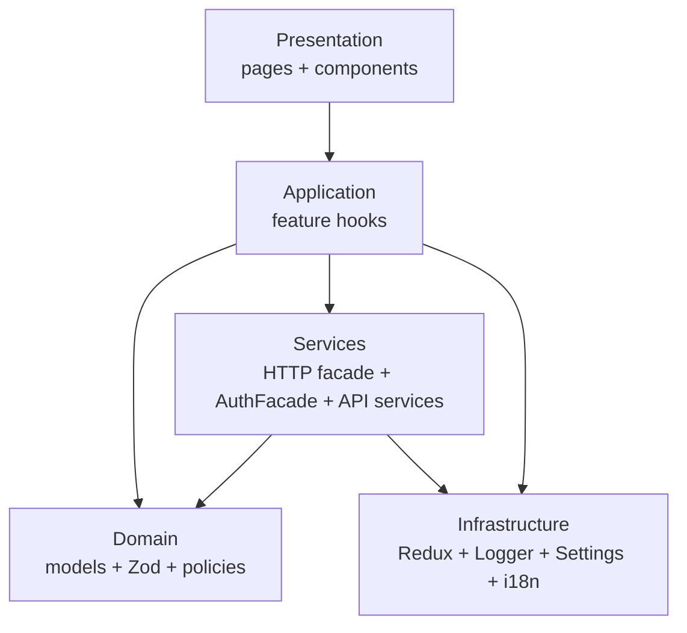
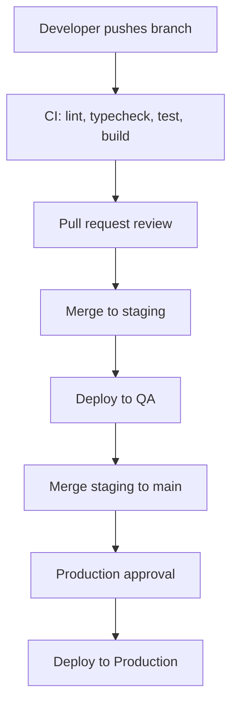
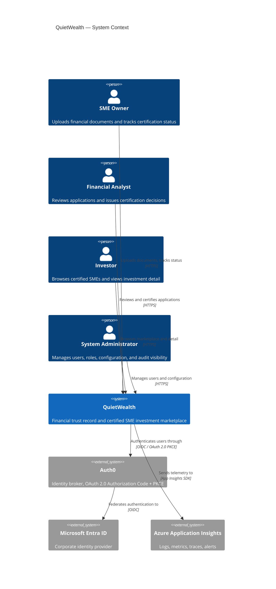
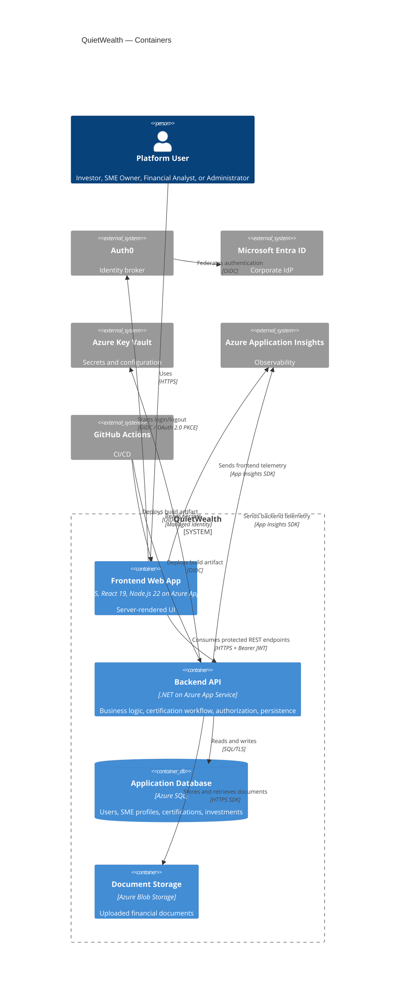
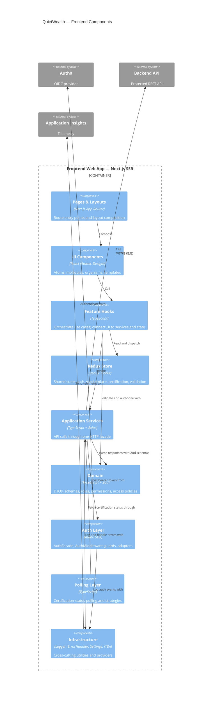

# QuietWealth

## Problem Statement

SMEs spend weeks proving their financial health before they can raise capital. The paperwork is slow, the criteria are inconsistent, and investors have no quick way to tell a healthy company from a risky one. QuietWealth shortens that loop: SMEs upload their financials, financial analysts certify them, and investors browse a marketplace of companies whose numbers have already been checked. Every certified profile is backed by a trust record built from validated documents and standardized financial conditions.

The core problem lies in the absence of a transparent, unified platform where financial trust can be established programmatically, enabling investors and SMEs to connect through certified, validated data.


## Authors

- Daniel Pulido  
- Juan Pablo Cambronero


# 1. Frontend Design

## 1.1 Technology stack

- Application Type: SPA Web App (SSR)
- Web Framework: Next.js version 15
- UI Library: React version 19.2
- Web server: NodeJS version 22 (LTS)
- Coding Language: TypeScript 5.9.3
- Styling Framework: TailwindCSS 4.1
- State Management: Redux Toolkit 2.8
- Data Validations: Zod 4.3.6
- HTTP Client: Axios 1.9
- Authentication: Auth0 React SDK 2.2 (OAuth 2.0 Authorization Code + PKCE)
- Unit Testing: Jest version 30.2.0
- Integration Testing: Playwright version 1.52
- Code Prettier Framework: Prettier 3.8.1
- Code Style Framework: ESLint 10.0.2
- Code Automation Tasks Tool: Husky 9.1.7
- Cloud Service: Azure
- Hosted Services with the Cloud Service: Azure App Service
- Code Repositories Service: GitHub
- CI/CD Pipeline Technology: GitHub Actions
- Environments: Development, Stage and Production
- Observability Framework: Azure Application Insights SDK


## 1.2 UX UI analysis

### 1.2.1 Core Business Process

#### Login
1. User opens QuietWealth and reaches the authentication screen
2. System redirects to Microsoft authentication via Auth0
3. User enters corporate Microsoft credentials
4. On failure, an error message is shown and the user is prompted to retry
5. On success, a session is created and the user is redirected to the Marketplace

#### Browse the Marketplace
1. User lands on the Marketplace — a list of certified SMEs available for investment
2. User can search by company name
3. User can filter by sector (Technology, Energy, Commerce) or trust level
4. Each SME card shows: certification status, growth %, total capital raised, and active investor count
5. User clicks **Ver Detalles** to open the full investment profile

#### Upload Financial Documents
1. User navigates to **Cargar Documentos** from the sidebar
2. A progress tracker shows the current stage: `Información Cargada → En Revisión por Expertos → Certificación Emitida`
3. User drags and drops files or clicks **Seleccionar Archivos**
4. Accepted formats: PDF, DOC, XLS, and image files up to 10 MB each
5. Uploaded documents are queued automatically for expert review

#### Expert Validation Panel
1. Financial expert navigates to **Panel de Validación**
2. System lists pending certification requests: ID, company, sector, submission date, and status
3. Expert clicks **Revisar** to open a request
4. Expert reviews documents and financial data
5. Expert issues a certification decision, updating the SME's trust status

#### Investment Detail
1. From the Marketplace, user clicks **Ver Detalles** on an SME card
2. System shows key financial metrics: Total Raised, Active Investors, Growth Rate, and Average ROI
3. User can scroll to view charts: Income Growth, Investor Growth, and Accumulated Capital Over Time
4. Additional metrics are displayed: retention rate, MRR, and profit margin
5. User can click **Invertir Ahora** to initiate the investment flow

#### Logout
1. User selects logout
2. System invalidates the active JWT
3. Session is terminated and user is redirected to Login


### 1.2.2 Wireframes

#### Login Screen
Microsoft-authenticated entry point.


#### Marketplace Screen
Lists certified SMEs with financial metrics and trust indicators.


#### Document Upload Screen
Allows SMEs to submit financial documents for expert review.


#### Expert Validation Panel Screen
Enables financial experts to review and certify pending applications.


#### Investment Detail Screen
Shows verified SME financials, growth charts, and expert certifications.


#### Logout Screen
Session is invalidated and user is redirected to login.


### 1.2.3 UX Test Results

A usability test was conducted using Maze to validate the proposed wireframes of the QuietWealth system. The test was shared remotely via URL with 6 participants, targeting the **Investment Detail Screen** — the most data-dense view.

#### Test Objective
Evaluate user ability to:
- Navigate the investment detail view
- Interpret financial metrics and trust indicators
- Identify the certification status of an SME
- Initiate an investment action

#### Tasks Executed

| Task | Description |
|------|------------|
| Task 1 - Login | User authenticates through Microsoft via Auth0 |
| Task 2 - Browse Marketplace | User navigates the list of certified SMEs |
| Task 3 - View Investment Detail | User opens an SME's financial profile |
| Task 4 - Upload Documents | User submits financial documents for review |
| Task 5 - Logout | User ends the session |

#### Participants

| Participant | Duration | OS | Browser | Score (1–5) | Feedback |
|---|---|---|---|---|---|
| 542521286 | 49 s | Windows | Chrome | 4 | "Considero que la información mostrada es clara." |
| 510669335 | 42 s | Windows | Chrome | 5 | "Esta bien" |
| 543901432 | 17.8 s | Windows | Brave | 4 | "all good" |
| 508804036 | 70.1 s | Windows | Edge | 5 | "." |
| 542802936 | 99.5 s | Windows | Edge | 5 | "Anuncios de invierta ahora no deberían de aparecer en la aplicación como tal, solo en una web." |
| 537502878 | 50.1 s | Linux | Firefox | 5 | "Muy detallada y presentable, no mejoraría nada." |
| **Average** | **54.8 s** | — | — | **4.7 / 5** | — |

#### Key Metrics (Maze)

#### Overall Performance

| Metric | Value | Interpretation |
|--------|------|----------------|
| Completion Rate | 100% | All users successfully completed all tasks |
| Success Rate | 100% | No task failures occurred |
| Average Time on Task | 54.8 seconds | Tasks were completed efficiently |
| Average Score | 4.7 / 5 | High user satisfaction across all participants |

#### Findings

- All participants successfully completed every task, indicating a clear and understandable user flow.
- The **Invertir Ahora** CTA felt too prominent for one participant, who noted it suits an external website better than an internal platform.
- All other interactions showed high clarity in navigation and actions.
- The financial metrics and certification status were considered clear and well presented.
- The review and logout flows were intuitive and required minimal effort.

#### Observations

- Users understood the platform flow without guidance.
- The interface provided clear feedback during each step of the process.
- The Investment Detail screen may benefit from reducing the visual weight of the primary CTA.

#### Heatmaps — Investment Detail Screen


#### Issues and Corrections

| # | Screen | Issue | Severity |
|---|---|---|---|
| 1 | Investment Detail | The **Invertir Ahora** CTA felt too prominent; one participant noted it suits an external website better than an internal platform. | Medium |

| # | Issue | Correction | Decision Criteria |
|---|---|---|---|
| 1 | CTA felt intrusive inside the platform | Reduced visual weight of the button in the Investment Detail screen | Keeps the platform focused on trust and information rather than aggressive selling |


## 1.3 Component design strategy

### 1.3.1 Components
The frontend follows an atomic design for component architecture.

### 1.3.2 Component Hierarchy
[Components](/app/components)

Current component implementation uses 5 atomic UI layers plus shared support modules:
```
app/
 ├ components/
 │   ├ atoms/
 │   ├ molecules/
 │   ├ organisms/
 │   ├ templates/
 │   ├ pages/
 │   ├ hooks/
 │   ├ i18n/
 │   └ styles/
```

### 1.3.3 Component Categories

#### [Atoms](/app/components/atoms)
Reusable low-level UI components (no business logic)

- Must be pure UI
- No API calls
- No business logic
- Only accept props
- Must support theme tokens

```
Button
Badge
Input
Label
Spinner
ProgressBar
TrustIndicator
StatCard
MaskedValue
```

Example usage:
```TypeScript
<Button variant="primary" size="md" onClick={onViewDetails}>
  {t("marketplace.viewDetails")}
</Button>
```

#### [Molecules](/app/components/molecules)
Built from primitives

- Combine primitives
- Handle UI logic
- No API calls directly
- Data passed via props

```
SMECard
FilterBar
DocumentUploader
FormField
StatusBadge
InfoBanner
```

Example:
```
SMECard
 ├ TrustIndicator
 ├ StatCard
 └ Button
```

#### [Organisms](/app/components/organisms)
Components responsible for larger layout composition and section structure.

- Must not contain business logic
- Responsible only for layout composition

```
MarketplaceGrid
InvestmentDetailPanel
ValidationQueue
DocumentUploadZone
Navbar
Sidebar
```

Example:
```
InvestmentDetailPanel
 ├ StatCard
 ├ TrustIndicator
 └ MaskedValue
```

#### [Templates](/app/components/templates)
Layout shells

- Wrap authenticated and public route layouts
- Do not contain feature logic

```
AuthenticatedLayout
PublicLayout
```

#### [Pages](/app/components/pages)
Feature-specific components tied to a business process.

- Coordinate business logic through hooks, which interact with services
- Manage state
- Compose composites + layouts
- Are mounted by route definitions via Next.js App Router

```
LoginPage
MarketplacePage
InvestmentDetailPage
DocumentUploadPage
ExpertValidationPage
```

### 1.3.4 Component Reuse Strategy

Before creating a new component, developers must:
1. Search in [Atoms](/app/components/atoms)
2. Search in [Molecules](/app/components/molecules)

If a similar component exists, extend it by adding props, variants, or composition instead of duplicating code.

Components must be configurable using props instead of duplication.

```
<Button variant="primary" />
<Button variant="secondary" />
<Button variant="danger" />
```

#### [Hooks](/app/components/hooks)
Components use hooks for business logic.

Example:
```
useApplicationServices()
useAuth()
useMarketplace()
useDocumentUpload()
useCertificationProgress()
useExpertValidation()
useInvestmentDetail()
usePermissions()
usePolicies()
useSession()
```

Hooks use [Services](/app/services), [Auth](/app/auth/AuthFacade.ts), and [State](/app/state) for orchestration:

Example:
```
applicationFacade.ts
CertificationPollingManager.ts
```

### 1.3.5 [Styles](/app/components/styles)
All visual styles must be centralized using design tokens in [tokens.ts](/app/components/styles/tokens.ts)

Example:
```TypeScript
export const colors = {
  primary:    "#0D1F3C", // navy — headings, navbar
  accent:     "#1AACA8", // teal — CTAs, active states
  gold:       "#C8972B", // gold — certified badges, trust scores
  background: "#F5F7FA",
  surface:    "#FFFFFF",
  success:    "#22C55E",
  warning:    "#F59E0B",
  error:      "#EF4444",
};

export const spacing = {
  sm: "8px",
  md: "16px",
  lg: "24px",
}

export const radius = {
  sm: "4px",
  md: "8px",
  lg: "12px"
}
```

#### [Theme](/app/components/styles/theme.ts)
How do I switch dark/light mode? How do I add a new theme?

Example:
```TypeScript
export const theme = {
  colors,
  spacing,
  radius,
  typography: {
    fontFamily: "Inter, sans-serif",
    headingWeight: 600
  }
}
```

#### Styling rules
Developers must:
- Use tokens
- Avoid hardcoded colors
- Prefer token-based class names/CSS variables for visual styling
- Use inline styles only for temporary layout scaffolding

Correct:
```TypeScript
<Button className="bg-[var(--color-primary)] text-[var(--color-surface)]" />
```
Incorrect:
```TypeScript
<Button style={{ background: "#0D1F3C" }} />
```

Certification status is communicated with both a color and a text label, never color alone: certified uses gold with a check, pending uses warning with a clock, rejected uses error with an X.

### 1.3.6 Internationalization Strategy
All text must be externalized.

#### [i18n](/app/components/i18n)
Insert new languages in this folder:
- [es](/app/components/i18n/es.json)
- [en](/app/components/i18n/en.json)

Example:
```JSON
{
  "marketplace.title": "Marketplace",
  "marketplace.filter.sector": "Sector",
  "marketplace.viewDetails": "Ver Detalles",
  "sme.growth": "Crecimiento"
}
```

#### Usage rule
Components must not contain literal text.

Incorrect:
```TypeScript
<h1>Marketplace</h1>
```

Correct:
```TypeScript
<h1>{t("marketplace.title")}</h1>
```

#### Translation hook
Developers must use `react-i18next`.

Example:
```TypeScript
const { t } = useTranslation()
```

### 1.3.7 Responsiveness Strategy
Responsiveness must be centralized using breakpoint tokens in [breakpoints.ts](/app/components/styles/breakpoints.ts)

Example:
```TypeScript
export const breakpoints = {
  mobile: 480,
  tablet: 768,
  desktop: 1200
}
```

#### Responsive rules
Developers must:
- Use flex/grid layouts
- Avoid fixed widths
- Use responsive utilities (`sm:`, `md:`, `lg:` Tailwind prefixes)

| Device | Marketplace | Investment Detail | Navigation |
|--------|-------------|-------------------|------------|
| Mobile | Single column | Single column | Hamburger menu |
| Tablet | 2-column grid | Metrics beside charts | Collapsed sidebar |
| Desktop | 3-column grid | Full dual panel | Full sidebar |

### 1.3.8 Testing Requirements for Components
Each component must include tests.

#### Unit tests (Jest)
| Folder | Covers |
|---|---|
| `app/__tests__/unit/auth/` | `AuthFacade`, guards, permission helpers, `MicrosoftProfileAdapter` |
| `app/__tests__/unit/polling/` | `PollingOrchestrator` transitions, both strategies, terminal states |
| `app/__tests__/unit/services/` | Services with a mocked `HttpClientFacade` |
| `app/__tests__/unit/validation/` | Zod schemas — valid payloads pass, invalid ones fail with the expected shape |

Statement coverage holds at or above 80% on `app/auth/**`, `app/polling/**`, `app/services/**`, and `app/validation/**`, enforced as a CI gate.

Example tests:
- Button renders correctly
- Button shows loading state
- Button triggers click handler

#### Integration tests (Playwright)

Required flows:
| Flow | File |
|---|---|
| Login | `login.spec.ts` |
| Marketplace | `marketplace.spec.ts` |
| Document upload | `document-upload.spec.ts` |
| Expert validation | `expert-validation.spec.ts` |

#### Performance Guidelines
Developers must:
- Use `React.memo` for heavy components
- Use `lazy()` for feature modules
- Avoid unnecessary re-renders

Examples:

```tsx
import { memo } from "react";

export const SMECard = memo(function SMECard({ sme }: SMECardProps) {
  return (
    <article data-testid="sme-card">
      <TrustIndicator level={sme.certificationStatus} />
      <StatCard label={t("sme.growth")} value={formatPercent(sme.growthRate)} />
    </article>
  );
});
```

```tsx
import { lazy, Suspense } from "react";

const MarketplacePage = lazy(() => import("@/components/pages/MarketplacePage"));
const InvestmentDetailPage = lazy(() => import("@/components/pages/InvestmentDetailPage"));

export function AppRoutes() {
  return (
    <Suspense fallback={<Spinner />}>
      <MarketplacePage />
      <InvestmentDetailPage />
    </Suspense>
  );
}
```

## 1.4 Security

### 1.4.1 Technologies
- Auth0 React SDK (OAuth 2.0 Authorization Code + PKCE)
- Microsoft Entra ID (corporate IdP via Auth0 federation)
- Zod (runtime validation)
- Axios via `HttpClientFacade`
- JWT bearer tokens for protected API requests

### 1.4.2 Authentication
Uses Auth0 federated with Microsoft Entra ID.

1. User selects "Continue with Microsoft".
2. `AuthFacade.login()` starts Auth0 Universal Login (Authorization Code + PKCE).
3. Entra ID authenticates the user.
4. Auth0 returns tokens to the callback.
5. `MicrosoftProfileAdapter` normalizes raw claims into a `UserSessionDTO`.
6. Session is held in memory only (`authSlice` in Redux).
7. Protected API calls attach the access token through the HTTP interceptor.

```TypeScript
// app/auth/AuthFacade.ts
export class AuthFacade {
  async login(): Promise<void> { /* starts Auth0 PKCE flow */ }
  async logout(): Promise<void> { /* terminates session */ }
  async getAccessToken(): Promise<string> { /* silent refresh */ }
  getSession(): UserSessionDTO { /* returns in-memory session */ }
}
export const authFacade = AuthFacade.getInstance();
```

Access tokens stay in memory (Redux); the refresh token sits in an `HttpOnly`, `Secure`, `SameSite=Strict` cookie that JavaScript cannot read. MFA is enforced for all roles through Auth0 Adaptive MFA.

### 1.4.3 Authorization

#### 1.4.3.1 Roles
Roles are found in [roles.ts](/app/auth/policies/roles.ts)

| Code | Description |
|---|---|
| `investor` | Can browse the marketplace, view investment detail, and initiate investments |
| `sme_owner` | Can upload financial documents and track certification status |
| `financial_analyst` | Can review pending applications and issue certification decisions |
| `sys_admin` | Full access to the platform, including user, role, and audit administration |

#### 1.4.3.2 Permissions
Permissions are found in [permissions.ts](/app/auth/policies/permissions.ts)

**Permission Catalog**
| Code | Description |
|---|---|
| `marketplace.browse` | User can view and filter the list of certified SMEs |
| `investment.detail.view` | User can open an SME's full investment profile |
| `investment.initiate` | User can initiate an investment action |
| `documents.upload` | User can upload financial documents for review |
| `documents.status.read` | User can view upload and certification status |
| `validation.queue.read` | Financial analyst can view pending certification requests |
| `validation.certify` | Financial analyst can issue certification decisions |
| `audit_log.read` | Admin can view the full system audit log |

#### 1.4.3.3 Role-Permission Mapping
Role to permissions mapping is found in [rolePermissions.ts](/app/auth/policies/rolePermissions.ts)

| Role | Permissions |
|---|---|
| `investor` | `marketplace.browse`, `investment.detail.view`, `investment.initiate` |
| `sme_owner` | `marketplace.browse`, `documents.upload`, `documents.status.read` |
| `financial_analyst` | `marketplace.browse`, `investment.detail.view`, `validation.queue.read`, `validation.certify` |
| `sys_admin` | All permissions |

#### 1.4.3.4 Access Policies
Access Policies are found in [accessPolicy.ts](/app/auth/policies/accessPolicy.ts)

| Policy | Required Permissions | Description |
|---|---|---|
| `canBrowseMarketplace` | `marketplace.browse` | Allows access to the SME listing screen |
| `canViewInvestmentDetail` | `investment.detail.view` | Allows opening an SME's full financial profile |
| `canInitiateInvestment` | `investment.initiate` | Allows starting the investment flow |
| `canUploadDocuments` | `documents.upload` | Allows submitting documents for certification |
| `canReadDocumentStatus` | `documents.status.read` | Allows tracking upload and certification progress |
| `canViewValidationQueue` | `validation.queue.read` | Allows financial analysts to view pending requests |
| `canCertifySME` | `validation.certify` | Allows issuing a certification decision |
| `canReadAuditLog` | `audit_log.read` | Allows access to the full audit log |

#### 1.4.3.5 Routing Protection
This project has three methods of routing protection.

**[AuthGuard.tsx](/app/auth/guards/AuthGuard.tsx)**

Use this guard to prevent unauthenticated access to specific routes.

Example usage:
```TypeScript
<AuthGuard>
  <AuthenticatedLayout>
    <MarketplacePage />
  </AuthenticatedLayout>
</AuthGuard>
```

**[GuestGuard.tsx](/app/auth/guards/GuestGuard.tsx)**

Use this guard to prevent authenticated users accessing unauthenticated sites.

Example usage:
```TypeScript
<GuestGuard>
  <LoginPage />
</GuestGuard>
```

**[PolicyGuard.tsx](/app/auth/guards/PolicyGuard.tsx)**

Use this guard when an entire route or page requires a specific access policy.

Example usage:
```TypeScript
<AuthGuard>
  <PolicyGuard required={accessPolicy.canCertifySME}>
    <ExpertValidationPage />
  </PolicyGuard>
</AuthGuard>
```

#### 1.4.3.6 Usage
Developers must never write:
```TypeScript
if (user.role === "financial_analyst")
```
directly inside pages or components. Instead they should use:
```TypeScript
const { hasAccess } = usePolicies();

{hasAccess("canCertifySME") && <CertifyButton />}
```

**hasAccess** — use when the user must have all permissions required by the policy (default for most actions).

**hasSomeAccess** — use when a screen can still provide value with partial access (dashboards with optional widgets).

**getMissingPermissions(policyName)** — use when the UI needs to explain why access is denied.

**To add additional roles/permissions:**

1. Add role definition in [roles.ts](/app/auth/policies/roles.ts)
2. Add permission in [permissions.ts](/app/auth/policies/permissions.ts)
3. Map policy to permissions in [accessPolicy.ts](/app/auth/policies/accessPolicy.ts)

### 1.4.4 API Communication

#### Centralized API Client
[client.ts](/app/services/client.ts)

#### HTTP Interceptors
[httpInterceptors.ts](/app/services/httpInterceptors.ts)

### 1.4.5 Storage Rules

**Allowed storage**
- UI preferences
- Selected language
- Theme
- Non-sensitive temporary UI state

**Forbidden storage**
- Access tokens
- Refresh tokens
- Passwords
- Raw permission payloads if sensitive

**Preferred storage model**
- Access token stored in memory (Redux `authSlice`)
- Refresh token in `HttpOnly`, `Secure`, `SameSite=Strict` cookie
- Frontend session state kept in memory through `SessionProvider`

**Enforcement**
- Keep authentication credentials out of `localStorage` and `sessionStorage` — enforced by ESLint ban rule.
- Clear in-memory session data on logout and on 401 responses.
- Review pull requests for any usage of `localStorage` or `sessionStorage` with token-shaped keys.

### 1.4.6 Logout
Responsibilities:
- Call `AuthFacade.logout()`
- Clear Redux `authSlice` session
- Clear in-memory session data
- Redirect to login

[useAuth.ts](/app/components/hooks/useAuth.ts)

### 1.4.7 Session Expiration

When the backend returns 401 Unauthorized:
- HTTP interceptor detects it
- Silent token refresh is attempted via `getAccessTokenSilently()`
- If refresh fails, `sessionManager.handleUnauthorized()` clears the session
- User is redirected to login with a session-expired message

## 1.5 Layered design

The frontend uses a five-layer architecture with clear responsibilities and downward-only dependencies.

**Layer 1 — Presentation:** Pages and components render data and capture input. They do not call APIs directly. Next.js App Router and route guards protect navigation.

**Layer 2 — Application:** Hooks orchestrate use cases end to end. Standard flow: validate input → call service → dispatch Redux actions.

**Layer 3 — Domain Logic:** Zod schemas validate every API response. Permission checks use `usePolicies()`, not direct role comparisons. Policies define roles and permissions.

**Layer 4 — Services:** `HttpClientFacade` and `AuthFacade` are the only network entry points. Services call the backend and Auth0; they render no UI.

**Layer 5 — Infrastructure:** Shared foundation: Redux store, `SessionProvider`, design tokens, i18n, observability utilities.

**Folder mapping:**

| Folder | Layer | Purpose |
|--------|-------|---------|
| `app/components/pages/`, `app/**/page.tsx` | Layer 1 | Route entry points and feature screens |
| `app/components/atoms/`, `molecules/`, `organisms/`, `templates/` | Layer 1 | Atomic UI components |
| `app/components/hooks/` | Layer 2 | Application orchestration hooks |
| `app/models/`, `app/validation/`, `app/auth/policies/` | Layer 3 | Domain types, Zod schemas, access policies |
| `app/services/`, `app/auth/AuthFacade.ts` | Layer 4 | HTTP facade, auth service, interceptors |
| `app/state/`, `app/utils/`, `app/settings/`, `app/components/i18n/`, `app/components/styles/` | Layer 5 | Redux store, logger, settings, i18n, tokens |

**Dependency rules:**
- Presentation can only call Application (hooks) and Infrastructure.
- Application can call Domain Logic, Services, and Infrastructure.
- Domain Logic can only use Infrastructure.
- Services can only use Infrastructure.
- **No layer may call upward.**



**Example: Login flow**

`LoginPage` → `useAuth().login()` → `AuthFacade.login()` (Auth0 PKCE) → `MicrosoftProfileAdapter.adapt()` → `UserSessionDTO` → `SessionManager.setSession()` → Redux `authSlice` update.

**Example: Certification polling flow**

`DocumentUploadPage` → `useCertificationProgress()` subscription → `CertificationPollingManager.startPolling()` → `PollingOrchestrator` → `GET /api/trust-record-applications/{id}/status` → `certificationPollingStore.patchState()` → UI update.

## 1.6 Design patterns

### Singleton
The following classes currently use the singleton pattern:
- [logger.ts](/app/utils/logger.ts) — `Logger`
- [error-handler.ts](/app/utils/error-handler.ts) — `ExceptionHandler`
- [AuthFacade.ts](/app/auth/AuthFacade.ts) — `AuthFacade`
- [sessionManager.ts](/app/state/sessionManager.ts) — `SessionManager`
- [certificationPollingStore.ts](/app/state/certificationPollingStore.ts) — `CertificationPollingStore`
- [certificationPollingManager.ts](/app/state/certificationPollingManager.ts) — `CertificationPollingManager`
- [applicationFacade.ts](/app/services/applicationFacade.ts) — `ApplicationServiceFacade`

#### When to apply here
Apply only if all are true:
1. One shared instance is desired app-wide.
2. Behavior must stay consistent across all consumers.
3. Class should not be recreated with different runtime config per feature.

#### Do not apply here
Skip singleton for:
- Error objects (`*Error` classes): create per error event.
- React components: React manages lifecycle.
- Per-operation objects with internal mutable buffers (e.g. report formatters).

#### Implementation recipe

```ts
export class MyService {
  private static instance: MyService | null = null;

  static getInstance() {
    if (!MyService.instance) {
      MyService.instance = new MyService();
    }
    return MyService.instance;
  }

  private constructor() {}
}

export const myService = MyService.getInstance();
```

Example — Logger singleton:
```ts
export class Logger {
  private static instance: Logger | null = null;
  static getInstance(): Logger {
    if (!Logger.instance) Logger.instance = new Logger();
    return Logger.instance;
  }
  private constructor() {}
}
export const logger = Logger.getInstance();
```

### Observer
Use these files as the canonical pattern:
- [certification.types.ts](/app/state/certification.types.ts)
- [certificationPollingStore.ts](/app/state/certificationPollingStore.ts)
- [certificationPollingManager.ts](/app/state/certificationPollingManager.ts)
- [useCertificationProgress.ts](/app/components/hooks/useCertificationProgress.ts)

#### 1) State Contract (`*.types.ts`)
Define progress phases, run state (`idle`, `running`, `completed`, etc.), progress snapshot shape, and `createInitial...State()` factory.

#### 2) Observable Store (`*Store.ts`)
Must expose: `getState()`, `subscribe(listener) => unsubscribe`, `patchState(partial)`, `reset()`.

Rule: listeners stored in a `Set`; `subscribe` must emit current state immediately.

#### 3) Manager/Publisher (`*Manager.ts`)
Must expose: `startPolling()`, `stopPolling()`, `subscribe(...)` pass-through, `getSnapshot()` pass-through.

#### 4) Subscriber Hook
```ts
function useCertificationProgress() {
  const [state, setState] = useState(() => certificationPollingManager.getSnapshot());
  useEffect(() => certificationPollingManager.subscribe(setState), []);
  return state;
}
```

#### Agent Copy Template

```ts
// store
class XStore {
  private listeners = new Set<Listener<XState>>();
  private state: XState = createInitialXState();
  getState() { return this.state; }
  subscribe(listener: Listener<XState>) {
    this.listeners.add(listener);
    listener(this.state);
    return () => this.listeners.delete(listener);
  }
  patchState(partial: Partial<XState>) {
    this.state = { ...this.state, ...partial };
    for (const listener of this.listeners) listener(this.state);
  }
}
```

### Proxy — Auth Middleware
- [AuthFacade.ts](/app/auth/AuthFacade.ts)
- [AuthMiddleware.ts](/app/auth/AuthMiddleware.ts)
- [client.ts](/app/services/client.ts)

`AuthMiddleware` sits between services and the raw HTTP client, attaching the bearer token and handling 401 cases. Services call `HttpClientFacade` and never attach tokens themselves.

```ts
class AuthMiddleware {
  // <<Proxy>>
  async intercept(request: Request): Promise<Request> { /* attaches token */ }
  private async refreshTokenIfExpired(): Promise<void> { /* silent refresh */ }
  private handleUnauthorized(): void { /* clears session, redirects */ }
}
```

### Facade Pattern (Hooks → Auth + HTTP)
Expose a single service access surface for hooks while keeping auth and HTTP implementation details behind facades.

#### Files to keep aligned
- [client.ts](/app/services/client.ts)
- [AuthFacade.ts](/app/auth/AuthFacade.ts)
- [applicationFacade.ts](/app/services/applicationFacade.ts)
- [useApplicationServices.ts](/app/components/hooks/useApplicationServices.ts)

#### Contracts

HTTP facade contract:
```ts
export interface HttpClientFacade {
  get<T>(url: string, schema: ZodSchema<T>): Promise<T>;
  post<T>(url: string, body: unknown, schema: ZodSchema<T>): Promise<T>;
}
```

Auth facade contract:
```ts
export interface AuthFacade {
  login(): Promise<void>;
  logout(): Promise<void>;
  getAccessToken(): Promise<string>;
  getSession(): UserSessionDTO;
}
```

App facade contract:
```ts
export interface ApplicationServiceFacade {
  readonly auth: AuthFacade;
  readonly http: HttpClientFacade;
  readonly marketplace: MarketplaceService;
  readonly trustRecord: TrustRecordService;
}
```

#### Checklist for New Agents
- Hooks import only `useApplicationServices` for service access.
- `AuthFacade` is the only Auth0 entry point.
- `HttpClientFacade` is the only Axios/fetch entry point.
- New features are added by extending facades, not by importing Auth0 or Axios directly in hooks.

### Strategy — Polling Interval Selection
[IPollingStrategy.ts](/app/polling/strategies/IPollingStrategy.ts), [FixedIntervalStrategy.ts](/app/polling/strategies/FixedIntervalStrategy.ts), [ExponentialBackoffStrategy.ts](/app/polling/strategies/ExponentialBackoffStrategy.ts), [PollingOrchestrator.ts](/app/polling/PollingOrchestrator.ts)

```ts
interface IPollingStrategy {
  getInterval(attempt: number): number;
}
class FixedIntervalStrategy implements IPollingStrategy {
  getInterval() { return 10_000; } // 10 s
}
class ExponentialBackoffStrategy implements IPollingStrategy {
  getInterval(attempt: number) { return Math.min(10_000 * 2 ** attempt, 60_000); }
}
```

### Queue-based logging — Auth Audit Events
[AuthAuditQueue.ts](/app/auth/AuthAuditQueue.ts)

Auth events (login, logout, refresh, permission denial) are enqueued and flushed asynchronously to Application Insights, avoiding latency during authentication.

```ts
class AuthAuditQueue {
  private queue: AuthEvent[] = [];
  enqueue(event: AuthEvent): void { /* add to queue */ }
  private async flush(): Promise<void> { /* send to App Insights */ }
}
```

### Not implemented (pending)
- **Adapter** for normalizing heterogeneous SME financial data from different API providers into a unified `SMEProfile` domain model.
- **Strategy** for document upload validation per file type (PDF, XLS, DOC, image) with type-specific size and MIME checks.

## 1.7 src folder

The `/app` folder contains the application scaffold organized by architectural layers and functional domains, following the 5-layer architecture specified in sections 1.1 to 1.6.

```txt
app/
├── layout.tsx · page.tsx · globals.css
├── login/page.tsx
├── marketplace/page.tsx
├── marketplace/[id]/page.tsx
├── documents/page.tsx
├── validation/page.tsx
├── admin/page.tsx
│
├── components/
│   ├── atoms/        Button, Badge, Input, Label, Spinner, ProgressBar,
│   │                 TrustIndicator, StatCard, MaskedValue
│   ├── molecules/    SMECard, FilterBar, DocumentUploader, FormField,
│   │                 StatusBadge, InfoBanner
│   ├── organisms/    MarketplaceGrid, InvestmentDetailPanel, ValidationQueue,
│   │                 DocumentUploadZone, Navbar, Sidebar
│   ├── templates/    AuthenticatedLayout, PublicLayout
│   ├── pages/        LoginPage, MarketplacePage, InvestmentDetailPage,
│   │                 DocumentUploadPage, ExpertValidationPage
│   ├── hooks/        useApplicationServices, useAuth, useMarketplace,
│   │                 useDocumentUpload, useCertificationProgress,
│   │                 useExpertValidation, useInvestmentDetail,
│   │                 usePermissions, usePolicies, useSession
│   ├── i18n/         config.ts, I18nProvider.tsx, en.json, es.json
│   └── styles/       tokens.ts, theme.ts, breakpoints.ts, globals.css, ThemeProvider.tsx
│
├── auth/
│   ├── AuthFacade.ts · AuthMiddleware.ts · AuthAuditQueue.ts · authConfig.ts
│   ├── adapters/     MicrosoftProfileAdapter.ts
│   ├── guards/       AuthGuard.tsx, GuestGuard.tsx, PolicyGuard.tsx
│   └── policies/     roles.ts, permissions.ts, rolePermissions.ts, accessPolicy.ts
│
├── polling/
│   ├── PollingOrchestrator.ts
│   └── strategies/   IPollingStrategy.ts, FixedIntervalStrategy.ts, ExponentialBackoffStrategy.ts
│
├── services/         applicationFacade.ts, client.ts, httpInterceptors.ts,
│                     MarketplaceService.ts, TrustRecordService.ts,
│                     ExpertValidationService.ts, InvestmentService.ts
│
├── state/
│   ├── certification.types.ts, certificationPollingStore.ts, certificationPollingManager.ts
│   ├── session.types.ts, sessionManager.ts, SessionProvider.tsx
│   ├── StoreProvider.tsx, store.ts, hooks.ts
│   └── slices/       authSlice.ts, marketplaceSlice.ts, certificationSlice.ts, validationSlice.ts
│
├── contracts/        openapi.json, openapi.example.json
├── models/           api.types.ts (generated), SME.ts, TrustRecord.ts, DocumentUpload.ts, …
├── validation/       documentUploadSchema.ts, smeSchema.ts, trustRecordSchema.ts, userSchema.ts, index.ts
├── settings/         Settings.ts
├── utils/            logger.ts, error-handler.ts, eventBus.ts, schemaValidator.ts, constants.ts, formatters.ts
├── assets/logo/      logo-dark.svg, logo-light.svg
├── __tests__/        setup.ts, unit/, e2e/, fixtures/, mocks/
│
├── next.config.ts · tailwind.config.ts · tsconfig.json
├── jest.config.ts · playwright.config.ts · package.json
├── .env.example · .eslintrc.json · .prettierrc · .lintstagedrc.json
└── .husky/pre-commit
```

# 2. Backend Design

## Technology Stack
- API style: REST API over HTTPS
- API specification standard: OpenAPI
- API documentation tooling: Swagger / OpenAPI for contract publication and validation
- Backend framework and language: .NET on Azure App Service
- Database: Azure SQL Database
- File storage: Azure Blob Storage
- Identity provider: Auth0 federated with Microsoft Entra ID
- Code quality: `dotnet format` and built-in .NET analyzers
- Testing: xUnit for unit and integration tests
- Services:
  - Authentication service (Auth0/Entra ID)
  - SME profile and document upload service
  - Certification workflow service
  - Investment service
  - Notification service
  - Result download service

## Security
- Transport security: HTTPS enforced at Azure API Management for all public endpoints
- Authentication:
  - Auth0 Authorization Code + PKCE with Microsoft Entra ID federation
  - After successful authentication, the backend validates the JWT issued by Auth0
  - JWT signing algorithm: RS256
  - JWT tokens are required for all protected endpoints
- Encryption at rest:
  - Azure SQL Database uses Transparent Data Encryption (TDE) with service-managed keys
- Request payload limits:
  - General API payload limit: 10 MB per file
  - Accepted formats: PDF, DOC, XLS, and image files
  - Requests above these limits must be rejected with a clear validation error
- Rate limiting at Azure API Management:
  - Maximum concurrent connections per authenticated client: 10
  - Request rate limit per authenticated client: 60 requests per minute
- Data retention and archiving:
  - Production operational data and generated files remain in the active environment for the retention period defined by compliance requirements
  - After the retention period, records are moved to archive tier for audit and traceability purposes

## Observability
- Telemetry platform: Azure Application Insights, aligned with the frontend for unified end-to-end telemetry
- Dashboard and analysis tool: Azure Monitor
- Logged backend events:
  - AuthLoginRequested
  - AuthLoginSucceeded
  - AuthLoginFailed
  - UserLoggedOut
  - DocumentsUploadStarted
  - DocumentsUploadCompleted
  - DocumentsUploadRejected
  - CertificationRequested
  - CertificationStarted
  - CertificationCompleted
  - CertificationFailed
  - ValidationDecisionIssued
  - InvestmentDetailViewed
  - ArtifactDownloaded
  - ApiRequestFailed
  - ContractViolationError
  - UnhandledExceptionCaptured
- Progress polling guideline: do not log every frontend polling request; log only meaningful status transitions and exceptional progress-check failures

### Operational metrics (required)
- Latency metrics: at minimum P95/P99 per API endpoint and critical business flow
- Error metrics: request error rate (4xx/5xx), dependency failure rate, and timeout rate
- Saturation metrics: CPU/memory utilization and worker concurrency saturation
- Monitoring stack: Azure Monitor + Azure Application Insights

### Application observability patterns (required)
- Health checks: implement `liveness` and `readiness` endpoints
- Correlation IDs: propagate a single correlation ID across all services, logs, traces, and domain events
- SLIs defined from design: availability and latency SLIs must be defined at architecture stage for each critical user flow

## Infrastructure (DevOps)

### CI/CD orchestration tool
- Standard tool: **GitHub Actions** (single CI/CD control plane from this monorepo)
- Rationale: repository-native workflows, PR checks, environments, approvals, and strong Azure integration via OIDC

### Infrastructure as Code (IaC)
- Standard tool: **Terraform** for provisioning and updates across environments
- Managed resources via Terraform:
  - Azure App Service (frontend and backend hosting)
  - Azure SQL Database
  - Azure Blob Storage
  - Observability resources (Application Insights / Azure Monitor)
  - Azure Key Vault

### Environments and deployment model
- Environments: `development`, `staging`, `production` (isolated by resource group)
- Deployment pattern:
  - `development`: automatic deployment on merge to `develop`
  - `staging`: automatic deployment from `staging` branch after CI success
  - `production`: manual approval + protected environment gate from `main`

### Pipeline structure

| Workflow | Trigger | Steps |
|---|---|---|
| `ci-frontend.yml` | push to any branch, `app/**` | install → lint → typecheck → test + coverage → build → bundle analysis |
| `security-scan.yml` | pull requests | `npm audit`, secret scan, dependency checks |
| `deploy-qa-frontend.yml` | push to `staging`, `app/**` | build artifact → Azure login (OIDC) → deploy to QA App Service |
| `deploy-prod-frontend.yml` | push to `main`, `app/**`, + approval | same, targeting Production |



### Governance and quality gates
- Required PR checks before merge: frontend CI, security scan
- Protected branches: `main` and `staging`
- Environment approvals required for `prod`
- Artifact/version traceability required per deployment (commit SHA, build ID, release timestamp)

## Availability
99.99% uptime target.

### Resilience patterns (required)
- Circuit breaker per downstream dependency (SQL, Blob, Auth0) to fail fast when an integration is unhealthy
- Timeouts + retries with exponential backoff for transient failures
- Bulkhead isolation so one slow dependency cannot collapse the full API

### Controlled degradation (required)
- Feature flags to disable non-critical capabilities quickly while preserving core flows
- Partial responses when optional downstream data is unavailable
- Polling with `ExponentialBackoffStrategy` for certification status under load

| Component | SLA | Maximum theoretical downtime/year |
|---|---|---|
| Azure App Service | 99.99% (with 2+ AZ) | 0.876 h |
| Azure SQL Database | 99.99% (zone-redundant) | 0.876 h |
| Azure Blob Storage | 99.9% write hot | 8.76 h |
| Auth0 | 99.99% | 0.876 h |

## Scalability

### 1) Scaling model and expected bottlenecks
- Upload path: network throughput and Blob write throughput
- Certification polling: query latency on status reads under concurrent users
- Persistence path: Azure SQL write contention and connection pool saturation

### 2) Stateless application tier and session strategy
- API layer in Azure App Service must remain stateless to allow safe horizontal scaling
- Primary auth model: JWT bearer tokens issued by Auth0, minimizing server-side session coupling

### 3) Data scaling
- Start with a single Azure SQL logical model optimized with indexing and query tuning
- Keep large files (financial documents) in Blob Storage and only metadata/references in SQL

### 4) Caching and edge distribution
- Use response caching only for safe/idempotent GET operations with explicit TTL (e.g., marketplace listings)
- Use Azure Front Door/CDN for static frontend assets

### 5) Auto-scaling and cost guardrails
- Auto-scaling policies driven by combined metrics: CPU/memory, RPS, P95/P99 latency
- Define per-environment min/max instance limits to prevent uncontrolled spend

## Backend key workflows

### SME uploads financial documents
1. Client sends files (name, size, MIME type) with the target session
2. Backend validates authentication/authorization (`documents.upload`) and enforces request-size limits
3. Backend validates supported file types (PDF, DOC, XLS, images) and rejects unsupported or oversized files
4. Backend streams files directly to Azure Blob Storage
5. Backend persists file metadata and blob reference in Azure SQL
6. Backend returns a summary response with accepted/rejected files

### Certification workflow
1. Once documents are uploaded, they are queued automatically for expert review
2. Financial analyst navigates to the Validation Panel and opens a pending request
3. Analyst reviews documents and financial data
4. Analyst issues a certification decision (certified or rejected)
5. Backend updates the SME's trust status and notifies the SME owner
6. Frontend polling via `GET /api/trust-record-applications/{id}/status` reflects the updated status

### Preview and download certified profile
1. Once status is `CERTIFIED`, investors can view the full investment detail
2. Backend authorizes access and returns financial metrics with sensitive fields unmasked
3. User can initiate an investment action via the authorized endpoint

## Architecture diagrams in layers

### Level 1 — Context


### Level 2 — Containers


### Level 3 — Frontend Components


## Design Considerations

### 1) Configuration, parameters, and policy as code
- All runtime configuration must be versioned in source control (environment-specific values injected via GitHub Environments and Azure Key Vault, not hardcoded secrets)
- Authentication/authorization policy mappings (`roles → permissions → endpoints`) maintained in `accessPolicy.ts` and backend authorization middleware
- Any policy change must include: code/config change, migration notes, and rollback plan

### 2) Resource allocation and capacity planning
- Define baseline and peak workload assumptions: concurrent users, requests/minute, and document upload sizes
- Configure App Service scale rules (scale-out on CPU and memory)
- Keep file transfers decoupled through streamed uploads to avoid blocking API threads

### 3) Interfaces, proxies, and external integrations
- Use contract-first interfaces (OpenAPI) for all public and internal APIs; version contracts semantically
- Use integration proxies/adapters for external dependencies (`AuthFacade`, `HttpClientFacade`, `MicrosoftProfileAdapter`) to isolate provider-specific logic
- Standardize observability across boundaries: correlation ID propagation, structured logs

## Source Code

### Monorepo target structure
- Frontend root: [`app/`](/app)
- Backend root: [`server/`](/server)
- Tests root: [`app/__tests__/`](/app/__tests__)
- Deployment/IaC root: [`deploy/`](/deploy)

### CI/CD and IaC source folders
- GitHub Actions workflows: [`.github/workflows/`](/.github/workflows)
- Terraform root: [`deploy/terraform/`](/deploy/terraform)

### Scaffold acceptance criteria
- Solution compiles successfully with empty/stub implementations
- OpenAPI document is generated for all planned endpoints
- Dependency injection registrations resolve at startup
- Frontend layers enforce downward-only dependency rules
- Cross-layer dependencies are only implemented through defined facade contracts

### Backend Design Patterns

| Pattern | Why it is needed | Where to apply |
|---|---|---|
| Singleton | Reuses expensive infrastructure clients and avoids connection churn | Auth0 client, HTTP client, logger, session manager |
| Repository | Keeps persistence access behind domain-owned contracts | SME profiles, certifications, investment records |
| Facade (ACL Facade) | Exposes one stable contract per cross-domain integration | `AuthFacade`, `ApplicationServiceFacade` |
| Adapter | Converts upstream models into downstream domain language | `MicrosoftProfileAdapter` (Auth0 claims → `UserSessionDTO`) |
| Strategy | Swaps processing logic without `if/else` explosion | Polling intervals (`FixedIntervalStrategy`, `ExponentialBackoffStrategy`) |
| Observer | Decouples progress state from UI rendering | `CertificationPollingStore`, `CertificationPollingManager` |
| Proxy | Adds token attachment and 401 handling around services | `AuthMiddleware` wrapping `HttpClientFacade` |
| CQRS (lightweight) | Optimizes read-heavy screens without overloading write model | Marketplace listing and certification status read endpoints |
| Decorator | Adds logging, retry, metrics around services | Around repository and external provider clients |
| Idempotency Key | Prevents duplicate command execution from retries | Document upload initiation, certification start |

### Pattern usage rules
- No component reaches a service directly; all service access goes through feature hooks
- No hook imports Auth0 or Axios directly; all auth/HTTP goes through facade contracts
- No component checks `user.role === "..."` directly; use `usePolicies().hasAccess(policyName)` instead
- Emit observability events through `Logger` and `AuthAuditQueue` with sensitive data redacted

## Domain-Driven Design (DDD) domain definition

### Domain classification
| Domain | Classification | Why |
|---|---|---|
| Certification and Trust Record | Core Domain | Business differentiator: validates SME financial health and produces certified trust records |
| Document Upload | Supporting Domain | Enables ingestion, validation, and lifecycle of financial documents |
| Investment Marketplace | Supporting Domain | Governs browsing, filtering, and investment detail access for certified SMEs |
| Expert Validation | Supporting Domain | Controls analyst decision flow for certification approvals and rejections |
| Identity and Access | Generic Domain | Standard authn/authz via Auth0 and Entra ID |
| Audit and Observability | Generic Domain | Cross-cutting event traceability, telemetry, and operational diagnostics |

### Bounded contexts
| Bounded Context | Main Responsibilities | Aggregate Root(s) | Primary Data Store |
|---|---|---|---|
| IdentityAccess | Login via Auth0/Entra ID, JWT validation, role/permission checks | `UserSession`, `AccessPolicy` | Auth0 + Azure SQL |
| DocumentUpload | File registration, upload status, blob linkage, file eligibility | `DocumentBatch`, `SourceDocument` | Azure SQL + Blob |
| CertificationWorkflow | Analyst review flow, approve/reject decisions, trust record update | `CertificationCase`, `ApprovalDecision` | Azure SQL |
| InvestmentMarketplace | SME listings, filtering, investment detail, trust indicators | `SMEProfile`, `TrustRecord` | Azure SQL + Blob |
| AuditObservability | Domain event log, trace correlation, operational metrics | `AuditEntry` | Azure SQL + App Insights |

### Domain events and consumers
| Event | Produced by | Consumed by |
|---|---|---|
| `DocumentsUploadStarted` / `DocumentsUploadCompleted` / `DocumentsUploadRejected` | DocumentUpload | CertificationWorkflow, AuditObservability |
| `CertificationRequested` / `CertificationStarted` | CertificationWorkflow | AuditObservability |
| `CertificationCompleted` / `CertificationFailed` | CertificationWorkflow | InvestmentMarketplace, AuditObservability |
| `ValidationDecisionIssued` (approved/rejected) | CertificationWorkflow | InvestmentMarketplace, AuditObservability |
| `InvestmentDetailViewed` | InvestmentMarketplace | AuditObservability |
| `ArtifactDownloaded` | InvestmentMarketplace | AuditObservability |

### Ubiquitous language (project terms)
| Term | Definition |
|---|---|
| `SMEProfile` | Business profile of a Small/Medium Enterprise registered on the platform |
| `TrustRecord` | Certified financial trust summary built from validated documents |
| `DocumentBatch` | Set of uploaded financial documents associated to one certification session |
| `CertificationCase` | Review workflow unit that processes one SME's documents into a certification decision |
| `ApprovalDecision` | Analyst decision that finalizes acceptance or rejection of a certification request |
| `GeneratedArtifact` | Previewable/downloadable certified profile produced by the certification workflow |
