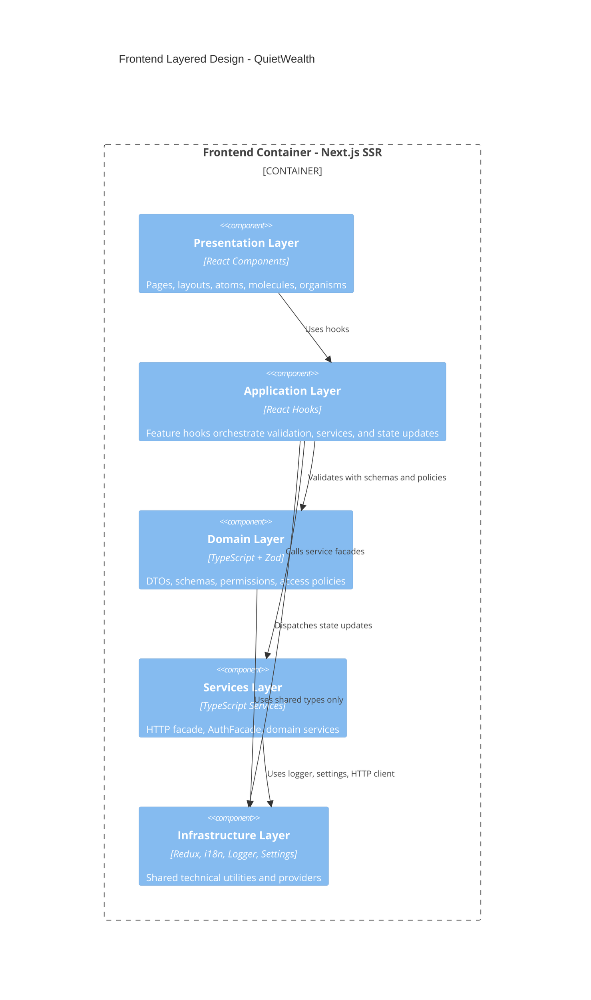
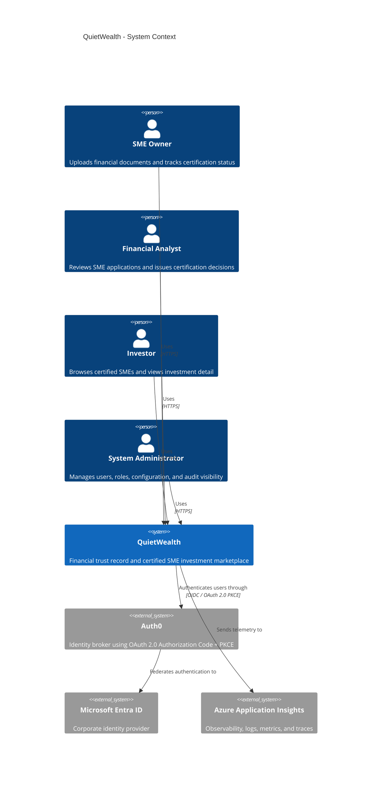
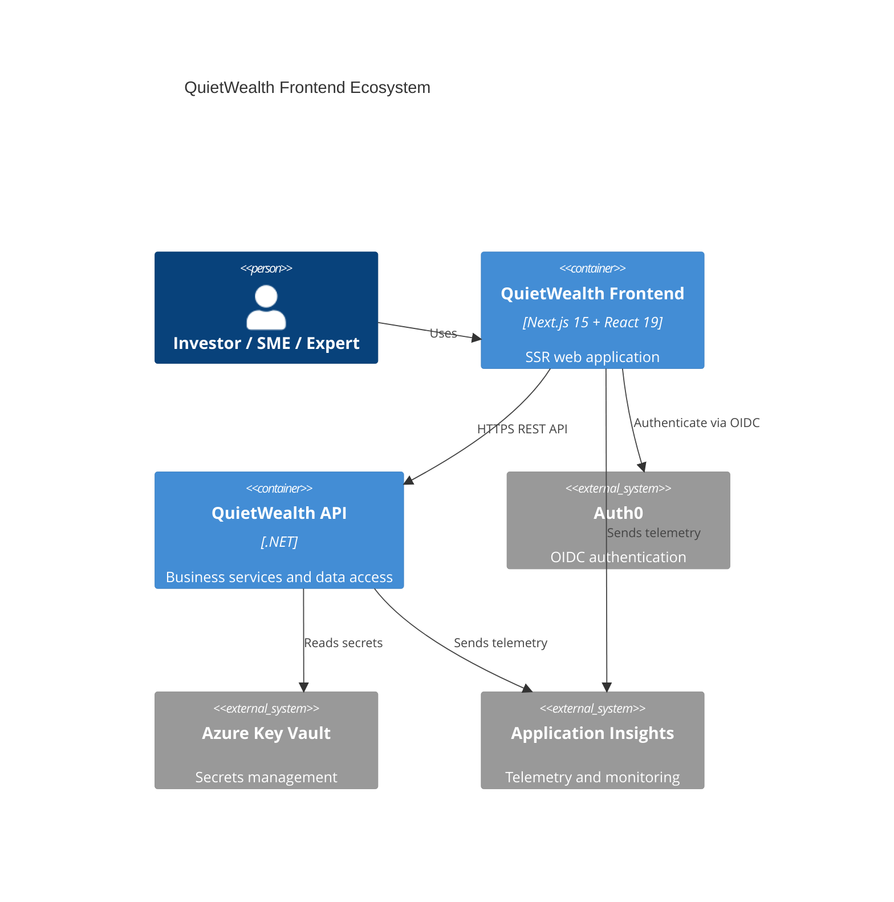
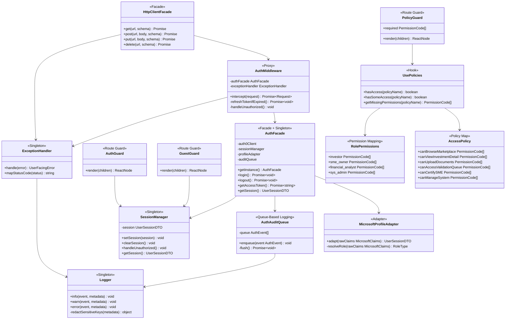

# QuietWealth

## Problem Statement
SMEs face slow, bureaucratic processes to certify their financial health, delaying capital access and investment. QuietWealth provides an expedited financial trust record by integrating document validation, risk analysis, and standardized financial conditions into a single certified report oriented to investors, establishing a low-risk certified investment ecosystem based on real revenue streams.

# 1. Frontend Design

## 1.1 Technology Stack
| Technology | Version | Justification |
|---|---|---|
| **Application Type** | SSR Web App | Server-side rendering enables auth-gated pages to be rendered on the server, reducing layout shift and preventing flash of unauthorized content for sensitive financial data |
| **React.js** | `19.2` | Industry-standard UI library with mature ecosystem; concurrent rendering features (`Suspense`, `React.lazy`) are essential for the document upload and long-running compilation flows |
| **Next.js** | `15` | Provides SSR, file-system routing, and built-in image optimization out of the box; integrates natively with Azure App Service Node.js runtime |
| **Node.js** | `22` | LTS release; required by Next.js 15 SSR runtime on Azure App Service |
| **TypeScript** | `5.9.3` | Static typing catches contract mismatches between API responses and UI state at compile time; essential for a data-intensive financial domain |
| **TailwindCSS** | `4.1` | Utility-first approach maps directly to the design token model; JIT compiler eliminates dead CSS in production with zero configuration |
| **Redux Toolkit** | `2.8` | Manages async thunks for document processing status tracking across page navigations; DevTools enable observability of state transitions during development |
| **Jest** | `30.2.0` | De-facto standard for React unit testing; compatible with TypeScript via `ts-jest`; supports coverage thresholds enforced in CI |
| **Zod** | `4.3.6` | Runtime schema validation for all API responses and form inputs; catches backend contract drift before data reaches Redux state |
| **Prettier** | `3.8.1` | Enforces uniform formatting across the team; integrated with Husky pre-commit hooks to block non-conforming commits |
| **ESLint** | `10.0.2` | Static analysis with custom rules that ban `dangerouslySetInnerHTML`, token storage in `localStorage`, and direct `console.log` calls |
| **Playwright** | `1.52` | Cross-browser E2E and integration testing; supports Chromium and Firefox; first-class `msw` integration for mocking backend responses |
| **Axios** | `1.9` | Provides interceptor support used by `AuthMiddleware` to attach Bearer tokens and handle 401 refresh centrally; cleaner API than native `fetch` for multipart document uploads |
| **Auth0 React SDK** | `2.2` | Manages OAuth 2.0 Authorization Code + PKCE flow and silent token refresh without custom implementation; Microsoft Entra ID is federated through Auth0 |
| **Husky** | `9.1.7` | Runs `lint-staged` on pre-commit; blocks commits that fail ESLint, Prettier, or TypeScript checks |
| **Cloud Service** | Azure | Consistent with the backend infrastructure; reduces operational complexity and cross-cloud latency |
| **Azure App Service** | — | Supports Node.js SSR runtimes natively; provides deployment slots (`staging → production`) enabling zero-downtime releases with instant rollback |
| **Code Repository** | GitHub | Enables GitHub Actions CI/CD with OIDC-based Azure deployment, avoiding long-lived credentials |
| **CI/CD** | GitHub Actions | OIDC token exchange with Azure App Service; branch-based environment promotion with manual approval for production |
| **Azure Application Insights SDK** | — | Unified telemetry for frontend and backend; correlates traces across browser, SSR layer, and backend API using a single `correlationId` |

---

## 1.2 UX/UI Analysis

## 1.2.1 Core Business Process

### Login
1. The user accesses the QuietWealth platform and is presented with the authentication screen.
2. The system redirects the user to the Microsoft authentication provider via Auth0.
3. The user enters their corporate Microsoft credentials.
4. If authentication fails, the system displays an error message and prompts the user to retry.
5. If authentication succeeds, a user session is created and the user is redirected to the Marketplace.


---

### Browse the Investment Marketplace
1. The user lands on the Marketplace screen, which displays a list of certified SMEs available for investment.
2. The user can search for a specific company using the search bar.
3. The user can filter results by sector (e.g., Technology, Energy, Commerce) or by trust level.
4. Each SME card displays key information: certification status, growth percentage, total raised capital, and number of active investors.
5. The user selects a company by clicking "Ver Detalles" to view the full investment profile.


---

### Upload Financial Documents
1. The user navigates to the "Cargar Documentos" section from the sidebar.
2. The system displays the document upload portal with a progress tracker showing the current stage: Información Cargada → En Revisión por Expertos → Certificación Emitida.
3. The user drags and drops files into the upload area or clicks "Seleccionar Archivos" to browse.
4. The system accepts PDF, DOC, XLS, and image formats up to 10 MB per file.
5. Once uploaded, the documents enter the expert review queue automatically.


---

### Expert Validation Panel
1. A financial expert accesses the "Panel de Validación" section from the sidebar.
2. The system displays a list of pending SME certification requests with ID, company name, sector, submission date, and status.
3. The expert selects a pending request by clicking "Revisar".
4. The expert reviews the uploaded documents and financial information.
5. The expert issues a certification decision, which updates the SME's trust status on the platform.


---

### View Investment Detail
1. From the Marketplace, the user clicks "Ver Detalles" on a specific SME card.
2. The system navigates to the Investment Detail screen, showing key financial metrics: Total Raised, Active Investors, Growth Rate, and Average ROI.
3. The user can scroll down to view detailed charts: Income Growth, Investor Growth, and Accumulated Capital Over Time.
4. The screen also displays a company description and key business metrics such as retention rate, MRR, and profit margin.
5. The user can click "Invertir Ahora" to initiate the investment flow.


---

### Logout
1. The user ends their session through the logout option.
2. The system invalidates the active JWT token.
3. The session is terminated and the user is redirected to the Login screen.


---

## 1.2.2 Wireframes
### Login Screen
Microsoft-authenticated entry point to the platform.


### Marketplace Screen
Lists certified SMEs with key financial metrics and trust indicators for investors to browse and compare.


### Document Upload Screen
Allows SMEs to submit financial documents for expert review and certification.


### Expert Validation Panel Screen
Enables financial experts to review and certify pending SME applications.


### Investment Detail Screen
Shows verified SME financial metrics, growth charts, and expert certifications to support investor decision-making.


### 1.2.3 Testing results
A usability test was conducted using Maze. Tests were shared remotely via URL.

**Test Objective:** Evaluate user ability to understand the information provided in the Investment Detail Screen. Also, check the overall user navigation along the platform.

#### Participant Results

| Participant | Duration | OS | Browser | Opinion Scale (1–5) | Open Feedback |
|---|---|---|---|---|---|
| 542521286 | 49 s | Windows | Chrome | 4 | "Considero que la información mostrada es clara." |
| 510669335 | 42 s | Windows | Chrome | 5 | "Esta bien" |
| 543901432 | 17.8 s | Windows | Brave | 4 | "all good" |
| 508804036 | 70.1 s | Windows | Edge | 5 | "." |
| 542802936 | 99.5 s | Windows | Edge | 5 | "Anuncios de invierta ahora no deberían de aparecer en la aplicación como tal, solo en una web." |
| 537502878 | 50.1 s | Linux | Firefox | 5 | "Muy detallada y presentable, no mejoraría nada." |
| **Average** | **54.8 s** | — | — | **4.7 / 5** | — |

---

### Heatmaps

**Investment Detail Screen**


### Usability Issues Detected
 
| # | Screen | Issue | Severity |
|---|--------|-------|----------|
| 1 | Investment Detail | The "Invertir Ahora" CTA feels too prominent within the platform; one participant noted it is more appropriate for an external web page. | Medium |
 
---
### Corrections Applied
 
| # | Issue | Correction | Decision Criteria |
|---|-------|------------|-------------------|
| 1 | "Invertir Ahora" CTA felt intrusive inside the platform | Reduced visual weight of the CTA within the Investment Detail screen | Keeps the platform focused on trust and information rather than aggressive selling |


---

## 1.3 Component Design Strategy
### 1.3.1 Strategy
### 1.3.2 Component Hierarchy
### 1.3.3 Component Categories
### 1.3.4 Component Reuse Strategy
### 1.3.5 [Hooks]
### 1.3.6 Naming conventions
### 1.3.7 Styles and Design Tokens
### 1.3.8 Responsive Design
### 1.3.9 Internationalization
### 1.3.10 Performance Guidelines

## 1.4 Security 
### 1.4.1 Technologies
### 1.4.2 Authentication
### 1.4.3 Authorization
### 1.4.4 Encryption and Data Privacy
### 1.4.5 API Communication
### 1.4.6 Storage Rules
### 1.4.7 Data Masking


## 1.4.8 OWASP Mitigations

This section defines the concrete security responsibilities that frontend developers must follow when implementing QuietWealth features. Each mitigation includes the expected developer action, the affected frontend area, and the acceptance criteria used during review.

| OWASP Risk                      | Developer Responsibility                                                                                                                                           | Implementation Area                                                                         | Review / Acceptance Criteria                                                                                                                             |
| ------------------------------- | ------------------------------------------------------------------------------------------------------------------------------------------------------------------ | ------------------------------------------------------------------------------------------- | -------------------------------------------------------------------------------------------------------------------------------------------------------- |
| XSS                             | Never render untrusted HTML directly. Do not use `dangerouslySetInnerHTML`. All dynamic text must be rendered through React JSX escaping.                          | `app/components/`, `app/components/pages/`, ESLint configuration                            | Pull request is rejected if `dangerouslySetInnerHTML` appears. ESLint rule must fail the build.                                                          |
| Broken Authentication           | All login, logout, token retrieval, and token refresh logic must go through `AuthFacade`. Developers must not manually call Auth0 from pages or components.        | `app/auth/AuthFacade.ts`, `app/auth/AuthMiddleware.ts`, `app/services/httpInterceptors.ts`  | Components never access Auth0 SDK directly. API calls receive tokens only through the HTTP interceptor.                                                  |
| Token Exposure                  | Access tokens must remain in memory only. Tokens must never be stored in `localStorage`, `sessionStorage`, IndexedDB, or URL parameters.                           | `app/state/authSlice.ts`, `app/state/sessionManager.ts`, `app/services/httpInterceptors.ts` | Static analysis blocks token-related keys in browser storage. Manual review verifies no token persistence exists.                                        |
| Broken Access Control           | Protected routes must be wrapped with `AuthGuard` and `PolicyGuard`. UI actions must check permissions through `usePolicies()` instead of checking roles directly. | `app/auth/guards/`, `app/auth/policies/`, `app/components/hooks/usePolicies.ts`             | Code must not use direct checks such as `user.role === "financial_analyst"`. Permission checks must use access policies.                                 |
| Sensitive Data Exposure         | Financial values must be masked unless the authenticated user has permission to view them and the backend has already authorized the response.                     | `app/components/atoms/MaskedValue/`, `app/components/organisms/InvestmentDetailPanel/`      | Unauthorized users see masked or null values. Client-side masking is not treated as the only security control.                                           |
| Injection                       | All form inputs and API responses must be validated with Zod schemas before being used by Redux state or UI components.                                            | `app/validation/`, `app/services/`, feature hooks                                           | Invalid payloads must throw a validation error and must not update the UI state.                                                                         |
| CSRF                            | Authentication must use Auth0 Authorization Code + PKCE and the Auth0 `state` parameter. Developers must not implement custom OAuth callbacks manually.            | `app/auth/AuthFacade.ts`, Auth0 configuration                                               | Login flow must preserve PKCE and state validation. No custom unsafe callback handling is allowed.                                                       |
| Security Misconfiguration       | Environment variables and secrets must be read through the settings layer. Secrets must never be committed to the repository.                                      | `app/settings/Settings.ts`, Azure Key Vault, `.env.example`                                 | `.env.example` contains placeholders only. Real secrets are provided through Azure Key Vault or local developer configuration.                           |
| Clickjacking                    | The deployed application must reject iframe embedding.                                                                                                             | Azure App Service headers / Next.js security headers                                        | `X-Frame-Options: DENY` or `Content-Security-Policy: frame-ancestors 'none'` must be configured.                                                         |
| Security Logging and Monitoring | Security-relevant events must be logged through the `Logger` and `AuthAuditQueue`. Raw tokens, passwords, secrets, or financial values must never be logged.       | `app/utils/logger.ts`, `app/auth/AuthAuditQueue.ts`, Azure Application Insights             | Logs include `correlationId`, event type, hashed user identifier, and timestamp. Logs must redact keys matching `token`, `secret`, `password`, or `key`. |
| File Upload Abuse               | Uploaded documents must be validated by MIME type and size before submission. The frontend validates early, but the backend remains the final authority.           | `app/validation/documentUploadSchema.ts`, `app/components/molecules/DocumentUploader/`      | Files above the allowed size or unsupported MIME types are rejected before upload and display a clear validation message.                                |

### Developer Rules

Developers must follow these rules in every feature:

* Do not call APIs directly from components.
* Do not store tokens in browser-persistent storage.
* Do not check user roles directly in components.
* Do not log raw financial values or authentication secrets.
* Do not create new security logic inside pages; reuse `AuthFacade`, `AuthMiddleware`, `PolicyGuard`, `usePolicies()`, and Zod schemas.
* Every protected screen must have both authentication and authorization checks.

---

## 1.5 Frontend Layered Design

The layered design is not a replacement for the C4 architecture diagrams. The C4 diagrams explain the system structure, while this section defines the dependency rules that frontend developers must follow when writing code.

The frontend uses five logical layers with downward-only dependencies.

| Layer          | Responsibility                                                   | Examples                                                                                                                     | Developer Rule                                                        |
| -------------- | ---------------------------------------------------------------- | ---------------------------------------------------------------------------------------------------------------------------- | --------------------------------------------------------------------- |
| Presentation   | Render UI and receive user interaction                           | Atoms, molecules, organisms, pages, layouts                                                                                  | May call hooks, but must not call services or API clients directly.   |
| Application    | Orchestrate use cases and UI workflows                           | `useAuth`, `useMarketplace`, `useDocumentUpload`, `useExpertValidation`, `useInvestmentDetail`                               | Validates user actions, calls services, dispatches Redux actions.     |
| Domain         | Define business rules, permissions, DTOs, and validation schemas | Zod schemas, role definitions, permission policies, models                                                                   | Must not import React components or infrastructure clients.           |
| Services       | Communicate with backend and external SDKs                       | `AuthFacade`, `HttpClientFacade`, `MarketplaceService`, `TrustRecordService`, `ExpertValidationService`, `InvestmentService` | Must expose clean methods to hooks and must not render UI.            |
| Infrastructure | Shared technical concerns                                        | Redux store, `SessionProvider`, `Logger`, `ExceptionHandler`, i18n, settings, design tokens                                  | Supports other layers but must not contain feature-specific UI logic. |

### Allowed Dependency Flow



### Layer Dependency Rules

```text
UI Components
      ↓
Feature Hooks
      ↓
Application Services
      ↓
Infrastructure
```

Rules:

- Components never call services directly.
- Components never access Redux slices directly.
- Hooks orchestrate business workflows.
- Services own API communication.
- Infrastructure owns external integrations.
```

### Example: Login Flow

`LoginPage` receives the user action and calls `useAuth().login()`.
`useAuth()` delegates authentication to `AuthFacade`.
`AuthFacade` starts the Auth0 Authorization Code + PKCE flow.
After callback validation, the session is normalized through `MicrosoftProfileAdapter`.
`SessionManager` updates the active session and Redux reflects the authenticated state.

### Example: Document Upload Flow

`DocumentUploadPage` calls `useDocumentUpload().submit(files)`.
`useDocumentUpload()` validates files with `documentUploadSchema`.
`TrustRecordService` sends the request to the backend.
The backend responds with `202 Accepted`.
`PollingOrchestrator` starts status polling.
`certificationSlice` updates the progress tracker until the application reaches a terminal state.

---

## 1.10 Architecture Diagrams (C4)

### C4 Level 1 - System Context



### C4 Level 2 - Container Diagram



### C4 Level 3 - Frontend Component Diagram


### C4 Level 4 - Auth and Security Code Diagram



---

## Broken Links Policy

To avoid broken links in the README, documentation must follow one of these two rules:

1. Use a markdown link only when the referenced file already exists in the repository.
2. If the file is part of the proposed scaffold but has not been created yet, write the path in backticks instead of using a link.

Correct:

```md
`app/auth/AuthFacade.ts`
```

Incorrect when the file does not exist yet:

```md
[app/auth/AuthFacade.ts](app/auth/AuthFacade.ts)
```

Before submitting the documentation, the team must run a link check or manually verify every local markdown link that points to `app/`, `server/`, `infra/`, or `Media/`.


## 1.5 Layered Design
## 1.6 Design Patterns

## 1.7 Project Scaffold
```
app/
├── layout.tsx
├── page.tsx
├── globals.css
├── login/
│   └── page.tsx
├── marketplace/
│   └── page.tsx                   → MarketplacePage
├── marketplace/[id]/
│   └── page.tsx                   → InvestmentDetailPage
├── documents/
│   └── page.tsx                   → DocumentUploadPage
├── validation/
│   └── page.tsx                   → ExpertValidationPage
└── admin/
    └── page.tsx
│
app/components/
├── atoms/
│   ├── Button/
│   ├── Badge/
│   ├── Input/
│   ├── Label/
│   ├── Spinner/
│   ├── ProgressBar/
│   ├── TrustIndicator/
│   ├── StatCard/
│   ├── MaskedValue/
│   └── atoms.css
├── molecules/
│   ├── SMECard/
│   ├── FilterBar/
│   ├── DocumentUploader/
│   ├── FormField/
│   ├── StatusBadge/
│   ├── InfoBanner/
│   └── molecules.css
├── organisms/
│   ├── MarketplaceGrid/
│   ├── InvestmentDetailPanel/
│   ├── ValidationQueue/
│   ├── DocumentUploadZone/
│   ├── Navbar/
│   ├── Sidebar/
│   └── organisms.css
├── templates/
│   ├── AuthenticatedLayout/
│   └── PublicLayout/
├── pages/
│   ├── LoginPage.tsx
│   ├── MarketplacePage.tsx
│   ├── InvestmentDetailPage.tsx
│   ├── DocumentUploadPage.tsx
│   └── ExpertValidationPage.tsx
├── hooks/
│   ├── useApplicationServices.ts
│   ├── useAuth.ts
│   ├── useMarketplace.ts
│   ├── useDocumentUpload.ts
│   ├── useCertificationProgress.ts
│   ├── useExpertValidation.ts
│   ├── useInvestmentDetail.ts
│   ├── usePermissions.ts
│   ├── usePolicies.ts
│   └── useSession.ts
├── i18n/
│   ├── config.ts
│   ├── I18nProvider.tsx
│   ├── en.json
│   └── es.json
└── styles/
    ├── tokens.ts
    ├── theme.ts
    ├── breakpoints.ts
    ├── globals.css
    └── ThemeProvider.tsx
│
app/auth/
├── AuthFacade.ts
├── AuthMiddleware.ts
├── AuthAuditQueue.ts
├── authConfig.ts
├── adapters/
│   └── MicrosoftProfileAdapter.ts
├── guards/
│   ├── AuthGuard.tsx
│   ├── GuestGuard.tsx
│   └── PolicyGuard.tsx
└── policies/
    ├── roles.ts
    ├── permissions.ts
    ├── rolePermissions.ts
    └── accessPolicy.ts
│
app/polling/
├── PollingOrchestrator.ts
└── strategies/
    ├── IPollingStrategy.ts
    ├── FixedIntervalStrategy.ts
    └── ExponentialBackoffStrategy.ts
│
app/services/
├── applicationFacade.ts
├── client.ts
├── httpInterceptors.ts
├── MarketplaceService.ts
├── TrustRecordService.ts
├── ExpertValidationService.ts
└── InvestmentService.ts
│
app/state/
├── certification.types.ts
├── certificationPollingStore.ts
├── certificationPollingManager.ts
├── session.types.ts
├── sessionManager.ts
├── SessionProvider.tsx
├── StoreProvider.tsx
├── store.ts
├── hooks.ts
└── slices/
    ├── authSlice.ts
    ├── marketplaceSlice.ts
    ├── certificationSlice.ts
    └── validationSlice.ts
│
app/models/
├── ApiResponse.ts
├── SME.ts
├── TrustRecord.ts
├── DocumentUpload.ts
├── Permission.ts
├── Role.ts
└── User.ts
│
app/validation/
├── documentUploadSchema.ts
├── smeSchema.ts
├── userSchema.ts
└── index.ts
│
app/settings/
└── Settings.ts
│
app/utils/
├── logger.ts
├── error-handler.ts
├── eventBus.ts
├── schemaValidator.ts
├── constants.ts
└── formatters.ts
│
app/assets/
└── logo/
    ├── logo-dark.svg
    └── logo-light.svg
│
app/__tests__/
├── setup.ts
├── unit/
│   ├── auth/
│   ├── polling/
│   ├── services/
│   └── validation/
└── e2e/
    ├── login.spec.ts
    ├── marketplace.spec.ts
    ├── document-upload.spec.ts
    └── expert-validation.spec.ts
│
app/__mocks__/
└── styleMock.ts
│
next.config.ts
tailwind.config.ts
tsconfig.json
jest.config.ts
playwright.config.ts
package.json
.env.example
.eslintrc.json
.prettierrc
.lintstagedrc.json
.husky/
└── pre-commit
```

---

### [State Management](app/state/)

State is split into two categories: **global shared state** managed by Redux Toolkit, and **local UI state** managed by `useState`/`useReducer` inside components. The rule is simple — if more than one component needs the value, it goes into Redux; otherwise it stays local.

#### What goes into Redux

| Slice | File | What it holds |
|---|---|---|
| `auth` | [app/state/slices/authSlice.ts](app/state/slices/authSlice.ts) | `isAuthenticated`, `user`, `role`, `accessToken` |
| `marketplace` | [app/state/slices/marketplaceSlice.ts](app/state/slices/marketplaceSlice.ts) | SME listings, active filters, search query |
| `certification` | [app/state/slices/certificationSlice.ts](app/state/slices/certificationSlice.ts) | Upload job state: `applicationId`, `status`, `stage` |
| `validation` | [app/state/slices/validationSlice.ts](app/state/slices/validationSlice.ts) | Expert queue: pending requests, selected request |

#### What stays local

- Form input values (controlled inputs inside a single component)
- UI toggles: modal open/close, dropdown expanded, loading spinner for a single button
- Transient error messages that don't need to persist across navigation

#### How to read state

Always use the typed hooks from [app/state/hooks.ts](app/state/hooks.ts) — never import `useSelector` or `useDispatch` directly.

```ts
import { useAppSelector, useAppDispatch } from "@/state/hooks";

const smes = useAppSelector(
  state => state.marketplace.smes
);

const dispatch = useAppDispatch();
```

#### How to write state

All state writes go through slice actions or async thunks — never mutate state directly outside a slice reducer.

```ts
dispatch(
  certificationSlice.actions.certificationStarted(applicationId)
);
```

#### How to handle async operations

Use `createAsyncThunk` for any operation that involves an API call. The thunk handles `pending`, `fulfilled`, and `rejected` states automatically.

```ts
export const fetchSMEs = createAsyncThunk(
  "marketplace/fetchSMEs",
  async (filters: SMEFilters) => {
    return await marketplaceService.getSMEs(filters);
  }
);
```
Components do not interact with services directly. API operations are orchestrated through feature hooks, which dispatch the corresponding thunks.

State transitions follow the thunk lifecycle:

- `pending` → `loading`
- `fulfilled` → `succeeded`
- `rejected` → `failed`

#### Infrastructure files

| File | Purpose |
|---|---|
| [app/state/store.ts](app/state/store.ts) | Configures the Redux store; registers all slices |
| [app/state/StoreProvider.tsx](app/state/StoreProvider.tsx) | Wraps the app with `<Provider store={store}>` |
| [app/state/hooks.ts](app/state/hooks.ts) | Exports typed `useAppSelector` and `useAppDispatch` |

---
### Async Communication and Polling
### Storage Considerations
### Events
### Observability and Monitoring
### Data Validation
### Caching
### API Consumption and Data Contracts
### [API Consumption and Data Contracts](app/services/)

The frontend treats the backend OpenAPI specification as the single source of truth for all data contracts. The workflow is: **spec first → generate types → validate at runtime**.

#### OpenAPI Specification

The backend exposes its OpenAPI spec at `GET /swagger/v1/swagger.json` (available in QA; disabled in production). The frontend references this spec to keep DTOs and service contracts in sync.

Spec location (local copy for codegen): [`app/contracts/openapi.json`](app/contracts/openapi.json)

To refresh the local copy from a running QA backend:

```bash
curl https://qaquietwealth-api.azurewebsites.net/swagger/v1/swagger.json \
  -o app/contracts/openapi.json
```

#### Type Generation

Types in [`app/models/`](app/models/) are generated from the OpenAPI spec using `openapi-typescript`. Run this whenever the backend updates its spec:

```bash
npx openapi-typescript app/contracts/openapi.json --output app/models/api.types.ts
```

Developers must **never hand-write DTO types** that correspond to a backend endpoint — always regenerate from the spec.

#### Endpoints by Service

| Service | File | Endpoints |
|---|---|---|
| Marketplace | [app/services/MarketplaceService.ts](app/services/MarketplaceService.ts) | `GET /api/smes` · `GET /api/smes/{id}` |
| Trust Record | [app/services/TrustRecordService.ts](app/services/TrustRecordService.ts) | `POST /api/trust-record-applications` · `GET /api/trust-record-applications/{id}/status` |
| Expert Validation | [app/services/ExpertValidationService.ts](app/services/ExpertValidationService.ts) | `GET /api/validation-queue` · `POST /api/validation-queue/{id}/decision` |
| Investment | [app/services/InvestmentService.ts](app/services/InvestmentService.ts) | `POST /api/investments` |

#### Runtime Validation with Zod

Even though types are generated at build time, every API response is validated at runtime using the corresponding Zod schema before it reaches Redux state. This catches backend contract drift that TypeScript alone cannot catch at runtime.

```ts
// TrustRecordService.ts
import { trustRecordStatusSchema } from "@/validation/smeSchema";

async getStatus(applicationId: string): Promise<TrustRecordStatus> {
  const response = await httpClient.get(`/api/trust-record-applications/${applicationId}/status`);
  return trustRecordStatusSchema.parse(response.data);  // throws ContractViolationError on mismatch
}
```

A `ContractViolationError` is automatically caught by `ExceptionHandler` and logged to Application Insights with the full raw response for debugging.

#### HTTP Client

All requests go through [app/services/client.ts](app/services/client.ts), which handles:
- Attaching `Authorization: Bearer <token>` on every protected request
- Detecting `401` and triggering `sessionManager.handleUnauthorized()`
- Delegating unhandled errors to `ExceptionHandler`

Developers must never call `fetch` or `axios` directly — always use the injected HTTP facade via `useApplicationServices().http`.

---
### Performance Optimization

## 1.8 Testing
### Unit Testing (Jest)

| Folder | What is tested |
|---|---|
| [app/__tests__/unit/auth/](app/__tests__/unit/auth/) | `AuthFacade`, `hasPermission`, `getMissingPermissions`, `MicrosoftProfileAdapter` |
| [app/__tests__/unit/polling/](app/__tests__/unit/polling/) | `PollingOrchestrator` state transitions, `FixedIntervalStrategy`, `ExponentialBackoffStrategy` |
| [app/__tests__/unit/services/](app/__tests__/unit/services/) | `MarketplaceService`, `TrustRecordService`, `ExpertValidationService` — with `HttpClientFacade` mocked |
| [app/__tests__/unit/validation/](app/__tests__/unit/validation/) | Zod schemas: valid payloads pass, invalid payloads produce expected error shapes |

Testing rules per unit:
- Verify expected behavior and outputs.
- Cover edge cases (empty, loading, error states).
- Mock external dependencies.
- Do not call real APIs, Auth0, or Azure services.

```ts
// MicrosoftProfileAdapter.test.ts
it("maps Entra ID oid to userId", () => {
  const adapter = new MicrosoftProfileAdapter();
  const dto = adapter.adapt({ oid: "abc123", preferred_username: "user@corp.com", name: "Jane" });
  expect(dto.userId).toBe("abc123");
});
```
### Coverage

**Minimum:** 80% statement coverage on `app/auth/`, `app/polling/`, `app/services/`, `app/validation/`.

```ts
// jest.config.ts
coverageThreshold: {
  "app/auth/**":       { statements: 80 },
  "app/polling/**":    { statements: 80 },
  "app/services/**":   { statements: 80 },
  "app/validation/**": { statements: 80 },
},
```

Coverage report published as a GitHub Actions artifact on every CI run. PRs that drop below threshold are blocked by the quality gate.

---
### Integration Testing (Playwright + msw)
Playwright tests run against a local Next.js dev server. The backend is mocked with `msw` handlers; Auth0 is bypassed via a test token fixture injected into the Redux store.

#### Where to put test files

```
app/__tests__/e2e/
├── login.spec.ts
├── marketplace.spec.ts
├── document-upload.spec.ts
└── expert-validation.spec.ts
```

All E2E tests live under `app/__tests__/e2e/`. One file per business flow. Do not place test files next to the components they test — that folder is for unit tests only.

#### File naming standard

| Pattern | Example |
|---|---|
| One file per business flow | `marketplace.spec.ts` |
| Kebab-case for multi-word flows | `document-upload.spec.ts` |
| Fixtures and helpers | `app/__tests__/fixtures/auth.ts` |
| Page Object Models | `app/__tests__/e2e/pages/MarketplacePage.ts` |

#### How to write a test case

Each test file follows this structure:

```ts
// app/__tests__/e2e/marketplace.spec.ts
import { test, expect } from "@playwright/test";
import { injectAuthSession } from "../fixtures/auth";
import { MarketplacePOM } from "./pages/MarketplacePage";

test.describe("Marketplace", () => {
  test.beforeEach(async ({ page }) => {
    await injectAuthSession(page, { role: "investor" });
    await page.goto("/marketplace");
  });

  test("displays SME cards after loading", async ({ page }) => {
    const marketplace = new MarketplacePOM(page);
    await marketplace.waitForCards();
    expect(await marketplace.cardCount()).toBeGreaterThan(0);
  });

  test("filters by sector", async ({ page }) => {
    const marketplace = new MarketplacePOM(page);
    await marketplace.selectSector("Technology");
    const cards = await marketplace.getVisibleCards();
    expect(cards.every(c => c.sector === "Technology")).toBe(true);
  });
});
```

Rules:
- Use `test.describe` to group related cases under the same flow.
- Use `test.beforeEach` to set up auth and navigation — never repeat these inside individual tests.
- Each `test()` block tests **one observable behavior**, not an entire journey.
- Name tests as plain sentences describing what the user sees or can do: `"displays SME cards after loading"`, not `"test marketplace loads"`.

#### Page Object Model (POM)

Every screen gets a Page Object Model in `app/__tests__/e2e/pages/`. POMs encapsulate selectors and interactions so test cases stay readable and locators are maintained in one place.

```ts
// app/__tests__/e2e/pages/MarketplacePage.ts
import { Page } from "@playwright/test";

export class MarketplacePOM {
  constructor(private page: Page) {}

  async waitForCards() {
    await this.page.waitForSelector("[data-testid='sme-card']");
  }

  async cardCount() {
    return this.page.locator("[data-testid='sme-card']").count();
  }
}
```
Rule: **all `data-testid` attributes are defined in the component**, not hardcoded strings in test files. Add `data-testid` to any element that a test needs to target.

#### Auth fixture

Auth0 is never called in tests. Use the shared fixture to inject a session directly:

```ts
// marketplace.spec.ts
await injectAuthSession(page, {
  role: "investor"
});
```
The `SessionProvider` reads `window.__TEST_AUTH__` when present and skips the Auth0 flow. Never mock Auth0 responses directly in test files.

#### Backend mock with msw

API calls are intercepted by `msw`. Handlers live in `app/__tests__/mocks/handlers.ts`:

```ts
// app/__tests__/mocks/handlers.ts
import { http, HttpResponse } from "msw";
import { smeListFixture } from "../fixtures/sme";

export const handlers = [
  http.get("/api/smes", () =>
    HttpResponse.json(smeListFixture)
  ),
];
```

To override a handler for a specific test (e.g. to simulate an error):

```ts
test("shows error banner when API fails", async ({ page }) => {
  await page.route("**/api/smes", route => route.fulfill({ status: 500 }));
  await page.goto("/marketplace");
  await expect(page.getByTestId("error-banner")).toBeVisible();
});
```
#### Configuration

`playwright.config.ts` — Chromium and Firefox projects, `baseURL` from `PLAYWRIGHT_BASE_URL` env var, screenshot on failure, 2 retries on CI.

```ts
export default defineConfig({
  projects: [
    { name: "chromium", use: { ...devices["Desktop Chrome"] } },
    { name: "firefox",  use: { ...devices["Desktop Firefox"] } },
  ],
  use: { baseURL: process.env.PLAYWRIGHT_BASE_URL ?? "http://localhost:3000" },
  retries: process.env.CI ? 2 : 0,
  reporter: [["html"], ["github"]],
});
```

Run locally: `npx playwright test` · Run single file: `npx playwright test marketplace.spec.ts` · Open UI mode: `npx playwright test --ui`

---

## [1.9 CI/CD](.github/workflows/)

**Technology:** GitHub Actions. All pipeline definitions live in [`.github/workflows/`](.github/workflows/). The repository has two protected branches: `staging` (QA) and `main` (Production). Merging into either branch is the only deployment trigger — there are no manual `workflow_dispatch` runs for normal deployments.

**Environments:** GitHub Environments (`QA`, `Production`) are configured under **Repository → Settings → Environments**. Each environment holds its own secrets and, for Production, requires a manual approval before the deploy job runs.

### Deployment flow

```
developer pushes code
        │
        ▼
 ┌─────────────────────┐
 │  ci-frontend        │  runs on every push to any branch
 │  ci-backend         │  lint · typecheck · test · build
 │  security-scan      │  on every PR only
 └────────┬────────────┘
          │ all checks pass
          ▼
   branch = staging?
      │         │
     yes        no → stops here (feature branches don't deploy)
      │
      ▼
 deploy-qa  ──────────────────►  qaquietwealth-frontend (Azure App Service)
                                  qaquietwealth-api     (Azure App Service)
          │
          │ merge staging → main
          ▼
 deploy-prod  (manual approval required in GitHub Environment)
          │
          ▼
 prodquietwealth-frontend (Azure App Service)
 prodquietwealth-api      (Azure App Service)
```

Authentication to Azure uses **OIDC** — no stored credentials. GitHub exchanges a short-lived token with Azure Entra ID at deploy time. See [OIDC setup](#oidc-and-azure-app-registrations) below.

### Pipeline files

| File | Trigger | Scope |
|---|---|---|
| [`.github/workflows/ci-frontend.yml`](.github/workflows/ci-frontend.yml) | Push to any branch, path `app/**` | `npm ci` → ESLint → Prettier → `tsc --noEmit` → Jest + coverage → `npm run build` → bundle analysis |
| [`.github/workflows/ci-backend.yml`](.github/workflows/ci-backend.yml) | Push to any branch, path `server/**` | `dotnet restore` → `dotnet build` → `dotnet test` → `dotnet format --verify-no-changes` |
| [`.github/workflows/security-scan.yml`](.github/workflows/security-scan.yml) | Pull requests only | `npm audit` · OSSF Scorecard · `gitleaks` for secret scanning |
| [`.github/workflows/deploy-qa-frontend.yml`](.github/workflows/deploy-qa-frontend.yml) | Push to `staging`, path `app/**` | Build → upload artifact → Azure login (OIDC) → `azure/webapps-deploy` |
| [`.github/workflows/deploy-qa-api.yml`](.github/workflows/deploy-qa-api.yml) | Push to `staging`, path `server/**` | Build → publish → Azure login (OIDC) → `azure/webapps-deploy` |
| [`.github/workflows/deploy-prod-frontend.yml`](.github/workflows/deploy-prod-frontend.yml) | Push to `main`, path `app/**` + manual approval | Same as QA workflow; targets `prodquietwealth-frontend` |
| [`.github/workflows/deploy-prod-api.yml`](.github/workflows/deploy-prod-api.yml) | Push to `main`, path `server/**` + manual approval | Same as QA workflow; targets `prodquietwealth-api` |

### Workflow structure (frontend deploy)

Every deploy workflow follows the same two-job pattern. The build job has no Azure permissions; only the deploy job requests `id-token: write` for OIDC.

```yaml
# .github/workflows/deploy-qa-frontend.yml
on:
  push:
    branches: [staging]
    paths: [app/**]

jobs:
  build:
    runs-on: ubuntu-latest
    environment: QA
    permissions:
      contents: read
    steps:
      - uses: actions/checkout@v4
      - uses: actions/setup-node@v4
        with: { node-version: '22', cache: 'npm', cache-dependency-path: app/package-lock.json }
      - run: npm ci
        working-directory: app
      - run: npm run lint
        working-directory: app
      - run: npm run format:check
        working-directory: app
      - run: npx tsc --noEmit
        working-directory: app
      - run: npm run test:coverage
        working-directory: app
      - run: npm run build
        working-directory: app
        env:
          NEXT_PUBLIC_AUTH0_DOMAIN:    ${{ secrets.AUTH0_DOMAIN }}
          NEXT_PUBLIC_AUTH0_CLIENT_ID: ${{ secrets.AUTH0_CLIENT_ID }}
          NEXT_PUBLIC_API_BASE_URL:    ${{ secrets.API_BASE_URL }}
      - uses: actions/upload-artifact@v4
        with: { name: node-app, path: app/.next/ }

  deploy:
    runs-on: ubuntu-latest
    needs: build
    environment: QA
    permissions:
      id-token: write   # required for OIDC — must NOT be on the build job
      contents: read
    steps:
      - uses: actions/download-artifact@v4
        with: { name: node-app }
      - uses: azure/login@v2
        with:
          client-id:       ${{ secrets.AZUREAPPSERVICE_CLIENTID_QA_FRONTEND }}
          tenant-id:       ${{ secrets.AZUREAPPSERVICE_TENANTID_QA }}
          subscription-id: ${{ secrets.AZUREAPPSERVICE_SUBSCRIPTIONID_QA }}
      - uses: azure/webapps-deploy@v3
        with:
          app-name: qaquietwealth-frontend
          package: .
```

`NEXT_PUBLIC_*` variables are baked into the Next.js bundle at build time. They are **not** runtime Azure App Service settings — do not add them under **Configuration → Application settings** in the portal.

### Pre-commit hooks

Husky runs `lint-staged` before every local commit. Failing checks block the commit.

```json
// app/.lintstagedrc.json
{
  "app/**/*.{ts,tsx}": ["eslint --fix", "prettier --write"],
  "app/**/*.{css,json}": ["prettier --write"]
}
```

Custom ESLint rules enforced on every file:
- `no-restricted-syntax` → no `dangerouslySetInnerHTML`
- `no-restricted-globals` → no `localStorage.setItem` / `sessionStorage.setItem` with token-related keys
- `no-console` → use `Logger` from `app/utils/logger.ts`
- `i18n/no-literal-string` → no hardcoded display strings outside i18n keys

### Secrets — where they live and how to get them

#### Local development

Create `app/.env.local` (gitignored). Copy from `app/.env.example` and fill in the values:

```bash
# app/.env.local
NEXT_PUBLIC_AUTH0_DOMAIN=dev-xxxx.us.auth0.com
NEXT_PUBLIC_AUTH0_CLIENT_ID=<from Auth0 dashboard → Applications → QuietWealth Dev>
NEXT_PUBLIC_API_BASE_URL=http://localhost:5000
AUTH0_SECRET=<random 32-char string, generate with: openssl rand -hex 32>
```

Auth0 values come from the **Auth0 dashboard → Applications → QuietWealth Dev application → Settings**. Never commit this file.

#### QA and Production (GitHub Actions)

Secrets are stored in **GitHub → Repository → Settings → Environments → QA / Production → Environment secrets**. They are injected at pipeline runtime and never written to disk or logs.

| Secret | Environment | Where to get the value |
|---|---|---|
| `AZUREAPPSERVICE_CLIENTID_QA_FRONTEND` | QA | Output of [`infra/setup-github-oidc.ps1`](infra/setup-github-oidc.ps1) |
| `AZUREAPPSERVICE_CLIENTID_QA_API` | QA | Output of [`infra/setup-github-oidc.ps1`](infra/setup-github-oidc.ps1) |
| `AZUREAPPSERVICE_TENANTID_QA` | QA | Azure Portal → Entra ID → Overview → Tenant ID |
| `AZUREAPPSERVICE_SUBSCRIPTIONID_QA` | QA | Azure Portal → Subscriptions |
| `AUTH0_DOMAIN` | QA + Production | Auth0 dashboard → Tenant Settings |
| `AUTH0_CLIENT_ID` | QA + Production | Auth0 dashboard → Applications → QuietWealth QA/Prod |
| `API_BASE_URL` | QA | `https://qaquietwealth-api.azurewebsites.net` |
| `AZUREAPPSERVICE_CLIENTID_PROD_FRONTEND` | Production | Output of [`infra/setup-github-oidc.ps1`](infra/setup-github-oidc.ps1) |
| `AZUREAPPSERVICE_CLIENTID_PROD_API` | Production | Output of [`infra/setup-github-oidc.ps1`](infra/setup-github-oidc.ps1) |
| `AZUREAPPSERVICE_TENANTID_PROD` | Production | Azure Portal → Entra ID → Overview → Tenant ID |
| `AZUREAPPSERVICE_SUBSCRIPTIONID_PROD` | Production | Azure Portal → Subscriptions |
| `API_BASE_URL` | Production | `https://prodquietwealth-api.azurewebsites.net` |

Backend secrets (`ConnectionStrings__QuietWealthSql`, `BlobStorage__ConnectionString`, `NotificationHub__ConnectionString`, `AUTH0_CLIENT_SECRET`) are provisioned directly as Azure App Service **Application settings** via Bicep — they never pass through GitHub Actions.

### OIDC and Azure App Registrations

OIDC lets GitHub Actions deploy to Azure without storing long-lived credentials. The script [`infra/setup-github-oidc.ps1`](infra/setup-github-oidc.ps1) automates the one-time setup. Run it locally with `az login` and `gh auth login` active before the first deployment to each environment.

**What the script does for each app × environment combination** (`frontend-qa`, `api-qa`, `frontend-prod`, `api-prod`):

1. Creates an **Entra ID App Registration** named `qw-{env}-{role}-deploy` (e.g. `qw-qa-frontend-deploy`).
2. Creates a **Service Principal** for it.
3. Adds a **Federated Credential** with:
   - Issuer: `https://token.actions.githubusercontent.com`
   - Subject: `repo:danielpulido01/QuietWealth:environment:QA` (or `Production`)
   - Audience: `api://AzureADTokenExchange`
4. Assigns the **Contributor** role scoped to the specific Azure Web App resource only — not subscription-wide.
5. Writes the three OIDC secrets (`CLIENTID`, `TENANTID`, `SUBSCRIPTIONID`) into the correct GitHub Environment via `gh secret set`.

After running the script, the secrets listed in the table above will be populated automatically. No manual copy-paste from the Azure portal.

**Critical constraints:**
- Each Web App has its own App Registration and `clientId`. `tenantId` and `subscriptionId` are shared within an environment.
- Do not reuse the same App Registration across frontend and API — each needs its own federated credential with the correct subject.
- Bicep infra secrets (`ConnectionStrings__*`, `BlobStorage__*`) are passed via `.bicepparam` using `readEnvironmentVariable()`. Set them in your local shell before running `deploy.ps1`:

```powershell
# Set before running infra deployment — never commit these
$env:QW_SQL_CONNECTION      = '...'
$env:BLOB_CONNECTION        = '...'
$env:NOTIFICATION_CONNECTION = '...'
.\infra\deploy.ps1 -Environment qa
```

Infra deployment is **manual only** and runs from a developer machine, not from GitHub Actions. The Bicep files provision the Azure resources; the GitHub Actions workflows only deploy the application code.

### Infrastructure resources (Bicep)

[`infra/`](infra/) — subscription scope. Deploys the resource group and all Azure resources.

| Resource | QA | Production |
|---|---|---|
| App Service Plan | `asp-qw-qa` (B1) | `asp-qw-prod` (B1) |
| Frontend Web App | `qaquietwealth-frontend` (Node 24 LTS) | `prodquietwealth-frontend` |
| API Web App | `qaquietwealth-api` (DOTNETCORE 10.0) | `prodquietwealth-api` |

Frontend App Service settings provisioned by Bicep:
- `WEBSITE_NODE_DEFAULT_VERSION = ~22`
- `SCM_DO_BUILD_DURING_DEPLOYMENT = false` — Oryx disabled; we deploy pre-built `.next/`

API App Service settings provisioned by Bicep:
- `ASPNETCORE_ENVIRONMENT = Production` (prod) / `Development` (qa — enables Swagger UI)
- `ConnectionStrings__QuietWealthSql`, `BlobStorage__ConnectionString`, `NotificationHub__ConnectionString` — injected from `.bicepparam`
- `AllowedOrigins__0 = https://{frontendAppName}.azurewebsites.net`

---
## 1.10 Architecture Diagrams (C4)

# Backend Design
