# QuietWealth — Frontend Design

## Problem statement

SMEs spend weeks proving their financial health before they can raise capital. The paperwork is slow, the criteria are inconsistent, and investors have no quick way to tell a healthy company from a risky one. QuietWealth shortens that loop: SMEs upload their financials, financial analysts certify them, and investors browse a marketplace of companies whose numbers have already been checked. Every certified profile is backed by a trust record built from validated documents and standardized financial conditions.

## Scope

This document describes the **frontend** of QuietWealth: the Next.js application, its architecture, the way its code is organized, and the design decisions behind each part.

The backend API is a separate service with its own design. It appears here only as an external container in the C4 diagrams and as the API contract the frontend consumes (Section 7). Backend internals are not part of this document. Everything under `app/` is the frontend; anything under `server/` belongs to the backend design.

| Section | Contents |
|---|---|
| 1 | Architecture (C4) |
| 2 | Layered design |
| 3 | Technology stack |
| 4 | UX/UI |
| 5 | Component design |
| 6 | State management |
| 7 | API contract and runtime validation |
| 8 | Asynchronous communication and polling |
| 9 | Security |
| 10 | Observability |
| 11 | Testing |
| 12 | CI/CD and environments |
| 13 | Source code structure |
| 14 | Design patterns |

---

# 1. Architecture (C4)

The diagrams zoom in progressively: the system in its environment (Level 1), the deployable containers (Level 2), and the internals of the frontend container only (Level 3). The backend container's internals are documented separately.

## 1.1 Level 1 — System context

Three day-to-day actors and a system administrator interact with QuietWealth. Identity is delegated to Auth0, which federates exclusively with Microsoft Entra ID, so every user signs in with a corporate Microsoft account. Telemetry flows to Azure Application Insights.

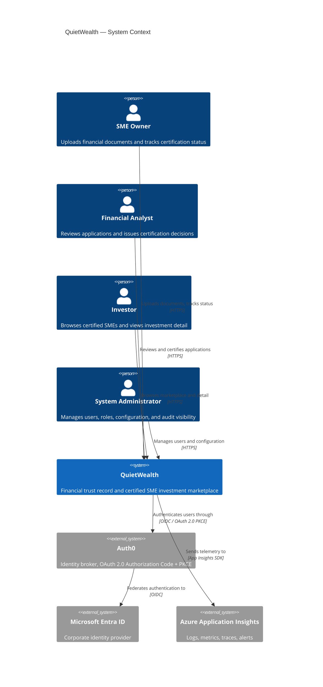

## 1.2 Level 2 — Containers

QuietWealth runs as four containers: the frontend web app, the backend API, the database, and document storage. Each is shown with its technology and the external systems it depends on.

This is the only level where the whole system appears. From Level 3 onward the diagrams expand the **Frontend Web App** container; the Backend API container is expanded in the backend design.

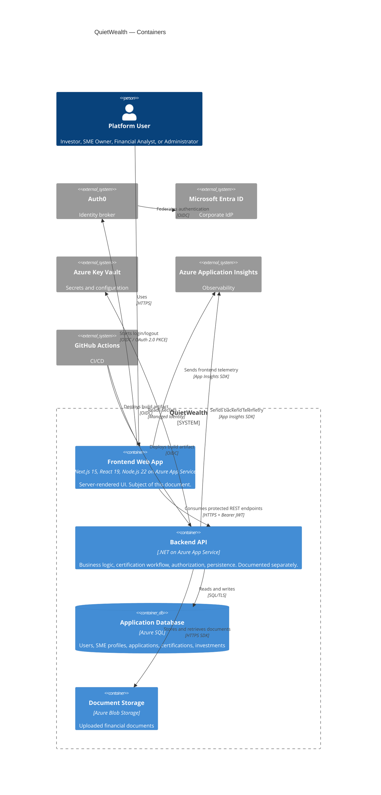

## 1.3 Level 3 — Frontend components

This expands the Frontend Web App container. Each box is a group of code inside `app/`, and the boxes correspond one-to-one with the layers in Section 2.

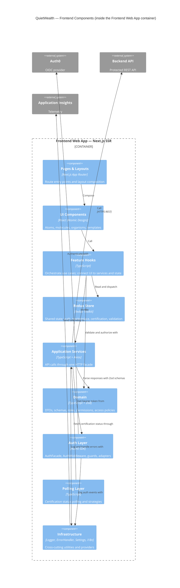

---

# 2. Layered design

C4 describes how the system is structured. The layered design describes a different relationship: which code is allowed to depend on which. Both views describe the same frontend, so the boxes in §1.3 map onto the layers below.

The frontend has five layers. Dependencies point downward only — a layer uses the one beneath it and never the one above.

| Layer | Responsibility | Location | Dependency constraint |
|---|---|---|---|
| Presentation | Render UI and capture user input | `app/components/**`, `app/**/page.tsx` | Calls hooks. Does not import services, Axios, Auth0, or Redux slices. |
| Application | Orchestrate a use case end to end | `app/components/hooks/**` | Validates input, calls services, dispatches Redux actions. |
| Domain | Business types and rules | `app/models/**`, `app/validation/**`, `app/auth/policies/**` | Pure TypeScript. No React or infrastructure clients. |
| Services | Talk to the backend and Auth0 | `app/services/**`, `app/auth/AuthFacade.ts` | Owns all network I/O. Renders no UI. |
| Infrastructure | Cross-cutting plumbing | `app/state/**`, `app/utils/**`, `app/settings/**`, `app/components/i18n/**` | Provides logger, store, settings, i18n. No feature logic. |

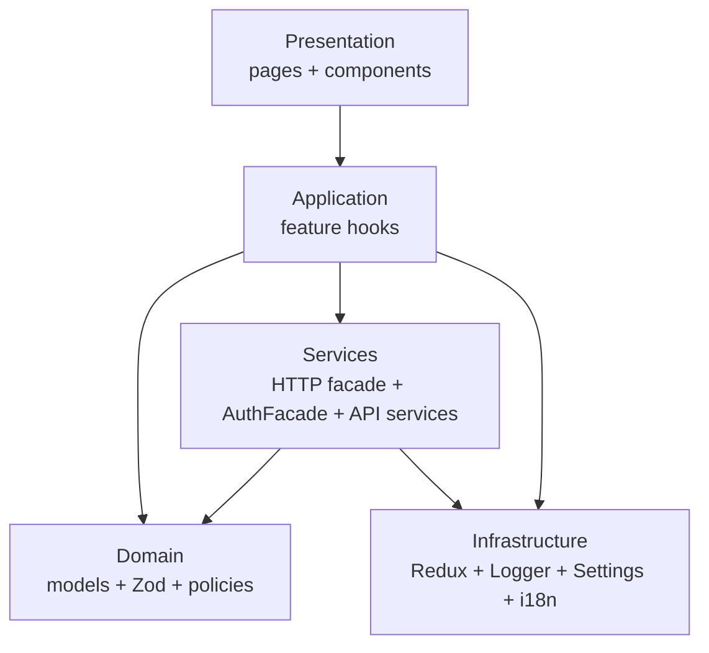

The login flow crosses four layers in order:

1. `LoginPage` (Presentation) calls `useAuth().login()`.
2. `useAuth` (Application) delegates to `AuthFacade`.
3. `AuthFacade` (Services) runs the Auth0 PKCE flow, then passes raw claims to `MicrosoftProfileAdapter` (Domain), which produces a `UserSessionDTO`.
4. `SessionManager` (Infrastructure) stores the session and Redux reflects the authenticated state.

No component reaches a service directly. `LoginPage` importing `AuthFacade` would break the layering.

---

# 3. Technology stack

The version column is the baseline the project targets. Major-version upgrades are made deliberately, not incidentally.

| Technology | Version | Role | Usage in the codebase |
|---|---|---|---|
| Next.js | 15 | SSR + App Router. Auth-gated pages render server-side, so unauthorized content never flashes. | Route entries in `app/**/page.tsx`; business UI in `app/components/pages/`. |
| React | 19.2 | UI library | Atomic Design with typed props. |
| Node.js | 22 (LTS) | SSR runtime on Azure App Service | Matches the version run by CI and App Service. |
| TypeScript | 5.9.3 | Static typing | `any` is avoided except where justified. |
| TailwindCSS | 4.1 | Utility-first styling mapped to tokens | Styling reads token CSS variables, not hardcoded hex. |
| Redux Toolkit | 2.8 | Shared state and async thunks | Accessed through typed hooks in `app/state/hooks.ts`. |
| Zod | 4.3.6 | Runtime validation | Parses every API response in the service layer before Redux. |
| Axios | 1.9 | HTTP client with interceptors | Used only through `HttpClientFacade`. |
| Auth0 React SDK | 2.2 | OAuth 2.0 Authorization Code + PKCE, silent refresh | Accessed only through `AuthFacade`. |
| Jest | 30.2.0 | Unit tests | Covers auth, services, validation, polling. |
| Playwright | 1.52 | E2E across Chromium and Firefox | Drives flows through Page Object Models and `data-testid`. |
| ESLint | 10.0.2 | Static analysis with custom bans | Enforced in CI and on pre-commit. |
| Prettier | 3.8.1 | Formatting | Runs on pre-commit. |
| Husky | 9.1.7 | Pre-commit hooks | Runs lint, format, and typecheck. |
| Azure App Service | — | Frontend hosting | Hosts the pre-built `.next/` artifact deployed from CI. |
| Azure Application Insights | — | Observability | Receives frontend telemetry. |
| GitHub Actions | — | CI/CD | Authenticates to Azure via OIDC; no stored credentials. |

ESLint carries three project-specific bans, each tied to a concrete risk rather than to style: no `dangerouslySetInnerHTML` (XSS), no token-shaped keys written to `localStorage`/`sessionStorage` (token theft), and no `console.log` (output goes through the structured, redacting `Logger`).

---

---

## 4. UX/UI

### 4.2 Core Business Flows

#### Login
1. User opens QuietWealth and reaches the authentication screen.
2. System redirects to Microsoft authentication via Auth0.
3. User enters corporate Microsoft credentials.
4. On failure, an error message is shown and the user is prompted to retry.
5. On success, a session is created and the user is redirected to the Marketplace.

#### Browse the Marketplace
1. User lands on the Marketplace — a list of certified SMEs available for investment.
2. User can search by company name.
3. User can filter by sector (Technology, Energy, Commerce) or trust level.
4. Each SME card shows: certification status, growth %, total capital raised, and active investor count.
5. User clicks **Ver Detalles** to open the full investment profile.

#### Upload Financial Documents
1. User navigates to **Cargar Documentos** from the sidebar.
2. A progress tracker shows the current stage: `Información Cargada → En Revisión por Expertos → Certificación Emitida`.
3. User drags and drops files or clicks **Seleccionar Archivos**.
4. Accepted formats: PDF, DOC, XLS, and image files up to 10 MB each.
5. Uploaded documents are queued automatically for expert review.

#### Expert Validation Panel
1. Financial expert navigates to **Panel de Validación**.
2. System lists pending certification requests: ID, company, sector, submission date, and status.
3. Expert clicks **Revisar** to open a request.
4. Expert reviews documents and financial data.
5. Expert issues a certification decision, updating the SME's trust status.

#### Investment Detail
1. From the Marketplace, user clicks **Ver Detalles** on an SME card.
2. System shows key financial metrics: Total Raised, Active Investors, Growth Rate, and Average ROI.
3. User can scroll to view charts: Income Growth, Investor Growth, and Accumulated Capital Over Time.
4. Additional metrics are displayed: retention rate, MRR, and profit margin.
5. User can click **Invertir Ahora** to initiate the investment flow.

#### Logout
1. User selects logout.
2. System invalidates the active JWT.
3. Session is terminated and user is redirected to Login.

---

### 4.3 Wireframes

#### Login
Microsoft-authenticated entry point.


#### Marketplace
Lists certified SMEs with financial metrics and trust indicators.


#### Document Upload
Allows SMEs to submit financial documents for expert review.


#### Expert Validation Panel
Enables financial experts to review and certify pending applications.


#### Investment Detail
Shows verified SME financials, growth charts, and expert certifications.


---

### 4.4  Usability Testing

Tests were conducted remotely using Maze, targeting the **Investment Detail Screen** — the most data-dense view.

#### Results

| Participant | Duration | OS | Browser | Score (1–5) | Feedback |
|---|---|---|---|---|---|
| 542521286 | 49 s | Windows | Chrome | 4 | "Considero que la información mostrada es clara." |
| 510669335 | 42 s | Windows | Chrome | 5 | "Esta bien" |
| 543901432 | 17.8 s | Windows | Brave | 4 | "all good" |
| 508804036 | 70.1 s | Windows | Edge | 5 | "." |
| 542802936 | 99.5 s | Windows | Edge | 5 | "Anuncios de invierta ahora no deberían de aparecer en la aplicación como tal, solo en una web." |
| 537502878 | 50.1 s | Linux | Firefox | 5 | "Muy detallada y presentable, no mejoraría nada." |
| **Average** | **54.8 s** | — | — | **4.7 / 5** | — |

#### Heatmaps — Investment Detail Screen


#### Issues and Corrections

| # | Screen | Issue | Severity |
|---|---|---|---|
| 1 | Investment Detail | The **Invertir Ahora** CTA felt too prominent; one participant noted it suits an external website better than an internal platform. | Medium |

| # | Issue | Correction | Decision Criteria |
|---|---|---|---|
| 1 | CTA felt intrusive inside the platform | Reduced visual weight of the button in the Investment Detail screen | Keeps the platform focused on trust and information rather than aggressive selling |


---

# 5. Component design

## 5.1 Atomic Design

Components are organized by size and responsibility. A component depends only on the categories to its left.

| Category | Folder | Definition | Depends on |
|---|---|---|---|
| Atoms | `app/components/atoms/` | Pure UI, no business logic | Props and design tokens only |
| Molecules | `app/components/molecules/` | Small compositions of atoms | Atoms, local UI state |
| Organisms | `app/components/organisms/` | Whole screen sections | Atoms, molecules, hooks |
| Templates | `app/components/templates/` | Layout shells | Organisms, layout providers |
| Pages | `app/components/pages/` | Business screens | Hooks, templates, organisms |

Components observe a fixed set of constraints: they perform no `fetch`/`axios`/service calls (they go through a hook), they never access Auth0 directly (it is reached through `AuthFacade` via a hook), they never check roles such as `user.role === "financial_analyst"` (they use `hasAccess("canCertifySME")`), they contain no literal display strings (i18n keys instead), and they never interpolate a raw sensitive financial value into JSX (rendered through `MaskedValue`, §9.3). New components extend existing atoms or molecules through props and variants rather than duplicating them.

```tsx
// SMECard composes existing atoms and molecules; it holds no business logic.
<article data-testid="sme-card">
  <TrustIndicator level={sme.certificationStatus} />
  <StatCard label={t("sme.growth")} value={formatPercent(sme.growthRate)} />
  <Button variant="primary" size="md" onClick={onViewDetails}>
    {t("marketplace.viewDetails")}
  </Button>
</article>
```

## 5.2 Naming conventions

| Element | Convention | Example |
|---|---|---|
| Component files & folders | PascalCase | `SMECard.tsx`, `SMECard/` |
| Page components | PascalCase + `Page` | `MarketplacePage.tsx` |
| Hooks | camelCase, `use` prefix | `useMarketplace.ts` |
| Services | PascalCase + `Service` | `TrustRecordService.ts` |
| Redux slices | camelCase + `Slice` | `marketplaceSlice.ts` |
| Zod schemas | camelCase + `Schema` | `documentUploadSchema.ts` |
| Constants | SCREAMING_SNAKE_CASE | `MAX_UPLOAD_FILE_SIZE_MB` |
| DTOs | PascalCase + `DTO` | `UserSessionDTO` |
| Test files | source name + `.test.ts(x)` / `.spec.ts` | `AuthFacade.test.ts` |
| i18n keys | dot-separated camelCase | `marketplace.filter.sector` |
| Non-component folders | kebab-case | `investment-detail/` |

## 5.3 Design tokens

Visual values are centralized in `app/components/styles/`, so a brand change is one edit rather than a search-and-replace.

| File | Contents |
|---|---|
| `tokens.ts` | Colors, spacing, radius, typography |
| `theme.ts` | The theme object composed from tokens |
| `breakpoints.ts` | `mobile: 480`, `tablet: 768`, `desktop: 1200` |
| `globals.css` | CSS variables and Tailwind base |

```ts
// app/components/styles/tokens.ts
export const colors = {
  primary:    "#0D1F3C", // navy — headings, navbar
  accent:     "#1AACA8", // teal — CTAs, active states
  gold:       "#C8972B", // gold — certified badges, trust scores
  background: "#F5F7FA",
  surface:    "#FFFFFF",
  success:    "#22C55E", // certified / low risk
  warning:    "#F59E0B", // pending / medium risk
  error:      "#EF4444", // rejected / high risk
};
```

Components read tokens through CSS variables:

```tsx
<Button className="bg-[var(--color-primary)] text-[var(--color-surface)]" />
```

Hardcoded values bypass theming and are not used:

```tsx
<Button style={{ background: "#0D1F3C" }} />
```

Certification status is communicated with both a color and a text label, never color alone, for accessibility: certified uses gold with a check, pending uses warning with a clock, rejected uses error with an X.

## 5.4 Responsive layout

| Device | Marketplace | Investment Detail | Navigation |
|---|---|---|---|
| Mobile | Single column | Single column | Hamburger menu |
| Tablet | 2-column grid | Metrics beside charts | Collapsed sidebar |
| Desktop | 3-column grid | Full dual panel | Full sidebar |

Layout uses `flex`/`grid` and Tailwind responsive prefixes (`sm:`, `md:`, `lg:`), with no fixed pixel widths for structural layout.

## 5.5 Internationalization

Every display string is externalized to `en.json` and `es.json`; a literal string in JSX fails linting.

```tsx
const { t } = useTranslation();
<h1>{t("marketplace.title")}</h1>   // externalized
<h1>Marketplace</h1>                // rejected by i18n/no-literal-string
```

## 5.6 Performance

Route-level code splitting is automatic with the App Router, and heavy feature pages are additionally loaded with `lazy()` behind a `<Suspense fallback={<Spinner />}>`. Display-heavy components such as `SMECard` are memoized, and derived values and handlers use `useMemo`/`useCallback`. The marketplace grid and validation queue use `react-window` virtualization beyond 100 rows. CI fails the build when any bundle chunk exceeds 250 KB, and `lucide-react` is imported as named exports only.

---

# 6. State management

State is split in two: shared state in Redux Toolkit, and local UI state in `useState`/`useReducer`. The dividing line is reuse — a value needed by more than one component lives in Redux; everything else stays local.

| Redux slice | File | Contents |
|---|---|---|
| `auth` | `app/state/slices/authSlice.ts` | `isAuthenticated`, `user`, `role`, in-memory `accessToken` |
| `marketplace` | `app/state/slices/marketplaceSlice.ts` | SME listings, active filters, search query |
| `certification` | `app/state/slices/certificationSlice.ts` | `applicationId`, status, current stage |
| `validation` | `app/state/slices/validationSlice.ts` | Pending queue, selected request |

Local-only state covers controlled form inputs, modal and dropdown open state, a single button's spinner, and transient errors that do not survive navigation.

State is read and written through one consistent path. Reads use the typed selector hook; writes go through slice reducers or thunks; async operations are modeled as thunks whose lifecycle maps to loading/succeeded/failed.

```ts
// Reads use the typed hooks, not useSelector/useDispatch directly.
import { useAppSelector, useAppDispatch } from "@/state/hooks";

const smes = useAppSelector((s) => s.marketplace.smes);
const dispatch = useAppDispatch();
```

```ts
// Async work is a thunk; the slice maps its lifecycle to UI state.
export const fetchSMEs = createAsyncThunk(
  "marketplace/fetchSMEs",
  (filters: SMEFilters) => marketplaceService.getSMEs(filters)
);
```

A feature hook dispatches the thunk, so the component stays declarative and never touches a service.

---

# 7. API contract and runtime validation

The backend's OpenAPI specification is the single source of truth for data shapes. The flow is **spec → generated types → runtime validation**.

## 7.1 Generating types from the spec

The backend serves its spec at `GET /swagger/v1/swagger.json` (available in QA, disabled in production). The frontend keeps a committed copy at `app/contracts/openapi.json` and generates TypeScript types from it through a single npm script. The script runs from the `app/` folder whenever the backend changes an endpoint or DTO; it is not part of the normal build, and its output is never hand-edited.

```json
// app/package.json
{
  "scripts": {
    "generate:api": "openapi-typescript app/contracts/openapi.json --output app/models/api.types.ts"
  }
}
```

```bash
cd app
# Refresh the local spec from QA only when the backend changed it:
curl https://qaquietwealth-api.azurewebsites.net/swagger/v1/swagger.json -o app/contracts/openapi.json
# Regenerate the typed models:
npm run generate:api
```

`app/models/api.types.ts` is generated output, and DTOs returned by an endpoint are never hand-written. So the spec is never a missing reference, `app/contracts/openapi.example.json` is committed as a placeholder, and CI fails if `openapi.json` is absent when codegen runs.

## 7.2 Endpoints by service

Each service owns a small, fixed set of endpoints.

| Service | File | Endpoints |
|---|---|---|
| Marketplace | `app/services/MarketplaceService.ts` | `GET /api/smes`, `GET /api/smes/{id}` |
| Trust Record | `app/services/TrustRecordService.ts` | `POST /api/trust-record-applications`, `GET /api/trust-record-applications/{id}/status` |
| Expert Validation | `app/services/ExpertValidationService.ts` | `GET /api/validation-queue`, `POST /api/validation-queue/{id}/decision` |
| Investment | `app/services/InvestmentService.ts` | `POST /api/investments` |

## 7.3 Runtime validation with Zod

Generated types exist only at compile time. To catch the case where the backend's real response drifts from its spec, every response is validated at runtime with a Zod schema in the service layer before it reaches Redux. Components never call `.parse()` on a response.

| Concern | Location |
|---|---|
| Schemas, one per response shape or form payload | `app/validation/*Schema.ts` |
| The `schema.parse(response.data)` call | `app/services/*Service.ts` |
| Mapping a Zod failure to `ContractViolationError` | `app/utils/error-handler.ts` |
| Logging the violation to Application Insights | `app/utils/logger.ts` |

```ts
// app/services/TrustRecordService.ts
import { trustRecordStatusSchema } from "@/validation/trustRecordSchema";
import { exceptionHandler } from "@/utils/error-handler";

export async function getStatus(applicationId: string): Promise<TrustRecordStatus> {
  try {
    const res = await httpClient.get(`/api/trust-record-applications/${applicationId}/status`);
    return trustRecordStatusSchema.parse(res.data); // throws on contract drift
  } catch (error) {
    throw exceptionHandler.handle(error);            // mapped to a user-safe error
  }
}
```

A schema mismatch raises a `ContractViolationError`, which `ExceptionHandler` logs with `correlationId`, endpoint, and status — without tokens or financial values. No service returns unparsed `response.data`.

## 7.4 HTTP client

All requests go through `app/services/client.ts` (`HttpClientFacade`), which attaches `Authorization: Bearer <token>`, detects `401` and triggers `sessionManager.handleUnauthorized()`, and routes unhandled errors to `ExceptionHandler`. Services reach it through `useApplicationServices().http` rather than calling `axios` or `fetch` directly.

---

# 8. Asynchronous communication and polling

Certification is a long-running backend process, so the frontend polls for its result. After an application is submitted, the UI calls `GET /api/trust-record-applications/{id}/status` until the status reaches a terminal state: `CERTIFIED`, `REJECTED`, or `REQUIRES_HUMAN_REVIEW`.

| File | Responsibility |
|---|---|
| `app/polling/PollingOrchestrator.ts` | Starts, suspends, resumes, and stops the loop; dispatches status to `certificationSlice` |
| `app/polling/strategies/FixedIntervalStrategy.ts` | 10-second interval under normal conditions |
| `app/polling/strategies/ExponentialBackoffStrategy.ts` | Doubles the interval on `503`/network error, capped at 60 s |
| `app/components/hooks/useCertificationProgress.ts` | Subscribes the UI to the current status |

Polling is driven entirely by the orchestrator, reached from the UI through `useCertificationProgress()`. It stops the moment a terminal state is reached, and after five consecutive failures it stops and surfaces a recoverable error. Only status transitions and failures are logged, not individual ticks.

---

# 9. Security

## 9.1 Authentication

Authentication is delegated to Auth0, federated with Microsoft Entra ID. The frontend never implements OAuth itself; it drives Auth0 through `AuthFacade`.

The flow: the user selects "Continue with Microsoft" → `AuthFacade.login()` starts Auth0 Universal Login (Authorization Code + PKCE) → Entra ID authenticates → Auth0 returns tokens to the callback → `MicrosoftProfileAdapter` normalizes the claims into a `UserSessionDTO` → the session is held in memory only → protected calls attach the access token through the HTTP interceptor.

| File | Responsibility |
|---|---|
| `app/auth/AuthFacade.ts` | login, logout, silent token retrieval, current session |
| `app/auth/AuthMiddleware.ts` | intercepts protected requests; refreshes or handles unauthorized |
| `app/auth/adapters/MicrosoftProfileAdapter.ts` | maps Auth0/Microsoft claims to `UserSessionDTO` |
| `app/auth/AuthAuditQueue.ts` | batches auth events for Application Insights |
| `app/state/sessionManager.ts` | in-memory session; logout and 401 cleanup |

Access tokens stay in memory (Redux); the refresh token sits in an `HttpOnly`, `Secure`, `SameSite=Strict` cookie that JavaScript cannot read. Access token lifetime is 60 minutes with refresh-token rotation, and `getAccessTokenSilently()` refreshes before expiry. MFA is enforced for all roles through Auth0 Adaptive MFA.

## 9.2 Authorization

Authorization is permission-based. The UI checks whether the session holds a permission, never which role it is.

The four roles are `investor`, `sme_owner`, `financial_analyst`, and `sys_admin`. Each maps to a set of permissions such as `marketplace.browse`, `investment.detail.view`, `investment.initiate`, `documents.upload`, `documents.status.read`, `validation.queue.read`, `validation.certify`, and `audit_log.read`. The full role-to-permission map lives in `app/auth/policies/rolePermissions.ts`, and named access policies (for example `canCertifySME`) live in `app/auth/policies/accessPolicy.ts`.

Three guards wrap routes — `AuthGuard` blocks unauthenticated access, `GuestGuard` keeps authenticated users off public routes, and `PolicyGuard` blocks routes when a required permission is missing:

```tsx
<AuthGuard>
  <PolicyGuard required={accessPolicy.canCertifySME}>
    <ExpertValidationPage />
  </PolicyGuard>
</AuthGuard>
```

Inside the UI, actions are gated with the policy hook rather than a role string:

```tsx
const { hasAccess } = usePolicies();
{hasAccess("canCertifySME") && <CertifyButton />}
```

## 9.3 Data masking

Masking sensitive financial figures is enforced in two places, and the backend is the one that matters. A client-side hide alone is cosmetic, since anyone can open dev tools.

The backend is the real gate. For a caller without permission, or for an SME whose status is not `CERTIFIED`, the API returns the sensitive numeric fields as `null` (or omits them). The frontend therefore never receives a value it is not allowed to show, so there is nothing to leak.

The frontend adds a presentation mask on top. The `MaskedValue` atom renders a fallback when the value is missing or the local permission gate is false, which keeps the UI honest before the API responds and avoids interpolating a raw sensitive value into JSX.

```tsx
// app/components/atoms/MaskedValue/MaskedValue.tsx
export function MaskedValue({
  value,
  visible,
  fallback = "••••••••",
}: {
  value: string | number | null | undefined;
  visible: boolean;
  fallback?: string;
}) {
  if (!visible || value === null || value === undefined) {
    return <span aria-label="Restricted value">{fallback}</span>;
  }
  return <span>{value}</span>;
}
```

The visibility gate combines permission with the server-confirmed certification status:

```tsx
// app/components/organisms/InvestmentDetailPanel/InvestmentDetailPanel.tsx
const { hasAccess } = usePolicies();
const canShow = hasAccess("canViewInvestmentDetail") && sme.certificationStatus === "CERTIFIED";

<MaskedValue value={sme.revenueAmount} visible={canShow} />
<MaskedValue value={sme.averageRoi}   visible={canShow} />
```

A sensitive field is never rendered with raw JSX interpolation; it always passes through `MaskedValue`. Unit tests cover the visible and hidden branches, and an E2E test confirms an unauthorized user sees the mask rather than the value.

## 9.4 OWASP mitigations

Each risk is mitigated by a specific mechanism in a specific part of the frontend.

| Risk | Mitigation | Location |
|---|---|---|
| XSS | All dynamic text rendered through JSX escaping; `dangerouslySetInnerHTML` banned by ESLint, which fails the build if it appears. | `app/components/**`, ESLint config |
| Broken authentication | Every login/logout/token operation flows through `AuthFacade`; no component imports the Auth0 SDK, and tokens are attached only by the interceptor. | `app/auth/AuthFacade.ts`, `AuthMiddleware.ts` |
| Token exposure | Access tokens live in memory only; nothing is written to `localStorage`, `sessionStorage`, IndexedDB, or URLs. | `app/state/authSlice.ts`, `sessionManager.ts` |
| Broken access control | Routes are wrapped in `AuthGuard`/`PolicyGuard`, and actions are gated with `usePolicies()`; no role comparisons in the UI. | `app/auth/guards/**`, `app/auth/policies/**` |
| Sensitive data exposure | Values masked via `MaskedValue`, backed by backend nulling (§9.3). | `MaskedValue`, `InvestmentDetailPanel` |
| Injection | Every form input and API response validated with Zod; invalid payloads never reach Redux. | `app/validation/**`, `app/services/**` |
| CSRF | Auth0 Authorization Code + PKCE with `state` validation; no hand-rolled OAuth callback. | `AuthFacade`, Auth0 config |
| Security misconfiguration | Secrets read through the settings layer / Key Vault; none committed. | `app/settings/Settings.ts`, `.env.example` |
| Clickjacking | Iframe embedding rejected via `X-Frame-Options: DENY` / `frame-ancestors 'none'`. | `next.config.ts`, App Service headers |
| Insufficient logging | Security events logged through `Logger` and `AuthAuditQueue` with secrets redacted. | `app/utils/logger.ts`, `AuthAuditQueue.ts` |
| File upload abuse | MIME and size validated before upload, with the backend re-validating. | `DocumentUploader`, `documentUploadSchema.ts` |

---

# 10. Observability

Observability runs on Azure Application Insights, reached through the App Insights JS SDK wrapped by a singleton `Logger`. Two files own it: `app/utils/logger.ts` emits `info`/`warn`/`error`, and `app/utils/error-handler.ts` maps HTTP codes to user-facing messages and forwards 5xx with context.

| Event | Emitted from |
|---|---|
| `AuthLoginStarted` | `AuthFacade.login()` |
| `AuthLoginCompleted` | `AuthFacade` callback handler |
| `AuthLoginFailed` | `AuthFacade` / `ExceptionHandler` |
| `DocumentsSubmitted` | `useDocumentUpload` after `POST` is accepted |
| `CertificationPollingStarted` | `PollingOrchestrator.start()` |
| `CertificationStatusChanged` | `PollingOrchestrator` on a transition |
| `CertificationCompleted` | `PollingOrchestrator` on `CERTIFIED` |
| `ValidationDecisionIssued` | `ExpertValidationService` |
| `InvestmentDetailViewed` | `useInvestmentDetail` |
| `ApiRequestFailed` | `ExceptionHandler` |
| `ContractViolationError` | `ExceptionHandler` (Zod mismatch) |
| `UnhandledExceptionCaptured` | React error boundary |

Every event carries `correlationId`, hashed `userId`, `role`, `timestamp`, and `appVersion`. Access and refresh tokens, passwords, secrets, raw financial values, and document contents are never logged; events carry identifiers (`applicationId`, `smeId`) rather than the data behind them, and polling logs transitions and failures rather than individual ticks. Application Insights dashboards track P95/P99 page load, certification polling success rate, auth error rate, and marketplace search latency.

Error handling is centralized so the UI behaves consistently:

| Status | UI behavior |
|---|---|
| 400 | Inline validation error next to the field |
| 401 | Silent refresh; if it fails, redirect to login with a session-expired message |
| 403 | Toast: permission denied for this action |
| 404 | Redirect to not-found |
| 429 | Toast with retry countdown; backoff strategy activates |
| 5xx | Toast with a support reference; polling retries up to five times |

---

# 11. Testing

## 11.1 Unit tests (Jest)

| Folder | Covers |
|---|---|
| `app/__tests__/unit/auth/` | `AuthFacade`, guards, permission helpers, `MicrosoftProfileAdapter` |
| `app/__tests__/unit/polling/` | `PollingOrchestrator` transitions, both strategies, terminal states |
| `app/__tests__/unit/services/` | Services with a mocked `HttpClientFacade` |
| `app/__tests__/unit/validation/` | Zod schemas — valid payloads pass, invalid ones fail with the expected shape |

Statement coverage holds at or above 80% on `app/auth/**`, `app/polling/**`, `app/services/**`, and `app/validation/**`, enforced as a CI gate. Tests mock external dependencies and never call real Auth0, Azure, or the backend.

```ts
it("maps the Entra ID oid to userId", () => {
  const dto = new MicrosoftProfileAdapter().adapt({
    oid: "abc123", preferred_username: "user@corp.com", name: "Jane",
  });
  expect(dto.userId).toBe("abc123");
});
```

## 11.2 E2E tests (Playwright + msw)

E2E tests run against a local Next.js server, with the backend mocked by `msw` and Auth0 bypassed via an injected session fixture. There is one file per business flow under `app/__tests__/e2e/`:

| Flow | File |
|---|---|
| Login | `login.spec.ts` |
| Marketplace | `marketplace.spec.ts` |
| Document upload | `document-upload.spec.ts` |
| Expert validation | `expert-validation.spec.ts` |

Selectors live in Page Object Models under `app/__tests__/e2e/pages/`, and every targeted element exposes a `data-testid` defined in the component rather than a hardcoded string in the test. The tests reach no real Auth0, Azure, or backend service.

---

# 12. CI/CD and environments

GitHub Actions runs the pipelines, and deployment authenticates to Azure with OIDC, so no long-lived Azure credentials are stored. Two protected branches deploy: `staging` to QA, and `main` to Production with manual approval.

| Workflow | Trigger | Steps |
|---|---|---|
| `ci-frontend.yml` | push to any branch, `app/**` | install → lint → typecheck → test + coverage → build → bundle analysis |
| `security-scan.yml` | pull requests | `npm audit`, secret scan, dependency checks |
| `deploy-qa-frontend.yml` | push to `staging`, `app/**` | build artifact → Azure login (OIDC) → deploy to QA App Service |
| `deploy-prod-frontend.yml` | push to `main`, `app/**`, + approval | same, targeting Production |

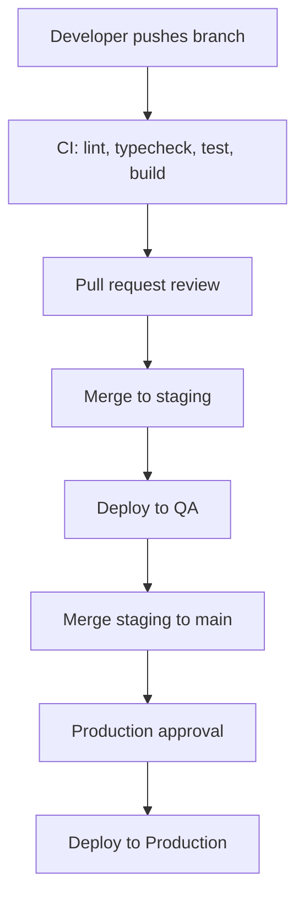

Local secrets live in `app/.env.local` (gitignored), copied from `app/.env.example`:

```bash
NEXT_PUBLIC_AUTH0_DOMAIN=dev-xxxx.us.auth0.com
NEXT_PUBLIC_AUTH0_CLIENT_ID=<from Auth0 dashboard>
NEXT_PUBLIC_API_BASE_URL=http://localhost:5000
AUTH0_SECRET=<random 32-char string>
```

QA and Production secrets live in GitHub Environments and are injected at pipeline runtime. `NEXT_PUBLIC_*` values are baked into the bundle at build time and are not App Service runtime settings. Backend-only secrets — database and Blob connection strings, the Auth0 client secret — never pass through the frontend or GitHub Actions; they are provisioned to the API as Azure App Service settings via Key Vault.

---

# 13. Source code structure

The frontend source layout under `app/`:

```txt
app/
├── layout.tsx · page.tsx · globals.css
├── login/page.tsx
├── marketplace/page.tsx
├── marketplace/[id]/page.tsx
├── documents/page.tsx
├── validation/page.tsx
├── admin/page.tsx
│
├── components/
│   ├── atoms/        Button, Badge, Input, Label, Spinner, ProgressBar,
│   │                 TrustIndicator, StatCard, MaskedValue
│   ├── molecules/    SMECard, FilterBar, DocumentUploader, FormField,
│   │                 StatusBadge, InfoBanner
│   ├── organisms/    MarketplaceGrid, InvestmentDetailPanel, ValidationQueue,
│   │                 DocumentUploadZone, Navbar, Sidebar
│   ├── templates/    AuthenticatedLayout, PublicLayout
│   ├── pages/        LoginPage, MarketplacePage, InvestmentDetailPage,
│   │                 DocumentUploadPage, ExpertValidationPage
│   ├── hooks/        useApplicationServices, useAuth, useMarketplace,
│   │                 useDocumentUpload, useCertificationProgress,
│   │                 useExpertValidation, useInvestmentDetail,
│   │                 usePermissions, usePolicies, useSession
│   ├── i18n/         config.ts, I18nProvider.tsx, en.json, es.json
│   └── styles/       tokens.ts, theme.ts, breakpoints.ts, globals.css, ThemeProvider.tsx
│
├── auth/
│   ├── AuthFacade.ts · AuthMiddleware.ts · AuthAuditQueue.ts · authConfig.ts
│   ├── adapters/     MicrosoftProfileAdapter.ts
│   ├── guards/       AuthGuard.tsx, GuestGuard.tsx, PolicyGuard.tsx
│   └── policies/     roles.ts, permissions.ts, rolePermissions.ts, accessPolicy.ts
│
├── polling/
│   ├── PollingOrchestrator.ts
│   └── strategies/   IPollingStrategy.ts, FixedIntervalStrategy.ts, ExponentialBackoffStrategy.ts
│
├── services/         applicationFacade.ts, client.ts, httpInterceptors.ts,
│                     MarketplaceService.ts, TrustRecordService.ts,
│                     ExpertValidationService.ts, InvestmentService.ts
│
├── state/
│   ├── certification.types.ts, certificationPollingStore.ts, certificationPollingManager.ts
│   ├── session.types.ts, sessionManager.ts, SessionProvider.tsx
│   ├── StoreProvider.tsx, store.ts, hooks.ts
│   └── slices/       authSlice.ts, marketplaceSlice.ts, certificationSlice.ts, validationSlice.ts
│
├── contracts/        openapi.json, openapi.example.json
├── models/           api.types.ts (generated), SME.ts, TrustRecord.ts, DocumentUpload.ts, …
├── validation/       documentUploadSchema.ts, smeSchema.ts, trustRecordSchema.ts, userSchema.ts, index.ts
├── settings/         Settings.ts
├── utils/            logger.ts, error-handler.ts, eventBus.ts, schemaValidator.ts, constants.ts, formatters.ts
├── assets/logo/      logo-dark.svg, logo-light.svg
├── __tests__/        setup.ts, unit/, e2e/, fixtures/, mocks/
│
├── next.config.ts · tailwind.config.ts · tsconfig.json
├── jest.config.ts · playwright.config.ts · package.json
├── .env.example · .eslintrc.json · .prettierrc · .lintstagedrc.json
└── .husky/pre-commit
```

---

# 14. Design patterns

Each pattern is documented with the same elements: where it is used, the problem it solves, how it is applied, its source files, a class diagram, the constraint it imposes, and how it handles exceptions.

## 14.1 Singleton — shared technical services

Logger, error handler, session manager, and the auth facade each exist as a single shared instance. Without this, multiple instances would produce inconsistent sessions, duplicated logs, and divergent error mappings. The pattern is applied through a private constructor and a static `getInstance()`, with the ready-made instance exported. The exported instance is used everywhere (`logger`, `exceptionHandler`, `authFacade`); `new` is never called. These services map errors to user-safe objects rather than throwing raw technical errors at the UI.

Source: `app/utils/logger.ts`, `app/utils/error-handler.ts`, `app/state/sessionManager.ts`, `app/auth/AuthFacade.ts`.

```ts
export class Logger {
  private static instance: Logger | null = null;
  static getInstance(): Logger {
    if (!Logger.instance) Logger.instance = new Logger();
    return Logger.instance;
  }
  private constructor() {}
}
export const logger = Logger.getInstance();
```

## 14.2 Facade — authentication and application services

Authentication and protected API access are complex enough that, without a facade, pages would wire up Auth0 and Axios directly and duplicate auth logic. `AuthFacade` and `ApplicationServiceFacade` are the only entry points, reached by hooks through `useApplicationServices()`. Pages and components call hooks only and never instantiate Auth0 or Axios clients. `AuthFacade` catches Auth0 errors and delegates them to `ExceptionHandler`, and failures are recorded through `AuthAuditQueue`.

Source: `app/auth/AuthFacade.ts`, `app/services/applicationFacade.ts`, `app/components/hooks/useApplicationServices.ts`.

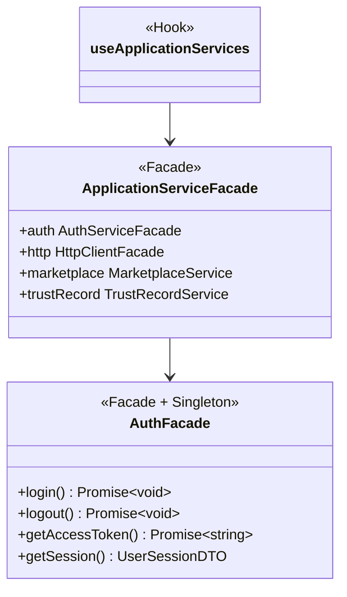

## 14.3 Adapter — Microsoft profile normalization

Auth0/Entra ID claims do not match the internal session model. Without an adapter, provider-specific claim names such as `oid` and `preferred_username` would spread across the codebase. `MicrosoftProfileAdapter.adapt()` converts raw claims into a `UserSessionDTO`, and nothing else in the application sees claim shapes. Missing required claims raise a mapped auth-profile error that triggers session cleanup.

Source: `app/auth/adapters/MicrosoftProfileAdapter.ts`, `app/state/session.types.ts`.

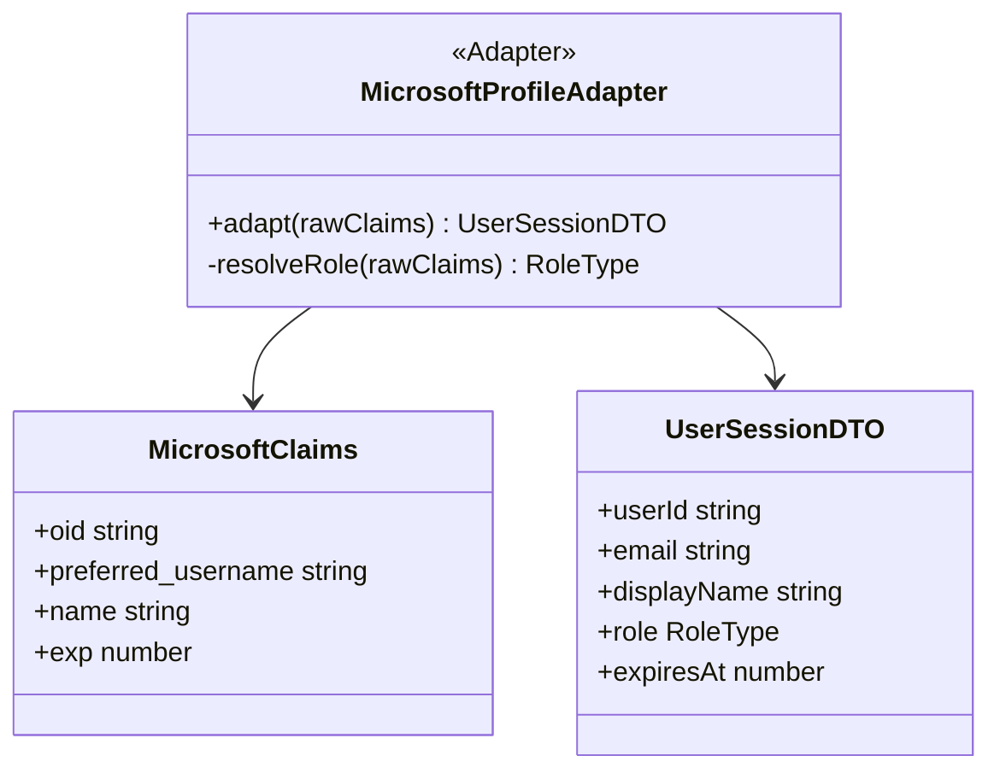

## 14.4 Proxy — auth middleware

Every protected API request needs token attachment and `401` handling. Without a proxy, each service would do this by hand, multiplying the chance of a mistake. `AuthMiddleware` sits between the services and the raw client, attaching the token and handling refresh and unauthorized cases. Services call `HttpClientFacade` and never attach bearer tokens themselves. A `401` triggers a silent refresh; a failed refresh clears the session and redirects to login.

Source: `app/auth/AuthMiddleware.ts`, `app/services/client.ts`, `app/services/httpInterceptors.ts`.

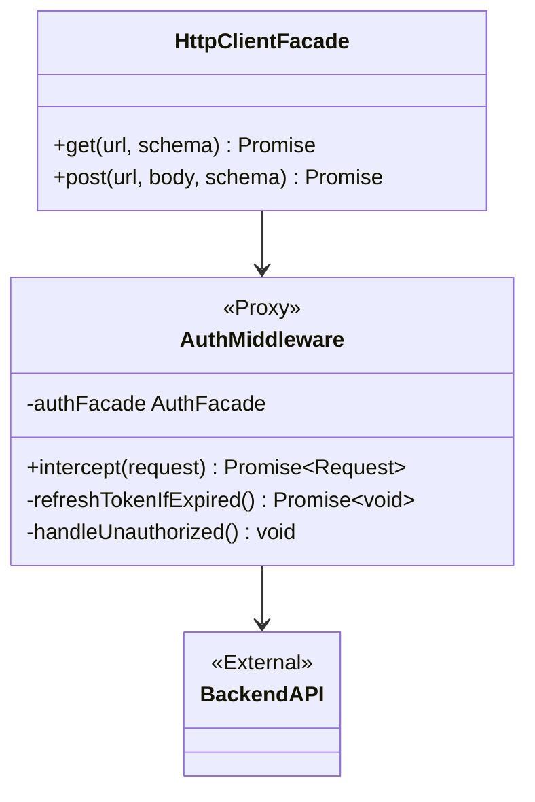

## 14.5 Observer — certification status tracking

Certification progress is asynchronous and several UI sections react to it. Without the pattern, components would each run their own polling loop and drift out of sync. An observable store notifies its subscribers on every state change, and the UI subscribes through a single hook. Components subscribe via `useCertificationProgress()` and never run polling loops. Polling errors are mapped by `ExceptionHandler`; after five failures, polling stops and the UI shows a recoverable error.

Source: `app/state/certificationPollingStore.ts`, `app/state/certificationPollingManager.ts`, `app/components/hooks/useCertificationProgress.ts`.

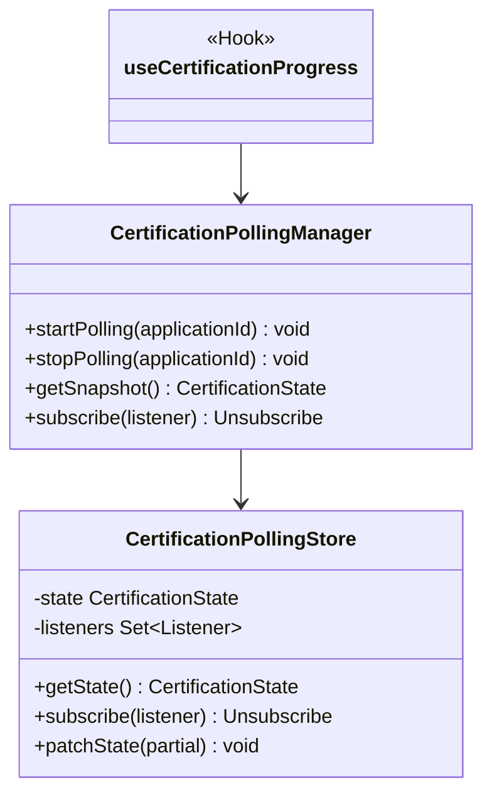

## 14.6 Strategy — polling interval selection

Normal polling and error polling need different timing. Without the pattern, timing rules would be hardcoded `if/else` blocks inside the orchestrator. `IPollingStrategy` has two implementations — fixed interval for normal operation and exponential backoff on errors — and the orchestrator swaps between them. A new timing policy implements `IPollingStrategy` rather than editing the orchestrator with inline timing. Network errors switch to backoff; after the retry cap, polling stops and logs `CertificationPollingFailed`.

Source: `app/polling/strategies/IPollingStrategy.ts`, `FixedIntervalStrategy.ts`, `ExponentialBackoffStrategy.ts`, `app/polling/PollingOrchestrator.ts`.

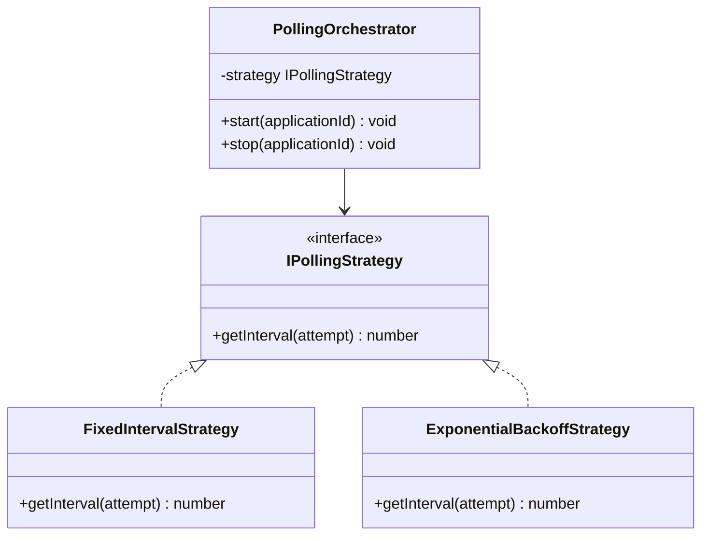

## 14.7 Queue-based logging — auth audit events

Login, logout, refresh, and permission-denial events must be recorded without slowing authentication. Without the pattern, a synchronous telemetry call during login would add latency. Auth events are enqueued and flushed asynchronously to Application Insights. Auth events are enqueued rather than sent directly from UI components. A failed flush is retried silently and never breaks login or logout.

Source: `app/auth/AuthAuditQueue.ts`, `app/utils/logger.ts`.

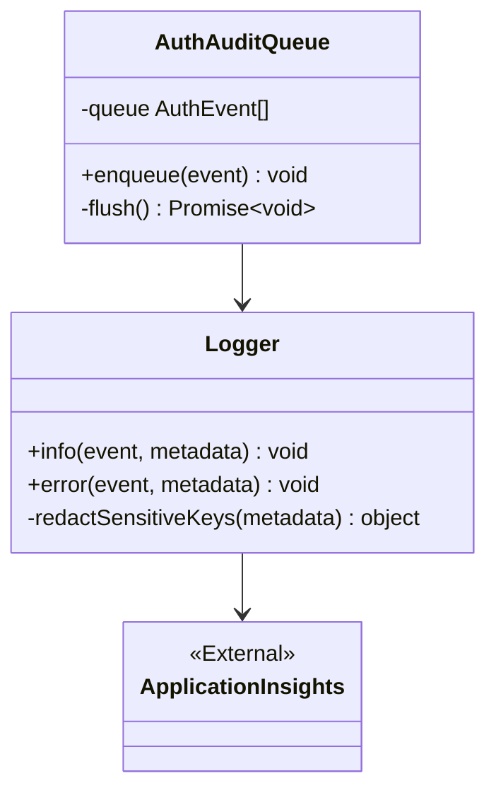
